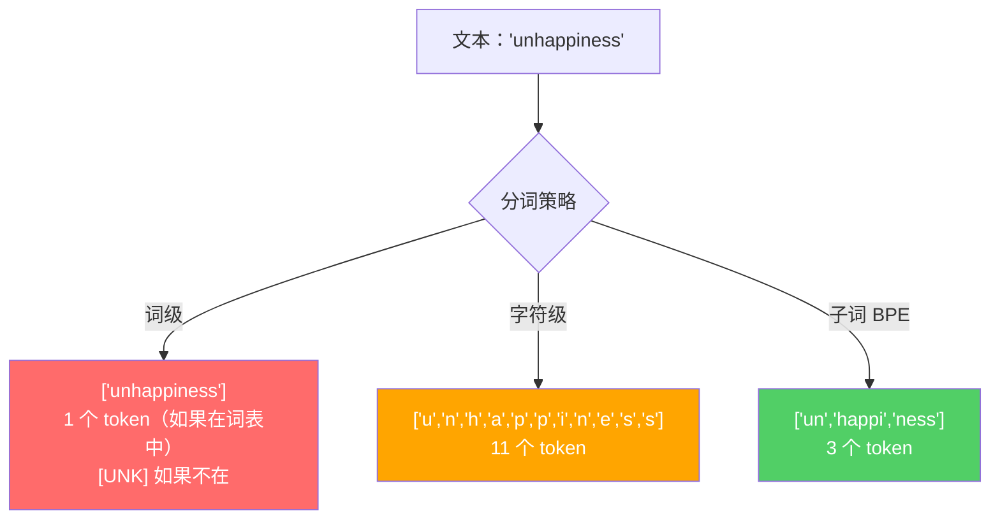
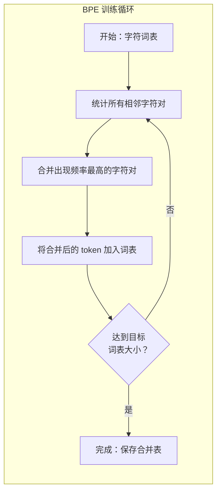
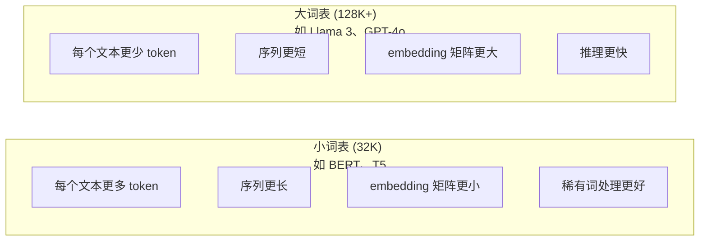

# 分词器：BPE、WordPiece、SentencePiece

> 你的大语言模型不读英文。它只读整数。分词器决定这些整数是承载意义还是浪费空间。

**类型：** 学习型
**语言：** Python
**前置条件：** 阶段 05（NLP 基础）
**时间：** 约 90 分钟

## 学习目标

- 从零实现 BPE、WordPiece 和 Unigram 分词算法，并比较它们的合并策略
- 解释词表大小如何影响模型效率：太小产生长序列，太大浪费 embedding 参数
- 分析跨语言和代码的分词结果，识别特定分词器在哪里失效
- 使用 tiktoken 和 sentencepiece 库对文本进行分词并检查生成的 token ID

## 问题

你的大语言模型不读英文。它不读任何语言。它只读数字。

"Hello, world!" 和 [15496, 11, 995, 0] 之间的鸿沟就是分词器。每一个词、每一个空格、每一个标点符号都必须转换为整数，模型才能处理它。这种转换不是中性的。它把假设 baked into the model that cannot be undone later。

做错了，你的模型会在编码常用词时浪费容量，用多个 token 来表示。"unfortunately" 变成了四个 token 而不是 一个。你的 128K 上下文窗口在处理多音节词多的文本时缩小了 75%。做对了，同样的上下文窗口能承载两倍的意义。"this model handles code well" 和 "this model chokes on Python" 之间的差别，往往就取决于分词器是怎么训练的。

每次调用 GPT-4 或 Claude 的 API 都是按 token 计费的。你的模型生成的每个 token 都需要算力。表示输出所需的 token 越少，端到端推理就越快。分词不是预处理，它是架构。

## 概念

### 三种失败的方法（和一种成功的）

把文本转为数字有三种显而易见的方法。其中两种在大规模时行不通。

**词级分词** 按空格和标点符号拆分。"The cat sat" 变成 ["The", "cat", "sat"]。很简单。但是 "tokenization" 怎么办？或者 "GPT-4o"？或者像 "Geschwindigkeitsbegrenzung" 这样的德语复合词？词级需要庞大的词表才能覆盖每种语言中的每个词。漏掉一个词就会出现讨厌的 `[UNK]` token——这是模型在说"我不知道这是什么"。仅英语就有超过一百万种词形。加上代码、URL、科学记数法和其他 100 种语言，你需要无限大的词表。

**字符级分词** 走向另一个极端。"hello" 变成 ["h", "e", "l", "l", "o"]。词表很小（几百个字符）。永远不会出现未知 token。但序列变得极长。一个句子用词级只需要 10 个 token，字符级就变成 50 个。模型必须学会 "t"、"h"、"e" 合在一起意味着 "the"——把注意力容量浪费在人类三岁就学会的东西上。

**子词分词** 找到了最佳平衡点。常用词保持完整："the" 是一个 token。稀有词分解成有意义的片段："unhappiness" 变成 ["un", "happi", "ness"]。词表保持可控（30K 到 128K 个 token）。序列保持简短。未知 token 基本上消失了，因为任何词都可以由子词片段构建。

每个现代大语言模型都使用子词分词。GPT-2、GPT-4、BERT、Llama 3、Claude——全都是。问题是用哪种算法。



### BPE：字节对编码

BPE 是一个贪婪压缩算法，被改造用于分词。想法简单到可以写在一张索引卡上。

从单个字符开始。统计训练语料中每一对相邻的字符。合并出现频率最高的那对成为一个新 token。重复直到达到目标词表大小。

```figure
tokenizer-bpe
```

以下是 BPE 在一个小型语料库上运行的过程，词汇为 "lower"、"lowest" 和 "newest"：

```
语料库（附词频）：
  "lower"  x5
  "lowest" x2
  "newest" x6

步骤 0 -- 从字符开始：
  l o w e r       (x5)
  l o w e s t     (x2)
  n e w e s t     (x6)

步骤 1 -- 统计相邻字符对：
  (e,s): 8    (s,t): 8    (l,o): 7    (o,w): 7
  (w,e): 13   (e,r): 5    (n,e): 6    ...

步骤 2 -- 合并出现频率最高的字符对 (w,e) -> "we"：
  l o we r        (x5)
  l o we s t      (x2)
  n e we s t      (x6)

步骤 3 -- 重新统计并合并 (e,s) -> "es"：
  l o we r        (x5)
  l o we s t      (x2)    <- 'es' 只能由 'e'+'s' 形成，不是 'we'+'s'
  n e we s t      (x6)    <- 等等，'we' 前面的 'e' 和后面的 's'

精确跟踪如下：
  合并 "we" 后，剩余的字符对：
  (l,o): 7   (o,we): 7   (we,r): 5   (we,s): 8
  (s,t): 8   (n,e): 6    (e,we): 6

步骤 3 -- 合并 (we,s) -> "wes" 或 (s,t) -> "st"（都是 8，平局，取第一个）：
  合并 (we,s) -> "wes"：
  l o we r        (x5)
  l o wes t       (x2)
  n e wes t       (x6)

步骤 4 -- 合并 (wes,t) -> "west"：
  l o we r        (x5)
  l o west        (x2)
  n e west        (x6)

...继续直到达到目标词表大小。
```

合并表就是分词器。要编码新文本，按学习时的顺序应用合并。训练语料决定了存在哪些合并，而这个选择永久地塑造了模型看到的内容。



### 字节级 BPE（GPT-2、GPT-3、GPT-4）

标准 BPE 操作 Unicode 字符。字节级 BPE 操作原始字节（0-255）。这给你一个恰好 256 的基础词表，能处理任何语言或编码，永不产生未知 token。

GPT-2 引入了这种方法。基础词表覆盖每个可能的字节。BPE 合并在此基础上构建。OpenAI 的 tiktoken 库实现了字节级 BPE，词表大小如下：

- GPT-2：50,257 个 token
- GPT-3.5/GPT-4：约 100,256 个 token（cl100k_base 编码）
- GPT-4o：200,019 个 token（o200k_base 编码）

### WordPiece（BERT）

WordPiece 看起来和 BPE 很像，但选择合并的方式不同。不是用原始频率，而是最大化训练数据的似然：

```
BPE 合并标准：      count(A, B)
WordPiece 合并标准： count(AB) / (count(A) * count(B))
```

BPE 问："哪一对出现最多？" WordPiece 问："哪一对比随机情况下更经常一起出现？" 这个微妙的差异产生了不同的词表。WordPiece 偏向于共现令人惊讶的合并，而不仅仅是频繁。

WordPiece 还使用 "##" 前缀来表示连续的子词：

```
"unhappiness" -> ["un", "##happi", "##ness"]
"embedding"   -> ["em", "##bed", "##ding"]
```

"##" 前缀告诉你这个片段延续上一个 token。BERT 使用 WordPiece，词表包含 30,522 个 token。每个 BERT 变体——DistilBERT、RoBERTa 的分词器实际上是 BPE，但 BERT 本身是 WordPiece。

### SentencePiece（Llama、T5）

SentencePiece 把输入当作原始 Unicode 字符流，包括空格。没有预分词步骤。没有关于词边界的语言特定规则。这使它真正做到了语言无关——它适用于中文、日文、泰文和其他不用空格分词的语言。

SentencePiece 支持两种算法：
- **BPE 模式**：与标准 BPE 相同的合并逻辑，应用于原始字符序列
- **Unigram 模式**：从一个大型词表开始，迭代移除对整体似然影响最小的 token。BPE 的反向操作——剪枝而不是合并。

Llama 2 使用 SentencePiece BPE，词表大小为 32,000。T5 使用 SentencePiece Unigram，也是 32,000。注意：Llama 3 改用了基于 tiktoken 的字节级 BPE 分词器，词表大小为 128,256。

### 词表大小的权衡

这是一个有可衡量后果的真实工程决策。



具体数字。对于 128K 词表和 4,096 维 embedding，embedding 矩阵本身就是 128,000 x 4,096 = 5.24 亿个参数。对于 32K 词表，是 1.31 亿个参数。仅分词器的选择就造成了 4 亿个参数的差异。

但更大的词表会压缩文本更激进。同样的英文段落，用 32K 词表需要 100 个 token，用 128K 词表可能只需要 70 个。这意味着生成时前向传播减少 30%。对于服务数百万请求的模型，这是算力成本的直接降低。

趋势很明显：词表大小在增长。GPT-2 用 50,257。GPT-4 用约 100K。Llama 3 用 128K。GPT-4o 用 200K。

| 模型 | 词表大小 | 分词器类型 | 每个英文词的平均 token 数 |
|-------|-----------|----------------|---------------------------|
| BERT | 30,522 | WordPiece | 约 1.4 |
| GPT-2 | 50,257 | 字节级 BPE | 约 1.3 |
| Llama 2 | 32,000 | SentencePiece BPE | 约 1.4 |
| GPT-4 | 约 100,256 | 字节级 BPE | 约 1.2 |
| Llama 3 | 128,256 | 字节级 BPE（tiktoken） | 约 1.1 |
| GPT-4o | 200,019 | 字节级 BPE | 约 1.0 |

### 多语言税

主要在英语上训练的分词器对其他语言非常残忍。GPT-2 分词器处理韩语文本平均每个词 2-3 个 token。中文可能更糟。这意味着一个韩国用户的有效上下文窗口只有英语用户的一半——付同样的价格却得到更少的信息密度。

这就是 Llama 3 将词表从 32K 扩大到 128K 的原因。更多 dedicated to non-English scripts 意味着跨语言更公平的压缩。

## 动手实现

### 第 1 步：字符级分词器

从基础开始。字符级分词器将每个字符映射到其 Unicode 码点。不需要训练。没有未知 token。只是直接映射。

```python
class CharTokenizer:
    def encode(self, text):
        return [ord(c) for c in text]

    def decode(self, tokens):
        return "".join(chr(t) for t in tokens)
```

"hello" 变成 [104, 101, 108, 108, 111]。每个字符都是自己的 token。这是我们改进的 baseline。

### 第 2 步：从零实现 BPE 分词器

真正的实现。我们在原始字节上训练（像 GPT-2 一样），统计字符对，合并出现频率最高的，并按顺序记录每个合并。合并表就是分词器。

```python
from collections import Counter

class BPETokenizer:
    def __init__(self):
        self.merges = {}
        self.vocab = {}

    def _get_pairs(self, tokens):
        pairs = Counter()
        for i in range(len(tokens) - 1):
            pairs[(tokens[i], tokens[i + 1])] += 1
        return pairs

    def _merge_pair(self, tokens, pair, new_token):
        merged = []
        i = 0
        while i < len(tokens):
            if i < len(tokens) - 1 and tokens[i] == pair[0] and tokens[i + 1] == pair[1]:
                merged.append(new_token)
                i += 2
            else:
                merged.append(tokens[i])
                i += 1
        return merged

    def train(self, text, num_merges):
        tokens = list(text.encode("utf-8"))
        self.vocab = {i: bytes([i]) for i in range(256)}

        for i in range(num_merges):
            pairs = self._get_pairs(tokens)
            if not pairs:
                break
            best_pair = max(pairs, key=pairs.get)
            new_token = 256 + i
            tokens = self._merge_pair(tokens, best_pair, new_token)
            self.merges[best_pair] = new_token
            self.vocab[new_token] = self.vocab[best_pair[0]] + self.vocab[best_pair[1]]

        return self

    def encode(self, text):
        tokens = list(text.encode("utf-8"))
        for pair, new_token in self.merges.items():
            tokens = self._merge_pair(tokens, pair, new_token)
        return tokens

    def decode(self, tokens):
        byte_sequence = b"".join(self.vocab[t] for t in tokens)
        return byte_sequence.decode("utf-8", errors="replace")
```

训练循环是 BPE 的核心：统计字符对，合并赢家，重复。每个合并都会减少总 token 数。经过 `num_merges` 轮后，词表从 256（基础字节）增长到 256 + num_merges。

编码按学习时的确切顺序应用合并。这很重要。如果合并 1 创建了 "th" 而合并 5 创建了 "the"，编码必须先应用合并 1，这样 "the" 才能在合并 5 中由 "th" + "e" 形成。

解码是逆过程：在词表中查找每个 token ID，拼接字节，解码为 UTF-8。

### 第 3 步：编码和解码往返测试

```python
corpus = (
    "The cat sat on the mat. The cat ate the rat. "
    "The dog sat on the log. The dog ate the frog. "
    "Natural language processing is the study of how computers "
    "understand and generate human language. "
    "Tokenization is the first step in any NLP pipeline."
)

tokenizer = BPETokenizer()
tokenizer.train(corpus, num_merges=40)

test_sentences = [
    "The cat sat on the mat.",
    "Natural language processing",
    "tokenization pipeline",
    "unhappiness",
]

for sentence in test_sentences:
    encoded = tokenizer.encode(sentence)
    decoded = tokenizer.decode(encoded)
    raw_bytes = len(sentence.encode("utf-8"))
    ratio = len(encoded) / raw_bytes
    print(f"'{sentence}'")
    print(f"  Tokens: {len(encoded)} (from {raw_bytes} bytes) -- ratio: {ratio:.2f}")
    print(f"  Roundtrip: {'PASS' if decoded == sentence else 'FAIL'}")
```

压缩比告诉你分词器的效果。比率 0.50 意味着分词器将文本压缩到原始字节数的一半。越低越好。在训练语料上，比率会很好。在分布外的文本上，比如 "unhappiness"（不在语料库中），比率会更差——分词器会 fallback 到字符级编码来处理未见过的模式。

### 第 4 步：与 tiktoken 比较

```python
import tiktoken

enc = tiktoken.get_encoding("cl100k_base")

texts = [
    "The cat sat on the mat.",
    "unhappiness",
    "Hello, world!",
    "def fibonacci(n): return n if n < 2 else fibonacci(n-1) + fibonacci(n-2)",
    "Geschwindigkeitsbegrenzung",
]

for text in texts:
    our_tokens = tokenizer.encode(text)
    tiktoken_tokens = enc.encode(text)
    tiktoken_pieces = [enc.decode([t]) for t in tiktoken_tokens]
    print(f"'{text}'")
    print(f"  Our BPE:   {len(our_tokens)} tokens")
    print(f"  tiktoken:  {len(tiktoken_tokens)} tokens -> {tiktoken_pieces}")
```

tiktoken 使用完全相同的算法，但在一百多 GB 的文本上训练，有 100,000 次合并。算法是相同的。区别在于训练数据和合并次数。你用一段话训练了 40 次合并的分词器，无法与 tiktoken 在海量语料上的 100K 次合并竞争。但机制是一样的。

### 第 5 步：词表分析

```python
def analyze_vocabulary(tokenizer, test_texts):
    total_tokens = 0
    total_chars = 0
    token_usage = Counter()

    for text in test_texts:
        encoded = tokenizer.encode(text)
        total_tokens += len(encoded)
        total_chars += len(text)
        for t in encoded:
            token_usage[t] += 1

    print(f"Vocabulary size: {len(tokenizer.vocab)}")
    print(f"Total tokens across all texts: {total_tokens}")
    print(f"Total characters: {total_chars}")
    print(f"Avg tokens per character: {total_tokens / total_chars:.2f}")

    print(f"\nMost used tokens:")
    for token_id, count in token_usage.most_common(10):
        token_bytes = tokenizer.vocab[token_id]
        display = token_bytes.decode("utf-8", errors="replace")
        print(f"  Token {token_id:4d}: '{display}' (used {count} times)")

    unused = [t for t in tokenizer.vocab if t not in token_usage]
    print(f"\nUnused tokens: {len(unused)} out of {len(tokenizer.vocab)}")
```

这揭示了你词表中的 Zipf 分布。少数 token 占主导地位（空格、"the"、"e"）。大多数 token 很少被使用。生产级分词器针对这种分布进行优化——常见模式获得短 token ID，稀有模式获得更长的表示。

## 实际使用

你的从零实现的 BPE 可以工作了。现在看看生产工具有什么样子。

### tiktoken（OpenAI）

```python
import tiktoken

enc = tiktoken.get_encoding("cl100k_base")

text = "Tokenizers convert text to integers"
tokens = enc.encode(text)
print(f"Tokens: {tokens}")
print(f"Pieces: {[enc.decode([t]) for t in tokens]}")
print(f"Roundtrip: {enc.decode(tokens)}")
```

tiktoken 用 Rust 编写，有 Python 绑定。它每秒编码数百万 token。同样的 BPE 算法，工业级的实现。

### Hugging Face tokenizers

```python
from tokenizers import Tokenizer
from tokenizers.models import BPE
from tokenizers.trainers import BpeTrainer
from tokenizers.pre_tokenizers import ByteLevel

tokenizer = Tokenizer(BPE())
tokenizer.pre_tokenizer = ByteLevel()

trainer = BpeTrainer(vocab_size=1000, special_tokens=["<pad>", "<eos>", "<unk>"])
tokenizer.train(["corpus.txt"], trainer)

output = tokenizer.encode("The cat sat on the mat.")
print(f"Tokens: {output.tokens}")
print(f"IDs: {output.ids}")
```

Hugging Face tokenizers 库底层也是 Rust。它在秒级时间内在 GB 级语料上训练 BPE。当你自己训练模型时，用的就是这个。

### 加载 Llama 的分词器

```python
from transformers import AutoTokenizer

tokenizer = AutoTokenizer.from_pretrained("meta-llama/Llama-3.1-8B")

text = "Tokenizers are the unsung heroes of LLMs"
tokens = tokenizer.encode(text)
print(f"Token IDs: {tokens}")
print(f"Tokens: {tokenizer.convert_ids_to_tokens(tokens)}")
print(f"Vocab size: {tokenizer.vocab_size}")

multilingual = ["Hello world", "Hola mundo", "Bonjour le monde"]
for text in multilingual:
    ids = tokenizer.encode(text)
    print(f"'{text}' -> {len(ids)} tokens")
```

Llama 3 的 128K 词表比 GPT-2 的 50K 词表能显著更好地压缩非英文文本。你可以自己验证——用多种语言编码同一句话并统计 token 数。

## 交付物

本课产出 `outputs/prompt-tokenizer-analyzer.md`——一个可重用的提示词，用于分析任何文本和模型组合的分词效率。给它一个文本样本，它会告诉你哪个模型的分词器处理得最好。

## 练习

1. 修改 BPE 分词器，让它打印每个合并步骤的词表。看着 "t" + "h" 变成 "th"，然后 "th" + "e" 变成 "the"。追踪常见英语单词是如何逐片组装的。

2. 给 BPE 分词器添加特殊 token（`<pad>`、`<eos>`、`<unk>`）。给它们分配 ID 0、1、2，并相应地移动所有其他 token。在运行 BPE 之前，实现一个预分词步骤来按空白符拆分。

3. 实现 WordPiece 合并标准（似然比而不是频率）。在同一个语料库上用相同数量的合并训练 BPE 和 WordPiece。比较 resulting 词表——哪个产生更多语言上有意义的子词？

4. 构建一个多语言分词器效率基准。用英语、西班牙语、中文、韩语和阿拉伯语各取 10 个句子。用 tiktoken（cl100k_base）对每个进行分词并测量每个字符的平均 token 数。量化每种语言的"多语言税"。

5. 在更大的语料库上训练你的 BPE 分词器（下载一篇 Wikipedia 文章）。调整合并次数，使压缩比达到 tiktoken 在同一文本上的 10% 以内。这迫使你理解语料库大小、合并次数和压缩质量之间的关系。

## 关键术语

| 术语 | 大家怎么说的 | 实际含义 |
|------|----------------|----------------------|
| Token | "一个词" | 模型词表中的一个单位——可以是字符、子词、词或多词块 |
| BPE | "某种压缩东西" | 字节对编码——迭代合并出现频率最高的相邻 token 对，直到达到目标词表大小 |
| WordPiece | "BERT 的分词器" | 类似 BPE，但合并最大化似然比 count(AB)/(count(A)*count(B)) 而不是原始频率 |
| SentencePiece | "一个分词器库" | 一种语言无关的分词器，在原始 Unicode 上操作，没有预分词，支持 BPE 和 Unigram 算法 |
| 词表大小 | "它认识多少词" | 唯一 token 的总数：GPT-2 有 50,257，BER 有 30,522，Llama 3 有 128,256 |
| Fertility | "不是分词器术语" | 每个词的平均 token 数——衡量分词器跨语言效率（1.0 是完美的，3.0 意味着模型要多花三倍力气） |
| 字节级 BPE | "GPT 的分词器" | 在原始字节（0-255）上操作的 BPE，而不是 Unicode 字符，保证任何输入都没有未知 token |
| 合并表 | "分词器文件" | 训练期间学习到的有序字符对合并列表——这就是分词器本身，顺序很重要 |
| 预分词 | "按空格拆分" | 在子词分词之前应用的规则：空白符拆分、数字分离、标点符号处理 |
| 压缩比 | "分词器有多高效" | 产生的 token 数除以输入字节数——越低意味着压缩越好、推理越快 |

## 延伸阅读

- [Sennrich 等，2016——《利用子词单元翻译稀有词的神经机器翻译"](https://arxiv.org/abs/1508.07909)——将 BPE 引入 NLP 的论文，把 1994 年的压缩算法变成现代分词的基础
- [Kudo & Richardson，2018——《SentencePiece：一个简单且语言无关的子词分词器"](https://arxiv.org/abs/1808.06226)——使多语言模型变得实用的语言无关分词
- [OpenAI tiktoken 仓库](https://github.com/openai/tiktoken)——Rust 实现的生产级 BPE，有 Python 绑定，GPT-3.5/4/4o 使用
- [Hugging Face Tokenizers 文档](https://huggingface.co/docs/tokenizers)——Rust 性能的生产级分词器训练