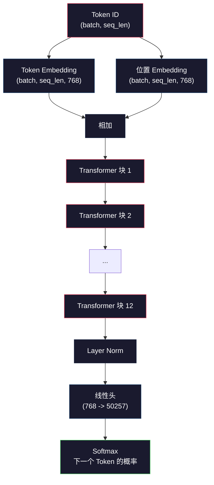
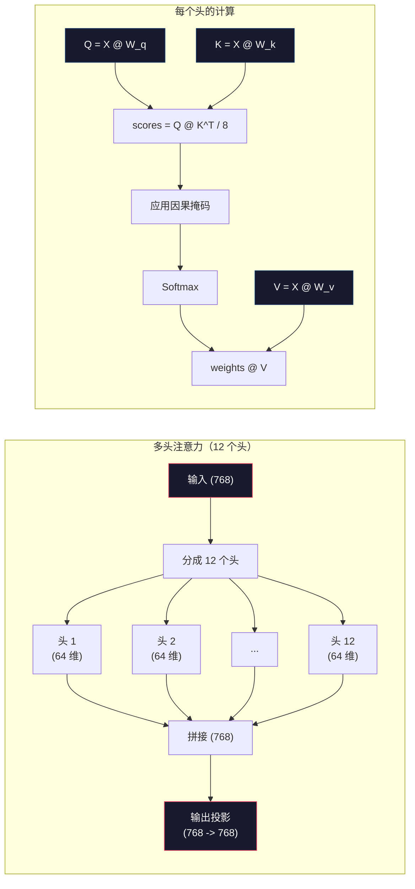
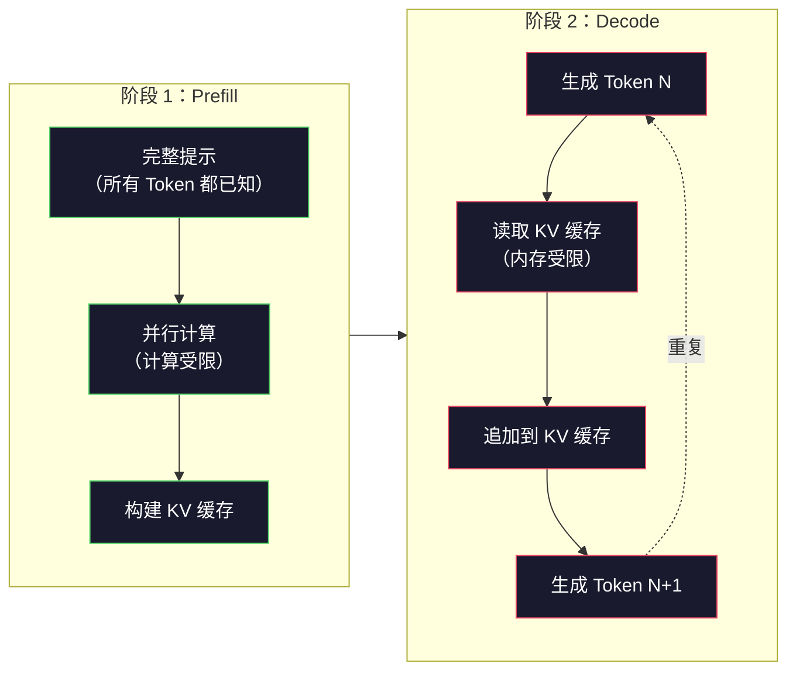

# 从零预训练 Mini GPT（124M 参数）

> GPT-2 Small 有 1.24 亿个参数。由 12 个 Transformer 层、12 个注意力头和 768 维 Embedding 组成。在一块 GPU 上花几个小时就能从头训练它。大多数人从不这样做——他们直接用预训练好的检查点。但如果你没有自己训练过，你就无法真正理解你所构建的模型内部究竟发生了什么。

**类型：** 构建型
**语言：** Python（纯 numpy）
**前置条件：** 阶段 10，第 01-03 课（分词器、从零构建分词器、数据管道）
**时间：** 约 120 分钟

## 学习目标

- 从零实现完整 GPT-2 架构（124M 参数）：Token Embedding、位置 Embedding、Transformer 块和语言模型头
- 使用下一个 Token 预测和交叉熵损失，在文本语料库上训练 GPT 模型
- 实现基于温度采样和 top-k/top-p 过滤的自回归文本生成
- 监控训练损失曲线，验证模型学习到了连贯的语言模式

## 问题

你知道 Transformer 是什么。你看过那些图。你能背诵"注意力就是你所需要的一切"，也能在白板上画出标着"多头注意力"的方框。

但这些都不意味着你理解模型生成文本时真正发生了什么。

GPT-2 Small 有 124,438,272 个参数（启用了权重绑定）。每一个参数都是通过训练循环设置的：前向传播、计算损失、反向传播、更新权重。12 个 Transformer 块。每块 12 个注意力头。768 维的 Embedding 空间。50,257 个 Token 的词表。每次模型生成一个 Token，1.24 亿个参数全部参与一条矩阵乘法链——接收一段 Token ID 序列，输出下一个 Token 的概率分布。

如果你从未自己构建过它，你就是在用一个黑盒。你可以用 API，可以微调。但当模型出现幻觉、重复自己、拒绝遵循指令时，你没有任何心理模型来理解*为什么*。

这节课从零构建 GPT-2 Small。不用 PyTorch，用 numpy。每一个矩阵乘法都是可见的。每一个梯度都是你的代码计算的。你将亲眼看到这 1.24 亿个数字如何合谋预测下一个词。

## 概念

### GPT 架构

GPT 是一个自回归语言模型。"自回归"意味着它一次生成一个 Token，每个 Token 都以所有之前的 Token 为条件。架构是一堆 Transformer 解码器块。

以下是完整的计算图——从 Token ID 到下一个 Token 的概率：

1. 输入 Token ID。形状：(batch_size, seq_len)。
2. Token Embedding 查找。每个 ID 映射到一个 768 维向量。形状：(batch_size, seq_len, 768)。
3. 位置 Embedding 查找。每个位置（0, 1, 2, …）映射到一个 768 维向量。同样的形状。
4. Token Embedding + 位置 Embedding 相加。
5. 通过 12 个 Transformer 块。
6. 最后的层归一化。
7. 线性投影到词表大小。形状：(batch_size, seq_len, vocab_size)。
8. Softmax 得到概率。

这就是整个模型。没有卷积，没有循环。只有 Embedding、注意力、前馈网络和层归一化，堆叠 12 次。



### Transformer 块

12 个块中的每一个都遵循相同的模式。Pre-norm 架构（GPT-2 用 pre-norm，不是原始 transformer 的 post-norm）：

1. LayerNorm
2. 多头自注意力
3. 残差连接（把输入加回去）
4. LayerNorm
5. 前馈网络（MLP）
6. 残差连接（把输入加回去）

残差连接至关重要。没有它们，反向传播时梯度在到达第 1 块时就消失了。有了它们，梯度可以通过"跳跃"路径直接从损失流向任意层。这就是为什么你可以堆叠 12、32 甚至 96 个块（据说 GPT-4 用了 120 个）。

### 注意力：核心机制

自注意力让每个 Token 查看所有之前的 Token，并决定对每个 Token 投入多少注意力。以下是数学原理。

对于每个 Token 位置，从输入中计算三个向量：
- **Query（Q）**："我在找什么？"
- **Key（K）**："我包含什么？"
- **Value（V）**："我携带什么信息？"

```
Q = input @ W_q    (768 -> 768)
K = input @ W_k    (768 -> 768)
V = input @ W_v    (768 -> 768)

attention_scores = Q @ K^T / sqrt(d_k)
attention_scores = mask(attention_scores)   # 因果掩码：未来位置设为 -inf
attention_weights = softmax(attention_scores)
output = attention_weights @ V
```

因果掩码是 GPT 自回归的关键。位置 5 可以关注位置 0-5，但不能关注 6、7、8 等。这防止了模型在训练时"作弊"——通过查看未来的 Token。

**多头注意力**将 768 维空间分成 12 个头，每头 64 维。每个头学习不同的注意力模式。一个头可能追踪句法关系（主谓一致）。另一个可能追踪语义相似性（同义词）。还有一个可能追踪位置邻近性（相邻的词）。所有 12 个头的输出被拼接起来，再投影回 768 维。



除以 sqrt(d_k)——sqrt(64) = 8——是缩放。没有它，高维向量的点积会变得很大，把 softmax 推到梯度几乎为零的区域。这是原始"注意力就是你所需要的一切"论文的关键洞察之一。

### KV 缓存：推理为什么快

训练时，你一次处理整个序列。推理时，你一次生成一个 Token。没有优化的话，生成第 N 个 Token 需要重新计算前 N-1 个 Token 的注意力。每个生成的 Token 是 O(N²)，长度为 N 的序列总计是 O(N³)。

KV 缓存解决了这个问题。计算完每个 Token 的 K 和 V 后，存储它们。生成第 N+1 个 Token 时，只需要为新 Token 计算 Q，然后从所有之前的 Token 中查找缓存的 K 和 V。这将每个 Token 的 K 和 V 计算成本从 O(N) 降低到 O(1)。注意力分数计算仍然是 O(N)，因为你需要关注所有之前的位置，但你避免了输入上的冗余矩阵乘法。

对于有 12 层和 12 个头的 GPT-2，KV 缓存为每个 Token 存储 2 × (K + V) × 12 层 × 12 头 × 64 维 = 18,432 个值。对于 1024 个 Token 的序列，在 FP32 下大约是 75MB。对于有 128 层的 Llama 3 405B，单个序列的 KV 缓存可以超过 10GB。这就是为什么长上下文推理是内存受限的。

### Prefill 与 Decode：推理的两个阶段

当你向 LLM 发送提示时，推理分为两个不同的阶段。

**Prefill** 并行处理你的整个提示。所有 Token 都是已知的，所以模型可以同时计算所有位置的注意力。这一阶段是计算受限的——GPU 以全吞吐量进行矩阵乘法。对于 A100 上的 1000 个 Token 提示，prefill 大约需要 20-50 毫秒。

**Decode** 一次生成一个 Token。每个新 Token 依赖于所有之前的 Token。这一阶段是内存受限的——瓶颈是从 GPU 内存读取模型权重和 KV 缓存，而不是矩阵运算本身。GPU 的计算核心大部分时间都在空闲，等待内存读取。对于 GPT-2，每个解码步骤花费的时间大致相同，无论矩阵乘法需要多少 FLOPs，因为内存带宽才是约束。

这种区分对生产系统很重要。Prefill 吞吐量随 GPU 计算能力扩展（更多 FLOPS = 更快的 prefill）。Decode 吞吐量随内存带宽扩展（更快的内存 = 更快的 decode）。这就是为什么 NVIDIA 的 H100 比 A100 更注重内存带宽的改进——它直接加速了 Token 生成。



### 训练循环

训练 LLM 就是预测下一个 Token。给定 Token [0, 1, 2, …, N-1]，预测 Token [1, 2, 3, …, N]。损失函数是模型预测的概率分布与实际下一个 Token 之间的交叉熵。

一次训练步骤：

1. **前向传播**：将批次通过所有 12 个块。得到每个位置的非归一化分数（pre-softmax 分数，即 logits）。
2. **计算损失**：logits 与目标 Token（在输入序列上偏移一个位置）的交叉熵。
3. **反向传播**：使用反向传播计算所有 1.24 亿个参数的梯度。
4. **优化器步骤**：更新权重。GPT-2 使用 Adam 优化器，带学习率预热和余弦衰减。

学习率调度比你想象的更重要。GPT-2 在前 2000 步中将学习率从 0 预热到峰值学习率，然后按照余弦曲线衰减。一开始就用高学习率会导致模型发散。一直保持高学习率会导致后期训练中出现振荡。预热-然后衰减的模式被每个主要的 LLM 使用。

### GPT-2 Small：参数一览

| 组件 | 形状 | 参数数量 |
|-----------|-------|------------|
| Token Embedding | (50257, 768) | 38,597,376 |
| 位置 Embedding | (1024, 768) | 786,432 |
| 每块注意力（W_q, W_k, W_v, W_out） | 4 × (768, 768) | 2,359,296 |
| 每块 FFN（上升 + 下降） | (768, 3072) + (3072, 768) | 4,718,592 |
| 每块 LayerNorm（2 个） | 2 × 768 × 2 | 3,072 |
| 最终 LayerNorm | 768 × 2 | 1,536 |
| **每块总计** | | **7,080,960** |
| **总计（12 块）** | | **85,054,464 + 39,383,808 = 124,438,272** |

输出投影（logits 头）与 Token Embedding 矩阵共享权重。这叫做权重绑定——它减少了 3800 万个参数，并改善了性能，因为它强制模型在输入和输出使用相同的表示空间。

## 构建

### 第 1 步：Embedding 层

Token Embedding 将 50,257 个可能的 Token 中的每一个映射到一个 768 维向量。位置 Embedding 添加每个 Token 在序列中位置的信息。两者相加。

```python
import numpy as np

class Embedding:
    def __init__(self, vocab_size, embed_dim, max_seq_len):
        self.token_embed = np.random.randn(vocab_size, embed_dim) * 0.02
        self.pos_embed = np.random.randn(max_seq_len, embed_dim) * 0.02

    def forward(self, token_ids):
        seq_len = token_ids.shape[-1]
        tok_emb = self.token_embed[token_ids]
        pos_emb = self.pos_embed[:seq_len]
        return tok_emb + pos_emb
```

初始化的 0.02 标准差来自 GPT-2 论文。太大初始前向传播会产生极端值，破坏训练。太小初始输出对所有输入几乎相同，使早期梯度信号失效。

### 第 2 步：带因果掩码的自注意力

先做单头注意力。因果掩码在 softmax 之前将未来位置设置为负无穷，确保每个位置只能关注自身和更早的位置。

```python
def attention(Q, K, V, mask=None):
    d_k = Q.shape[-1]
    scores = Q @ K.transpose(0, -1, -2 if Q.ndim == 4 else 1) / np.sqrt(d_k)
    if mask is not None:
        scores = scores + mask
    weights = np.exp(scores - scores.max(axis=-1, keepdims=True))
    weights = weights / weights.sum(axis=-1, keepdims=True)
    return weights @ V
```

Softmax 实现先减去最大值再取指数。没有这个，exp(大数) 会溢出到无穷。这是数值稳定性技巧，不改变输出，因为 softmax(x - c) = softmax(x) 对任意常数 c 成立。

### 第 3 步：多头注意力

将 768 维输入分成 12 个头，每头 64 维。每个头独立计算注意力。拼接结果并投影回 768 维。

```python
class MultiHeadAttention:
    def __init__(self, embed_dim, num_heads):
        self.num_heads = num_heads
        self.head_dim = embed_dim // num_heads
        self.W_q = np.random.randn(embed_dim, embed_dim) * 0.02
        self.W_k = np.random.randn(embed_dim, embed_dim) * 0.02
        self.W_v = np.random.randn(embed_dim, embed_dim) * 0.02
        self.W_out = np.random.randn(embed_dim, embed_dim) * 0.02

    def forward(self, x, mask=None):
        batch, seq_len, d = x.shape
        Q = (x @ self.W_q).reshape(batch, seq_len, self.num_heads, self.head_dim).transpose(0, 2, 1, 3)
        K = (x @ self.W_k).reshape(batch, seq_len, self.num_heads, self.head_dim).transpose(0, 2, 1, 3)
        V = (x @ self.W_v).reshape(batch, seq_len, self.num_heads, self.head_dim).transpose(0, 2, 1, 3)

        scores = Q @ K.transpose(0, 1, 3, 2) / np.sqrt(self.head_dim)
        if mask is not None:
            scores = scores + mask
        weights = np.exp(scores - scores.max(axis=-1, keepdims=True))
        weights = weights / weights.sum(axis=-1, keepdims=True)
        attn_out = weights @ V

        attn_out = attn_out.transpose(0, 2, 1, 3).reshape(batch, seq_len, d)
        return attn_out @ self.W_out
```

reshape-transpose-reshape 的变换是多头注意力中最令人困惑的部分。过程是这样的：(batch, seq_len, 768) 变成 (batch, seq_len, 12, 64)，然后变成 (batch, 12, seq_len, 64)。现在 12 个头中的每一个都有自己的 (seq_len, 64) 矩阵来运行注意力。注意力之后，我们反向操作：(batch, 12, seq_len, 64) 变成 (batch, seq_len, 12, 64) 变成 (batch, seq_len, 768)。

### 第 4 步：Transformer 块

一个完整的 Transformer 块：LayerNorm、带残差的多头注意力、LayerNorm、带残差的前馈网络。

```python
class LayerNorm:
    def __init__(self, dim, eps=1e-5):
        self.gamma = np.ones(dim)
        self.beta = np.zeros(dim)
        self.eps = eps

    def forward(self, x):
        mean = x.mean(axis=-1, keepdims=True)
        var = x.var(axis=-1, keepdims=True)
        return self.gamma * (x - mean) / np.sqrt(var + self.eps) + self.beta


class FeedForward:
    def __init__(self, embed_dim, ff_dim):
        self.W1 = np.random.randn(embed_dim, ff_dim) * 0.02
        self.b1 = np.zeros(ff_dim)
        self.W2 = np.random.randn(ff_dim, embed_dim) * 0.02
        self.b2 = np.zeros(embed_dim)

    def forward(self, x):
        h = x @ self.W1 + self.b1
        h = np.maximum(0, h)  # GELU 近似：这里用 ReLU 简化
        return h @ self.W2 + self.b2


class TransformerBlock:
    def __init__(self, embed_dim, num_heads, ff_dim):
        self.ln1 = LayerNorm(embed_dim)
        self.attn = MultiHeadAttention(embed_dim, num_heads)
        self.ln2 = LayerNorm(embed_dim)
        self.ffn = FeedForward(embed_dim, ff_dim)

    def forward(self, x, mask=None):
        x = x + self.attn.forward(self.ln1.forward(x), mask)
        x = x + self.ffn.forward(self.ln2.forward(x))
        return x
```

前馈网络将 768 维输入扩展到 3,072 维（4 倍），应用非线性，然后投影回 768 维。这种扩展-收缩模式在每个位置给模型一个更"宽"的内部表示来工作。GPT-2 使用 GELU 激活，但这里为了简化我们使用 ReLU——对于理解架构来说差别不大。

### 第 5 步：完整 GPT 模型

堆叠 12 个 Transformer 块。在前面加 Embedding 层，在后面加输出投影。

```python
class MiniGPT:
    def __init__(self, vocab_size=50257, embed_dim=768, num_heads=12,
                 num_layers=12, max_seq_len=1024, ff_dim=3072):
        self.embedding = Embedding(vocab_size, embed_dim, max_seq_len)
        self.blocks = [
            TransformerBlock(embed_dim, num_heads, ff_dim)
            for _ in range(num_layers)
        ]
        self.ln_f = LayerNorm(embed_dim)
        self.vocab_size = vocab_size
        self.embed_dim = embed_dim

    def forward(self, token_ids):
        seq_len = token_ids.shape[-1]
        mask = np.triu(np.full((seq_len, seq_len), -1e9), k=1)

        x = self.embedding.forward(token_ids)
        for block in self.blocks:
            x = block.forward(x, mask)
        x = self.ln_f.forward(x)

        logits = x @ self.embedding.token_embed.T
        return logits

    def count_parameters(self):
        total = 0
        total += self.embedding.token_embed.size
        total += self.embedding.pos_embed.size
        for block in self.blocks:
            total += block.attn.W_q.size + block.attn.W_k.size
            total += block.attn.W_v.size + block.attn.W_out.size
            total += block.ffn.W1.size + block.ffn.b1.size
            total += block.ffn.W2.size + block.ffn.b2.size
            total += block.ln1.gamma.size + block.ln1.beta.size
            total += block.ln2.gamma.size + block.ln2.beta.size
        total += self.ln_f.gamma.size + self.ln_f.beta.size
        return total
```

注意权重绑定：`logits = x @ self.embedding.token_embed.T`。输出投影重用 Token Embedding 矩阵（转置）。这不仅仅是节省参数的技巧。它意味着模型在理解 Token（Embedding）和预测它们（输出）时使用相同的向量空间。

### 第 6 步：训练循环

要在 124M 参数上进行真正的训练，你需要 GPU 和 PyTorch。这个训练循环用纯 numpy 在一个小模型上演示这些机制。我们使用一个超小模型（4 层、4 头、128 维）使其易于处理。

```python
def cross_entropy_loss(logits, targets):
    batch, seq_len, vocab_size = logits.shape
    logits_flat = logits.reshape(-1, vocab_size)
    targets_flat = targets.reshape(-1)

    max_logits = logits_flat.max(axis=-1, keepdims=True)
    log_softmax = logits_flat - max_logits - np.log(
        np.exp(logits_flat - max_logits).sum(axis=-1, keepdims=True)
    )

    loss = -log_softmax[np.arange(len(targets_flat)), targets_flat].mean()
    return loss


def train_mini_gpt(text, vocab_size=256, embed_dim=128, num_heads=4,
                   num_layers=4, seq_len=64, num_steps=200, lr=3e-4):
    tokens = np.array(list(text.encode("utf-8")[:2048]))
    model = MiniGPT(
        vocab_size=vocab_size, embed_dim=embed_dim, num_heads=num_heads,
        num_layers=num_layers, max_seq_len=seq_len, ff_dim=embed_dim * 4
    )

    print(f"模型参数: {model.count_parameters():,}")
    print(f"训练 Token 数: {len(tokens):,}")
    print(f"配置: {num_layers} 层, {num_heads} 头, {embed_dim} 维")
    print()

    for step in range(num_steps):
        start_idx = np.random.randint(0, max(1, len(tokens) - seq_len - 1))
        batch_tokens = tokens[start_idx:start_idx + seq_len + 1]

        input_ids = batch_tokens[:-1].reshape(1, -1)
        target_ids = batch_tokens[1:].reshape(1, -1)

        logits = model.forward(input_ids)
        loss = cross_entropy_loss(logits, target_ids)

        if step % 20 == 0:
            print(f"步骤 {step:4d} | 损失: {loss:.4f}")

    return model
```

损失从 ln(vocab_size) 开始——对于 256 个 Token 的字节级词表，这是 ln(256) = 5.55。随机模型给每个 Token 分配相等的概率。随着训练进行，损失下降，因为模型学习预测常见模式："t" 之后的 "th"，句号后的空格，等等。

在生产中，你会使用带梯度累积、學習率預熱和梯度裁剪的 Adam 优化器。前向传播-损失-反向传播-更新的循环是相同的，只是优化器更复杂。

### 第 7 步：文本生成

生成使用训练好的模型一次预测一个 Token。每个预测从输出分布中采样（或者贪婪地取 argmax）。

```python
def generate(model, prompt_tokens, max_new_tokens=100, temperature=0.8):
    tokens = list(prompt_tokens)
    seq_len = model.embedding.pos_embed.shape[0]

    for _ in range(max_new_tokens):
        context = np.array(tokens[-seq_len:]).reshape(1, -1)
        logits = model.forward(context)
        next_logits = logits[0, -1, :]

        next_logits = next_logits / temperature
        probs = np.exp(next_logits - next_logits.max())
        probs = probs / probs.sum()

        next_token = np.random.choice(len(probs), p=probs)
        tokens.append(next_token)

    return tokens
```

温度控制随机性。温度 1.0 使用原始分布。温度 0.5 使其更尖锐（更确定性——模型更频繁地选择顶级选项）。温度 1.5 使其更平坦（更随机——低概率 Token 得到更大的机会）。温度 0.0 是贪婪解码（总是选择最高概率的 Token）。

`tokens[-seq_len:]` 窗口是必要的，因为模型有最大上下文长度（GPT-2 是 1024）。一旦超过，就必须丢弃最旧的 Token。这就是大家都在谈论的"上下文窗口"。

## 使用

### 完整训练和生成演示

```python
corpus = """The transformer architecture has revolutionized natural language processing.
Attention mechanisms allow the model to focus on relevant parts of the input.
Self-attention computes relationships between all pairs of positions in a sequence.
Multi-head attention splits the representation into multiple subspaces.
Each attention head can learn different types of relationships.
The feedforward network provides nonlinear transformations at each position.
Residual connections enable gradient flow through deep networks.
Layer normalization stabilizes training by normalizing activations.
Position embeddings give the model information about token ordering.
The causal mask ensures autoregressive generation during training.
Pre-training on large text corpora teaches the model general language understanding.
Fine-tuning adapts the pre-trained model to specific downstream tasks."""

model = train_mini_gpt(corpus, num_steps=200)

prompt = list("The transformer".encode("utf-8"))
output_tokens = generate(model, prompt, max_new_tokens=100, temperature=0.8)
generated_text = bytes(output_tokens).decode("utf-8", errors="replace")
print(f"\n生成文本: {generated_text}")
```

在小语料库上用小模型，生成的文本充其量只是半连贯的。它会从训练文本中学习一些字节级模式，但不能像 GPT-2 用 40GB 训练数据和完整的 1.24 亿参数架构那样泛化。关键不在于输出质量。关键是你可以追踪每一步：Embedding 查找、注意力计算、前馈变换、logit 投影、softmax、采样。每一步操作都是可见的。

## 交付物

本课产出 `outputs/prompt-gpt-architecture-analyzer.md`——一个分析任何 GPT 类模型架构选择的提示词。将模型卡或技术报告喂给它，它会分解参数分配、注意力设计和扩展决策。

## 练习

1. 修改模型使用 24 层和 16 头而不是 12/12。数一数参数数量。加倍深度与加倍宽度（Embedding 维度）相比如何？

2. 实现 GELU 激活函数（GELU(x) = x * 0.5 * (1 + erf(x / sqrt(2)))）并替换前馈网络中的 ReLU。用每种激活函数运行 500 步训练，比较最终损失。

3. 在生成函数中添加 KV 缓存。在第一次前向传播后存储每层的 K 和 V 张量，并在后续 Token 中重用它们。测量加速：分别用和有不用缓存生成 200 个 Token，比较墙上时钟时间。

4. 实现 top-k 采样（只考虑概率最高的 k 个 Token）和 top-p 采样（核采样：考虑累积概率超过 p 的最小 Token 集合）。在温度 0.8 下比较 top-k=50 与 top-p=0.95 的输出质量。

5. 构建训练损失曲线绘图器。训练模型 1000 步，绘制损失 vs 步数。识别三个阶段：快速初始下降（学习常见字节）、较慢中期（学习字节模式）和平台期（在小语料库上过拟合）。这条曲线的形状与训练 128 维模型或 GPT-4 是相同的。

## 关键术语

| 术语 | 大家怎么说的 | 实际含义 |
|------|----------------|----------------------|
| 自回归 | "它一次生成一个词" | 每个输出 Token 以所有之前的 Token 为条件——模型预测 P(token_n \| token_0, ..., token_{n-1}) |
| 因果掩码 | "它看不到未来" | 一个上三角负无穷值矩阵，在训练时防止关注未来位置 |
| 多头注意力 | "多种注意力模式" | 将 Q、K、V 分成并行头（例如 GPT-2 的 12 个头，每头 64 维），使每个头学习不同类型的关系 |
| KV 缓存 | "为了加速的缓存" | 存储之前 Token 的计算结果 Key 和 Value 张量，以避免自回归生成中的冗余计算 |
| Prefill | "处理提示" | 第一个推理阶段，所有提示 Token 并行处理——在 GPU FLOPS 上计算受限 |
| Decode | "生成 Token" | 第二个推理阶段，一次生成一个 Token——在 GPU 带宽上内存受限 |
| 权重绑定 | "共享 Embedding" | 在输入 Token Embedding 和输出投影头使用相同的矩阵——在 GPT-2 中节省 3800 万参数 |
| 残差连接 | "跳跃连接" | 将输入直接加到子层输出上（x + sublayer(x)）——实现深度网络中的梯度流动 |
| 层归一化 | "归一化激活值" | 跨特征维度归一化到均值 0 方差 1，带可学习的缩放和偏置参数 |
| 交叉熵损失 | "预测有多错误" | -log(分配给正确下一个 Token 的概率)，在所有位置上平均——标准的 LLM 训练目标 |

## 延伸阅读

- [Radford 等，2019——"语言模型是无监督多任务学习者"（GPT-2）](https://cdn.openai.com/better-language-models/language_models_are_unsupervised_multitask_learners.pdf)——引入 1.24 亿到 15 亿参数系列的 GPT-2 论文
- [Vaswani 等，2017——"注意力就是你所需要的一切"](https://arxiv.org/abs/1706.03762)——带有缩放点积注意力和多头注意力的原始 Transformer 论文
- [Llama 3 技术报告](https://arxiv.org/abs/2407.21783)——Meta 如何用 16K GPU 将 GPT 架构扩展到 4050 亿参数
- [Pope 等，2022——"高效扩展 Transformer 推理"](https://arxiv.org/abs/2211.05102)——将 prefill vs decode 和 KV 缓存分析形式化的论文