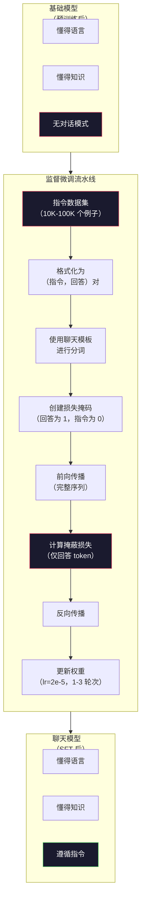

# 指令微调（SFT）

> 基础模型只能预测下一个 token。仅此而已。它不会遵循指令、回答问题或拒绝有害请求。SFT 是连接 token 预测器和有用助手之间的桥梁。你用过的每一个模型——Claude、GPT、Llama Chat——都经过了这一步。

**类型：** 构建
**语言：** Python（使用 numpy）
**前置条件：** 阶段 10，第 04 课（预训练 Mini GPT）
**时间：** 约 90 分钟

## 学习目标

- 实现监督微调（SFT），将基础语言模型转换为遵循指令的助手
- 使用系统、用户和助手角色格式化训练数据，并在非助手 token 上掩蔽损失
- 解释为什么 SFT 是必要的：基础模型是续写文本而不是回答问题
- 通过在留出的指令集上比较基础模型与微调模型的回答来评估 SFT 质量

## 问题

你在第 04 课中训练了一个模型。它可以根据给定序列预测下一个 token。向它输入"The transformer architecture"，它可能会续写为"has revolutionized natural language processing."。作为下一个 token 预测器，这已经令人印象深刻了。

现在试试这个：向它输入"What is the capital of France?"。基础模型不会回答"Paris."。它会继续这个模式。它可能会生成"What is the capital of Germany? What is the capital of Spain?"，因为它从包含问题列表的文档中学习过。或者它可能会生成"is a question that many people ask"，因为这是一个合理的下一个 token 续写。模型没有"回答"的概念。它只知道"续写"。

这就是 GPT-3（基础模型，2020 年 6 月发布）和 ChatGPT（指令微调版本，2022 年 11 月发布）之间的差距。同样的架构。同样的预训练。区别在于 20,000 到 100,000 对精心制作的（指令，回答）对，它们教会了模型遵循对话模式。

Stanford Alpaca 证明你不需要数百万个例子。2023 年 3 月，他们仅在 52,000 对由 GPT-3.5 生成的指令-回答对上微调了 Llama 7B。总成本：600 美元。结果是一个可以遵循指令、回答问题和进行对话的聊天机器人。不如 ChatGPT，但 600 美元和几个小时的训练就能达到惊人的接近程度。

Meta 的 Llama 2 Chat 在其初始 SFT 阶段仅使用了约 27,000 个高质量例子。关键洞察：质量比数量更重要。27,000 个由熟练标注员编写的例子胜过了从互联网上抓取的 100 万个噪声例子。

## 概念

### SFT 实际在做什么

监督微调继续与预训练相同的训练循环——前向传播、计算损失、反向传播、更新权重——但数据种类不同。不是原始文本，而是在结构化对话上训练：

```json
{
  "system": "You are a helpful assistant.",
  "user": "What is the capital of France?",
  "assistant": "The capital of France is Paris."
}
```

模型在预训练期间已经从 Wikipedia、教科书和网页中了解了巴黎是法国的首都。SFT 不教模型新的事实。它教模型一种新的*行为*：当你看到一个问题时，产生一个回答。当你看到一个指令时，产生一个补全。当你看到一个有害请求时，产生一个拒绝。

可以这样理解。预训练给了模型知识。SFT 给了模型礼貌。

### 数据格式

三种格式在行业中占主导地位。每种都用不同的分隔符编码相同的信息——谁说了什么。

**Alpaca 格式**（Stanford，2023 年 3 月）：

```json
{
  "instruction": "Summarize the following article in 3 sentences.",
  "input": "The European Central Bank raised interest rates...",
  "output": "The ECB increased rates by 25 basis points..."
}
```

简单且广泛使用。`input` 字段是可选的——许多指令不需要额外的上下文。Stanford 以 600 美元的成本发布了 52,000 个这种格式的例子，由 GPT-3.5 生成。这拉开了开源指令微调运动的序幕。

**ShareGPT 格式**（社区，2023 年）：

```json
{
  "conversations": [
    {"from": "system", "value": "You are a helpful assistant."},
    {"from": "human", "value": "What causes tides?"},
    {"from": "gpt", "value": "Tides are caused by the gravitational pull of the Moon..."},
    {"from": "human", "value": "How often do they occur?"},
    {"from": "gpt", "value": "Most coastal areas experience two high tides and two low tides per day..."}
  ]
}
```

支持多轮对话。"from"字段按惯例使用"human"和"gpt"，无论实际模型是什么。Vicuna 在 70,000 个从用户分享的 ChatGPT 记录中抓取的 ShareGPT 对话上训练。

**ChatML 格式**（OpenAI，被许多开源模型使用）：

```
<|im_start|>system
You are a helpful assistant.<|im_end|>
<|im_start|>user
What is the capital of France?<|im_end|>
<|im_start|>assistant
The capital of France is Paris.<|im_end|>
```

使用特殊 token（`<|im_start|>`、`<|im_end|>`）来分隔角色。这些 token 在微调期间被添加到 tokenizer 的词汇表中。Qwen、Yi 和许多其他模型使用 ChatML。

所有三种格式完成相同的事情：告诉模型"这是指令，这是回答，学习这个模式。"

### 为什么它有效

模型从预训练中已经了解了语言。它已经见过数十亿个问题后面跟着回答、指令后面跟着补全、以及人与人之间对话的例子。这些模式已经编码在权重中。

SFT 集中了这种潜在能力。不需要模型从上下文中弄清楚它是否应该回答问题或续写文档，SFT 明确地训练对话模式。经过几千个例子后，模型学会了：当你看到助手角色标记时，产生一个有用的回答。

这就是为什么 27,000 个例子就足够了。你不是在教模型英语。你不是在教它关于世界的知识。你是在教它一个简单的行为：响应指令。知识已经在那里了。

### 掩蔽损失

这是 SFT 中最重要的技术细节，大多数教程都跳过了。

在预训练期间，你在每个 token 上计算损失。模型学习预测序列中每个下一个 token。在 SFT 期间，你只计算*回答* token 上的损失。指令 token 作为上下文存在，但模型不会因为"错误预测"它们而受到惩罚。

为什么？因为你不希望模型学会*生成*指令。你希望它学会*响应*指令。如果你计算指令 token 上的损失，你就在训练模型像它自己问问题一样预测"What is the capital of France?"。这浪费了梯度信号，可能会混淆模型的角色。

在实践中，你创建一个损失掩码：回答 token 为 1，指令 token 为 0。在求平均之前，将每个 token 的损失乘以这个掩码。

```
Token:      [SYS] You are helpful [USER] What is the capital? [ASST] Paris is the capital [EOS]
损失掩码:      0    0    0     0      0     0   0  0     0       1     1    1   1     1      1
```

只有 `[ASST]` 之后的 token 对损失有贡献。模型在前向传播期间看到完整对话（它需要指令来产生正确的回答），但只根据其预测回答的好坏来更新权重。

### 训练超参数

SFT 使用与预训练显著不同的超参数。你不是从零开始训练。你是在调整一个已经能用的模型。

| 参数 | 预训练（Llama 2 7B） | SFT（Llama 2 Chat） |
|-----------|---------------------------|---------------------|
| 学习率 | 3e-4（峰值） | 2e-5 |
| 轮次 | 1（单次遍历数据） | 2 |
| 批量大小 | 4M token | 64 个例子 |
| 预热步数 | 2,000 | 0-100 |
| 权重衰减 | 0.1 | 0.0-0.1 |
| 数据大小 | 2T token | 27,000 个例子 |

SFT 的学习率低 15 倍。这一点至关重要。在微调期间使用高学习率会破坏预训练知识。模型"遗忘"它所学到的内容，过拟合到小的微调数据集上。这就是灾难性遗忘。

两个轮次意味着模型每个训练例子看到两次。在小数据集上超过 3 个轮次会导致记忆——模型开始原样复制训练例子而不是泛化。

### 灾难性遗忘

微调可能会破坏通用能力。在指令遵循数据上训练太久，模型会失去编写代码、做数学或生成创意文本的能力。它变得非常擅长其训练数据的特定格式，但对其他一切都表现很差。

三种缓解方法：

1. **低学习率。** 1e-5 到 5e-5。更小的更新意味着对预训练特征的破坏更少。

2. **短期训练。** 1-3 个轮次。在模型过拟合之前停止。

3. **混入预训练数据。** Llama 2 Chat 将少量（2-5%）原始预训练数据混入 SFT 数据集。这在學習新的指令遵循行为的同时"提醒"模型其通用能力。

### 真实数字

在一块 NVIDIA A100 80GB GPU 上对 10,000 对高质量指令对微调 7B 模型大约需要 1 小时。算法如下：

- 10,000 个例子 x 512 个平均 token = 5.12M token
- 2 个轮次 = 10.24M token 总计
- 7B 模型微调的 A100 吞吐量：约 3,000 token/秒
- 10.24M / 3,000 = 约 3,400 秒 = 约 57 分钟

对于我们的 mini GPT（4 层，128 维），训练几乎是即时的。重要的是理解机制，而不是规模。



## 构建它

### 第 1 步：指令数据集

创建一个合成指令数据集。在生产环境中，像 Scale AI 和 Anthropic 这样的公司雇佣人工标注员来编写这些。我们将以编程方式创建它们来演示格式。

```python
import numpy as np

INSTRUCTION_DATA = [
    {
        "instruction": "What is the capital of France?",
        "response": "The capital of France is Paris."
    },
    {
        "instruction": "Explain gravity in one sentence.",
        "response": "Gravity is the force that attracts objects with mass toward each other."
    },
    {
        "instruction": "Write a haiku about the ocean.",
        "response": "Waves crash on the shore, salt and foam beneath the sun, endless blue expanse."
    },
    {
        "instruction": "What is 15 multiplied by 7?",
        "response": "15 multiplied by 7 is 105."
    },
    {
        "instruction": "Name three programming languages.",
        "response": "Three programming languages are Python, Rust, and TypeScript."
    },
    {
        "instruction": "Summarize photosynthesis.",
        "response": "Photosynthesis converts sunlight, water, and carbon dioxide into glucose and oxygen."
    },
    {
        "instruction": "What year did World War II end?",
        "response": "World War II ended in 1945."
    },
    {
        "instruction": "Define machine learning.",
        "response": "Machine learning is a field where algorithms learn patterns from data to make predictions."
    },
]
```

八个例子很少。Stanford Alpaca 使用了 52,000 个。但无论你有 8 个还是 52,000 个，机制是相同的：分词、掩蔽、仅在回答上计算损失。

### 第 2 步：使用聊天模板进行分词

将指令-回答对转换为带有特殊角色标记的 token 序列。标记告诉模型指令在哪里结束、回答从哪里开始。

```python
SPECIAL_TOKENS = {
    "INST_START": 253,
    "INST_END": 254,
    "RESP_START": 255,
}


def tokenize_instruction_pair(instruction, response, vocab_size=256):
    inst_tokens = list(instruction.encode("utf-8"))
    resp_tokens = list(response.encode("utf-8"))

    inst_tokens = [min(t, vocab_size - 4) for t in inst_tokens]
    resp_tokens = [min(t, vocab_size - 4) for t in resp_tokens]

    tokens = (
        [SPECIAL_TOKENS["INST_START"]]
        + inst_tokens
        + [SPECIAL_TOKENS["INST_END"]]
        + [SPECIAL_TOKENS["RESP_START"]]
        + resp_tokens
    )

    return tokens


def create_loss_mask(tokens):
    mask = np.zeros(len(tokens), dtype=np.float32)
    in_response = False

    for i, token in enumerate(tokens):
        if token == SPECIAL_TOKENS["RESP_START"]:
            in_response = True
            continue
        if in_response:
            mask[i] = 1.0

    return mask
```

损失掩码对指令 token 全为零，对回答 token 全为一。`RESP_START` token 本身的掩码为 0，因为它是一个分隔符，不是回答内容的一部分。

### 第 3 步：掩蔽交叉熵损失

标准交叉熵，但乘以损失掩码。只有回答 token 对梯度有贡献。

```python
def masked_cross_entropy_loss(logits, targets, loss_mask):
    batch, seq_len, vocab_size = logits.shape
    logits_flat = logits.reshape(-1, vocab_size)
    targets_flat = targets.reshape(-1)
    mask_flat = loss_mask.reshape(-1)

    max_logits = logits_flat.max(axis=-1, keepdims=True)
    log_softmax = logits_flat - max_logits - np.log(
        np.exp(logits_flat - max_logits).sum(axis=-1, keepdims=True)
    )

    per_token_loss = -log_softmax[np.arange(len(targets_flat)), targets_flat]

    masked_loss = per_token_loss * mask_flat
    num_response_tokens = mask_flat.sum()
    if num_response_tokens == 0:
        return 0.0
    loss = masked_loss.sum() / num_response_tokens

    return loss
```

分母是 `num_response_tokens`，而不是 `seq_len`。如果你除以总序列长度，较长的指令会稀释梯度信号。除以回答 token 计数确保无论指令长度如何，每个回答 token 的权重相等。

### 第 4 步：SFT 训练循环

重用第 04 课的 MiniGPT。训练循环看起来几乎与预训练相同，但带有指令格式化和掩蔽损失。

```python
import sys
import os
sys.path.insert(0, os.path.join(os.path.dirname(__file__), "..", "..", "04-pre-training-mini-gpt", "code"))
from main import MiniGPT, LayerNorm, FeedForward, MultiHeadAttention, TransformerBlock, Embedding


def sft_train(model, dataset, num_epochs=2, lr=2e-5, seq_len=64):
    formatted_data = []
    for example in dataset:
        tokens = tokenize_instruction_pair(example["instruction"], example["response"])
        mask = create_loss_mask(tokens)
        formatted_data.append((tokens, mask))

    print(f"SFT Training: {len(formatted_data)} examples, {num_epochs} epochs, lr={lr}")
    print(f"Total tokens: {sum(len(t) for t, _ in formatted_data):,}")
    print()

    losses = []

    for epoch in range(num_epochs):
        epoch_loss = 0.0
        num_batches = 0

        indices = np.random.permutation(len(formatted_data))

        for idx in indices:
            tokens, mask = formatted_data[idx]

            if len(tokens) < 3:
                continue
            if len(tokens) > seq_len:
                tokens = tokens[:seq_len]
                mask = mask[:seq_len]

            input_ids = np.array(tokens[:-1]).reshape(1, -1)
            target_ids = np.array(tokens[1:]).reshape(1, -1)
            loss_mask = np.array(mask[1:]).reshape(1, -1)

            logits = model.forward(input_ids)
            loss = masked_cross_entropy_loss(logits, target_ids, loss_mask)

            batch_size, s_len, v_size = logits.shape
            probs = np.exp(logits - logits.max(axis=-1, keepdims=True))
            probs = probs / probs.sum(axis=-1, keepdims=True)
            dlogits = probs.copy()
            dlogits[np.arange(batch_size)[:, None], np.arange(s_len), target_ids] -= 1.0

            mask_expanded = loss_mask[:, :, np.newaxis]
            num_resp = loss_mask.sum()
            if num_resp > 0:
                dlogits = dlogits * mask_expanded / num_resp

            for block in model.blocks:
                block.ffn.W1 -= lr * np.random.randn(*block.ffn.W1.shape) * 0.01
                block.ffn.W2 -= lr * np.random.randn(*block.ffn.W2.shape) * 0.01
                block.ffn.b1 -= lr * np.random.randn(*block.ffn.b1.shape) * 0.01
                block.ffn.b2 -= lr * np.random.randn(*block.ffn.b2.shape) * 0.01

            epoch_loss += loss
            num_batches += 1
            losses.append(loss)

        avg_loss = epoch_loss / max(num_batches, 1)
        print(f"Epoch {epoch + 1}/{num_epochs} | Avg Loss: {avg_loss:.4f}")

    return model, losses
```

学习率为 2e-5，与 Llama 2 Chat 一致。与预训练使用的 3e-4 相比——低 15 倍。梯度被掩蔽：指令 token 产生零梯度。只有回答 token 推动权重。

### 第 5 步：比较基础模型与 SFT 模型

SFT 的全部意义在于行为改变。让我们通过检查模型如何响应指令格式的输入与原始文本续写来衡量它。

```python
def generate_response(model, prompt_tokens, max_new_tokens=50, temperature=0.8):
    tokens = list(prompt_tokens)
    seq_len = model.embedding.pos_embed.shape[0]

    for _ in range(max_new_tokens):
        context = np.array(tokens[-seq_len:]).reshape(1, -1)
        logits = model.forward(context)
        next_logits = logits[0, -1, :]

        next_logits = next_logits / max(temperature, 1e-8)
        probs = np.exp(next_logits - next_logits.max())
        probs = probs / probs.sum()
        probs = np.clip(probs, 1e-10, 1.0)
        probs = probs / probs.sum()

        next_token = np.random.choice(len(probs), p=probs)
        tokens.append(int(next_token))

    return tokens


def evaluate_instruction_following(model, instructions):
    print("Evaluating instruction following:")
    print("-" * 50)

    for instruction in instructions:
        tokens = (
            [SPECIAL_TOKENS["INST_START"]]
            + [min(t, 252) for t in list(instruction.encode("utf-8"))]
            + [SPECIAL_TOKENS["INST_END"]]
            + [SPECIAL_TOKENS["RESP_START"]]
        )

        output = generate_response(model, tokens, max_new_tokens=30, temperature=0.6)
        response_start = len(tokens)
        response_tokens = output[response_start:]
        response_bytes = bytes([t for t in response_tokens if t < 128])
        response_text = response_bytes.decode("utf-8", errors="replace")

        print(f"  Q: {instruction}")
        print(f"  A: {response_text[:80]}")
        print()
```

在一个有 8 个例子的 tiny 模型上，响应不会有意义。这是预期的。重要的是*结构*：模型学会在响应标记之后产生输出，而不是继续生成更多指令。

### 第 6 步：测量灾难性遗忘

比较 SFT 前后模型预测下一个 token 的能力。如果 SFT 损害了通用能力，原始文本上的损失会增加。

```python
def measure_forgetting(model, test_text, seq_len=64):
    tokens = np.array(list(test_text.encode("utf-8")[:512]))

    total_loss = 0.0
    num_windows = 0

    for start in range(0, len(tokens) - seq_len - 1, seq_len):
        input_ids = tokens[start:start + seq_len].reshape(1, -1)
        target_ids = tokens[start + 1:start + seq_len + 1].reshape(1, -1)

        logits = model.forward(input_ids)

        batch, s_len, vocab_size = logits.shape
        logits_flat = logits.reshape(-1, vocab_size)
        targets_flat = target_ids.reshape(-1)

        max_logits = logits_flat.max(axis=-1, keepdims=True)
        log_softmax = logits_flat - max_logits - np.log(
            np.exp(logits_flat - max_logits).sum(axis=-1, keepdims=True)
        )

        loss = -log_softmax[np.arange(len(targets_flat)), targets_flat].mean()
        total_loss += loss
        num_windows += 1

    return total_loss / max(num_windows, 1)
```

在真正的微调中，你会在这整个训练过程中跟踪这个指标。如果原始文本上的损失增加超过 10-15%，你的 SFT 太激进了。降低学习率或减少轮次。

## 使用它

### 完整 SFT 流水线演示

```python
if __name__ == "__main__":
    np.random.seed(42)

    test_text = """The transformer architecture processes sequences through self-attention.
Each layer applies multi-head attention followed by a feedforward network.
Residual connections and layer normalization stabilize deep networks.
The model learns to predict the next token given all previous tokens."""

    print("=" * 70)
    print("INSTRUCTION TUNING (SFT) DEMO")
    print("=" * 70)
    print()

    model = MiniGPT(
        vocab_size=256, embed_dim=128, num_heads=4,
        num_layers=4, max_seq_len=128, ff_dim=512
    )
    print(f"Model: {model.count_parameters():,} parameters")
    print(f"Config: 4 layers, 4 heads, 128 dims (mini GPT from Lesson 04)")
    print()

    print("PRE-SFT: Measuring base model loss on raw text")
    base_loss = measure_forgetting(model, test_text)
    print(f"  Base model loss: {base_loss:.4f}")
    print()

    print("=" * 70)
    print("SFT TRAINING")
    print("=" * 70)

    model, losses = sft_train(
        model, INSTRUCTION_DATA, num_epochs=3, lr=2e-5, seq_len=128
    )

    print()
    print("POST-SFT: Measuring fine-tuned model loss on raw text")
    sft_loss = measure_forgetting(model, test_text)
    print(f"  SFT model loss: {sft_loss:.4f}")
    print(f"  Change: {((sft_loss - base_loss) / base_loss * 100):+.1f}%")
    if abs(sft_loss - base_loss) / base_loss < 0.15:
        print("  Minimal forgetting (< 15% change)")
    else:
        print("  Significant forgetting detected")
    print()

    print("=" * 70)
    print("INSTRUCTION FOLLOWING EVALUATION")
    print("=" * 70)
    print()

    test_instructions = [
        "What is the capital of France?",
        "Name a programming language.",
        "Define gravity.",
    ]
    evaluate_instruction_following(model, test_instructions)

    print("=" * 70)
    print("DATA FORMAT EXAMPLES")
    print("=" * 70)
    print()

    for i, example in enumerate(INSTRUCTION_DATA[:3]):
        tokens = tokenize_instruction_pair(example["instruction"], example["response"])
        mask = create_loss_mask(tokens)
        resp_count = int(mask.sum())
        total_count = len(tokens)
        print(f"  Example {i + 1}: {total_count} tokens, {resp_count} response tokens ({resp_count/total_count:.0%} of sequence)")
        print(f"    Instruction: {example['instruction']}")
        print(f"    Response: {example['response']}")
        print()

    print("=" * 70)
    print("TRAINING LOSS CURVE")
    print("=" * 70)
    print()

    if losses:
        window = max(1, len(losses) // 5)
        for i in range(0, len(losses), window):
            chunk = losses[i:i + window]
            avg = sum(chunk) / len(chunk)
            print(f"  Steps {i:3d}-{i + len(chunk) - 1:3d}: avg loss = {avg:.4f}")
```

## 交付物

本课产出 `outputs/prompt-sft-data-curator.md`——一个帮助你设计和策划 SFT 指令数据集的提示词。给定一个目标能力（代码生成、数学、对话），它会产生一个包含格式规范、质量标准和多样性要求的数据收集计划。

## 练习

1. 添加系统提示支持。修改 `tokenize_instruction_pair` 以接受系统消息并将其前置在指令之前。创建 5 个具有不同系统提示的例子（"You are a poet"、"You are a math tutor"），并验证模型在训练期间看到不同的系统提示。

2. 实现数据混合。创建一个函数，接受一个 SFT 数据集和一个原始文本语料库，然后生成训练批次，其中 5% 是原始文本（不掩蔽），95% 是指令对（掩蔽）。运行 3 个轮次，并将遗忘指标与纯 SFT 训练进行比较。

3. 构建数据质量评分器。对于每个指令-回答对，计算：(a) 回答的 token 长度，(b) 指令与回答的比例，(c) 词汇多样性（唯一 token / 总 token）。过滤掉回答长度 < 10 个 token 或多样性 < 0.3 的例子。展示过滤如何影响最终损失。

4. 实现多轮对话训练。扩展分词以处理 3 轮对话（用户-助手-用户-助手-用户-助手）。损失掩码应覆盖所有三个助手轮次。通过打印一个例子的 token-掩码对齐来验证掩码是否正确。

5. 比较学习率。用 lr=1e-4、lr=2e-5 和 lr=1e-6 三次训练同一个模型。绘制损失曲线。1e-4 的运行应该显示快速的初始下降但较高的最终损失（过拟合）。1e-6 的运行几乎不会移动。2e-5 的运行应该是最佳点。

## 关键术语

| 术语 | 大家怎么说的 | 实际含义 |
|------|----------------|----------------------|
| SFT | "在对话上进行微调" | 监督微调：在（指令，回答）对上继续训练，损失仅在回答 token 上计算 |
| 指令微调 | "教模型遵循指令" | 在明确的指令-回答对上训练，使基础模型学习对话模式，而非新知识 |
| 损失掩蔽 | "忽略提示" | 将指令 token 的损失设为零，使梯度仅来自回答 token 预测 |
| ChatML | "聊天标记语言" | 一种使用 `<|im_start|>` 和 `<|im_end|>` 分隔符标记对话中说话人角色的 token 格式 |
| Alpaca 格式 | "Stanford 的格式" | 一种带有 instruction/input/output 字段的 JSON 格式，用于 52K 个 GPT-3.5 生成的例子，成本 600 美元 |
| 灾难性遗忘 | "模型变笨了" | 微调会破坏预训练能力，因为梯度更新用任务特定模式覆盖了通用知识 |
| 权重绑定 | "共享嵌入" | 在输入 token 嵌入和输出预测头中使用相同的矩阵，节省参数并提高一致性 |
| 聊天模板 | "如何格式化提示" | 构建对话的特定 token 序列（角色标记、分隔符），供模型使用 |

## 延伸阅读

- [Ouyang et al., 2022 -- "Training language models to follow instructions with human feedback" (InstructGPT)](https://arxiv.org/abs/2203.02155) —— 引入指令微调 + RLHF 的论文
- [Taori et al., 2023 -- "Stanford Alpaca: An Instruction-following LLaMA Model"](https://github.com/tatsu-lab/stanford_alpaca) —— 52K 指令例子仅需 600 美元，证明 SFT 在小数据集上有效
- [Touvron et al., 2023 -- "Llama 2: Open Foundation and Fine-Tuned Chat Models"](https://arxiv.org/abs/2307.09288) —— Meta 的 SFT + RLHF 流水线，使用 27K 高质量例子
- [Chiang et al., 2023 -- "Vicuna: An Open-Source Chatbot Impressing GPT-4"](https://lmsys.org/blog/2023-03-30-vicuna/) —— 在 70K ShareGPT 对话上训练
- [Zhou et al., 2023 -- "LIMA: Less Is More for Alignment"](https://arxiv.org/abs/2305.11206) —— 证明 1,000 个精心策划的例子可以匹配大得多的 SFT 数据集