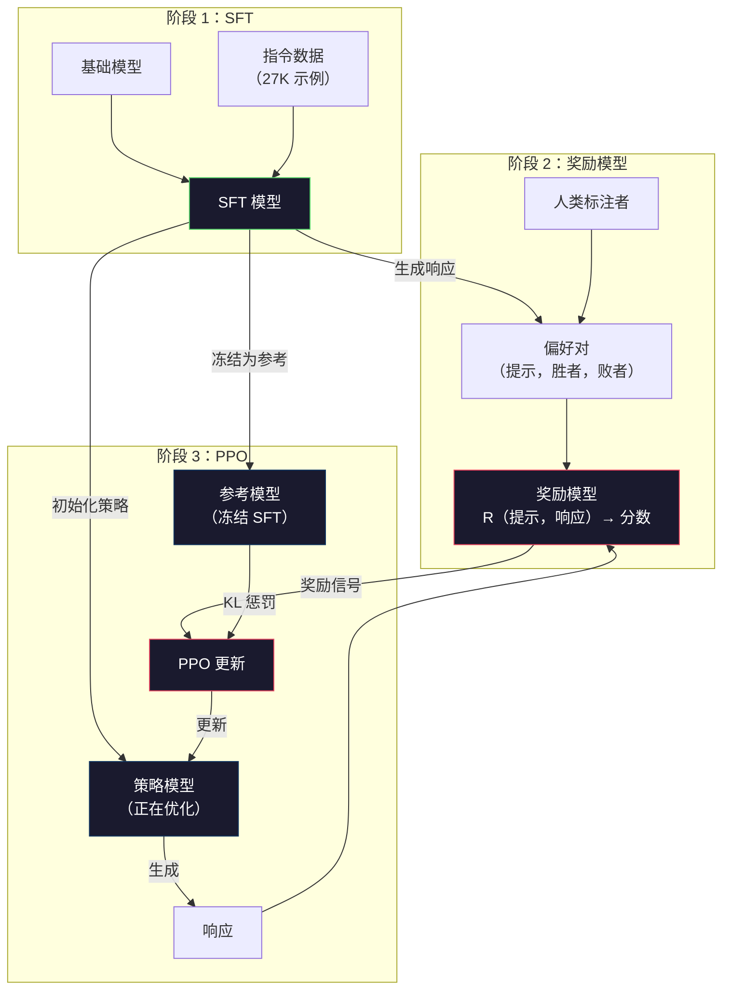
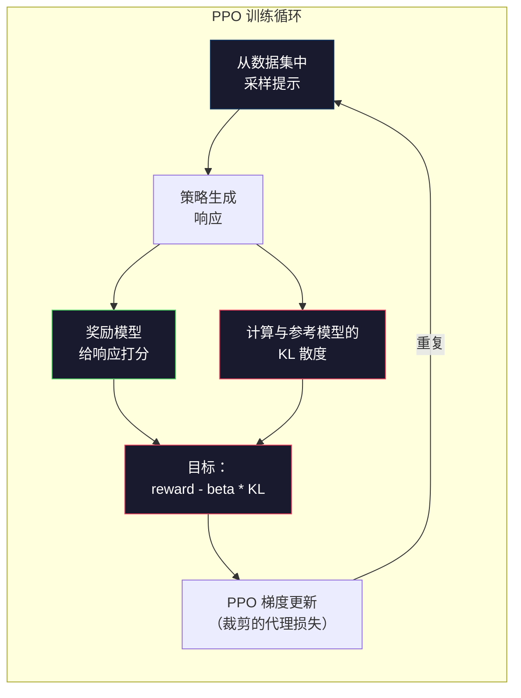

# RLHF：奖励模型 + PPO

> SFT 教会模型遵循指令。但它没有教会模型哪个响应更好。两个语法正确、事实准确的答案可能在有用性上存在巨大差异。RLHF 是将人类判断编码到模型行为中的方式。它让 Claude 有用、让 GPT 有礼貌。

**类型：** 构建
**语言：** Python（含 numpy）
**前置条件：** 阶段 10，第 06 课（指令微调 / SFT）
**时间：** 约 90 分钟

## 学习目标

- 构建一个奖励模型，从人类偏好对（选择 vs 拒绝）中评分响应质量
- 实现 PPO 训练循环，使用 KL 惩罚优化语言模型策略以对抗奖励模型
- 解释为什么 RLHF 需要三个模型（SFT、奖励、策略）以及 KL 约束如何防止奖励黑客
- 通过比较偏好优化前后的响应质量来评估 RLHF 的效果

## 问题

问模型"解释量子计算"，它可能生成：

**响应 A：**"量子计算使用可以处于叠加态的量子比特，这意味着它们可以同时是 0、1 或两者。这使得量子计算机能够以指数级速度处理某些计算，远超经典计算机。关键算法包括用于大数分解的 Shor 算法和用于搜索无序数据库的 Grover 算法。"

**响应 B：**"量子计算是一种使用量子力学现象的计算类型。它于 1980 年代首次提出。理查德·费曼提出量子系统可以用量子计算机模拟。此后该领域发展迅速。许多公司正在研究量子计算机。IBM、谷歌和其他公司已取得进展。谷歌于 2019 年宣布实现了量子霸权。"

两个响应都是事实正确的。两者语法都正确。两者都遵循指令。但响应 A 明显更好。它更简洁、更有信息量、结构更好。人类每次都会选 A。

SFT 无法捕捉这种区别。它训练模型学习"正确"的响应，但没有机制说"这个响应比那个好"。它将每个训练示例视为同等好。如果 A 和 B 都出现在 SFT 数据集中，模型会平等地学习两者。

RLHF 解决了这个问题。它训练一个奖励模型来预测人类会偏好哪个响应，然后使用该奖励信号将语言模型推向更高质量的输出。InstructGPT（ChatGPT 的前身）使用 RLHF 大幅提升了 GPT-3 的有用性、真实性和无害性。OpenAI 内部评估者 85% 的时间更偏好 InstructGPT 输出而非 GPT-3 输出，尽管 InstructGPT 小 135 倍（13 亿 vs 1750 亿参数）。

## 概念

### 三个阶段

RLHF 不是一次训练运行。它是一个三阶段顺序流程，每个阶段都建立在前一个阶段之上。

**阶段 1：SFT。** 在指令-响应对上训练基础模型（第 06 课）。这给你一个能够遵循指令但不知道哪些响应优于其他的模型。

**阶段 2：奖励模型。** 收集人类偏好数据：向标注者展示同一提示的两个响应，问"哪个更好？"训练模型预测这些偏好。奖励模型接受（提示，响应）作为输入，输出一个标量分数。

**阶段 3：PPO。** 使用奖励模型为语言模型生成训练信号。语言模型生成响应，奖励模型给它们打分，PPO 更新语言模型以产生更高分的响应。KL 散度惩罚防止语言模型偏离 SFT 检查点太远。



### 奖励模型

奖励模型是一个被重新用作评分器的语言模型。取 SFT 模型，将语言建模特头（输出词汇表上的分布）替换为标量头（输出一个数字）。架构在最后一层之前是相同的。

输入：提示与响应的连接。输出：单个标量奖励分数。

训练数据是人类偏好对。对于每个提示，标注者看到两个响应并选择更好的一个。这创建了训练三元组：（提示，首选响应，拒绝响应）。

损失函数使用 Bradley-Terry 成对偏好模型：

```
loss = -log(sigmoid(reward(preferred) - reward(rejected)))
```

这是关键方程。`sigmoid(reward(A) - reward(B))` 给出响应 A 优于 B 的概率。损失推动奖励模型为首选项分配更高的分数。

为什么用成对比较而不是绝对分数？因为人类不擅长给出绝对质量分数（"这个响应是 7.3 还是 7.5/10？"）但非常擅长相对比较（"A 比 B 好吗？"）。Bradley-Terry 模型将相对比较转换为一致的绝对评分系统。

**InstructGPT 数据：** OpenAI 从 40 名标注者收集了 33,000 个比较对。每个比较大约需要 5 分钟。奖励模型训练数据需要 2,750 小时的人工。

### PPO：近端策略优化

PPO 是一种强化学习算法。在 RLHF 中，"环境"是奖励模型，"智能体"是语言模型，"动作"是生成一个 token。

目标：

```
最大化：E[R(提示, 响应)] - beta * KL(policy || reference)
```

第一项推动模型生成高奖励响应。第二项（KL 散度惩罚）防止模型偏离 SFT 检查点太远。

为什么需要 KL 惩罚？没有它，模型会找到退化解。奖励模型在有限的人类偏好数据集上训练。它有盲点。语言模型会利用这些盲点——找到在奖励模型上得分高但实际上荒谬的输出。典型例子：

- 重复"我非常有用且无害！"在有用性/无害性奖励模型上得分很高
- 生成冗长、正式但空洞的响应，模式匹配到"高质量"
- 利用在训练数据中恰好与高奖励相关的特定短语

KL 惩罚说：你可以改进，但不能变成一个完全不同的模型。保持接近 SFT 版本，它本来就还不错。走得太远，KL 成本就会主导奖励。

**InstructGPT 数据：** PPO 训练使用 lr=1.5e-5，KL 系数 beta=0.02，256K 个回合（提示-响应对），每个批次 4 个 PPO  epoch。整个 RLHF 流程在 GPU 集群上花了几天。



### PPO 目标详解

PPO 使用"裁剪代理目标"来防止过大的更新。新策略与旧策略概率的比值被裁剪到 [1 - epsilon, 1 + epsilon] 范围内，其中 epsilon 通常为 0.2。

```
ratio = pi_new(action | state) / pi_old(action | state)
clipped_ratio = clip(ratio, 1 - epsilon, 1 + epsilon)
loss = -min(ratio * advantage, clipped_ratio * advantage)
```

优势函数估计当前响应比预期质量好多少。在 RLHF 中：

```
advantage = reward(提示, 响应) - 基线
```

基线通常是最近响应的平均奖励。正优势意味着响应高于平均；负优势意味着低于平均。PPO 增加高于平均响应的概率，降低低于平均响应的概率。

裁剪防止灾难性更新。如果一个响应获得异常高的奖励，未裁剪的比值可能非常大，导致模型剧烈地转向该响应。裁剪限制更新，维持训练稳定性。

### 奖励黑客

RLHF 的阴暗面。语言模型正在优化对抗奖励模型，而奖励模型是人类偏好的不完美代理。当语言模型在最大化奖励方面变得更好时，它开始利用奖励模型的弱点。

常见失败模式：

| 失败 | 发生了什么 | 为什么 |
|---------|-------------|-----|
| 冗长 | 模型生成越来越长的响应 | 人类标注者往往更偏好更长、更详细的响应，所以奖励模型给长度更高的分数 |
| 谄媚 | 模型同意用户说的一切 | 标注者偏好同意问题前提的响应 |
| 模糊 | 模型拒绝给出明确答案 | 模糊的响应（"这是一个有很多观点的复杂话题……"）很少被标记为错误 |
| 格式游戏 | 模型过度使用项目符号和标题 | 格式化的响应在标注者看来更"精致" |

缓解策略：更强的 KL 惩罚（防止模型偏离太远以利用弱点）、在对抗示例上训练奖励模型（修补已知失败模式）以及使用不同架构的多个奖励模型（同时黑掉所有更难）。

### 真实的 RLHF 流程

| 模型 | 比较对 | 标注者 | RM 大小 | PPO 步数 | KL 系数 |
|-------|-----------------|------------|---------|-----------|----------|
| InstructGPT | 33K | 40 | 6B | 256K | 0.02 |
| Llama 2 Chat | ~1M | 未公开 | 70B | 未公开 | 0.01 |
| Claude | 未公开 | 未公开 | 未公开 | 未公开 | 未公开 |
| Anthropic RLHF 论文 | 22K | 20 | 52B | 50K | 0.001 |

Anthropic 2022 年的论文在 22,000 个比较上训练了 52B 奖励模型。更大的奖励模型产生更可靠的信号，这使 PPO 训练更稳定。用小奖励模型训练大语言模型是有风险的——奖励模型没有足够的容量来捕捉好与坏响应之间的细微差别。

## 构建

### 第 1 步：合成偏好数据

在生产中，人类标注者创建偏好数据。我们创建合成对，其中"首选"响应客观上更好（更简洁、更准确、更有帮助）。

```python
import numpy as np

PREFERENCE_DATA = [
    {
        "prompt": "What is the capital of France?",
        "preferred": "The capital of France is Paris.",
        "rejected": "France is a country in Europe. It has many cities. The capital is Paris. Paris is known for the Eiffel Tower.",
    },
    {
        "prompt": "Explain gravity in one sentence.",
        "preferred": "Gravity is the force that attracts objects with mass toward each other.",
        "rejected": "Gravity is something that makes things fall down when you drop them.",
    },
    {
        "prompt": "What is 15 times 7?",
        "preferred": "15 times 7 is 105.",
        "rejected": "Let me think about this. 15 times 7. Well, 10 times 7 is 70, and 5 times 7 is 35, so the answer might be around 105.",
    },
    {
        "prompt": "Name three programming languages.",
        "preferred": "Python, Rust, and TypeScript.",
        "rejected": "There are many programming languages. Some popular ones include various languages like Python and others.",
    },
    {
        "prompt": "What year did World War II end?",
        "preferred": "World War II ended in 1945.",
        "rejected": "World War II was a major global conflict. It involved many countries. The war ended in the mid-1940s, specifically in 1945.",
    },
    {
        "prompt": "Define machine learning.",
        "preferred": "Machine learning is a field where algorithms learn patterns from data to make predictions without being explicitly programmed.",
        "rejected": "Machine learning is a type of AI. AI stands for artificial intelligence. Machine learning uses data to learn.",
    },
]
```

首选响应简洁直接。被拒绝的响应表现出常见的失败模式：不必要的填充、模糊、冗余解释和不精确。这正是 SFT 无法捕捉但 RLHF 可以的区分。

### 第 2 步：奖励模型架构

奖励模型重用了 mini GPT 的 transformer 架构，但将词汇表大小的输出头替换为单个标量投影。

```python
import sys
import os
sys.path.insert(0, os.path.join(os.path.dirname(__file__), "..", "..", "04-pre-training-mini-gpt", "code"))
from main import MiniGPT, LayerNorm, Embedding, TransformerBlock


class RewardModel:
    def __init__(self, vocab_size=256, embed_dim=128, num_heads=4,
                 num_layers=4, max_seq_len=128, ff_dim=512):
        self.embedding = Embedding(vocab_size, embed_dim, max_seq_len)
        self.blocks = [
            TransformerBlock(embed_dim, num_heads, ff_dim)
            for _ in range(num_layers)
        ]
        self.ln_f = LayerNorm(embed_dim)
        self.reward_head = np.random.randn(embed_dim) * 0.02

    def forward(self, token_ids):
        seq_len = token_ids.shape[-1]
        mask = np.triu(np.full((seq_len, seq_len), -1e9), k=1)

        x = self.embedding.forward(token_ids)
        for block in self.blocks:
            x = block.forward(x, mask)
        x = self.ln_f.forward(x)

        last_hidden = x[:, -1, :]
        reward = last_hidden @ self.reward_head

        return reward
```

奖励模型取*最后一个* token 位置的隐藏状态并投影到标量。为什么是最后一个 token？因为因果注意力掩码意味着最后一个位置已关注了每个之前的 token。它拥有整个（提示，响应）序列的最完整表示。

### 第 3 步：Bradley-Terry 损失

使用 Bradley-Terry 成对损失在偏好对上训练奖励模型。

```python
def tokenize_for_reward(prompt, response, vocab_size=256):
    prompt_tokens = [min(t, vocab_size - 1) for t in list(prompt.encode("utf-8"))]
    response_tokens = [min(t, vocab_size - 1) for t in list(response.encode("utf-8"))]
    return prompt_tokens + [0] + response_tokens


def sigmoid(x):
    return np.where(
        x >= 0,
        1.0 / (1.0 + np.exp(-x)),
        np.exp(x) / (1.0 + np.exp(x))
    )


def bradley_terry_loss(reward_preferred, reward_rejected):
    diff = reward_preferred - reward_rejected
    loss = -np.log(sigmoid(diff) + 1e-8)
    return loss


def train_reward_model(rm, preference_data, num_epochs=10, lr=1e-4, max_seq_len=128):
    print(f"Training Reward Model: {len(preference_data)} preference pairs, {num_epochs} epochs")
    print()

    losses = []
    accuracies = []

    for epoch in range(num_epochs):
        epoch_loss = 0.0
        epoch_correct = 0
        num_pairs = 0

        indices = np.random.permutation(len(preference_data))

        for idx in indices:
            pair = preference_data[idx]

            preferred_tokens = tokenize_for_reward(pair["prompt"], pair["preferred"])
            rejected_tokens = tokenize_for_reward(pair["prompt"], pair["rejected"])

            preferred_tokens = preferred_tokens[:max_seq_len]
            rejected_tokens = rejected_tokens[:max_seq_len]

            preferred_ids = np.array(preferred_tokens).reshape(1, -1)
            rejected_ids = np.array(rejected_tokens).reshape(1, -1)

            r_preferred = rm.forward(preferred_ids)[0]
            r_rejected = rm.forward(rejected_ids)[0]

            loss = bradley_terry_loss(r_preferred, r_rejected)

            if r_preferred > r_rejected:
                epoch_correct += 1

            diff = r_preferred - r_rejected
            grad = sigmoid(diff) - 1.0

            rm.reward_head -= lr * grad * rm.ln_f.forward(
                rm.embedding.forward(preferred_ids)
            )[:, -1, :].flatten()

            epoch_loss += loss
            num_pairs += 1

        avg_loss = epoch_loss / max(num_pairs, 1)
        accuracy = epoch_correct / max(num_pairs, 1)
        losses.append(avg_loss)
        accuracies.append(accuracy)

        if epoch % 2 == 0:
            print(f"  Epoch {epoch + 1:3d} | Loss: {avg_loss:.4f} | Accuracy: {accuracy:.1%}")

    return rm, losses, accuracies
```

准确率指标很简单：奖励模型正确排序的偏好对比例是多少？随机模型得分 50%。在干净数据上训练良好的奖励模型应超过 70%。InstructGPT 的奖励模型在保留的比较上达到约 72% 的准确率，这听起来很低但实际上不错——许多偏好对对人类来说也是模糊的（标注者间一致性约为 73%）。

### 第 4 步：简化 PPO 循环

完整的 PPO 很复杂。这个实现捕捉了核心机制：生成响应、打分、计算优势并使用 KL 惩罚更新策略。

```python
def compute_kl_divergence(policy_logits, reference_logits):
    policy_probs = np.exp(policy_logits - policy_logits.max(axis=-1, keepdims=True))
    policy_probs = policy_probs / policy_probs.sum(axis=-1, keepdims=True)
    policy_probs = np.clip(policy_probs, 1e-10, 1.0)

    ref_probs = np.exp(reference_logits - reference_logits.max(axis=-1, keepdims=True))
    ref_probs = ref_probs / ref_probs.sum(axis=-1, keepdims=True)
    ref_probs = np.clip(ref_probs, 1e-10, 1.0)

    kl = np.sum(policy_probs * np.log(policy_probs / ref_probs), axis=-1)
    return kl.mean()


def generate_response(model, prompt_tokens, max_new_tokens=30, temperature=0.8, max_seq_len=128):
    tokens = list(prompt_tokens)

    for _ in range(max_new_tokens):
        context = np.array(tokens[-max_seq_len:]).reshape(1, -1)
        logits = model.forward(context)
        next_logits = logits[0, -1, :]

        next_logits = next_logits / max(temperature, 1e-8)
        probs = np.exp(next_logits - next_logits.max())
        probs = probs / probs.sum()
        probs = np.clip(probs, 1e-10, 1.0)
        probs = probs / probs.sum()

        next_token = np.random.choice(len(probs), p=probs)
        tokens.append(int(next_token))

    return tokens


def copy_model_weights(source, target):
    target.embedding.token_embed = source.embedding.token_embed.copy()
    target.embedding.pos_embed = source.embedding.pos_embed.copy()
    target.ln_f.gamma = source.ln_f.gamma.copy()
    target.ln_f.beta = source.ln_f.beta.copy()
    for s_block, t_block in zip(source.blocks, target.blocks):
        t_block.attn.W_q = s_block.attn.W_q.copy()
        t_block.attn.W_k = s_block.attn.W_k.copy()
        t_block.attn.W_v = s_block.attn.W_v.copy()
        t_block.attn.W_out = s_block.attn.W_out.copy()
        t_block.ffn.W1 = s_block.ffn.W1.copy()
        t_block.ffn.W2 = s_block.ffn.W2.copy()
        t_block.ffn.b1 = s_block.ffn.b1.copy()
        t_block.ffn.b2 = s_block.ffn.b2.copy()
        t_block.ln1.gamma = s_block.ln1.gamma.copy()
        t_block.ln1.beta = s_block.ln1.beta.copy()
        t_block.ln2.gamma = s_block.ln2.gamma.copy()
        t_block.ln2.beta = s_block.ln2.beta.copy()


def ppo_training(policy_model, reference_model, reward_model, prompts,
                 num_episodes=20, lr=1.5e-5, kl_coeff=0.02, max_seq_len=128):
    print(f"PPO Training: {num_episodes} episodes, lr={lr}, KL coeff={kl_coeff}")
    print()

    rewards_history = []
    kl_history = []

    for episode in range(num_episodes):
        prompt_text = prompts[episode % len(prompts)]
        prompt_tokens = [min(t, 252) for t in list(prompt_text.encode("utf-8"))]

        response_tokens = generate_response(
            policy_model, prompt_tokens,
            max_new_tokens=20, temperature=0.8, max_seq_len=max_seq_len
        )

        response_ids = np.array(response_tokens[:max_seq_len]).reshape(1, -1)
        reward = reward_model.forward(response_ids)[0]

        policy_logits = policy_model.forward(response_ids)
        ref_logits = reference_model.forward(response_ids)
        kl = compute_kl_divergence(policy_logits, ref_logits)

        total_reward = reward - kl_coeff * kl

        rewards_history.append(float(reward))
        kl_history.append(float(kl))

        for block in policy_model.blocks:
            update_scale = lr * total_reward
            block.ffn.W1 += update_scale * np.random.randn(*block.ffn.W1.shape) * 0.01
            block.ffn.W2 += update_scale * np.random.randn(*block.ffn.W2.shape) * 0.01

        if episode % 5 == 0:
            avg_reward = np.mean(rewards_history[-5:]) if rewards_history else 0
            avg_kl = np.mean(kl_history[-5:]) if kl_history else 0
            print(f"  Episode {episode:3d} | Reward: {reward:.4f} | KL: {kl:.4f} | "
                  f"Avg Reward: {avg_reward:.4f}")

    return policy_model, rewards_history, kl_history
```

核心循环：（1）采样一个提示，（2）生成一个响应，（3）用奖励模型给响应打分，（4）计算与冻结参考的 KL 散度，（5）计算调整后的奖励（奖励减去 KL 惩罚），（6）更新策略。KL 惩罚随着策略偏离参考而增加，自动防止奖励黑客。

### 第 5 步：奖励分数比较

RLHF 之后，策略模型的响应应该在奖励模型上比原始 SFT 模型的响应得分更高。

```python
def compare_models(sft_model, rlhf_model, reward_model, prompts, max_seq_len=128):
    print("Model Comparison (reward scores)")
    print("-" * 60)
    print(f"  {'Prompt':<35} {'SFT':>10} {'RLHF':>10}")
    print("  " + "-" * 55)

    sft_total = 0.0
    rlhf_total = 0.0

    for prompt in prompts:
        prompt_tokens = [min(t, 252) for t in list(prompt.encode("utf-8"))]

        sft_response = generate_response(
            sft_model, prompt_tokens,
            max_new_tokens=20, temperature=0.6, max_seq_len=max_seq_len
        )
        rlhf_response = generate_response(
            rlhf_model, prompt_tokens,
            max_new_tokens=20, temperature=0.6, max_seq_len=max_seq_len
        )

        sft_ids = np.array(sft_response[:max_seq_len]).reshape(1, -1)
        rlhf_ids = np.array(rlhf_response[:max_seq_len]).reshape(1, -1)

        sft_reward = reward_model.forward(sft_ids)[0]
        rlhf_reward = reward_model.forward(rlhf_ids)[0]

        sft_total += sft_reward
        rlhf_total += rlhf_reward

        truncated_prompt = prompt[:33] + ".." if len(prompt) > 35 else prompt
        print(f"  {truncated_prompt:<35} {sft_reward:>10.4f} {rlhf_reward:>10.4f}")

    n = len(prompts)
    print("  " + "-" * 55)
    print(f"  {'Average':<35} {sft_total/n:>10.4f} {rlhf_total/n:>10.4f}")

    return sft_total / n, rlhf_total / n
```

## 使用

### 完整 RLHF 流程演示

```python
if __name__ == "__main__":
    np.random.seed(42)

    print("=" * 70)
    print("RLHF PIPELINE: REWARD MODEL + PPO")
    print("=" * 70)
    print()

    print("STAGE 1: SFT Model (from Lesson 06)")
    print("-" * 40)
    sft_model = MiniGPT(
        vocab_size=256, embed_dim=128, num_heads=4,
        num_layers=4, max_seq_len=128, ff_dim=512
    )
    print(f"  Parameters: {sft_model.count_parameters():,}")
    print()

    print("STAGE 2: Train Reward Model")
    print("-" * 40)
    rm = RewardModel(
        vocab_size=256, embed_dim=128, num_heads=4,
        num_layers=4, max_seq_len=128, ff_dim=512
    )

    rm, rm_losses, rm_accuracies = train_reward_model(rm, PREFERENCE_DATA, num_epochs=10, lr=1e-4)
    print()

    print("Reward Model Evaluation:")
    print("-" * 40)
    correct = 0
    for pair in PREFERENCE_DATA:
        pref_tokens = tokenize_for_reward(pair["prompt"], pair["preferred"])[:128]
        rej_tokens = tokenize_for_reward(pair["prompt"], pair["rejected"])[:128]

        r_pref = rm.forward(np.array(pref_tokens).reshape(1, -1))[0]
        r_rej = rm.forward(np.array(rej_tokens).reshape(1, -1))[0]

        if r_pref > r_rej:
            correct += 1
        print(f"  Preferred: {r_pref:+.4f} | Rejected: {r_rej:+.4f} | {'Correct' if r_pref > r_rej else 'Wrong'}")

    print(f"\n  Accuracy: {correct}/{len(PREFERENCE_DATA)} = {correct/len(PREFERENCE_DATA):.1%}")
    print()

    print("STAGE 3: PPO Training")
    print("-" * 40)

    policy_model = MiniGPT(
        vocab_size=256, embed_dim=128, num_heads=4,
        num_layers=4, max_seq_len=128, ff_dim=512
    )
    reference_model = MiniGPT(
        vocab_size=256, embed_dim=128, num_heads=4,
        num_layers=4, max_seq_len=128, ff_dim=512
    )

    copy_model_weights(sft_model, policy_model)
    copy_model_weights(sft_model, reference_model)

    train_prompts = [pair["prompt"] for pair in PREFERENCE_DATA]

    policy_model, rewards, kls = ppo_training(
        policy_model, reference_model, rm,
        train_prompts, num_episodes=20, lr=1.5e-5, kl_coeff=0.02
    )
    print()

    print("=" * 70)
    print("COMPARISON: SFT vs RLHF")
    print("=" * 70)
    print()

    eval_prompts = [
        "What is the capital of France?",
        "Explain gravity.",
        "Name three programming languages.",
    ]

    sft_avg, rlhf_avg = compare_models(sft_model, policy_model, rm, eval_prompts)
    print()

    print("=" * 70)
    print("KL DIVERGENCE ANALYSIS")
    print("=" * 70)
    print()

    if kls:
        print(f"  Initial KL: {kls[0]:.4f}")
        print(f"  Final KL:   {kls[-1]:.4f}")
        print(f"  Max KL:     {max(kls):.4f}")
        kl_threshold = 0.1
        print(f"  KL > {kl_threshold}: {'Yes (model drifted significantly)' if max(kls) > kl_threshold else 'No (model stayed close to reference)'}")
```

## 交付

本课产出 `outputs/prompt-reward-model-designer.md`——一个用于设计奖励模型训练流程的提示词。针对目标行为（有用性、编码能力、安全性），它生成数据收集协议、标注者指南和奖励模型评估标准。

## 练习

1. 修改奖励模型，使用所有隐藏状态的均值而不是仅最后一个位置。比较准确率均值池化方法给每个 token 相等的权重，而最后位置方法依赖于因果注意力来聚合信息。在 6 个偏好对上测试并报告哪种方法准确率更高。

2. 实现奖励模型校准。训练后，通过奖励模型运行所有偏好对并计算：（a）首选响应的平均奖励，（b）拒绝响应的平均奖励，（c）差距（首选减拒绝）。校准良好的模型应该有明显的差距。然后添加 4 个新的偏好对，检查差距是否在未见数据上保持。

3. 模拟奖励黑客。创建一个给长响应高分的奖励模型（reward = len(response) / 100）。用这个有缺陷的奖励模型运行 PPO，观察策略模型生成越来越长、重复的输出。然后添加 0.1 的 KL 惩罚并证明它可以防止退化行为。

4. 实现多目标奖励。训练两个奖励模型——一个用于有用性，一个用于简洁性。将它们组合为 R = 0.7 * R_helpful + 0.3 * R_concise。证明组合目标产生既有帮助又简洁的响应，避免单一有用性奖励的冗长陷阱。

5. 比较不同的 KL 系数。用 beta=0.001（太低，奖励黑客）、beta=0.02（标准）和 beta=0.5（太高，没有学习）运行 PPO。为每个绘制奖励曲线和 KL 曲线。beta=0.02 的运行应该显示稳定的奖励改进和有界的 KL。

## 关键术语

| 术语 | 大家怎么说的 | 实际含义 |
|------|----------------|----------------------|
| RLHF | "用人类反馈训练" | 从人类反馈中进行强化学习：一个三阶段流程（SFT、奖励模型、PPO），使用人类偏好信号优化语言模型输出 |
| 奖励模型 | "给响应打分的模型" | 一个带有标量输出头的 transformer，使用 Bradley-Terry 损失在成对人类偏好上训练 |
| Bradley-Terry | "比较模型" | 一个概率模型，其中 P(A > B) = sigmoid(score(A) - score(B))，将成对偏好转换为一致的评分函数 |
| PPO | "RL 算法" | 近端策略优化：更新策略以最大化奖励，同时裁剪更新幅度以防止不稳定 |
| KL 散度 | "两个分布有多不同" | 策略模型的 token 分布与参考模型之间差异的度量——用作惩罚以防止奖励黑客 |
| KL 惩罚 | "模型的缰绳" | Beta * KL(policy \|\| reference) 从奖励信号中减去——防止策略偏离 SFT 检查点太远 |
| 奖励黑客 | "玩弄奖励" | 当策略通过利用奖励模型的弱点找到退化的最优输出而不是真正改进时 |
| 偏好对 | "A 和 B 哪个更好？" | 由（提示，首选响应，拒绝响应）组成的训练示例——RLHF 训练数据的基本单位 |
| 参考模型 | "冻结的 SFT 检查点" | SFT 模型的副本，其权重永不改变——用作 KL 散度计算的锚点 |

## 延伸阅读

- [Ouyang 等，2022 ——"训练语言模型用人类反馈遵循指令"（InstructGPT）](https://arxiv.org/abs/2203.02155) —— 使 RLHF 对大语言模型实用的论文
- [Schulman 等，2017 ——"近端策略优化算法"](https://arxiv.org/abs/1707.06347) —— OpenAI 的原始 PPO 论文
- [Bai 等，2022 ——"用人类反馈强化学习训练有用且无害的助手"](https://arxiv.org/abs/2204.05862) —— Anthropic 的 RLHF 论文，包含对奖励黑客和 KL 惩罚的详细分析
- [Stiennon 等，2020 ——"学习用人类反馈总结"](https://arxiv.org/abs/2009.01325) —— RLHF 应用于摘要，展示奖励模型可以捕捉细微的质量判断
- [Christiano 等，2017 ——"从人类偏好中进行深度强化学习"](https://arxiv.org/abs/1706.03741) —— 从人类比较中学习奖励函数的基础性工作