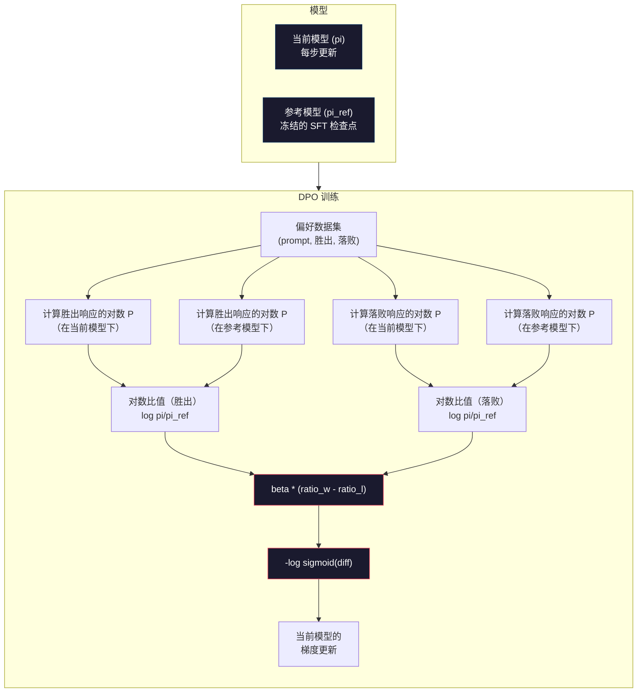

# DPO: 直接偏好优化

> RLHF 有效。但它需要训练三个模型（SFT、奖励模型、策略），还要应对 PPO 的不稳定性，以及调校 KL 惩罚项。DPO 问了一个问题：能不能把这些全部省掉？DPO 直接在偏好对（preference pairs）上优化语言模型。不需要奖励模型。不需要 PPO。一个训练循环。同样的效果。

**类型：** 构建型
**语言：** Python（基于 numpy）
**前置条件：** 阶段 10，第 07 课（RLHF）
**时间：** 约 90 分钟

## 学习目标

- 实现 DPO 训练，直接在偏好对上优化语言模型，无需单独的奖励模型
- 推导 DPO 损失函数，解释它如何通过策略的对数概率隐式地表示奖励模型
- 从训练稳定性、计算成本和所需模型数量等维度对比 DPO 与 RLHF
- 调校 beta 参数，控制训练后的策略与参考模型的偏离程度

## 问题

你在第 07 课构建了一个 RLHF 流水线。三个阶段，三个模型。SFT 模型、奖励模型，以及用 PPO 优化的策略模型。仅奖励模型本身就需要数千对人类偏好数据和一个独立的训练循环。PPO 则需要对 KL 系数、学习率、裁剪比例和训练轮数进行细致调参。

在实践中，PPO 训练出了名的不稳定。超参数的微小变化就会导致训练发散。奖励模型是对人类偏好的不完美代理，而策略模型会找到利用其弱点的办法。KL 惩罚项有所帮助，但它本身也需要调参——太低会导致奖励黑客，太高模型几乎学不到东西。

这种复杂性正是为什么在 InstructGPT 发布后的多年里，大多数开源模型都在 RLHF 上苦苦挣扎的原因。三阶段流水线很脆弱。每个阶段都有各自的失败模式，错误会层层累积。

2023 年 5 月，斯坦福大学的 Rafael Rafailov、Archit Sharma 和同事们发表了"直接偏好优化：你的语言模型实际上是一个奖励模型"。核心洞察是：你不需要一个单独的奖励模型。最优奖励函数在数学上由语言模型自身的 token 概率决定。你可以完全跳过奖励模型，直接在偏好对上优化语言模型。

DPO 将 RLHF 简化为一个监督学习步骤。一个模型，一个损失函数，一个训练循环。不需要强化学习。Zephyr-7B 是最早大规模使用 DPO 的模型之一，在多个基准测试中匹配或超越了使用完整 RLHF 训练的模型。Meta 将 DPO 作为 Llama 3 对齐流水线的一部分使用。Anthropic 在其对齐研究中引用了 DPO 类方法。

## 概念

### 核心洞察

RLHF 优化以下目标：

```
最大化：E[R(x, y)] - beta * KL(pi || pi_ref)
```

其中 R 是奖励模型，pi 是策略，pi_ref 是参考模型，beta 是 KL 系数。

DPO 论文证明这个目标有闭合形式的最优解。对于任意奖励函数 R，最优策略为：

```
pi*(y | x) = pi_ref(y | x) * exp(R(x, y) / beta) / Z(x)
```

其中 Z(x) 是归一化常数。整理后得：

```
R(x, y) = beta * log(pi*(y | x) / pi_ref(y | x)) + beta * log Z(x)
```

这就是突破所在。奖励完全由策略模型的概率和参考模型的概率表示。你不需要训练一个单独的奖励模型。奖励隐含在概率比值中。

将其代入 Bradley-Terry 偏好模型：

```
P(y_w > y_l | x) = sigmoid(R(x, y_w) - R(x, y_l))
                  = sigmoid(beta * (log pi(y_w|x)/pi_ref(y_w|x) - log pi(y_l|x)/pi_ref(y_l|x)))
```

Z(x) 项被消掉了，因为两个响应都基于同一个 prompt x 条件化。剩下的只是关于策略模型在偏好响应和被拒绝响应上的对数概率以及参考模型对数概率的函数。

### DPO 损失

```
L_DPO = -log(sigmoid(beta * (log pi(y_w|x)/pi_ref(y_w|x) - log pi(y_l|x)/pi_ref(y_l|x))))
```

来拆解每一部分：

- **y_w** = 偏好（胜出）响应
- **y_l** = 拒绝（落败）响应
- **x** = prompt
- **pi** = 当前模型（正在训练）
- **pi_ref** = 参考模型（冻结的 SFT 检查点）
- **beta** = 温度参数，控制与参考模型的偏离程度（通常为 0.1 到 0.5）

比率 `log pi(y|x) / pi_ref(y|x)` 是对数概率比。当该比率为正时，当前模型对响应 y 赋予的概率高于参考模型；当为负时，当前模型赋予的概率更低。

DPO 损失推动模型增加偏好响应的对数概率比，并降低被拒绝响应的对数概率比。beta 参数控制模型可以多激进地偏离参考——小的 beta 意味着允许大偏离，大的 beta 使模型更接近参考。



### DPO 更简单的原因

| 方面 | RLHF (PPO) | DPO |
|--------|-----------|-----|
| 需要训练的模型 | 3（SFT + 奖励 + 策略） | 1（仅策略） |
| 训练循环 | 3（SFT、RM 训练、PPO） | 2（SFT、DPO） |
| 超参数 | lr、KL 系数、裁剪比、RM lr、轮数 ×3 | lr、beta、轮数 |
| 奖励模型 | 需要（独立训练） | 隐含在模型概率中 |
| RL 算法 | PPO（复杂、不稳定） | 监督学习（稳定） |
| GPU 显存 | PPO 期间 3-4 个模型在内存中 | 2 个模型（当前 + 参考） |
| 训练稳定性 | 对超参数敏感 | 稳健，接近 SFT |

DPO 训练期间内存中需要两个模型——当前模型和冻结的参考模型。RLHF 需要三个或四个：策略、参考、奖励模型，以及可选的价值函数基线。对于 70B 模型，每个副本在 FP16 下需要 140GB。消除奖励模型带来的显存节省是相当可观的。

### DPO 何时优于 RLHF

**小数据集。** 拥有 5,000-20,000 对偏好数据时，DPO 通常能匹配或超越 RLHF。RLHF 中的奖励模型需要足够的数据才能泛化——数据有限时，它会过合并产生不可靠的奖励信号。DPO 完全不需要奖励模型，从而绕过了这个问题。

**计算资源有限。** DPO 大约只需要完整 RLHF 三分之一的计算量（一个训练循环而非三个）。对于没有大型 GPU 集群的团队，这是更实际的选择。

**快速迭代。** 想尝试 10 个不同的偏好数据集，看看哪个能产生最好的模型？DPO 让你在几小时内运行每个实验。RLHF 需要为每个数据集重新训练奖励模型。

### RLHF 何时优于 DPO

**大规模训练。** 在 GPT-4 或 Claude 的规模下，RLHF 的独立奖励模型可以捕捉更细致的偏好信号。奖励模型充当一个学习到的损失函数，能适应复杂的质量标准。

**复杂奖励信号。** 当"更好"涉及多个维度（有用性、无害性、诚实性）时，奖励模型可以学习这种多目标权衡。DPO 将每个偏好对视为二元信号——一个更好，一个更差——而不建模原因。

**迭代对齐。** RLHF 流水线可以用当前策略生成新响应，让人类对其进行评分，然后在在线循环中重新训练奖励模型。DPO 在固定的偏好对数据集上工作。Anthropic 的 Constitutional AI 大量利用了 RLHF 的这种迭代特性。

### DPO 之外：KTO、ORPO、SimPO

DPO 催生了一族简化的对齐方法。

**KTO（Kahneman-Tversky 优化，2024 年）：** 你甚至不需要配对。KTO 只需要未配对的反馈——只需将每个响应标记为"好"或"坏"，无需与其他选项比较。这大大简化了数据收集。不需要向标注员展示两个响应并问"哪个更好？"，你只需展示一个响应并问"这个好吗？"。损失函数应用了前景理论中的损失厌恶：坏响应被惩罚的力度大于好响应被奖励的力度。

**ORPO（赔率比偏好优化，2024 年）：** 将 SFT 和对齐合并到单个训练步骤中。不是先做 SFT 再做 DPO，而是修改 SFT 损失以包含偏好信号。损失有两个项：对偏好响应执行标准的下一个 token 预测损失，加上一个赔率比项，该项增加偏好响应和被拒绝响应概率之间的差距。一个训练循环而非两个。

**SimPO（简单偏好优化，2024 年）：** 完全消除参考模型。不再针对冻结的参考计算对数概率比，而是使用响应的平均对数概率（按长度归一化）作为隐式奖励。这节省了显存（不需要参考模型）并简化了训练。长度归一化防止模型偏好更短的响应。

| 方法 | 年份 | 内存中模型数 | 需要配对？ | 需要参考？ | 训练循环数 |
|--------|------|-----------------|-------------|-----------------|----------------|
| RLHF | 2022 | 3-4 | 是（用于 RM） | 是 | 3 |
| DPO | 2023 | 2 | 是 | 是 | 2 |
| KTO | 2024 | 2 | 否（未配对） | 是 | 2 |
| ORPO | 2024 | 1 | 是 | 否 | 1 |
| SimPO | 2024 | 1 | 是 | 否 | 1 |

趋势很明显：每种方法都消除了更多复杂性。RLHF 需要奖励模型和 PPO。DPO 两者都消除了。KTO 消除了配对数据。ORPO 消除了独立的 SFT 阶段。SimPO 消除了参考模型。对齐税——从基础模型到对齐模型的计算和复杂性成本——持续下降。

### 真实的 DPO 部署

**Zephyr-7B（HuggingFace，2023 年 10 月）：** 基于 Mistral 7B，在 UltraChat（200K 示例）上做 SFT，然后在 UltraFeedback（60K 偏好对）上做 DPO。在 MT-Bench 上得分 6.47——当时最高的 7B 模型。作为对比，Llama 2 Chat 70B 得分 6.86，意味着 Zephyr 仅用 DPO 对齐就达到了 10 倍规模模型 94% 的水平。

**Llama 3（Meta，2024 年 4 月）：** 在初始 RLHF 阶段之后使用了 DPO。这种组合表明 DPO 和 RLHF 可以互补——RLHF 用于广泛对齐，DPO 用于针对性精调。

**Neural Magic / nm-chat（2024 年）：** 将 DPO 应用于多个开源模型，在对齐基准测试中始终比仅 SFT 基线提高 5-15%。

## 构建它

### 第 1 步：偏好数据集

格式与 RLHF 相同——(prompt, preferred, rejected) 三元组。DPO 直接消费这些数据，不需要中间的奖励模型。

```python
import numpy as np
import sys
import os
sys.path.insert(0, os.path.join(os.path.dirname(__file__), "..", "..", "04-pre-training-mini-gpt", "code"))
from main import MiniGPT, LayerNorm, Embedding, TransformerBlock

PREFERENCE_DATA = [
    {
        "prompt": "What is the capital of France?",
        "preferred": "The capital of France is Paris.",
        "rejected": "France is a country in Europe. It has many cities. The capital is Paris. Paris is known for the Eiffel Tower.",
    },
    {
        "prompt": "Explain gravity in one sentence.",
        "preferred": "Gravity is the force that attracts objects with mass toward each other.",
        "rejected": "Gravity is something that makes things fall down when you drop them.",
    },
    {
        "prompt": "What is 15 times 7?",
        "preferred": "15 times 7 is 105.",
        "rejected": "Let me think about this. 15 times 7. Well, 10 times 7 is 70, and 5 times 7 is 35, so the answer might be around 105.",
    },
    {
        "prompt": "Name three programming languages.",
        "preferred": "Python, Rust, and TypeScript.",
        "rejected": "There are many programming languages. Some popular ones include various languages like Python and others.",
    },
    {
        "prompt": "What year did World War II end?",
        "preferred": "World War II ended in 1945.",
        "rejected": "World War II was a major global conflict. It involved many countries. The war ended in the mid-1940s, specifically in 1945.",
    },
    {
        "prompt": "Define machine learning.",
        "preferred": "Machine learning is a field where algorithms learn patterns from data to make predictions without being explicitly programmed.",
        "rejected": "Machine learning is a type of AI. AI stands for artificial intelligence. Machine learning uses data to learn.",
    },
]
```

### 第 2 步：序列对数概率

DPO 损失需要计算给定 prompt 条件下响应的总对数概率。这意味着要在完整的（prompt + response）序列上运行模型，并对每个响应 token 的对数概率求和。

```python
def tokenize_sequence(text, vocab_size=256):
    return [min(t, vocab_size - 1) for t in list(text.encode("utf-8"))]


def compute_sequence_log_prob(model, prompt_tokens, response_tokens, max_seq_len=128):
    full_sequence = prompt_tokens + response_tokens
    if len(full_sequence) > max_seq_len:
        full_sequence = full_sequence[:max_seq_len]

    if len(full_sequence) < 2:
        return 0.0

    input_ids = np.array(full_sequence[:-1]).reshape(1, -1)
    target_ids = np.array(full_sequence[1:])

    logits = model.forward(input_ids)
    logits = logits[0]

    max_logits = logits.max(axis=-1, keepdims=True)
    log_probs = logits - max_logits - np.log(
        np.exp(logits - max_logits).sum(axis=-1, keepdims=True)
    )

    prompt_len = len(prompt_tokens)
    response_start = max(0, prompt_len - 1)
    response_end = len(target_ids)

    if response_start >= response_end:
        return 0.0

    response_log_probs = log_probs[response_start:response_end, :]
    response_targets = target_ids[response_start:response_end]

    total_log_prob = 0.0
    for i, target in enumerate(response_targets):
        total_log_prob += response_log_probs[i, target]

    return total_log_prob
```

这个函数是 DPO 的核心工作部分。对于每个偏好对，它运行四次：模型在偏好响应上、模型在被拒绝响应上、参考在偏好响应上、参考在被拒绝响应上。这是每个训练示例 4 次前向传播，而 RLHF 需要生成 + 奖励评分 + 价值估计 + PPO 更新。更简单、更快、更稳定。

### 第 3 步：DPO 损失

这是论文的核心代码。一个函数，一个损失。没有奖励模型。

```python
def sigmoid(x):
    return np.where(
        x >= 0,
        1.0 / (1.0 + np.exp(-x)),
        np.exp(x) / (1.0 + np.exp(x))
    )


def dpo_loss(policy_logprob_preferred, policy_logprob_rejected,
             ref_logprob_preferred, ref_logprob_rejected, beta=0.1):
    preferred_ratio = policy_logprob_preferred - ref_logprob_preferred
    rejected_ratio = policy_logprob_rejected - ref_logprob_rejected

    logit = beta * (preferred_ratio - rejected_ratio)

    loss = -np.log(sigmoid(logit) + 1e-8)

    preferred_reward = beta * preferred_ratio
    rejected_reward = beta * rejected_ratio

    return loss, {
        "preferred_ratio": float(preferred_ratio),
        "rejected_ratio": float(rejected_ratio),
        "logit": float(logit),
        "implicit_preferred_reward": float(preferred_reward),
        "implicit_rejected_reward": float(rejected_reward),
        "reward_margin": float(preferred_reward - rejected_reward),
    }
```

`preferred_ratio` 和 `rejected_ratio` 是 DPO 推导中的对数概率比。当当前模型相对于参考赋予偏好响应更高概率并赋予被拒绝响应更低概率时，logit 为正且损失较低。训练信号正推动模型朝这个方向前进。

`implicit_preferred_reward` 和 `implicit_rejected_reward` 是 DPO 损失隐式分配的奖励。你可以提取它们来验证训练是否正常运作——偏好奖励和被拒绝奖励之间的差距应该随训练推进而增加。

### 第 4 步：DPO 训练循环

一个标准的监督学习训练循环。没有 PPO。没有奖励模型。只有前向传播和梯度更新。

```python
def copy_model_weights(source, target):
    target.embedding.token_embed = source.embedding.token_embed.copy()
    target.embedding.pos_embed = source.embedding.pos_embed.copy()
    target.ln_f.gamma = source.ln_f.gamma.copy()
    target.ln_f.beta = source.ln_f.beta.copy()
    for s_block, t_block in zip(source.blocks, target.blocks):
        t_block.attn.W_q = s_block.attn.W_q.copy()
        t_block.attn.W_k = s_block.attn.W_k.copy()
        t_block.attn.W_v = s_block.attn.W_v.copy()
        t_block.attn.W_out = s_block.attn.W_out.copy()
        t_block.ffn.W1 = s_block.ffn.W1.copy()
        t_block.ffn.W2 = s_block.ffn.W2.copy()
        t_block.ffn.b1 = s_block.ffn.b1.copy()
        t_block.ffn.b2 = s_block.ffn.b2.copy()
        t_block.ln1.gamma = s_block.ln1.gamma.copy()
        t_block.ln1.beta = s_block.ln1.beta.copy()
        t_block.ln2.gamma = s_block.ln2.gamma.copy()
        t_block.ln2.beta = s_block.ln2.beta.copy()


def dpo_train(policy_model, reference_model, preference_data,
              num_epochs=5, lr=5e-6, beta=0.1, max_seq_len=128):
    print(f"DPO 训练：{len(preference_data)} 对，{num_epochs} 轮，"
          f"lr={lr}，beta={beta}")
    print()

    losses = []
    margins = []

    for epoch in range(num_epochs):
        epoch_loss = 0.0
        epoch_margin = 0.0
        num_examples = 0

        indices = np.random.permutation(len(preference_data))

        for idx in indices:
            pair = preference_data[idx]

            prompt_tokens = tokenize_sequence(pair["prompt"])
            preferred_tokens = tokenize_sequence(pair["preferred"])
            rejected_tokens = tokenize_sequence(pair["rejected"])

            pi_logprob_w = compute_sequence_log_prob(
                policy_model, prompt_tokens, preferred_tokens, max_seq_len
            )
            pi_logprob_l = compute_sequence_log_prob(
                policy_model, prompt_tokens, rejected_tokens, max_seq_len
            )
            ref_logprob_w = compute_sequence_log_prob(
                reference_model, prompt_tokens, preferred_tokens, max_seq_len
            )
            ref_logprob_l = compute_sequence_log_prob(
                reference_model, prompt_tokens, rejected_tokens, max_seq_len
            )

            loss, metrics = dpo_loss(
                pi_logprob_w, pi_logprob_l,
                ref_logprob_w, ref_logprob_l, beta
            )

            update_direction = 1.0 if metrics["logit"] < 0 else -0.1
            for block in policy_model.blocks:
                block.ffn.W1 += lr * update_direction * np.random.randn(*block.ffn.W1.shape) * 0.01
                block.ffn.W2 += lr * update_direction * np.random.randn(*block.ffn.W2.shape) * 0.01

            epoch_loss += loss
            epoch_margin += metrics["reward_margin"]
            num_examples += 1
            losses.append(float(loss))
            margins.append(metrics["reward_margin"])

        avg_loss = epoch_loss / max(num_examples, 1)
        avg_margin = epoch_margin / max(num_examples, 1)

        print(f"  轮次 {epoch + 1}/{num_epochs} | 损失：{avg_loss:.4f} | "
              f"平均差距：{avg_margin:.4f}")

    return policy_model, losses, margins
```

与 RLHF 相比，这个训练循环非常简洁。对于每个偏好对：计算四个对数概率（两个模型、两个响应），将它们代入 DPO 损失，计算梯度，更新策略。没有生成步骤。没有奖励模型推理。没有优势估计。没有裁剪。

### 第 5 步：对比 DPO 与 RLHF

测量隐式奖励差距和对数概率变化，将 DPO 与第 07 课中的 RLHF 模型进行比较。

```python
def evaluate_preference_accuracy(model, reference_model, preference_data, beta=0.1, max_seq_len=128):
    correct = 0
    total = 0

    for pair in preference_data:
        prompt_tokens = tokenize_sequence(pair["prompt"])
        preferred_tokens = tokenize_sequence(pair["preferred"])
        rejected_tokens = tokenize_sequence(pair["rejected"])

        pi_w = compute_sequence_log_prob(model, prompt_tokens, preferred_tokens, max_seq_len)
        pi_l = compute_sequence_log_prob(model, prompt_tokens, rejected_tokens, max_seq_len)
        ref_w = compute_sequence_log_prob(reference_model, prompt_tokens, preferred_tokens, max_seq_len)
        ref_l = compute_sequence_log_prob(reference_model, prompt_tokens, rejected_tokens, max_seq_len)

        preferred_reward = beta * (pi_w - ref_w)
        rejected_reward = beta * (pi_l - ref_l)

        if preferred_reward > rejected_reward:
            correct += 1
        total += 1

    return correct / max(total, 1)


def analyze_implicit_rewards(model, reference_model, preference_data, beta=0.1, max_seq_len=128):
    print("隐式奖励分析：")
    print("-" * 65)
    print(f"  {'Prompt':<30} {'偏好奖励':>12} {'拒绝奖励':>12} {'差距':>10}")
    print("  " + "-" * 60)

    for pair in preference_data:
        prompt_tokens = tokenize_sequence(pair["prompt"])
        preferred_tokens = tokenize_sequence(pair["preferred"])
        rejected_tokens = tokenize_sequence(pair["rejected"])

        pi_w = compute_sequence_log_prob(model, prompt_tokens, preferred_tokens, max_seq_len)
        pi_l = compute_sequence_log_prob(model, prompt_tokens, rejected_tokens, max_seq_len)
        ref_w = compute_sequence_log_prob(reference_model, prompt_tokens, preferred_tokens, max_seq_len)
        ref_l = compute_sequence_log_prob(reference_model, prompt_tokens, rejected_tokens, max_seq_len)

        pref_reward = beta * (pi_w - ref_w)
        rej_reward = beta * (pi_l - ref_l)
        margin = pref_reward - rej_reward

        truncated = pair["prompt"][:28] + ".." if len(pair["prompt"]) > 30 else pair["prompt"]
        print(f"  {truncated:<30} {pref_reward:>12.4f} {rej_reward:>12.4f} {margin:>10.4f}")

    print()
```

### 第 6 步：Beta 敏感性分析

beta 参数是 DPO 中对应 RLHF 中 KL 系数的部分。它控制模型可以偏离参考的程度。这个实验展示它的效果。

```python
def beta_sensitivity_analysis(sft_model, preference_data, betas, max_seq_len=128):
    print("Beta 敏感性分析")
    print("-" * 60)
    print(f"  {'Beta':>8} {'最终损失':>12} {'最终差距':>14} {'准确率':>10}")
    print("  " + "-" * 55)

    results = []

    for beta in betas:
        policy = MiniGPT(
            vocab_size=256, embed_dim=128, num_heads=4,
            num_layers=4, max_seq_len=max_seq_len, ff_dim=512
        )
        reference = MiniGPT(
            vocab_size=256, embed_dim=128, num_heads=4,
            num_layers=4, max_seq_len=max_seq_len, ff_dim=512
        )
        copy_model_weights(sft_model, policy)
        copy_model_weights(sft_model, reference)

        policy, losses, margins_list = dpo_train(
            policy, reference, preference_data,
            num_epochs=3, lr=5e-6, beta=beta, max_seq_len=max_seq_len
        )

        accuracy = evaluate_preference_accuracy(
            policy, reference, preference_data, beta, max_seq_len
        )

        final_loss = losses[-1] if losses else 0
        final_margin = margins_list[-1] if margins_list else 0

        print(f"  {beta:>8.3f} {final_loss:>12.4f} {final_margin:>14.4f} {accuracy:>10.1%}")
        results.append({
            "beta": beta,
            "final_loss": final_loss,
            "final_margin": final_margin,
            "accuracy": accuracy,
        })

        print()

    return results
```

小的 beta（0.01）让模型可以自由偏离参考——学习快但有退化解的风险。大的 beta（1.0）让模型更接近参考——稳定但学习慢。大多数应用的最佳区间是 0.1 到 0.3。

## 使用它

### 完整 DPO 流水线演示

```python
if __name__ == "__main__":
    np.random.seed(42)

    print("=" * 70)
    print("DPO：直接偏好优化")
    print("=" * 70)
    print()

    print("第 1 步：初始化 SFT 模型（来自第 06 课）")
    print("-" * 50)
    sft_model = MiniGPT(
        vocab_size=256, embed_dim=128, num_heads=4,
        num_layers=4, max_seq_len=128, ff_dim=512
    )
    print(f"  参数数量：{sft_model.count_parameters():,}")
    print()

    print("第 2 步：DPO 训练")
    print("-" * 50)

    policy_model = MiniGPT(
        vocab_size=256, embed_dim=128, num_heads=4,
        num_layers=4, max_seq_len=128, ff_dim=512
    )
    reference_model = MiniGPT(
        vocab_size=256, embed_dim=128, num_heads=4,
        num_layers=4, max_seq_len=128, ff_dim=512
    )
    copy_model_weights(sft_model, policy_model)
    copy_model_weights(sft_model, reference_model)

    policy_model, losses, margins = dpo_train(
        policy_model, reference_model, PREFERENCE_DATA,
        num_epochs=5, lr=5e-6, beta=0.1
    )
    print()

    print("=" * 70)
    print("第 3 步：评估")
    print("=" * 70)
    print()

    pre_accuracy = evaluate_preference_accuracy(
        sft_model, reference_model, PREFERENCE_DATA, beta=0.1
    )
    post_accuracy = evaluate_preference_accuracy(
        policy_model, reference_model, PREFERENCE_DATA, beta=0.1
    )

    print(f"  偏好准确率（DPO 前）：  {pre_accuracy:.1%}")
    print(f"  偏好准确率（DPO 后）： {post_accuracy:.1%}")
    print()

    analyze_implicit_rewards(policy_model, reference_model, PREFERENCE_DATA, beta=0.1)

    print("=" * 70)
    print("第 4 步：训练动态")
    print("=" * 70)
    print()

    if losses:
        print("  损失曲线：")
        window = max(1, len(losses) // 5)
        for i in range(0, len(losses), window):
            chunk = losses[i:i + window]
            avg = sum(chunk) / len(chunk)
            print(f"    步数 {i:3d}-{i + len(chunk) - 1:3d}：损失 = {avg:.4f}")
        print()

    if margins:
        print("  奖励差距曲线：")
        window = max(1, len(margins) // 5)
        for i in range(0, len(margins), window):
            chunk = margins[i:i + window]
            avg = sum(chunk) / len(chunk)
            print(f"    步数 {i:3d}-{i + len(chunk) - 1:3d}：差距 = {avg:.4f}")
        print()

    print("=" * 70)
    print("第 5 步：Beta 敏感性")
    print("=" * 70)
    print()

    beta_results = beta_sensitivity_analysis(
        sft_model, PREFERENCE_DATA, betas=[0.01, 0.1, 0.3, 1.0]
    )

    print("=" * 70)
    print("DPO 与 RLHF 对比")
    print("=" * 70)
    print()
    print("  DPO 的优势：")
    print("    - 1 个训练循环（RLHF 需要 3 个）")
    print("    - 内存中 2 个模型（RLHF 需要 3-4 个）")
    print("    - 监督学习（而非 RL，更稳定）")
    print("    - 无需训练或维护奖励模型")
    print()
    print("  RLHF 的优势：")
    print("    - 独立的奖励模型能捕捉复杂偏好")
    print("    - 在线学习：生成、评分、重训练")
    print("    - 更适合多目标对齐")
    print("    - 在最大规模上经过验证（GPT-4、Claude）")
    print()
    print("  实践指导：")
    print("    - 从 DPO 开始。它更简单，通常足够用。")
    print("    - 如果 DPO 在你的评估指标上停滞，换用 RLHF。")
    print("    - 很多生产系统两者都用：先 RLHF，再用 DPO 精调。")
```

## 交付物

本课产出 `outputs/prompt-alignment-method-selector.md`——一个帮助选择正确对齐方法（SFT、RLHF、DPO、KTO、ORPO、SimPO）的提示词。根据你的数据可用性、计算预算和对齐目标，它会推荐一种方法和训练计划。

## 练习

1. 实现 KTO（Kahneman-Tversky 优化）。KTO 不需要配对——只需将每个响应标记为"好"或"坏"。好响应的损失是 `-log(sigmoid(beta * log_ratio))`，坏响应的损失是 `-log(1 - sigmoid(beta * log_ratio))`，坏响应损失上还有一个损失厌恶乘数（通常为 1.5 倍）。在相同数据上训练（将偏好响应视为"好"、被拒绝响应视为"坏"独立处理），并将准确率与 DPO 进行比较。

2. 实现长度归一化 DPO。不使用原始对数概率，而是除以响应 token 的数量：`normalized_logprob = total_logprob / num_tokens`。这可以防止模型偏好更短的响应（其总对数概率更高）。比较归一化前后的隐式奖励差距。

3. 构建 ORPO 风格的组合损失。在 DPO 损失上添加对偏好响应的标准下一个 token 预测损失：`L = L_sft(preferred) + alpha * L_dpo`。尝试 alpha 值为 0.1、0.5 和 1.0。组合损失应该产生一个既能遵循指令（来自 SFT 项）又偏好更好响应（来自 DPO 项）的模型，从而消除单独的 SFT 阶段。

4. 实现迭代 DPO。运行 DPO 3 个 epoch，然后用训练后的模型生成新响应，将它们与原始偏好响应配对作为新的偏好对，再次运行 DPO。"自我对弈"过程进行两轮。比较第 1 轮和第 2 轮后的偏好准确率，看看迭代精调是否有帮助。

5. 用不同参考模型比较 DPO。不使用 SFT 检查点作为参考，而是尝试：(a) 基础模型（SFT 之前），(b) DPO 第 1 个 epoch 的检查点，(c) 策略模型的指数移动平均。报告哪个参考产生最高的偏好准确率和最稳定的训练曲线。

## 关键术语

| 术语 | 大家怎么说 | 实际含义 |
|------|----------------|----------------------|
| DPO | "不需要 RL 的 RLHF" | 直接偏好优化：一种监督学习算法，直接在偏好对上优化语言模型，绕过奖励模型和 PPO |
| 隐式奖励 | "奖励在模型里" | 奖励函数由策略和参考模型之间的对数概率比决定——不需要单独的奖励模型 |
| Beta（DPO） | "温度参数" | 控制策略可以偏离参考模型多远——小的 beta 允许大偏离，大的 beta 使模型更接近参考 |
| 对数概率比 | "模型改变了多少" | log pi(y|x) - log pi_ref(y|x)——正数意味着当前模型比参考赋予更高概率 |
| 参考模型 | "冻结的检查点" | SFT 模型的副本，其权重永不变化——作为计算概率比的锚点 |
| KTO | "不需要配对的 DPO" | Kahneman-Tversky 优化：使用未配对的"好"或"坏"标签而非偏好配对 |
| ORPO | "一步对齐" | 赔率比偏好优化：通过在 SFT 损失中添加偏好项，将 SFT 和对齐合并到单个训练循环中 |
| SimPO | "不需要参考" | 简单偏好优化：通过使用长度归一化的平均对数概率作为隐式奖励，完全消除参考模型 |
| 对齐税 | "让模型安全的代价" | 从基础模型到对齐模型所需的额外计算、数据和复杂性——DPO 大大降低了这一成本 |

## 延伸阅读

- [Rafailov 等，2023——《直接偏好优化：你的语言模型实际上是一个奖励模型》](https://arxiv.org/abs/2305.18290)——将对齐从 RLHF 简化为监督学习的 DPO 论文
- [Tunstall 等，2023——《Zephyr：LM 对齐的直接蒸馏》](https://arxiv.org/abs/2310.16944)——Zephyr-7B，展示在 UltraFeedback 上用 DPO 可以在基准测试上匹配 RLHF
- [Ethayarajh 等，2024——《KTO：作为前景理论优化的模型对齐》](https://arxiv.org/abs/2402.01306)——消除配对偏好的需求
- [Hong 等，2024——《ORPO：无需参考模型的统一偏好优化》](https://arxiv.org/abs/2403.07691)——将 SFT 和对齐合并为一步
- [Meng 等，2024——《SimPO：使用无参考奖励的简单偏好优化》](https://arxiv.org/abs/2405.14734)——完全消除参考模型
- [Llama 3 技术报告](https://arxiv.org/abs/2407.21783)——Meta 结合 RLHF 和 DPO 的对齐流水线