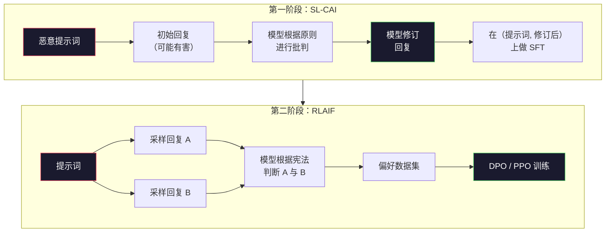
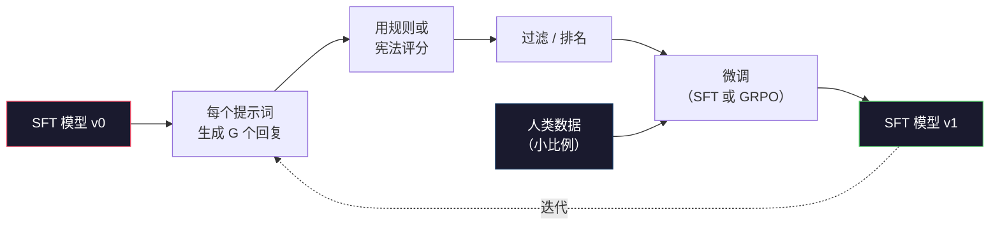

# 宪法人工智能与自我改进

> RLHF 需要人类全程参与。宪法人工智能用模型本身替代了大部分人类。写一份原则列表，让模型根据这些原则批判自己的输出，然后用这些批判来训练。2025 年 DeepSeek-R1 将这一方法推向极致：让模型生成数百万条推理轨迹，用规则对其进行评分，然后对结果运行 GRPO。2026 年前沿模型的大部分"对齐工作"就是模型自身的对齐。本课构建这两个循环。

**类型：** 实战型
**语言：** Python（标准库 + numpy）
**前置条件：** 第 10 阶段，第 06-08 课（SFT、RLHF、DPO）
**时间：** 约 45 分钟

## 学习目标

- 实现宪法人工智能两阶段循环：自我批判加自我修订，然后在修订后的配对数据上进行偏好训练
- 推导 GRPO 目标函数（DeepSeek-R1 的组相对策略优化），并将其与 PPO 的价值函数基线进行对比
- 使用基于规则的结果奖励生成可验证的推理轨迹，并在没有独立奖励模型的情况下对其进行评分
- 判断何时自我改进优于人类偏好数据，何时会陷入模式寻求

## 问题

你在第 07 课构建了 RLHF，在第 08 课构建了 DPO。两者都依赖同一种昂贵的输入：人类偏好对。Anthropic 的 InstructGPT 时代流水线使用了大约 33,000 个比较。Llama 2 Chat 使用了超过 150 万个。Claude 3 使用了更多。这些数据缓慢、昂贵，并且对标注员在评分当天碰所持的看法存在偏见。

2022 年的宪法人工智能论文提出了一个简单问题：如果让模型自己生成偏好标签呢？给它一份书面原则清单——"宪法"——让它对自己的回复进行批判。批判成为训练信号。

2024 年，DeepSeek 将这一想法进一步发展。他们表明，对于任何具有可验证结果的任务（已知答案的数学、要么通过测试要么失败的代码、要么赢要么输的游戏），你可以完全跳过评论家。生成多个候选解。用确定性规则对每个解评分。在奖励上运行策略梯度算法。DeepSeek-R1 就是这样训练的，几乎没有人类偏好数据，却达到了 o1 级别的推理性能。

这两个循环——用于主观行为的宪法人工智能和用于可验证行为的基于规则的 RL——是 2026 年的主流对齐方案。过去用于 RLHF 的人类偏好预算现在只需要花在更小的一步上：选择宪法和选择奖励规则。

## 概念

### 宪法人工智能循环

Bai 等人（2022 年）将流水线分为两个阶段。

**第一阶段：基于 AI 反馈的监督学习（SL-CAI）。** 从一个可能有害但有帮助的 SFT 模型开始。用潜在的恶意请求提示它。对于每个回复，让*同一模型*根据一条宪法原则批判其回复，然后进行修订。在修订后的回复上进行微调。数据集是（提示词，修订后回复）对。

**第二阶段：基于 AI 反馈的强化学习（RLAIF）。** 采样一对回复。询问模型哪个更好地遵循了宪法。成对偏好训练一个奖励模型。然后使用该奖励模型在模型上运行 PPO 或 DPO。与 RLHF 的关键区别：偏好来自模型，而非人类。



宪法是杠杆。Anthropic 最初的版本有 16 条原则（后来扩展了）。一条原则读起来像是"请选择最不可能被各种文化背景的人反对的回复。"你为每一步选择原则，有时是随机的，有时基于提示词类别。

### 宪法实际做什么

宪法将对齐契约从*数据*转移到*文本*。在 RLHF 下改变行为意味着重新标注数千个对。在 CAI 下改变行为意味着编辑一个段落。这是主要实践优势。

它有代价。模型的自我判断取决于其初始校准水平。如果 SFT 模型有盲点——例如，它无法识别操纵性措辞——批判步骤就会继承这些盲点。CAI 压缩了对齐循环，但无法将信号放大到基础模型的天花板之上。这就是为什么每个生产级 CAI 流水线仍然使用一些人类偏好数据，通常是纯 RLHF 量的 5-10%。

### GRPO：组相对策略优化

DeepSeek 在 DeepSeekMath 论文（2024 年）中引入了 GRPO，并将其用作 DeepSeek-R1（2025 年）的核心。GRPO 是 PPO 的一种变体，移除了价值函数。

回顾 PPO 的目标函数（来自第 07 课）：

```
L_PPO = E[min(r(theta) * A, clip(r(theta), 1-eps, 1+eps) * A)]
```

其中 `A` 是优势，通常用 GAE 估计，使用一个学到的价值网络 `V(s)`。价值网络是一个与策略相同大小的第二个模型。它使内存翻倍，并引入自己的训练循环。

GRPO 丢弃了价值函数。对于每个提示词，它采样 G 个回复（通常 G=16 或 64）。计算每个回复的奖励，然后在组内进行归一化：

```
A_i = (r_i - mean(r_1, ..., r_G)) / std(r_1, ..., r_G)
```

优势是回复奖励相对于其兄弟的 z-score。没有价值函数。该组作为自己的基线。

```
L_GRPO = E[min(r(theta) * A_group, clip(r(theta), 1-eps, 1+eps) * A_group)] - beta * KL(pi || pi_ref)
```

相对于参考模型的 KL 惩罚仍然存在，与 PPO 相同。裁剪比率仍然存在。消失的是独立的评论家。

### 为什么 GRPO 对推理很重要

对于推理任务，奖励通常是稀疏且二元的：最终答案要么正确要么错误。在稀疏二元奖励上训练的价值函数是一种浪费——因为在最后一步之前几乎每个状态都有相同的期望回报，所以它无法学到有用的中间估计。GRPO 的组归一化为你提供了即时的相对信号：在同一道数学问题的 16 次尝试中，哪些尝试高于该问题的平均水平？

这正是你从基于规则的奖励中获得的信号形状：

- **数学**：sympy 或符号检查器决定最终答案是否匹配。
- **代码**：测试套件决定通过/失败。
- **格式**：正则表达式决定答案是否在所需的 XML 标签中。
- **多步证明**：证明助手（Lean、Coq）决定有效性。

DeepSeek-R1-Zero 仅使用两个奖励训练：数学基准的准确性和格式合规性（答案在 `<answer>` 标签内）。没有人类偏好。没有评论家模型。DeepSeek 论文描述的"顿悟时刻"——模型自发地学习自我检查和回溯——仅从稀疏规则奖励的 GRPO 中涌现出来。

### 过程奖励模型 vs 结果奖励模型

你仍然有一个设计选择：奖励最终答案（结果奖励模型，ORM）还是奖励每个中间步骤（过程奖励模型，PRM）。

| 维度 | ORM | PRM |
|------|-----|-----|
| 每条轨迹的信号 | 1 个数字 | N 个数字（每步一个） |
| 监督来源 | 最终答案检查 | 步骤级标签或自我判断 |
| 训练成本 | 便宜 | 昂贵 |
| 信用分配 | 稀疏、有噪声 | 密集、有针对性 |
| 奖励黑客风险 | 较低 | 较高（模型优化 PRM 伪迹） |
| 使用者 | DeepSeek-R1、R1-Zero | OpenAI o1（据称）、Math-Shepherd |

2024-2025 年的共识是 ORM 加上 GRPO 比 PRM 扩展性更好。PRM 每 token 的样本效率更高，但需要昂贵的步骤标注数据，并且容易崩溃为捷径行为（写出看起来对 PRM 好看但不能推进证明的步骤）。对于大多数团队，ORM + GRPO 是首先尝试的方案。

### 自我改进：反馈倍增器

一旦有了双循环模式（批判/修订和基于规则的组相对 RL），你就可以将它们串联起来。

1. 从一个 SFT 模型开始。
2. 为每个提示词生成多个候选回复。
3. 用基于规则的奖励（对于可验证任务）或宪法评论家（对于主观任务）对其进行评分。
4. 将最佳候选作为新的 SFT 数据或偏好对保留下来。
5. 微调。用改进的模型回到步骤 2。

DeepSeek 将这称为"拒绝采样微调"，当应用于 R1-Zero 之后。Anthropic 将早期版本称为"宪法人工智能蒸馏"。模式是：每次迭代都放大模型中已有的信号。它不添加新信号。如果模型根本无法解决某类问题 X，再多的自我改进也无法创造出这种能力。

危险是模式崩溃。自我生成的数据总是比训练语料库更窄的分布。经过 3-5 轮自我蒸馏后，模型通常会在创造性任务上失去多样性，变得过于自信，并表现出典型的"AI 腔"（重复措辞、公式化结构）。生产流水线将自我生成的数据与少量新鲜人类数据混合，以保持分布的真实。



### 何时使用什么

- **纯 CAI**：主观行为（语气、安全性、拒绝风格）。你有一条定义明确的宪法。你没有干净的可验证结果。
- **GRPO + ORM**：可验证任务（数学、代码、结构化提取）。你可以廉价地检查正确性。奖励是稀疏且二元的。
- **在自我生成对上使用 DPO**：混合方案。用宪法产生偏好对，然后用 DPO（第 08 课）而不是 PPO/GRPO 进行训练。
- **完整 RLHF**：当你需要多目标权衡，而规则或短宪法都无法表达时，仍然适用。

大多数 2026 年的前沿流水线运行所有四种方法。CAI 用于安全层。GRPO 用于推理后训练阶段。DPO 用于偏好精修。少量 RLHF 用于其他方法无法消除的残余行为。

## 实战构建

代码用纯 Python + numpy 实现了三个东西。一个宪法人工智能自我批判循环。一个用于简单算术的基于规则的奖励检查器。一个最小化 GRPO 训练器，运行在第 04 课的一个小型语言模型上。

### 第 1 步：宪法

一份原则清单。在生产中，每一行会更丰富并带有类别标签。对于本课，保持简短。

```python
CONSTITUTION = [
    "回复必须直接回答所问的问题，不得含糊其辞。",
    "回复不得包含不必要的填充或废话。",
    "如果问题有单一数字答案，请直接给出数字。",
    "回复不得拒绝合理的、无害的请求。",
]
```

### 第 2 步：自我批判与修订

在真实系统中，模型本身进行批判。在本课中，我们用手动编写的评分标准模拟评论家，使流水线无需 LLM 调用即可运行。

```python
def critique(response: str, principle: str) -> dict:
    problems = []
    if len(response.split()) > 40 and "plainly" in principle:
        problems.append("answer buried in extra prose")
    if response.strip().lower().startswith(("i can't", "i cannot", "as an ai")):
        problems.append("unwarranted refusal")
    if response.count(",") > 4:
        problems.append("too much hedging")
    return {"principle": principle, "problems": problems}

def revise(response: str, critique_result: dict) -> str:
    if "answer buried" in " ".join(critique_result["problems"]):
        return response.split(".")[-2].strip() + "."
    if "unwarranted refusal" in " ".join(critique_result["problems"]):
        return "Here is the answer: " + response.split(":")[-1].strip()
    return response
```

修订函数是一个替代品。对于真实的 LLM，它会是第二个提示词："给定这个批判，重写回复。"

### 第 3 步：基于规则的奖励

对于可验证任务，完全替换评论家。这个检查器对算术答案进行评分。

```python
import re

def reward_math(prompt: str, response: str) -> float:
    try:
        expected = eval(prompt.replace("What is ", "").replace("?", "").strip())
    except Exception:
        return 0.0
    numbers = re.findall(r"-?\d+", response)
    if not numbers:
        return 0.0
    return 1.0 if int(numbers[-1]) == expected else 0.0

def reward_format(response: str) -> float:
    return 1.0 if re.search(r"<answer>.*</answer>", response) else 0.0
```

两个确定性规则。没有训练数据。没有人类标签。组合奖励是 `reward_math + 0.1 * reward_format`，对缺失格式进行惩罚，但不淹没正确性。

### 第 4 步：组相对优势

给定同一提示词的一组回复的奖励列表，计算 z-score：

```python
import numpy as np

def group_relative_advantage(rewards: list[float]) -> np.ndarray:
    r = np.array(rewards, dtype=float)
    if r.std() < 1e-8:
        return np.zeros_like(r)
    return (r - r.mean()) / (r.std() + 1e-8)
```

如果组中每个样本的奖励相同，优势为零，没有梯度信号流过。这是一个特性。它告诉你提示词要么被当前策略轻易解决，要么无法解决，这一步应该跳过。

### 第 5 步：GRPO 更新

一步，符号梯度。在生产中这将是一个 torch autograd 传递。这里我们直接展示更新规则。

```python
def grpo_step(policy_logprobs: np.ndarray, ref_logprobs: np.ndarray,
              advantages: np.ndarray, beta: float = 0.01, clip_eps: float = 0.2) -> dict:
    ratios = np.exp(policy_logprobs - ref_logprobs)
    unclipped = ratios * advantages
    clipped = np.clip(ratios, 1 - clip_eps, 1 + clip_eps) * advantages
    policy_loss = -np.minimum(unclipped, clipped).mean()
    kl = (ref_logprobs - policy_logprobs).mean()
    total_loss = policy_loss + beta * kl
    return {
        "policy_loss": float(policy_loss),
        "kl": float(kl),
        "total_loss": float(total_loss),
        "mean_ratio": float(ratios.mean()),
    }
```

这是 PPO 的裁剪代理目标，只有一个变化：优势来自组相对 z-score，而非来自价值函数。没有 V(s) 要训练。没有 GAE。该组就是基线。

### 第 6 步：自我改进轮次

将各部分绑在一起。采样一组，用规则对每个回复评分，计算优势，报告你会输入真实优化器的指标。

```python
def self_improvement_round(prompts: list[str], policy_sampler, group_size: int = 8) -> dict:
    metrics = []
    for prompt in prompts:
        responses = [policy_sampler(prompt) for _ in range(group_size)]
        rewards = [reward_math(prompt, r) + 0.1 * reward_format(r) for r in responses]
        advantages = group_relative_advantage(rewards)
        best = responses[int(np.argmax(rewards))]
        metrics.append({
            "prompt": prompt,
            "mean_reward": float(np.mean(rewards)),
            "best_reward": float(np.max(rewards)),
            "std_reward": float(np.std(rewards)),
            "best_response": best,
            "advantages": advantages.tolist(),
        })
    return {"per_prompt": metrics,
            "overall_mean": float(np.mean([m["mean_reward"] for m in metrics]))}
```

## 使用它

运行 `code/main.py` 端到端地运行两个循环。CAI 循环产生一小套（初始，修订）对，你可以对其进行微调。GRPO 循环为算术问题产生每个提示词的奖励统计，展示组相对优势如何让弱采样器在没有价值函数或人类标签的情况下改进。

数字不是重点。在使用训练模型的真实运行中，奖励均值应该随轮次上升，奖励标准差应该保持为正（如果它崩溃到零，策略已经模式崩溃，你应该停止），并且相对于参考的 KL 应该缓慢增长。这三条曲线——均值奖励上升、标准差稳定、KL 有界——是 GRPO 或 CAI 流水线的生产健康检查。

## 交付物

本课产出 `outputs/skill-self-improvement-auditor.md`。向其输入一个提议的自我改进流水线，它会强制执行不可协商的门控：可实际验证的奖励规则、相对于参考的 KL 预算、多样性下限，以及人类数据配额。它拒绝批准声称"纯自我改进"而没有任何外部接地的循环。

## 练习

1. 用 LLM 调用替换第 2 步中手写的评论家。使用任何本地聊天模型。测量批判和修订实际改进回复的频率，而不是保持不变。

2. 添加第三条关于事实性的宪法原则。在需要事实声明（首都、日期）的提示词上运行流水线，测量多少修订消除了事实错误而非引入新的错误。

3. 在 CAI 第二阶段产生的偏好对上实现 DPO。取 20 个提示词，每个生成两个回复，让评论家在每对中选出一个赢家，然后运行第 08 课的 DPO 损失。与在同一数据上的 GRPO 路径进行比较。

4. 向 GRPO 目标添加熵正则化。项 `-alpha * entropy(policy)`，alpha=0.01，鼓励多样性采样。测量它是否能延缓 5 轮自我改进中的模式崩溃。

5. 为两步算术问题构建过程奖励评分器。给定"（3+4）*5 是多少？"，模型必须展示中间步骤 3+4=7。分别对中间步骤和最终答案进行评分，并比较 10 轮中 PRM 加权 GRPO 与纯 ORM 加权 GRPO。

## 关键术语

| 术语 | 大家怎么说的 | 实际含义 |
|------|----------------|----------------------|
| 宪法人工智能 | "模型自己对齐自己" | 一个两阶段流水线（自我批判 + RLAIF），用模型对书面宪法的自我判断替代了大部分人类偏好标签 |
| RLAIF | "没有人类的 RLHF" | 基于 AI 反馈的强化学习——在模型自己生成的偏好上运行 PPO 或 DPO |
| GRPO | "没有价值函数的 PPO" | 组相对策略优化——每个提示词采样 G 个回复，使用 z-score 化的组奖励作为优势 |
| ORM | "奖励答案" | 结果奖励模型——仅在最终答案上的单个标量奖励 |
| PRM | "奖励每一步" | 过程奖励模型——在每个中间推理步骤上的奖励，通常从步骤标注数据中训练 |
| 基于规则的奖励 | "确定性评分器" | 一个验证器（正则表达式、sympy、测试套件），无需学习模型即可返回二元或数值分数 |
| 拒绝采样 FT | "保留赢家，重新训练" | 采样多个回复，过滤到最高奖励的那些，添加到 SFT 数据，重新训练 |
| 模式崩溃 | "模型不再多样" | 后训练策略集中在回复空间的一个狭窄区域；表现为组内奖励标准差下降 |
| KL 预算 | "你能漂移多远" | 优化器被允许在训练停止前累积的相对于参考模型的总 KL 散度 |
| R1 时刻 | "模型学会了回溯" | DeepSeek 报告的行为，其中仅在结果奖励上训练策略自发地在思维链中开发了自我检查和回溯 |

## 延伸阅读

- [Bai 等人，2022 年 —— "宪法人工智能：来自 AI 反馈的无害性"](https://arxiv.org/abs/2212.08073) —— Anthropic 最初的 CAI 论文，包含两阶段 SL-CAI + RLAIF 流水线
- [Shao 等人，2024 年 —— "DeepSeekMath：推动开放语言模型数学推理的极限"](https://arxiv.org/abs/2402.03300) —— 引入 GRPO
- [DeepSeek-AI，2025 年 —— "DeepSeek-R1：通过强化学习激励大型语言模型中的推理能力"](https://arxiv.org/abs/2501.12948) —— R1 和 R1-Zero，规模化应用 GRPO + 规则奖励
- [Lightman 等人，2023 年 —— "让我们逐步验证"](https://arxiv.org/abs/2305.20050) —— OpenAI 的 PRM800K 和过程奖励模型的案例
- [Wang 等人，2024 年 —— "Math-Shepherd：无需人工标注即可逐步验证和强化大型语言模型"](https://arxiv.org/abs/2312.08935) —— 通过蒙特卡洛 rollout 自动标注的 PRM
- [Huang 等人，2024 年 —— "大型语言模型尚无法自我纠正推理"](https://arxiv.org/abs/2310.01798) —— 关于没有外部接地的自我改进的怀疑观点