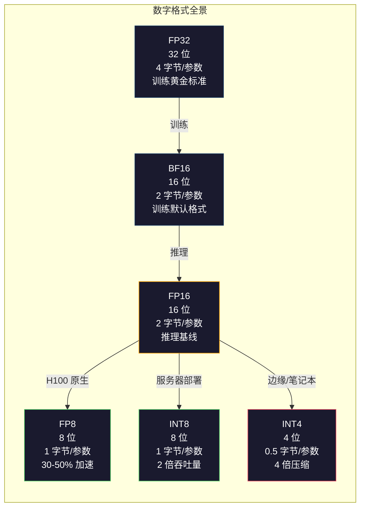
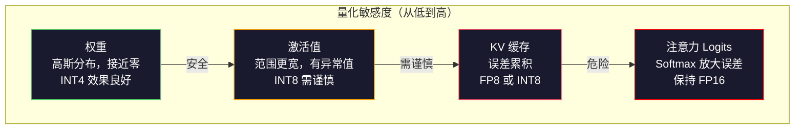
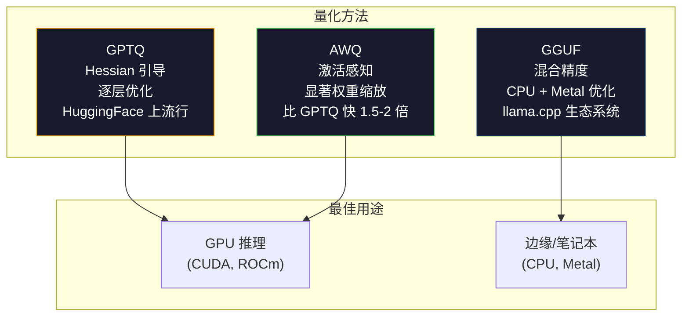

# 量化：让模型适配硬件

> 一个 70B 模型用 FP16 需要 140GB。两张 A100 才能放下权重。量化到 FP8：一张 80GB GPU 就够了。INT4：一台 MacBook。

**类型：** 构建
**语言：** Python（配合 numpy）
**前置要求：** 阶段 10，第 01-10 课（从零构建 LLM）
**时间：** 约 120 分钟

## 学习目标

- 实现从 FP16 到 INT8 和 INT4 的对称与非对称量化，包括 per-tensor 和 per-channel 缩放
- 计算量化带来的内存节省，并确定给定 GPU 的 VRAM 适合哪种精度
- 解释后训练量化（PTQ）与量化感知训练（QAT）的区别
- 应用 GPTQ 或 AWQ 量化真实模型，并在基准测试上衡量精度-内存的权衡

## 问题所在

Llama 3 70B 拥有 700 亿个参数。每个参数是一个 16 位浮点数。那就是 1400 亿字节。140GB。一张 A100 只有 80GB 的 VRAM。你连权重都加载不进去，更别说在一块 GPU 上跑推理了。仅服务一个模型就需要两张 A100，每张每小时 2 美元。

但每个参数 16 位是一种浪费。神经网络中的大多数权重集中在零附近。FP16 的完整动态范围（从 0.000000059 到 65,504）几乎完全未被使用。如果你测量 Llama 3 70B 权重的实际分布，95% 的权重落在 -0.1 到 +0.1 之间。你在用 16 位来表示 4 位就能表示的值。

量化将高精度数字替换为低精度数字。FP16 到 FP8 内存减半。FP16 到 INT4 内存降到四分之一。那个 140GB 的模型变成 35GB。它可以塞进一块消费级 GPU。继续到 2 位量化（激进的、有损的，但对某些任务可用）同一个模型可以在 16GB 的笔记本电脑上运行。

代价是精度。每减少一位都会丢失信息。问题是你会损失多少精度，以及在哪里损失。一个良好量化的 INT4 模型在大多数基准测试上保留原始模型 95-99% 的质量。简单地将模型量化到 INT4 可能彻底毁掉模型。差别在于技术。

社区用 GPTQ 将 Llama 3 量化为 INT4 后，在 WikiText 上大约损失 1-2 个 perplexity 点。Mistral 发布了 Mixtral 8x22B 的 FP8 检查点，在 MMLU 上几乎没有可测量的质量损失。GGUF 格式为 llama.cpp 提供动力，让 70B 模型可以在 M 系列芯片的 MacBook 上运行。量化不是 hack。它是每个大于 7B 的模型的标准部署路径。

## 核心概念

### 数字格式：每一位的作用

每个浮点数都有三个部分：符号位、指数和尾数（也称为有效数字）。符号位占 1 位。指数决定范围（数字能有多大或多小）。尾数决定精度（你能得到多少位有效数字）。

```
FP32:  [1 符号位] [8 指数位] [23 尾数位]  = 32 位
FP16:  [1 符号位] [5 指数位] [10 尾数位] = 16 位
BF16:  [1 符号位] [8 指数位] [7  尾数位] = 16 位
FP8:   [1 符号位] [4 指数位] [3  尾数位] = 8  位 (E4M3)
FP8:   [1 符号位] [5 指数位] [2  尾数位] = 8  位 (E5M2)
INT8:  [1 符号位] [7 数值位]               = 8  位（均匀步长）
INT4:  [1 符号位] [3 数值位]               = 4  位（总共 16 个级别）
```

**FP32** 是完整精度。23 位尾数给你大约 7 位有效数字。范围：大约 1.2 × 10⁻³⁸ 到 3.4 × 10³⁸。训练曾经完全在 FP32 中进行。对于累加（矩阵乘法过程中的运行总和）仍然如此。

**FP16** 位数减半。10 位尾数提供大约 3.3 位有效数字。指数缩减到 5 位，大幅缩小了范围（最大值约 65,504）。这对于权重（集中在零附近）来说没问题，但对训练过程中可能飙升的激活值和梯度来说很危险。FP16 训练需要损失缩放来防止下溢。

**BF16**（Brain Float 16）保留 FP32 的 8 位指数，但将尾数缩减到 7 位。与 FP32 相同的范围，但精度低于 FP16。Google 专门为深度学习设计了它。直觉：对于神经网络来说，范围比精度更重要。一个 10⁻²⁰ 的梯度在 FP16 中下溢为零，在 BF16 中得以保留。一个 0.07342 的权重在 BF16 中四舍五入为 0.0734 已经足够接近了。每一次现代训练运行都使用 BF16 或 BF16/FP32 混合。

**FP8** 有两种格式。E4M3（4 指数位，3 尾数位）用于推理期间的权重和激活。E5M2（5 指数位，2 尾数位）用于训练期间的梯度，范围比精度更重要。H100 GPU 上的 FP8 推理比 FP16 快 30-50%，质量损失可忽略不计。

**INT8** 是一种整数格式。没有指数，没有尾数。只有从 -128 到 127 的 256 个均匀分布的值。你需要一个缩放因子来将浮点权重映射到这个范围。优势：整数运算比浮点运算更快、更节能。A100 上的 INT8 矩阵乘法达到 624 TOPS，而 FP16 只有 312 TFLOPS。

**INT4** 进一步推进。只有 16 个可能的值。缩放因子承担重任。质量完全取决于你如何选择缩放因子以及对哪些权重进行量化。最先进的 INT4 方法（GPTQ、AWQ）保留了原始模型 95% 以上的质量。



### 量化是如何工作的

核心操作很简单。取一个浮点值张量，找到一个缩放因子，相乘，四舍五入到最近的整数，然后存储整数加上缩放因子。

**量化：**
```
scale = max(abs(tensor)) / max_int_value
quantized = round(tensor / scale)
```

**反量化：**
```
reconstructed = quantized * scale
```

对于对称范围的 INT8（-127 到 127）：
```
scale = max(abs(tensor)) / 127
quantized = clamp(round(tensor / scale), -128, 127)
```

误差就是舍入误差。每个值的误差最多为 `scale / 2`。整个层的总误差取决于你有多少权重，以及模型对这些权重的扰动有多敏感。

**Per-tensor 与 per-channel 量化。** Per-tensor 对整个权重矩阵使用一个缩放因子。简单但有损：如果一列有大值而另一列有小值，小值会损失大部分精度。Per-channel 对每个输出通道（权重矩阵的每行或每列）使用一个缩放因子。开销更大（你要存储 N 个缩放因子而不是 1 个），但质量好得多。每个生产级别的量化方法都使用 per-channel 或更细的粒度。

**非对称量化** 添加了一个零点偏移：`quantized = round(tensor / scale) + zero_point`。这处理了不以零为中心的分布。例如，ReLU 激活始终是非负的。对称量化浪费了一半的整数范围来表示永远不会出现的负值。非对称量化将实际范围 [min, max] 映射到完整的整数范围。

### 敏感度层级

模型中并非所有东西都能同等程度地承受量化。有一个清晰的层级。

**权重（最鲁棒）。** 模型权重在训练过程中变化缓慢，服从以零为中心的近似高斯分布。它们量化效果很好。带有 per-channel 缩放的 INT8 权重产生几乎无损的结果。INT4 需要更复杂的方法，但可以工作。

**激活值（中等敏感度）。** 激活值是推理过程中流经网络的中间值。它们比权重有更宽的动态范围并包含异常值。单个注意力头产生的激活值可能比均值大 100 倍。这些异常值对模型质量至关重要。简单地对它们进行量化会销毁信息。解决方案：将异常值通道保持在更高精度（LLM.int8()），使用 per-token 或 per-channel 激活缩放。

**KV 缓存（高敏感度）。** 键值缓存存储所有先前 token 的注意力状态。在长上下文情况下，KV 缓存主导内存。对于 70B 模型在 32K 上下文时，仅 KV 缓存就是 40GB（FP16）。将 KV 缓存量化到 FP8 或 INT8 可以节省大量内存，但任何误差都会在所有未来的注意力计算中累积。质量影响随序列长度而增加。

**注意力 logits（最敏感）。** 注意力中的 softmax 对其输入的小变化高度敏感。pre-softmax logit 中 0.01 的量化误差可以显著改变注意力分布。大多数量化方案将注意力计算保持在更高精度（FP16 或 BF16），即使其他一切都已量化。



### PTQ 与 QAT

**后训练量化（PTQ）** 对已经训练好的模型进行量化。无需重新训练。你获取 FP16 权重，计算缩放因子，四舍五入，然后部署。快速（几分钟到几小时）且便宜。对 INT8 和 FP8 效果很好。对于 INT4，简单 PTQ 经常严重失败，因为舍入误差会累积。高级 PTQ 方法（GPTQ、A QW）使用校准数据来最小化量化误差。

**量化感知训练（QAT）** 在训练期间的前向传播中插入伪量化操作。模型学习将其权重放在舍入误差较小的地方。梯度通过伪量化流动，使用直通估计器（STE）：假设舍入操作的梯度为 1。QAT 产生比 PTQ 更好的 INT4 和 INT2 模型，但需要完整的训练运行。Google 在 Gemini 的高效服务中使用了 QAT。Meta 在某些 Llama 部署目标上使用了 QAT。

| 方面 | PTQ | QAT |
|--------|-----|-----|
| 成本 | 分钟到几小时 | 完整训练运行 |
| INT8 质量 | 优秀（< 0.1% 损失）| 优秀 |
| INT4 质量 | 使用 GPTQ/AWQ 良好（1-3% 损失）| 更好（< 1% 损失）|
| INT2 质量 | 差 | 对某些任务可用 |
| 校准数据 | 128-1024 个样本 | 完整训练数据集 |
| 何时使用 | 部署、迭代 | 低位宽最大质量 |

### GPTQ、A QW、GGUF

**GPTQ（GPT 量化）** 是一种一次性 PTQ 方法。它一次量化一层的权重，使用小型校准数据集（典型为 128 个样本）来测量 Hessian（关于每个权重对输出敏感度的二阶信息）。Hessian 表明重要的权重会被更谨慎地量化。GPTQ 是第一个使 INT4 量化对 LLM 实际可行的方法。TheBloke 在 Hugging Face 上推广了 GPTQ，发布了数百个模型的量化版本。

**AWQ（激活感知权重量化）** 观察到一小部分权重（约 1%）由于与大的激活值相乘而具有不成比例的重要性。AWQ 使用校准数据识别这些显著权重，并在量化前将它们放大（然后将相应的激活值缩小）。这将重要权重保持在 INT4 量化准确的范围中。AWQ 通常在质量上匹配或略优于 GPTQ，而应用速度是 GPTQ 的 1.5-2 倍。

**GGUF（GPT 生成统一格式）** 是 llama.cpp 及其生态系统使用的文件格式。它支持混合量化：不同层获得不同的位宽。第一层和最后一层（embedding 和输出头）通常保持在更高精度。中层获得 INT4 或 INT3。GGUF 文件是自包含的：权重、分词器、元数据都在一个文件中。该格式专为 CPU 推理和 Apple Silicon 设计，在这些平台上将整个模型加载到内存中并在 CPU 或 Metal GPU 上运行矩阵乘法是标准路径。Q4_K_M 是最流行的 GGUF 量化变体，在质量和大小之间取得平衡。



### 质量衡量

你怎么知道你的量化模型是否仍然良好？

**Perplexity。** 最常见的指标。越低越好。在保留数据集（WikiText-2 是标准）上计算原始模型和量化模型的 perplexity。差值告诉你量化销毁了多少信息。经验法则：差值 < 0.5 为优秀，0.5-1.0 为良好，1.0-2.0 对大多数任务可接受，> 2.0 意味着出了问题。

**任务特定基准测试。** 在 MMLU、HumanEval、GSM8K 或你的自定义评估套件上运行量化模型。与原始模型比较。量化对不同能力的影响不均匀。数学和代码任务比对通用知识更敏感地承受精度损失。

**输出比较。** 在相同提示下从两个模型生成响应并比较。LLM-as-judge（第 10 课）在这里效果很好。计算胜率：量化模型在多大比例的提示上匹配或超越原始模型？

**延迟和吞吐量。** 量化的存在是为了让模型更快、更便宜。测量 tokens 每秒、首个 token 的时间以及内存使用量。一个比原始模型更慢的量化模型比无用更糟糕。

| 模型 | 格式 | 大小 | Perplexity（WikiText-2）| MMLU | Tokens/秒（A100）|
|-------|--------|------|------------------------|------|-------------------|
| Llama 3 70B | FP16 | 140GB | 3.12 | 79.5% | 38 |
| Llama 3 70B | FP8 | 70GB | 3.14 | 79.3% | 55 |
| Llama 3 70B | GPTQ INT4 | 35GB | 4.32 | 77.8% | 72 |
| Llama 3 70B | AWQ INT4 | 35GB | 4.18 | 78.1% | 75 |
| Llama 3 70B | GGUF Q4_K_M | 40GB | 4.25 | 77.9% | 28（CPU）|

规律：FP8 几乎免费。INT4 损失 1-2 个 MMLU 点，但吞吐量翻倍，内存降到四分之一。对于几乎所有部署场景来说，这种权衡都是值得的。

### 真实数字

H100 上 FP16 到 FP8：推理速度提升 30-50%，质量损失 < 0.1%。这是无需动脑子的量化。每个 H100 部署都应该使用它。

FP16 到 INT8（LLM.int8()）：内存减少 2 倍，质量损失 < 0.5%。混合精度方法将异常值特征保持在 FP16，而将其他一切都量化到 INT8。

FP16 到 INT4（GPTQ/AWQ）：内存减少 4 倍，根据模型和方法不同质量损失 1-3%。使 70B 模型能够在单张 48GB GPU 上运行。

FP16 到 INT4（GGUF Q4_K_M）：内存减少 3.5 倍，质量损失 1-2%。为 CPU 推理优化。Q4_K_M 的 70B 模型约 40GB，在配备 64GB 内存的 M3 Max 上以 10-15 tokens/秒的速度运行。

FP16 到 INT2：内存减少 8 倍，质量损失 5-15%。仅对某些可以容忍退化的特定窄任务可行。研究前沿，而非通用生产的就绪状态。## 构建它

### 步骤 1：数字格式表示

构建每种格式的位级表示，以直观理解符号位、指数位和尾数位的作用。

```python
import numpy as np


def float_to_fp32_bits(value):
    bits = np.float32(value).view(np.uint32)
    sign = (bits >> 31) & 1
    exponent = (bits >> 23) & 0xFF
    mantissa = bits & 0x7FFFFF
    return {"sign": int(sign), "exponent": int(exponent), "mantissa": int(mantissa),
            "exponent_bits": format(int(exponent), '08b'),
            "mantissa_bits": format(int(mantissa), '023b'),
            "value": float(value),
            "actual_exponent": int(exponent) - 127}


def float_to_fp16_bits(value):
    fp16 = np.float16(value)
    bits = fp16.view(np.uint16)
    sign = (bits >> 15) & 1
    exponent = (bits >> 10) & 0x1F
    mantissa = bits & 0x3FF
    return {"sign": int(sign), "exponent": int(exponent), "mantissa": int(mantissa),
            "exponent_bits": format(int(exponent), '05b'),
            "mantissa_bits": format(int(mantissa), '010b'),
            "value": float(fp16),
            "actual_exponent": int(exponent) - 15}


def float_to_bf16_bits(value):
    fp32_bits = np.float32(value).view(np.uint32)
    bf16_bits = (fp32_bits >> 16).astype(np.uint16)
    sign = (bf16_bits >> 15) & 1
    exponent = (bf16_bits >> 7) & 0xFF
    mantissa = bf16_bits & 0x7F
    reconstructed = np.uint32(bf16_bits.astype(np.uint32) << 16).view(np.float32)
    return {"sign": int(sign), "exponent": int(exponent), "mantissa": int(mantissa),
            "exponent_bits": format(int(exponent), '08b'),
            "mantissa_bits": format(int(mantissa), '07b'),
            "value": float(reconstructed),
            "actual_exponent": int(exponent) - 127}


def simulate_fp8_e4m3(value):
    sign = 1 if value < 0 else 0
    abs_val = abs(value)
    max_val = 448.0
    abs_val = min(abs_val, max_val)
    if abs_val == 0:
        return {"sign": sign, "exponent": 0, "mantissa": 0, "value": 0.0,
                "exponent_bits": "0000", "mantissa_bits": "000"}
    exp = int(np.floor(np.log2(abs_val)))
    exp = max(-6, min(8, exp))
    mantissa_val = abs_val / (2.0 ** exp) - 1.0
    mantissa_quant = round(mantissa_val * 8) / 8
    mantissa_quant = max(0, min(0.875, mantissa_quant))
    reconstructed = (1.0 + mantissa_quant) * (2.0 ** exp)
    if sign:
        reconstructed = -reconstructed
    mantissa_int = int(round(mantissa_quant * 8))
    return {"sign": sign, "exponent": exp + 7, "mantissa": mantissa_int,
            "exponent_bits": format(exp + 7, '04b'),
            "mantissa_bits": format(mantissa_int, '03b'),
            "value": float(reconstructed),
            "actual_exponent": exp}


def display_format_comparison(value):
    fp32 = float_to_fp32_bits(value)
    fp16 = float_to_fp16_bits(value)
    bf16 = float_to_bf16_bits(value)
    fp8 = simulate_fp8_e4m3(value)

    print(f"\n  值: {value}")
    print(f"  {'格式':<8} {'存储值':>14} {'误差':>12} {'符号':>5} {'指数位':>10} {'尾数位':>25}")
    print(f"  {'-'*76}")
    print(f"  {'FP32':<8} {fp32['value']:>14.6f} {abs(fp32['value'] - value):>12.8f} {fp32['sign']:>5} {fp32['exponent_bits']:>10} {fp32['mantissa_bits']:>25}")
    print(f"  {'FP16':<8} {fp16['value']:>14.6f} {abs(fp16['value'] - value):>12.8f} {fp16['sign']:>5} {fp16['exponent_bits']:>10} {fp16['mantissa_bits']:>25}")
    print(f"  {'BF16':<8} {bf16['value']:>14.6f} {abs(bf16['value'] - value):>12.8f} {bf16['sign']:>5} {bf16['exponent_bits']:>10} {bf16['mantissa_bits']:>25}")
    print(f"  {'FP8e4m3':<8} {fp8['value']:>14.6f} {abs(fp8['value'] - value):>12.8f} {fp8['sign']:>5} {fp8['exponent_bits']:>10} {fp8['mantissa_bits']:>25}")
```

### 步骤 2：对称量化（按张量与按通道）

基本的量化操作。按张量量化使用一个缩放因子作用于整个矩阵。按通道量化则每个行或列使用一个缩放因子。

```python
def quantize_symmetric(tensor, num_bits=8):
    qmin = -(2 ** (num_bits - 1))
    qmax = 2 ** (num_bits - 1) - 1
    abs_max = np.max(np.abs(tensor))
    if abs_max == 0:
        return np.zeros_like(tensor, dtype=np.int32), 1.0
    scale = abs_max / qmax
    quantized = np.clip(np.round(tensor / scale), qmin, qmax).astype(np.int32)
    return quantized, float(scale)


def dequantize_symmetric(quantized, scale):
    return quantized.astype(np.float64) * scale


def quantize_per_channel(tensor, num_bits=8, axis=0):
    qmin = -(2 ** (num_bits - 1))
    qmax = 2 ** (num_bits - 1) - 1

    if axis == 0:
        abs_max = np.max(np.abs(tensor), axis=1, keepdims=True)
    else:
        abs_max = np.max(np.abs(tensor), axis=0, keepdims=True)

    abs_max = np.where(abs_max == 0, 1.0, abs_max)
    scales = abs_max / qmax
    quantized = np.clip(np.round(tensor / scales), qmin, qmax).astype(np.int32)
    return quantized, scales.squeeze()


def dequantize_per_channel(quantized, scales, axis=0):
    if axis == 0:
        return quantized.astype(np.float64) * scales.reshape(-1, 1)
    else:
        return quantized.astype(np.float64) * scales.reshape(1, -1)


def quantize_asymmetric(tensor, num_bits=8):
    qmin = 0
    qmax = 2 ** num_bits - 1
    t_min = np.min(tensor)
    t_max = np.max(tensor)
    if t_max == t_min:
        return np.zeros_like(tensor, dtype=np.int32), 1.0, 0
    scale = (t_max - t_min) / (qmax - qmin)
    zero_point = int(np.round(qmin - t_min / scale))
    zero_point = max(qmin, min(qmax, zero_point))
    quantized = np.clip(np.round(tensor / scale + zero_point), qmin, qmax).astype(np.int32)
    return quantized, float(scale), int(zero_point)


def dequantize_asymmetric(quantized, scale, zero_point):
    return (quantized.astype(np.float64) - zero_point) * scale
```

### 步骤 3：质量度量

衡量量化过程破坏了多少信息。计算原始张量与重构张量之间的均方误差、信噪比和余弦相似度。

```python
def quantization_error(original, reconstructed):
    diff = original - reconstructed
    mse = float(np.mean(diff ** 2))
    rmse = float(np.sqrt(mse))
    max_error = float(np.max(np.abs(diff)))
    signal_power = float(np.mean(original ** 2))
    snr_db = 10 * np.log10(signal_power / max(mse, 1e-20))

    orig_flat = original.flatten()
    recon_flat = reconstructed.flatten()
    norm_orig = np.linalg.norm(orig_flat)
    norm_recon = np.linalg.norm(recon_flat)
    if norm_orig == 0 or norm_recon == 0:
        cosine_sim = 0.0
    else:
        cosine_sim = float(np.dot(orig_flat, recon_flat) / (norm_orig * norm_recon))

    return {"mse": mse, "rmse": rmse, "max_error": max_error,
            "snr_db": float(snr_db), "cosine_similarity": cosine_sim}


def compare_quantization_methods(tensor, num_bits=8):
    q_pt, s_pt = quantize_symmetric(tensor, num_bits)
    recon_pt = dequantize_symmetric(q_pt, s_pt)
    err_pt = quantization_error(tensor, recon_pt)

    q_pc, s_pc = quantize_per_channel(tensor, num_bits, axis=0)
    recon_pc = dequantize_per_channel(q_pc, s_pc, axis=0)
    err_pc = quantization_error(tensor, recon_pc)

    q_asym, s_asym, zp = quantize_asymmetric(tensor, num_bits)
    recon_asym = dequantize_asymmetric(q_asym, s_asym, zp)
    err_asym = quantization_error(tensor, recon_asym)

    print(f"\n  量化方法对比 ({num_bits} 位，张量形状 {tensor.shape}):")
    print(f"  {'方法':<20} {'MSE':>12} {'SNR (dB)':>10} {'余弦相似度':>12} {'最大误差':>12}")
    print(f"  {'-'*68}")
    print(f"  {'按张量对称':<20} {err_pt['mse']:>12.8f} {err_pt['snr_db']:>10.2f} {err_pt['cosine_similarity']:>12.8f} {err_pt['max_error']:>12.8f}")
    print(f"  {'按通道对称':<20} {err_pc['mse']:>12.8f} {err_pc['snr_db']:>10.2f} {err_pc['cosine_similarity']:>12.8f} {err_pc['max_error']:>12.8f}")
    print(f"  {'非对称':<20} {err_asym['mse']:>12.8f} {err_asym['snr_db']:>10.2f} {err_asym['cosine_similarity']:>12.8f} {err_asym['max_error']:>12.8f}")

    return {"per_tensor": err_pt, "per_channel": err_pc, "asymmetric": err_asym}
```

### 步骤 4：位宽扫描

以不同位宽（2、3、4、8、16）对同一张量进行量化，并测量每个级别的质量。这能精确展示质量悬崖出现在哪里。

```python
def bit_width_sweep(tensor):
    print(f"\n  位宽扫描（张量形状 {tensor.shape}）:")
    print(f"  {'位数':>6} {'等级数':>8} {'MSE':>14} {'SNR (dB)':>10} {'余弦相似度':>12} {'压缩比':>12}")
    print(f"  {'-'*64}")

    results = []
    for bits in [2, 3, 4, 8, 16]:
        q, s = quantize_per_channel(tensor, bits, axis=0)
        recon = dequantize_per_channel(q, s, axis=0)
        err = quantization_error(tensor, recon)
        levels = 2 ** bits
        compression = 32.0 / bits

        print(f"  {bits:>6} {levels:>8} {err['mse']:>14.8f} {err['snr_db']:>10.2f} {err['cosine_similarity']:>12.8f} {compression:>11.1f}x")
        results.append({"bits": bits, "levels": levels, "error": err, "compression": compression})

    return results
```

### 步骤 5：敏感度实验

模拟对 transformer 的不同部分进行量化，并测量哪些组件最敏感。这展示了敏感度层级：权重 < 激活值 < KV 缓存 < 注意力。

```python
def simulate_transformer_layer(input_data, weights, kv_scale=1.0):
    hidden = input_data @ weights["qkv"]
    seq_len = hidden.shape[1]
    d_model = weights["qkv"].shape[1] // 3
    q, k, v = hidden[:, :, :d_model], hidden[:, :, d_model:2*d_model], hidden[:, :, 2*d_model:]

    attn_scores = (q @ k.transpose(0, 2, 1)) / np.sqrt(d_model) * kv_scale
    attn_max = np.max(attn_scores, axis=-1, keepdims=True)
    attn_exp = np.exp(attn_scores - attn_max)
    attn_weights = attn_exp / np.sum(attn_exp, axis=-1, keepdims=True)

    attn_output = attn_weights @ v
    output = attn_output @ weights["out"]
    return output, {"q": q, "k": k, "v": v, "attn_scores": attn_scores,
                    "attn_weights": attn_weights, "attn_output": attn_output}


def sensitivity_experiment(batch_size=2, seq_len=16, d_model=64, num_bits=8):
    np.random.seed(42)
    input_data = np.random.randn(batch_size, seq_len, d_model) * 0.1

    weights = {
        "qkv": np.random.randn(d_model, 3 * d_model) * (2.0 / d_model) ** 0.5,
        "out": np.random.randn(d_model, d_model) * (2.0 / d_model) ** 0.5,
    }

    baseline_output, baseline_internals = simulate_transformer_layer(input_data, weights)

    experiments = {}

    q_qkv, s_qkv = quantize_per_channel(weights["qkv"], num_bits, axis=0)
    q_out, s_out = quantize_per_channel(weights["out"], num_bits, axis=0)
    quantized_weights = {
        "qkv": dequantize_per_channel(q_qkv, s_qkv, axis=0),
        "out": dequantize_per_channel(q_out, s_out, axis=0),
    }
    weight_quant_output, _ = simulate_transformer_layer(input_data, quantized_weights)
    experiments["仅权重"] = quantization_error(baseline_output, weight_quant_output)

    _, fresh_internals = simulate_transformer_layer(input_data, weights)
    q_act, s_act = quantize_per_channel(
        fresh_internals["attn_output"].reshape(-1, d_model), num_bits, axis=0
    )
    quant_attn_out = dequantize_per_channel(q_act, s_act, axis=0).reshape(batch_size, seq_len, d_model)
    act_quant_output = quant_attn_out @ weights["out"]
    experiments["仅激活值"] = quantization_error(baseline_output, act_quant_output)

    q_k, s_k = quantize_per_channel(fresh_internals["k"].reshape(-1, d_model), num_bits, axis=0)
    q_v, s_v = quantize_per_channel(fresh_internals["v"].reshape(-1, d_model), num_bits, axis=0)
    quant_k = dequantize_per_channel(q_k, s_k, axis=0).reshape(batch_size, seq_len, d_model)
    quant_v = dequantize_per_channel(q_v, s_v, axis=0).reshape(batch_size, seq_len, d_model)
    attn_scores_kv = (fresh_internals["q"] @ quant_k.transpose(0, 2, 1)) / np.sqrt(d_model)
    attn_max_kv = np.max(attn_scores_kv, axis=-1, keepdims=True)### 步骤 6：模拟 GPTQ

GPTQ 一次量化一列，使用 Hessian 矩阵来决定如何分配舍入误差。这是一个简化版本，捕捉了核心思想：使用校准数据来衡量权重重要性，然后对不重要的权重进行更激进的量化。

```python
def simulated_gptq(weight_matrix, calibration_inputs, num_bits=4):
    n_in, n_out = weight_matrix.shape
    qmin = -(2 ** (num_bits - 1))
    qmax = 2 ** (num_bits - 1) - 1

    H = np.zeros((n_in, n_in))
    for x in calibration_inputs:
        x = x.reshape(-1, 1) if x.ndim == 1 else x
        for row in range(x.shape[0]):
            xi = x[row].reshape(-1, 1)
            H += xi @ xi.T
    H /= len(calibration_inputs)
    H += np.eye(n_in) * 1e-4

    weight_importance = np.diag(H)

    quantized = np.zeros_like(weight_matrix, dtype=np.int32)
    scales = np.zeros(n_out)
    errors = np.zeros(n_out)

    W = weight_matrix.copy()

    for col in range(n_out):
        w_col = W[:, col]
        abs_max = np.max(np.abs(w_col))
        if abs_max == 0:
            scales[col] = 1.0
            continue
        scale = abs_max / qmax
        scales[col] = scale

        q_col = np.clip(np.round(w_col / scale), qmin, qmax).astype(np.int32)
        quantized[:, col] = q_col

        quant_error = w_col - q_col * scale
        errors[col] = np.sqrt(np.mean(quant_error ** 2))

        if col < n_out - 1:
            importance_weights = weight_importance / (np.max(weight_importance) + 1e-10)
            for next_col in range(col + 1, min(col + 4, n_out)):
                compensation = quant_error * importance_weights * 0.1
                W[:, next_col] += compensation

    return quantized, scales, {"column_errors": errors,
                               "mean_error": float(np.mean(errors)),
                               "max_error": float(np.max(errors))}


def dequantize_gptq(quantized, scales):
    result = np.zeros_like(quantized, dtype=np.float64)
    for col in range(quantized.shape[1]):
        result[:, col] = quantized[:, col] * scales[col]
    return result
```

### 步骤 7：AWQ 模拟

AWQ 识别显著权重（与大激活值相乘的权重）并在量化前通过缩放来保护它们。

```python
def simulated_awq(weight_matrix, calibration_inputs, num_bits=4, salient_fraction=0.01):
    n_in, n_out = weight_matrix.shape
    qmin = -(2 ** (num_bits - 1))
    qmax = 2 ** (num_bits - 1) - 1

    activation_magnitudes = np.zeros(n_in)
    for x in calibration_inputs:
        if x.ndim == 1:
            activation_magnitudes += np.abs(x)
        else:
            activation_magnitudes += np.mean(np.abs(x), axis=0)
    activation_magnitudes /= len(calibration_inputs)

    n_salient = max(1, int(n_in * salient_fraction))
    salient_indices = np.argsort(activation_magnitudes)[-n_salient:]

    scale_factors = np.ones(n_in)
    for idx in salient_indices:
        col_max = np.max(np.abs(weight_matrix[idx, :]))
        if col_max > 0:
            scale_factors[idx] = min(4.0, 1.0 / (col_max + 1e-8) * np.mean(np.abs(weight_matrix)))

    scaled_weights = weight_matrix * scale_factors.reshape(-1, 1)

    quantized, scales = quantize_per_channel(scaled_weights, num_bits, axis=0)
    dequantized = dequantize_per_channel(quantized, scales, axis=0)

    result = dequantized / scale_factors.reshape(-1, 1)

    err = quantization_error(weight_matrix, result)

    return result, {"salient_indices": salient_indices,
                    "scale_factors": scale_factors[salient_indices],
                    "error": err,
                    "n_salient": n_salient}
```

### 步骤 8：完整流水线

将所有组件连接起来。在同一个权重矩阵上比较朴素量化、按通道量化、GPTQ 和 AWQ。

```python
def full_quantization_comparison(d_in=256, d_out=512, num_bits=4, n_calibration=32):
    np.random.seed(42)

    weight = np.random.randn(d_in, d_out) * 0.02
    outlier_rows = np.random.choice(d_in, size=5, replace=False)
    weight[outlier_rows] *= 10

    calibration = [np.random.randn(8, d_in) * 0.1 for _ in range(n_calibration)]

    q_naive, s_naive = quantize_symmetric(weight, num_bits)
    recon_naive = dequantize_symmetric(q_naive, s_naive)
    err_naive = quantization_error(weight, recon_naive)

    q_pc, s_pc = quantize_per_channel(weight, num_bits, axis=0)
    recon_pc = dequantize_per_channel(q_pc, s_pc, axis=0)
    err_pc = quantization_error(weight, recon_pc)

    q_gptq, s_gptq, gptq_info = simulated_gptq(weight, calibration, num_bits)
    recon_gptq = dequantize_gptq(q_gptq, s_gptq)
    err_gptq = quantization_error(weight, recon_gptq)

    recon_awq, awq_info = simulated_awq(weight, calibration, num_bits)
    err_awq = awq_info["error"]

    print(f"\n  Full Quantization Comparison ({num_bits}-bit, {d_in}x{d_out} matrix)")
    print(f"  Matrix has {len(outlier_rows)} outlier rows (10x scale)")
    print()
    print(f"  {'Method':<20} {'MSE':>14} {'SNR (dB)':>10} {'Cosine Sim':>12}")
    print(f"  {'-'*58}")
    print(f"  {'Naive per-tensor':<20} {err_naive['mse']:>14.8f} {err_naive['snr_db']:>10.2f} {err_naive['cosine_similarity']:>12.8f}")
    print(f"  {'Per-channel':<20} {err_pc['mse']:>14.8f} {err_pc['snr_db']:>10.2f} {err_pc['cosine_similarity']:>12.8f}")
    print(f"  {'Simulated GPTQ':<20} {err_gptq['mse']:>14.8f} {err_gptq['snr_db']:>10.2f} {err_gptq['cosine_similarity']:>12.8f}")
    print(f"  {'Simulated AWQ':<20} {err_awq['mse']:>14.8f} {err_awq['snr_db']:>10.2f} {err_awq['cosine_similarity']:>12.8f}")

    test_input = np.random.randn(4, d_in) * 0.1
    baseline = test_input @ weight
    output_naive = test_input @ recon_naive
    output_pc = test_input @ recon_pc
    output_gptq = test_input @ recon_gptq
    output_awq = test_input @ recon_awq

    print(f"\n  End-to-End Output Error (matmul with test input):")
    print(f"  {'Method':<20} {'Output MSE':>14} {'Output Cosine':>14}")
    print(f"  {'-'*50}")
    for name, output in [("Naive", output_naive), ("Per-channel", output_pc),
                          ("GPTQ", output_gptq), ("AWQ", output_awq)]:
        out_err = quantization_error(baseline, output)
        print(f"  {name:<20} {out_err['mse']:>14.8f} {out_err['cosine_similarity']:>14.8f}")

    return {"naive": err_naive, "per_channel": err_pc, "gptq": err_gptq, "awq": err_awq}


def memory_calculator(num_params_billions, bits_per_param):
    bytes_per_param = bits_per_param / 8
    total_bytes = num_params_billions * 1e9 * bytes_per_param
    total_gb = total_bytes / (1024 ** 3)
    return total_gb


def print_memory_table():
    print("\n  Memory Requirements by Model and Precision:")
    print(f"  {'Model':<15} {'FP32':>8} {'FP16':>8} {'FP8':>8} {'INT8':>8} {'INT4':>8} {'INT2':>8}")
    print(f"  {'-'*64}")
    for name, params in [("7B", 7), ("13B", 13), ("34B", 34), ("70B", 70), ("405B", 405)]:
        fp32 = memory_calculator(params, 32)
        fp16 = memory_calculator(params, 16)
        fp8 = memory_calculator(params, 8)
        int8 = memory_calculator(params, 8)
        int4 = memory_calculator(params, 4)
        int2 = memory_calculator(params, 2)
        print(f"  {name:<15} {fp32:>7.1f}G {fp16:>7.1f}G {fp8:>7.1f}G {int8:>7.1f}G {int4:>7.1f}G {int2:>7.1f}G")


if __name__ == "__main__":
    np.random.seed(42)

    print("=" * 70)
    print("QUANTIZATION: MAKING MODELS FIT")
    print("=" * 70)

    print("\nSTEP 1: Number Format Comparison")
    print("-" * 50)
    for val in [0.1, 3.14159, -0.00073, 42.5, 0.0000012]:
        display_format_comparison(val)

    print("\n\nSTEP 2: Memory Requirements")
    print("-" * 50)
    print_memory_table()

    print("\n\nSTEP 3: Quantization Methods Comparison")
    print("-" * 50)
    weight_matrix = np.random.randn(128, 256) * 0.02
    weight_matrix[0] *= 15
    weight_matrix[42] *= 8
    compare_quantization_methods(weight_matrix, num_bits=8)
    compare_quantization_methods(weight_matrix, num_bits=4)

    print("\n\nSTEP 4: Bit-Width Sweep")
    print("-" * 50)
    sweep_tensor = np.random.randn(64, 128) * 0.05
    bit_width_sweep(sweep_tensor)

    print("\n\nSTEP 5: Sensitivity Experiment")
    print("-" * 50)
    print("\n  INT8:")
    sensitivity_experiment(num_bits=8)
    print("\n  INT4:")
    sensitivity_experiment(num_bits=4)

    print("\n\nSTEP 6: GPTQ vs AWQ vs Naive (INT4)")
    print("-" * 50)
    full_quantization_comparison(d_in=256, d_out=512, num_bits=4)

    print("\n\nSTEP 7: Distribution Analysis")
    print("-" * 50)
    np.random.seed(0)
    simulated_weights = np.random.randn(1000) * 0.02
    abs_vals = np.abs(simulated_weights)
    pct_in_range = np.mean(abs_vals < 0.1) * 100
    print(f"\n  Simulated weight distribution (1000 params, std=0.02):")
    print(f"  Weights in [-0.1, 0.1]: {pct_in_range:.1f}%")
    print(f"  Weights in [-0.05, 0.05]: {np.mean(abs_vals < 0.05) * 100:.1f}%")
    print(f"  Weights in [-0.01, 0.01]: {np.mean(abs_vals < 0.01) * 100:.1f}%")
    print(f"  Max absolute value: {np.max(abs_vals):.6f}")
    print(f"  Mean absolute value: {np.mean(abs_vals):.6f}")

    histogram = np.histogram(simulated_weights, bins=20)
    print(f"\n  Weight histogram:")
    max_count = max(histogram[0])
    for i in range(len(histogram[0])):
        bar_len = int(histogram[0][i] / max_count * 40)
        lo = histogram[1][i]
        hi = histogram[1][i + 1]
        print(f"  [{lo:>7.4f}, {hi:>7.4f}] {'#' * bar_len} ({histogram[0][i]})")

    print("\n\n" + "=" * 70)
    print("DONE")
    print("=" * 70)
```

## 使用它

### 使用 AutoGPTQ 进行量化

```python
# pip install auto-gptq transformers
# from auto_gptq import AutoGPTQForCausalLM, BaseQuantizeConfig
# from transformers import AutoTokenizer
#
# model_id = "meta-llama/Llama-3.1-8B"
# quantize_config = BaseQuantizeConfig(
#     bits=4,
#     group_size=128,
#     desc_act=False,
# )
#
# tokenizer = AutoTokenizer.from_pretrained(model_id)
# model = AutoGPTQForCausalLM.from_pretrained(model_id, quantize_config)
#
# calibration = [tokenizer(t, return_tensors="pt") for t in calibration_texts[:128]]
# model.quantize(calibration)
# model.save_quantized("llama-8b-gptq-int4")
```

### 使用 AutoAWQ 进行量化

```python
# pip install autoawq
# from awq import AutoAWQForCausalLM
# from transformers import AutoTokenizer
#
# model_id = "meta-llama/Llama-3.1-8B"
# model = AutoAWQForCausalLM.from_pretrained(model_id)
# tokenizer = AutoTokenizer.from_pretrained(model_id)
#
# model.quantize(tokenizer, quant_config={"zero_point": True, "q_group_size": 128, "w_bit": 4})
# model.save_quantized("llama-8b-awq-int4")
```

### 转换为 GGUF 格式

```bash
# pip install llama-cpp-python
# python convert_hf_to_gguf.py meta-llama/Llama-3.1-8B --outtype q4_k_m --outfile llama-8b-q4km.gguf
# llama-server -m llama-8b-q4km.gguf -c 4096 -ngl 99
```

### 使用 vLLM 进行服务

```python
# pip install vllm
# vllm serve model-awq --quantization awq --dtype half --max-model-len 8192
```

vLLM 原生支持 AWQ 和 GPTQ 模型。它在矩阵乘法期间处理反量化，并使用分页注意力来管理 KV 缓存。对于 H100 上的 FP8，添加 `--dtype float8_e4m3fn`。

## 部署它

本课程生成了 `outputs/skill-quantization.md`，这是一个决策框架，用于选择正确的量化策略。根据您的模型大小、目标硬件和质量要求，它告诉您使用哪种格式、方法和验证步骤。它包括内存预算计算、按组件精度建议，以及用于 vLLM、llama.cpp 和 TensorRT-LLM 的部署方案。

## 练习

1. **实现分组量化**。不是每个通道一个 scale，而是每个通道内每 128 个权重使用一个 scale。这就是 GPTQ 和 AWQ 实际使用的方式。在同一个权重矩阵上比较 32、64、128 和 256 的分组大小。较小的分组提供更好的质量，但 scale 因子的存储开销更大。

2. **构建混合精度量化器**。将多层网络的第一层和最后一层量化为 INT8，而将中间层量化为 INT4。将端到端输出质量与统一的 INT4 和统一的 INT8 进行比较。测量与全 INT8 相比的内存节省。

3. **实现直通估计器（STE）进行量化感知训练**。在简单两层网络的正向传播中插入伪量化/反量化操作，并在回归任务上进行训练。将从头开始使用 QAT 训练的模型的最终损失与正常训练后（然后 PTQ 到 INT4）的模型进行比较。

4. **构建基于 LLM.int8() 启发的异常值感知量化器**。检测激活幅度超过平均值 6 倍的通道。将这些通道保留在 FP16 中，将其他所有通道量化为 INT8。在第 5 步的 transformer 层上使用不同的异常值阈值（3x、6x、10x）测量端到端质量。

5. **实现量化质量仪表板**。给定一个权重矩阵，计算并显示：权重分布直方图、量化误差分布、按通道 scale 因子、最差量化通道（最高重构误差），以及跨 100 个随机输入的原始输出和量化输出之间的余弦相似度。识别哪些通道应该保持在更高精度。

## 关键术语

| 术语 | 人们怎么说 | 实际含义 |
|------|----------------|----------------------|
| FP16 | "半精度" | 16 位浮点数，5 位指数和 10 位尾数，最大值 65,504，标准推理格式 |
| BF16 | "Brain float" | 16 位浮点数，8 位指数（与 FP32 相同范围）和 7 位尾数，由 Google 为训练设计 |
| FP8 | "8 位浮点数" | 两个变体：E4M3（推理，更高精度）和 E5M2（训练，更大范围），H100 原生支持 |
| INT8 | "8 位整数" | 从 -128 到 127 的 256 个均匀分布的值，需要一个 scale 因子来从浮点数映射 |
| INT4 | "4 位整数" | 总共 16 个级别，需要复杂方法（GPTQ、AWQ）来维持质量 |
| 按通道量化 | "每行一个 scale" | 为每个输出通道使用单独的 scale 因子，而不是整个张量一个，显著降低误差 |
| GPTQ | "Hessian 方法" | 使用二阶信息最小化输出误差的训后量化，一次处理一层 |
| AWQ | "激活感知" | 在量化前通过缩放显著权重（与大激活值相乘的权重）来保护它们 |
| GGUF | "llama.cpp 格式" | 自包含模型文件，带混合精度层，针对 CPU 和 Apple Silicon 推理优化 |
| PTQ | "训练后量化" | 将训练好的模型权重转换为较低精度而不重新训练，快速但极端压缩下受限 |
| QAT | "训练中量化" | 在正向传播中插入伪量化，使模型学会容忍舍入，在 INT4/INT2 下效果更好 |
| 校准数据 | "128 个示例" | 通过模型运行的小数据集，用于计算激活统计信息以设置 scale 因子 |
| Scale 因子 | "乘数" | 转换浮点数范围和整数范围之间的值：`float_val = int_val * scale` |
| 困惑度增量 | "变差多少" | 原始模型和量化模型之间困惑度的差异，< 0.5 为优秀，> 2.0 为问题 |

## 扩展阅读

- [Frantar 等人，2022 -- "GPTQ: 生成式预训练 Transformer 的精确训后量化"](https://arxiv.org/abs/2210.17323) -- 使用 Hessian 引导权重舍入使 INT4 量化对 LLM 实用的论文
- [Lin 等人，2023 -- "AWQ: LLM 压缩和加速的激活感知权重量化"](https://arxiv.org/abs/2306.00978) -- 通过量化前缩放显著权重来保护它们，达到或超越 GPTQ
- [Dettmers 等人，2022 -- "LLM.int8(): 大规模 Transformer 的 8 位矩阵乘法"](https://arxiv.org/abs/2208.07339) -- 混合精度 INT8，将异常值特征保留在 FP16，实现无质量损失的 INT8 推理
- [Xiao 等人，2023 -- "SmoothQuant: 大型语言模型的精确高效训后量化"](https://arxiv.org/abs/2211.10438) -- 将量化难度从激活值迁移到权重以实现 W8A8 部署
- [Micikevicius 等人，2022 -- "深度学习的 FP8 格式"](https://arxiv.org/abs/2209.05433) -- NVIDIA/ARM/Intel 论文，定义现在 H100 原生的 E4M3 和 E5M2 格式