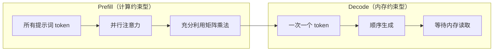
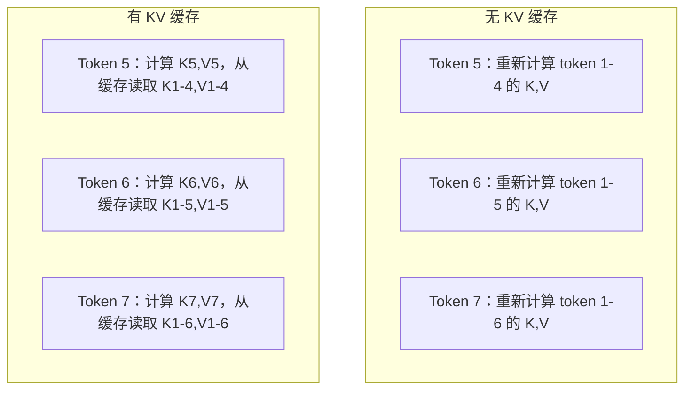
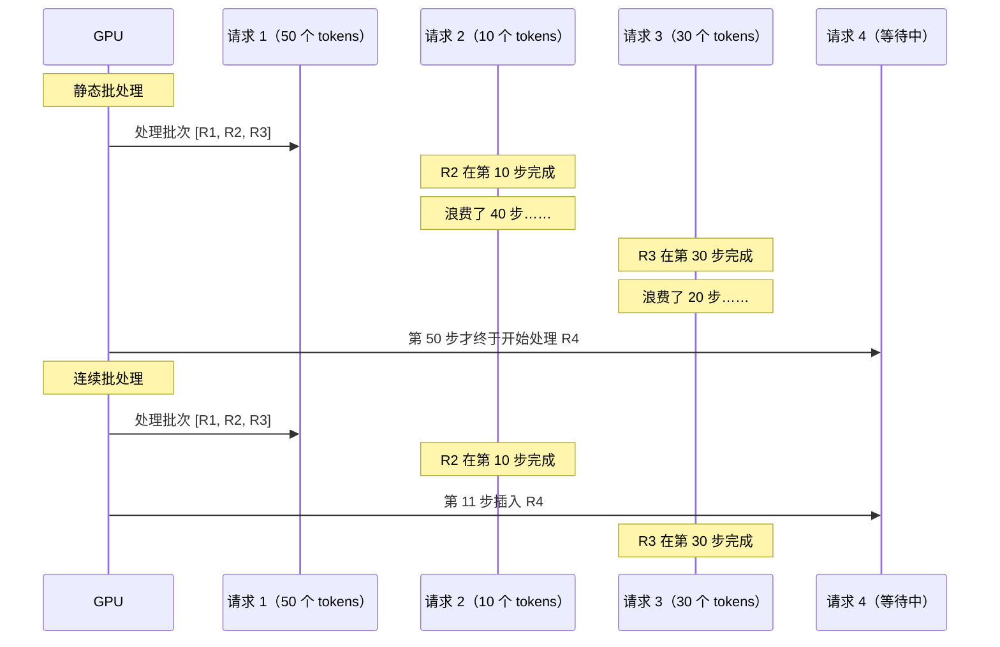
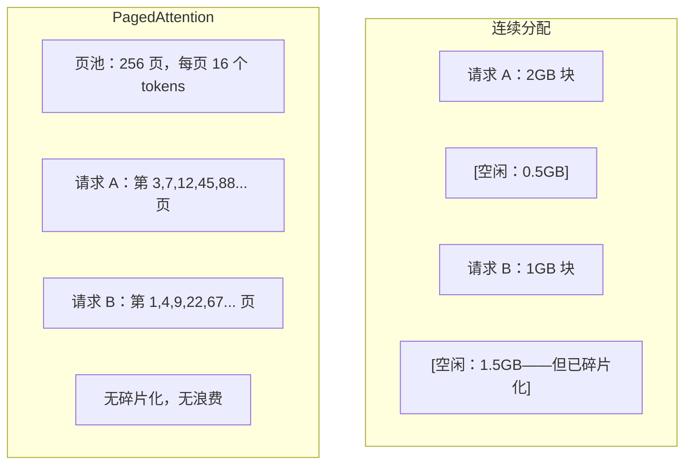
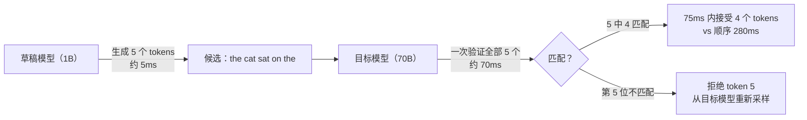

# 推理优化

> LLM 推理分为两个阶段。Prefill（填充）并行处理你的提示词——受计算约束。Decode（解码）逐个生成 token——受内存约束。每种优化都针对其中一个或两个阶段。

**类型：** 构建
**语言：** Python
**前置条件：** 第十阶段，第 01-08 课（Transformer 架构、注意力机制）
**时间：** 约 120 分钟

## 学习目标

- 实现 KV 缓存以消除自回归 token 生成过程中的冗余计算
- 解释 LLM 推理的 prefill 与 decode 阶段，以及为何各自具有不同的瓶颈（计算约束型 vs 内存约束型）
- 实现连续批处理（continuous batching）和 PagedAttention 概念，以在并发请求下最大化 GPU 利用率
- 比较推理优化技术（KV 缓存、投机解码、Flash Attention）及其吞吐量/延迟权衡

## 问题所在

你将 Llama 3 70B 部署在 4 张 A100 GPU 上。单用户使用时可达到约 50 tokens/秒。感觉很快。但当 100 个用户同时访问该端点时，吞吐量降至每个用户 3 tokens/秒。你的 25000 美元/月的 GPU 账单换来的却是比人类打字还慢的响应。

模型本身在 1 个用户和 100 个用户时没有变化。权重相同、架构相同、数学运算相同。变化的是工作调度方式。朴素推理浪费了 90% 以上的可用 GPU 计算资源。一个等待第 47 个 token 的用户占用了整个批处理槽位，而 GPU 内存总线在矩阵乘法之间处于空闲状态。与此同时，新用户的 2000 token 提示词可以利用那段空闲时间进行有效计算。

这不是一个扩展问题，而是一个调度问题。本课中的技术——KV 缓存、连续批处理、PagedAttention、投机解码、前缀缓存——是将 25000 美元/月的推理账单降至 5000 美元/月（服务相同流量）的关键。

vLLM 在 4 张 A100-80GB 上服务 Llama 3 70B，在低并发下达到约 50 tokens/秒/人，通过连续批处理和 PagedAttention 在 100 个并发请求时维持 15-25 TPS/人。没有这些优化，同等硬件在该并发下只能提供 5 TPS/人。同样的 GPU、同样的模型，4 倍的吞吐量。

## 核心概念

### Prefill 与 Decode

每个 LLM 推理请求都有两个截然不同的阶段。

**Prefill** 处理整个输入提示词。所有 token 都是已知的，因此可以在整个序列上并行计算注意力。这是一个大型矩阵乘法——GPU 核心保持繁忙。瓶颈在于计算：你的硬件每秒能提供多少 FLOPS。A100 可达 312 TFLOPS（BF16）。在单张 A100 上，对 70B 模型处理 4096 token 提示词的 prefill 阶段大约需要 400ms。

**Decode** 逐个生成输出 token。每个新 token 都会 attend 到所有之前的 token，但每次前向传播只产生一个 token。权重矩阵的尺寸与 prefill 阶段相同，但你是在用单个向量而非矩阵去乘以它们。GPU 核心在微秒级完成计算，然后等待下一批权重从内存到达。瓶颈在于内存带宽：你从 HBM 向计算单元流式传输模型权重的速度。A100 的带宽为 2 TB/s。70B 模型（FP16）为 140 GB。读取完整模型一次需要 70ms——这就是单个解码步骤的最低耗时。



**ops:byte 比率**（也称为算术强度）捕捉了这一权衡。它衡量的是每次从内存加载一字节数据所执行的运算次数。

```
ops:byte 比率 = 每个 token 的 FLOPs / 从内存读取的字节数
```

在批处理 4096 token 的 prefill 阶段，每次加载权重你执行约 4096 次乘累加运算。该比率很高——你处于计算约束状态。在 batch size 为 1 的 decode 阶段，每次加载权重你大约执行 1 次运算。该比率很低——你处于内存约束状态。

核心洞察：*decode 是内存约束型的，因为你要读取整个模型来产生一个 token*。以下每种优化要么减少你需要读取的数据量，要么增加每次读取处理的 token 批大小，要么完全避免读取。

### KV 缓存

在注意力机制中，每个 token 的 query 会 attend 到所有先前 token 的 key 和 value 向量。若不缓存，生成第 N 个 token 需要重新计算前面所有 N-1 个 token 的 key 和 value 投影。Token 1 在生成 token 2 时被投影，然后在 token 3 时再次被投影，然后在 token 4 时再次被投影。到 token 1000 时，token 1 已经被投影了总共 999 次。

KV 缓存存储所有先前 token 的 key 和 value 投影。生成第 N 个 token 时，你只需计算第 N 个 token 的 key 和 value，然后将其与 token 1 到 N-1 的缓存 K/V 连接起来。



**KV 缓存的内存公式：**

```
KV 缓存大小 = 2 * num_layers * num_kv_heads * head_dim * seq_len * bytes_per_param
```

以 Llama 3 70B 为例（80 层、8 个 KV heads 使用 GQA、head_dim=128、BF16）：

```
每个 token：2 * 80 * 8 * 128 * 2 字节 = 327,680 字节 = 320 KB
4,096 tokens 时：320 KB * 4,096 = 1.28 GB
128K tokens 时：320 KB * 131,072 = 40 GB
```

单个 128K 上下文的 Llama 3 70B 对话消耗 40 GB 的 KV 缓存——相当于一张 A100 的一半内存。若 100 个并发用户每人 4K tokens，仅 KV 缓存就需要 128 GB。这就是 KV 缓存管理成为推理优化核心挑战的原因。

### 连续批处理

静态批处理会等待 N 个请求全部到达后一起处理，并等待*所有*请求完成后再接受新请求。如果一个请求需要 500 个 tokens，另一个需要 10 个，短请求在完成后会闲置 490 个解码步骤。

连续批处理（也称为迭代级批处理）在任何一个请求完成时立即将新请求插入批处理中。批处理在每个解码步骤重新评估。一个在 10 个 tokens 后完成的请求会立即被一个等待中的请求替换。



吞吐量提升取决于输出长度差异有多大。若长度均匀，连续批处理与静态批处理相当。对于可变长度（常见情况），连续批处理可提供 2-5 倍更高的吞吐量，因为 GPU 槽位从不会空置。

### PagedAttention

每个请求的 KV 缓存是一个连续的内存块。随着请求的到来和离开，内存会产生碎片——就像操作系统中的 RAM 碎片化一样。一个 4K token 的请求需要 1.28 GB 的连续空间。即使你有总计 2 GB 的空闲空间，你可能也没有 1.28 GB 的*连续*空间。要么浪费内存，要么拒绝该请求。

PagedAttention（来自 vLLM）将操作系统风格的虚拟内存应用于 KV 缓存。它不是为每个请求分配一个连续块，而是分配固定大小的"页"（通常每页 16 个 tokens）。页可以位于物理 GPU 内存中的任何位置。页表将每个请求的逻辑序列位置映射到物理页位置。



PagedAttention 还支持共享前缀的**写时复制（copy-on-write）**。如果有 50 个请求共享相同的系统提示词，该系统提示词的 KV 缓存页只存储一次，由所有 50 个请求引用。只有当请求出现分歧时（不同的用户消息），它才会获得自己的页。这对于有共享系统提示词的应用程序来说，大大降低了内存使用。

vLLM 通过 PagedAttention 实现了接近零的内存浪费（约 4%，而朴素分配为约 60-80%）。

### 投机解码

Decode 之所以慢，是因为它是顺序的——你生成一个 token，然后将其反馈，再生成下一个。但如果你能以较低成本猜测接下来的 5 个 tokens，然后一次性验证它们呢？

投机解码使用一个小的、快速的**草稿模型**生成 K 个候选 tokens。然后大型**目标模型**在单次前向传播中处理所有 K 个候选（这看起来像 prefill——并行的、计算约束型的、高效的）。如果目标模型同意草稿模型的预测，你就在一次目标前向传播的时间内接受了所有 K 个 tokens。如果在第 j 个位置出现分歧，你就接受前 1 到 j-1 个 tokens，并丢弃其余的。



加速比取决于**接受率**——草稿模型的预测与目标模型匹配的频率。对于 Llama 3 8B 为 Llama 3 70B 做草稿的情况，在自然语言上的典型接受率为 70-85%。这转化为 2-3 倍的解码加速。

投机解码有三种方法：

| 方法 | 草稿来源 | 接受率 | 开销 |
|--------|-------------|-----------------|----------|
| 草稿-目标（Leviathan 等）| 独立的小模型 | 70-85% | 草稿模型内存 |
| EAGLE（Li 等）| 目标模型上的轻量级 head | 75-90% | 约 1% 额外参数 |
| N-gram 查找 | Token n-gram 表 | 40-60% | 可忽略 |

**EAGLE** 在目标模型的隐藏状态之上训练一个小的自回归 head。它使用目标模型的倒数第二层特征预测下一个 token 的嵌入。由于它操作的是目标模型自己的表示（而非独立模型的），因此以最小的额外内存实现了更高的接受率。EAGLE-2 添加了动态草稿树，根据上下文调整候选数量。

**N-gram 投机解码** 从当前上下文或预构建的语料库中维护 n-gram 延续表。如果草稿与之前在同一对话中出现的内容匹配（重复模式、代码、结构化输出），它会以零神经网络开销触发。平均接受率较低，但每次推测的成本基本上是免费的。

投机解码在*数学上是精确的*——输出分布与目标模型的分布完全相同。它不是一种近似。验证步骤确保每个被接受的 token 都具有目标模型本应分配的精确概率。

### 前缀缓存

许多请求共享相同的前缀。聊天机器人的系统提示词。RAG 上下文块。少样本示例集。如果没有前缀缓存，每个请求都会从头开始重新计算这些共享 token 的 KV 缓存。

前缀缓存存储常见前缀的 KV 缓存并在请求间重用。当新请求带有已知前缀到达时，系统复制（或引用）缓存的 KV 条目，仅计算唯一后缀的 KV。

对于跨所有请求共享的 2000 token 系统提示词，前缀缓存为每个请求消除了约 400ms 的 prefill。在 100 请求/秒的情况下，这节省了每秒 40 秒的 GPU 计算——相当于超过一张 GPU 的工作量。

SGLang 的 RadixAttention 使用 radix 树（trie）实现前缀缓存，按 token 内容索引前缀。任何匹配存储前缀的请求都可以免费获得其 KV 缓存。该树支持部分前缀匹配——如果你与缓存条目共享 2000 个前缀 token 中的 1500 个，你就重用这 1500 个，仅重新计算剩余的 500 个。

### 推理引擎

三个引擎主导着生产级 LLM 服务：

| 引擎 | 关键创新 | 最适合场景 |
|--------|---------------|----------|
| vLLM | PagedAttention、连续批处理 | 通用服务，最高兼容性 |
| SGLang | RadixAttention（前缀缓存）、结构化生成 | 多轮聊天机器人、约束解码 |
| TensorRT-LLM | NVIDIA 内核融合、FP8 量化 | NVIDIA 硬件上的最高单 GPU 吞吐量 |

**vLLM** 是默认起点。它支持最广泛的模型范围，可在任何 GPU 供应商（NVIDIA、AMD、Intel）上运行，并通过 PagedAttention + 连续批处理实现强劲吞吐量。OpenAI 兼容 API 意味着你可以将其作为任何 OpenAI API 调用的替代品直接替换。

**SGLang** 构建在 vLLM 相同的基础之上，但增加了用于前缀缓存的 RadixAttention 和用于结构化 LLM 程序的领域特定语言。如果你的工作负载涉及多轮对话、工具使用或约束解码（JSON 输出、正则引导生成），SGLang 通常通过前缀复用使性能超过 vLLM 2-5 倍。

**TensorRT-LLM** 将模型编译成优化的 NVIDIA GPU 内核。它融合操作（注意力 + 线性 + 激活融合为一个内核），在 H100 GPU 上使用 FP8，并与 NVIDIA Triton Inference Server 集成用于生产部署。它在 NVIDIA 硬件上实现了最高的单 GPU 吞吐量，但需要更多设置且仅支持 NVIDIA GPU。

Llama 3 70B（4xA100-80GB、BF16）的真实数据：

| 指标 | vLLM | SGLang | TensorRT-LLM |
|--------|------|--------|---------------|
| 吞吐量（1 用户）| 约 50 TPS | 约 55 TPS | 约 65 TPS |
| 吞吐量（100 用户）| 约 2500 总 TPS | 约 3200 总 TPS | 约 3000 总 TPS |
| 首个 token 时间 | 约 400ms | 约 300ms（前缀命中）| 约 350ms |
| 最大上下文 | 128K | 128K | 128K |

### Ops:Byte 框架

你无法优化你无法衡量的东西。ops:byte 比率告诉你是处于计算约束还是内存约束，这决定了哪些优化是重要的。

```
计算屋顶：GPU 的峰值 FLOPS
内存屋顶：峰值带宽 * ops:byte 比率
```

当 ops:byte 较低时（decode、小批次），你达到内存带宽屋顶。添加更多计算（更高时钟、更多核心）没有帮助。你需要减少内存读取（量化、KV 缓存压缩）或增加批次大小以在更多有用工作间分摊读取。

当 ops:byte 较高时（prefill、大批次），你达到计算屋顶。内存带宽优化没有帮助。你需要更快的 GPU、内核融合或降低精度以挤出更多 FLOPS。

| 场景 | ops:byte | 约束类型 | 优化手段 |
|----------|----------|-------|---------------|
| Prefill, batch=1 | 约 4096 | 计算 | 内核融合、FP8 |
| Decode, batch=1 | 约 1 | 内存 | 量化、KV 压缩 |
| Decode, batch=32 | 约 32 | 内存 | 更大批次、连续批处理 |
| Decode, batch=256 | 约 256 | 过渡期 | 两者都重要 |
| Decode, batch=1024 | 约 1024 | 计算 | 内核融合、张量并行 |

A100 上的交叉点在 ops:byte ≈ 156（312 TFLOPS / 2 TB/s）。低于 156 时，你处于内存约束。高于 156 时，你处于计算约束。连续批处理通过每次迭代打包更多 tokens 来推动 decode 接近这个交叉点。

## 构建它

### 步骤 1：从零构建 KV 缓存

我们构建一个多头 KV 缓存，按层、按头存储 key 和 value 投影，并展示内存增长模式。

```python
import numpy as np

class KVCache:
    def __init__(self, num_layers, num_heads, head_dim, max_seq_len, dtype=np.float16):
        self.num_layers = num_layers
        self.num_heads = num_heads
        self.head_dim = head_dim
        self.max_seq_len = max_seq_len        self.dtype = dtype

        self.k_cache = np.zeros(
            (num_layers, num_heads, max_seq_len, head_dim), dtype=dtype
        )
        self.v_cache = np.zeros(
            (num_layers, num_heads, max_seq_len, head_dim), dtype=dtype
        )
        self.seq_len = 0

    def update(self, layer_idx, new_keys, new_values):
        num_new = new_keys.shape[1]
        end = self.seq_len + num_new
        self.k_cache[layer_idx, :, self.seq_len:end, :] = new_keys
        self.v_cache[layer_idx, :, self.seq_len:end, :] = new_values
        return (
            self.k_cache[layer_idx, :, :end, :],
            self.v_cache[layer_idx, :, :end, :]
        )

    def advance(self, num_tokens):
        self.seq_len += num_tokens

    def memory_bytes(self):
        return self.k_cache.nbytes + self.v_cache.nbytes

    def used_bytes(self):
        per_token = 2 * self.num_layers * self.num_heads * self.head_dim * np.dtype(self.dtype).itemsize
        return per_token * self.seq_len
```

### Step 2：带 KV 缓存的注意力机制

一个简化版的多头注意力，使用 KV 缓存来处理解码步骤。

```python
def scaled_dot_product_attention(query, keys, values):
    head_dim = query.shape[-1]
    scores = np.matmul(query, keys.transpose(0, 1, 3, 2)) / np.sqrt(head_dim)
    seq_len_q = scores.shape[-2]
    seq_len_k = scores.shape[-1]
    if seq_len_q > 1:
        mask = np.triu(np.ones((seq_len_q, seq_len_k), dtype=np.float32), k=seq_len_k - seq_len_q + 1)
        scores = scores + mask * (-1e9)
    max_scores = np.max(scores, axis=-1, keepdims=True)
    exp_scores = np.exp(scores - max_scores)
    attn_weights = exp_scores / np.sum(exp_scores, axis=-1, keepdims=True)
    return np.matmul(attn_weights, values)


class MultiHeadAttention:
    def __init__(self, d_model, num_heads):
        self.num_heads = num_heads
        self.head_dim = d_model // num_heads
        scale = np.sqrt(2.0 / d_model)
        self.W_q = np.random.randn(d_model, d_model).astype(np.float32) * scale
        self.W_k = np.random.randn(d_model, d_model).astype(np.float32) * scale
        self.W_v = np.random.randn(d_model, d_model).astype(np.float32) * scale
        self.W_o = np.random.randn(d_model, d_model).astype(np.float32) * scale

    def forward(self, x, kv_cache=None, layer_idx=0):
        batch, seq_len, d_model = x.shape
        Q = np.matmul(x, self.W_q).reshape(batch, seq_len, self.num_heads, self.head_dim).transpose(0, 2, 1, 3)
        K = np.matmul(x, self.W_k).reshape(batch, seq_len, self.num_heads, self.head_dim).transpose(0, 2, 1, 3)
        V = np.matmul(x, self.W_v).reshape(batch, seq_len, self.num_heads, self.head_dim).transpose(0, 2, 1, 3)

        if kv_cache is not None:
            K_full, V_full = kv_cache.update(layer_idx, K[0], V[0])
            K = K_full[np.newaxis, :, :, :]
            V = V_full[np.newaxis, :, :, :]
            if seq_len == 1:
                kv_cache.advance(1)

        attn_out = scaled_dot_product_attention(Q, K, V)
        attn_out = attn_out.transpose(0, 2, 1, 3).reshape(batch, -1, d_model)
        return np.matmul(attn_out, self.W_o)
```

### Step 3：连续批处理模拟器

模拟静态批处理与连续批处理之间的调度差异。

```python
import heapq

class Request:
    def __init__(self, request_id, prompt_tokens, output_tokens, arrival_step):
        self.request_id = request_id
        self.prompt_tokens = prompt_tokens
        self.output_tokens = output_tokens
        self.arrival_step = arrival_step
        self.tokens_generated = 0
        self.start_step = None
        self.end_step = None

    def is_done(self):
        return self.tokens_generated >= self.output_tokens


def simulate_static_batching(requests, batch_size):
    step = 0
    completed = []
    queue = list(requests)
    queue.sort(key=lambda r: r.arrival_step)

    while queue:
        batch = []
        while queue and len(batch) < batch_size:
            r = queue.pop(0)
            r.start_step = max(step, r.arrival_step)
            batch.append(r)

        if batch:
            step = max(step, max(r.start_step for r in batch))
            max_output = max(r.output_tokens for r in batch)
            for r in batch:
                r.tokens_generated = r.output_tokens
                r.end_step = step + max_output
            step += max_output
            completed.extend(batch)

    return completed


def simulate_continuous_batching(requests, batch_size):
    step = 0
    completed = []
    queue = sorted(requests, key=lambda r: r.arrival_step)
    queue_idx = 0
    active = []
    waiting = []

    while queue_idx < len(queue) or active or waiting:
        while queue_idx < len(queue) and queue[queue_idx].arrival_step <= step:
            waiting.append(queue[queue_idx])
            queue_idx += 1

        while waiting and len(active) < batch_size:
            r = waiting.pop(0)
            r.start_step = step
            active.append(r)

        if not active:
            if waiting:
                step += 1
                continue
            elif queue_idx < len(queue):
                step = queue[queue_idx].arrival_step
                continue
            else:
                break

        for r in active:
            r.tokens_generated += 1

        done = [r for r in active if r.is_done()]
        for r in done:
            r.end_step = step + 1
            completed.append(r)
        active = [r for r in active if not r.is_done()]

        step += 1

    return completed


def batching_stats(completed):
    latencies = [r.end_step - r.arrival_step for r in completed]
    total_time = max(r.end_step for r in completed) - min(r.arrival_step for r in completed)
    total_tokens = sum(r.output_tokens for r in completed)
    return {
        "avg_latency": np.mean(latencies),
        "p50_latency": np.median(latencies),
        "p99_latency": np.percentile(latencies, 99),
        "total_time": total_time,
        "throughput": total_tokens / total_time if total_time > 0 else 0,
    }
```

### Step 4：前缀缓存

基于 Trie 的前缀缓存，用于存储共享前缀的 KV 条目。

```python
class TrieNode:
    def __init__(self):
        self.children = {}
        self.kv_data = None
        self.hit_count = 0


class PrefixCache:
    def __init__(self, max_entries=1000):
        self.root = TrieNode()
        self.max_entries = max_entries
        self.total_entries = 0
        self.hits = 0
        self.misses = 0

    def _walk(self, token_ids):
        node = self.root
        depth = 0
        for tid in token_ids:
            if tid not in node.children:
                break
            node = node.children[tid]
            depth += 1
        return node, depth

    def lookup(self, token_ids):
        node, depth = self._walk(token_ids)
        if depth > 0:
            self.hits += 1
            current = self.root
            for tid in token_ids[:depth]:
                current = current.children[tid]
                current.hit_count += 1
            kv_entries = []
            current = self.root
            for tid in token_ids[:depth]:
                current = current.children[tid]
                if current.kv_data is not None:
                    kv_entries.append(current.kv_data)
            return depth, kv_entries
        self.misses += 1
        return 0, []

    def insert(self, token_ids, kv_per_token):
        node = self.root
        for i, tid in enumerate(token_ids):
            if tid not in node.children:
                if self.total_entries >= self.max_entries:
                    return i
                node.children[tid] = TrieNode()
                self.total_entries += 1
            node = node.children[tid]
            if i < len(kv_per_token):
                node.kv_data = kv_per_token[i]
        return len(token_ids)

    def hit_rate(self):
        total = self.hits + self.misses
        return self.hits / total if total > 0 else 0.0
```

### Step 5：投机解码模拟器

我们模拟具有可配置接受率的草稿-目标投机解码。

```python
class DraftModel:
    def __init__(self, vocab_size, acceptance_rate=0.8):
        self.vocab_size = vocab_size
        self.acceptance_rate = acceptance_rate

    def generate(self, context, num_tokens):
        tokens = np.random.randint(0, self.vocab_size, size=num_tokens)
        return tokens

    def get_probs(self, context, token):        probs = np.random.dirichlet(np.ones(self.vocab_size))
        return probs


class TargetModel:
    def __init__(self, vocab_size):
        self.vocab_size = vocab_size

    def get_probs(self, context, tokens=None):
        if tokens is not None:
            return [np.random.dirichlet(np.ones(self.vocab_size)) for _ in tokens]
        return np.random.dirichlet(np.ones(self.vocab_size))


def speculative_decode(draft_model, target_model, context, num_speculative=5,
                       draft_cost=1.0, target_cost=10.0, verify_cost=12.0):
    total_tokens = 0
    total_cost = 0.0
    accepted_counts = []
    context = list(context)

    max_tokens = 100

    while total_tokens < max_tokens:
        draft_tokens = draft_model.generate(context, num_speculative)
        total_cost += draft_cost * num_speculative

        target_probs = target_model.get_probs(context, draft_tokens)
        total_cost += verify_cost

        accepted = 0
        for i, token in enumerate(draft_tokens):
            draft_p = draft_model.get_probs(context + list(draft_tokens[:i]), token)
            target_p = target_probs[i]

            r = np.random.random()
            acceptance_prob = min(1.0, target_p[token] / (draft_p[token] + 1e-10))

            if r < draft_model.acceptance_rate:
                accepted += 1
                context.append(token)
                total_tokens += 1
            else:
                new_token = np.random.choice(draft_model.vocab_size, p=target_p)
                context.append(new_token)
                total_tokens += 1
                break

        accepted_counts.append(accepted)

        if accepted == num_speculative:
            bonus_probs = target_model.get_probs(context)
            bonus_token = np.random.choice(draft_model.vocab_size, p=bonus_probs)
            context.append(bonus_token)
            total_tokens += 1

    sequential_cost = total_tokens * target_cost
    return {
        "total_tokens": total_tokens,
        "speculative_cost": total_cost,
        "sequential_cost": sequential_cost,
        "speedup": sequential_cost / total_cost if total_cost > 0 else 1.0,
        "avg_accepted": np.mean(accepted_counts),
        "acceptance_rate": np.mean(accepted_counts) / num_speculative,
    }


def compare_speculation_strategies(vocab_size=1000, num_trials=20):
    results = {}

    for name, acceptance_rate, spec_tokens in [
        ("草稿-目标 (8B->70B)", 0.78, 5),
        ("EAGLE", 0.85, 6),
        ("N-gram", 0.50, 4),
        ("无推测", 0.0, 0),
    ]:
        if spec_tokens == 0:
            results[name] = {
                "speedup": 1.0,
                "acceptance_rate": 0.0,
                "avg_accepted": 0.0,
            }
            continue

        trial_results = []
        for _ in range(num_trials):
            draft = DraftModel(vocab_size, acceptance_rate=acceptance_rate)
            target = TargetModel(vocab_size)
            context = list(np.random.randint(0, vocab_size, size=10))
            result = speculative_decode(draft, target, context, num_speculative=spec_tokens)
            trial_results.append(result)

        results[name] = {
            "speedup": np.mean([r["speedup"] for r in trial_results]),
            "acceptance_rate": np.mean([r["acceptance_rate"] for r in trial_results]),
            "avg_accepted": np.mean([r["avg_accepted"] for r in trial_results]),
        }

    return results
```

### 步骤 6: KV 缓存内存分析器

计算真实模型配置下的 KV 缓存内存需求。

```python
MODEL_CONFIGS = {
    "Llama-3-8B": {
        "num_layers": 32, "num_kv_heads": 8, "head_dim": 128,
        "model_params_b": 8, "gqa": True,
    },
    "Llama-3-70B": {
        "num_layers": 80, "num_kv_heads": 8, "head_dim": 128,
        "model_params_b": 70, "gqa": True,
    },
    "Llama-3-405B": {
        "num_layers": 126, "num_kv_heads": 8, "head_dim": 128,
        "model_params_b": 405, "gqa": True,
    },
    "Mistral-7B": {
        "num_layers": 32, "num_kv_heads": 8, "head_dim": 128,
        "model_params_b": 7, "gqa": True,
    },
    "GPT-4-est": {
        "num_layers": 120, "num_kv_heads": 96, "head_dim": 128,
        "model_params_b": 1800, "gqa": False,
    },
}


def kv_cache_memory(config, seq_len, dtype_bytes=2):
    per_token = 2 * config["num_layers"] * config["num_kv_heads"] * config["head_dim"] * dtype_bytes
    total = per_token * seq_len
    return {
        "per_token_bytes": per_token,
        "per_token_kb": per_token / 1024,
        "total_bytes": total,
        "total_mb": total / (1024 ** 2),
        "total_gb": total / (1024 ** 3),
    }


def memory_budget(config, gpu_memory_gb, model_dtype_bytes=2, kv_dtype_bytes=2):
    model_memory_gb = config["model_params_b"] * 1e9 * model_dtype_bytes / (1024 ** 3)
    overhead_gb = gpu_memory_gb * 0.1
    available_for_kv = gpu_memory_gb - model_memory_gb - overhead_gb

    if available_for_kv <= 0:
        return {"error": "Model does not fit in GPU memory", "model_memory_gb": model_memory_gb}

    per_token = 2 * config["num_layers"] * config["num_kv_heads"] * config["head_dim"] * kv_dtype_bytes
    max_tokens = int(available_for_kv * (1024 ** 3) / per_token)

    return {
        "gpu_memory_gb": gpu_memory_gb,
        "model_memory_gb": round(model_memory_gb, 1),
        "overhead_gb": round(overhead_gb, 1),
        "available_for_kv_gb": round(available_for_kv, 1),
        "max_total_tokens": max_tokens,
        "max_users_at_2k": max_tokens // 2048,
        "max_users_at_4k": max_tokens // 4096,
        "max_users_at_32k": max_tokens // 32768,
    }
```

## 使用它

使用 vLLM：

```python
from vllm import LLM, SamplingParams

llm = LLM(
    model="meta-llama/Llama-3-70B-Instruct",
    tensor_parallel_size=4,
    enable_prefix_caching=True,
    max_model_len=8192,
    gpu_memory_utilization=0.9,
)

params = SamplingParams(temperature=0.7, max_tokens=256)
outputs = llm.generate(["Explain inference optimization in one paragraph."], params)
```

使用 SGLang 实现前缀缓存 + 结构化输出：

```python
import sglang as sgl

@sgl.function
def classify(s, text):
    s += sgl.system("You are a classifier. Output JSON only.")
    s += sgl.user(f"Classify this text: {text}")
    s += sgl.assistant(sgl.gen("result", regex=r'\{"label": "(positive|negative|neutral)"\}'))

runtime = sgl.Runtime(model_path="meta-llama/Llama-3-70B-Instruct", tp_size=4)
sgl.set_default_backend(runtime)

results = classify.run_batch([
    {"text": "This product is amazing!"},
    {"text": "Terrible experience."},
    {"text": "It was okay I guess."},
])
```

使用 TensorRT-LLM：

```python
import tensorrt_llm
from tensorrt_llm.runtime import ModelRunner

runner = ModelRunner.from_dir("./llama-70b-trt-engine/", rank=0)

outputs = runner.generate(
    batch_input_ids=[tokenizer.encode("Explain KV caching.")],
    max_new_tokens=256,
    temperature=0.7,
)
```

## 部署它

本课程产出：
- `outputs/skill-inference-optimization.md` -- 一个用于诊断和优化 LLM 推理服务的技能

## 练习

1. 修改 KV 缓存分析器，比较 FP16 vs FP8 vs INT4 KV 缓存量化。在 4K 上下文长度下，为 Llama 3 70B 在 4xA100-80GB 上计算每种量化方式的最大并发用户数。KV 量化到 INT4 应该能将用户容量提升约 4 倍。

2. 扩展连续批处理模拟器，跟踪 GPU 利用率（每步填充的批次槽位比例）。绘制静态批处理和连续批处理在 50 个请求下的利用率随时间变化图，输出长度服从帕累托分布（shape=1.5, scale=20）。连续批处理的利用率应保持在 80% 以上。

3. 实现一个分组查询注意力（GQA）版本的 KV 缓存，其中 `num_kv_heads < num_query_heads`。Llama 3 70B 使用 64 个查询头但只有 8 个 KV 头。计算相比完整多头注意力的内存节省（KV 缓存大小减少 8 倍）。

4. 构建一个使用 LRU 淘汰策略的前缀缓存。设置 max_entries 为 500，生成 1,000 个请求，其中 60% 共享 5 个常见前缀中的一个。测量命中率并与无限缓存进行比较。良好的淘汰策略应使命中率保持在 55% 以上。

5. 扩展推测解码模拟器，实现树状推测（EAGLE-2 风格）。不是生成单个 K 个草稿令牌的链，而是生成一棵候选树（例如，在 3 个层级上每个位置 2 个分支 = 8 个叶候选）。比较每个验证轮次接受的总令牌数与线性推测的对比。

## 关键术语

| 术语 | 人们常说的 | 实际含义 |
|------|----------------|----------------------|
| Prefill | "处理提示词" | 并行计算所有输入 token 上的注意力——属于计算密集型，因为完整的矩阵乘法使 GPU 核心保持忙碌 |
| Decode | "生成 token" | 每次前向传播只产生一个 token，每次都读取完整的模型权重——属于内存密集型，因为计算完成后等待下一批权重到达 |
| KV 缓存 | "缓存注意力状态" | 存储所有先前 token 的键值投影，以便在每个解码步骤中不需要重新计算——以内存换取计算 |
| 连续批处理 | "动态批处理" | 一旦有任何请求完成，就立即将新请求插入运行中的批次，在每个解码迭代时评估，而不是等待整个批次完成 |
| PagedAttention | "KV 缓存的虚拟内存" | 以固定大小的页面而不是连续块来分配 KV 缓存，消除内存碎片，并支持共享前缀的写时复制 |
| 推测解码 | "草稿与验证" | 使用快速草稿模型提出多个 token，然后在一次目标模型前向传播中验证它们——数学上精确，可实现 2-3 倍加速 |
| EAGLE | "自推测解码" | 一种推测解码变体，在目标模型自己的隐藏状态上训练一个轻量级头，相比单独的草稿模型获得更高的接受率 |
| 前缀缓存 | "复用系统提示词 KV" | 存储常见前缀（系统提示词、少样本示例）的已计算 KV 缓存条目，并在不同请求间复用，以跳过冗余的 prefill |
| 运算字节比 | "算术强度" | 计算操作数与读取的内存字节数之比——决定工作负载是计算密集型（高比值）还是内存密集型（低比值） |
| 首个 token 时间 | "TTFT" | 从接收到请求到产生第一个输出 token 之间的延迟——对于长提示词，主要由 prefill 时间决定 |

## 进一步阅读

- Kwon 等，《Efficient Memory Management for Large Language Model Serving with PagedAttention》（2023）——vLLM 论文，引入了分页 KV 缓存管理，现已成为推理服务的事实标准
- Leviathan 等，《Fast Inference from Transformers via Speculative Decoding》（2023）——开创性论文，证明草稿-验证推测可以产生精确的目标模型分布，同时实现 2-3 倍加速
- Li 等，《EAGLE: Speculative Sampling Requires Rethinking Feature Uncertainty》（2024）——通过在目标模型自己的特征上训练一个头而非使用单独的草稿模型，获得更高的接受率
- Zheng 等，《SGLang: Efficient Execution of Structured Language Model Programs》（2024）——引入 RadixAttention 用于前缀缓存，以及用于多轮 LLM 程序的编程模型
- Williams 等，《Roofline: An Insightful Visual Performance Model for Multicore Architectures》（2009）——原始 Roofline 论文，将运算字节比框架形式化，用于推理计算与内存瓶颈
