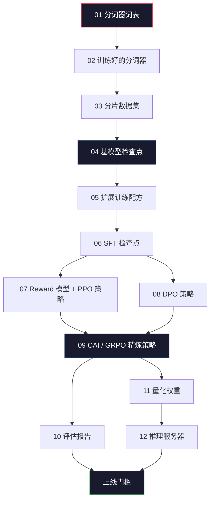
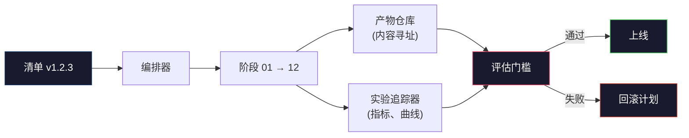

# 构建完整的 LLM 训练流水线

> 第一课到第十二课的内容，不过是整条流水线中某一个阶段的某一步而已。本课的目标是把这些阶段拼装成一条端到端的运行管线：分词、预训练、扩展、SFT、对齐、评估、量化、推理。你不需要在笔记本上训练一个 70B 的模型。你要做的是编排层、清单文件、评估门槛和回滚方案——这些才是 2026 年前沿团队用来决定「什么可以上线」的东西。这就是终极挑战。

**类型：** 构建
**语言：** Python（标准库）
**前置条件：** 第十阶段所有课程 01-12
**时间：** 约 120 分钟

## 学习目标

- 将之前的十一课（分词器、数据、预训练、扩展、SFT、RLHF、DPO、CAI、评估、量化、推理）组合成一条可复现的流水线配置文件
- 定义各阶段之间的产物契约：每个阶段消费什么、生产什么，以及下一阶段如何验证输入
- 构建一个编排器，负责追踪实验、对产物进行哈希、在评估门槛处决定是否放行
- 设计回滚方案：哪些产物便宜可重跑、哪些代价高昂、损坏的检查点意味着什么成本

## 问题

之前的每一课都能跑起来。分词器训练好了。微型 GPT 预训练完了。SFT 数据集组装好了。Reward 模型训练好了。DPO 运行了。评估测完了。量化权重导出了。推理服务器启动了。每一课都是一个 notebook。每一个都有自己的一套规范、自己的输出路径、自己的随机种子。

前沿训练不是 notebook。Llama 3 405B 用了 3000 万 H100 小时，跨越约 54 天。DeepSeek-V3 大约用了 280 万 H800 小时。在此期间，一个损坏的检查点、一次数据污染、一次评估回退，就能让团队损失一周的墙上时间和一月的 GPU 预算。团队生存的秘诀在于流水线卫生：每个阶段都有确定的输入、确定的输出、清单文件、哈希值和门槛。

这就是终极挑战。你不需要在笔记本上端到端跑这条流水线。你要写的是协调各阶段的编排器、描述本次运行的清单文件、在放行决策前验证的校验器，以及让第三方能从一个文件重跑全部工作的回放方案。代码很小；纪律要求很大。

这个模式从 100M 参数到 1T 参数 scale 都不变。相同的四个组件——清单、编排器、评估门槛、产物仓库——既能跑 Llama 3，也能跑你练手的 GPT。区别只在于每个阶段配置里的数字大小，流水线的形状不变。

## 概念

### 十二个阶段

每一个第十阶段的课程就是一个阶段。完整的依赖图如下：



阶段 07 和 08 可以并行运行。其他一切都是硬依赖。阶段 02（分词器）的任何改变都会使所有下游产物失效。阶段 10（评估）的改变只会使上线决策失效。

### 清单文件

清单是一个单独的文件，完整描述了一次运行，足以重放。流水线产生的任何东西都不应依赖于清单中未记录的状态。字段平庸但必须完备。

```
pipeline_version: 1.2.3
seed: 42
git_commit: a1b2c3d4
stages:
  01_tokenizer:
    recipe: bpe_32k
    input_hash: sha256:...
    output_hash: sha256:...
    wall_clock_sec: 3600
    cost_usd: 12
```

阶段 N 的输出哈希就是阶段 N+1 的输入哈希。任何偏差都会让流水线停下来。这就是早期捕获数据损坏的方法。也是让不同大陆的同事验证他们的重放产生了与你相同产物的方法。

实践中团队使用小型 YAML schema 加上清单检查器，与上一次成功运行做 diff。除预期字段（成本、墙上时间）以外的任何增量都是红旗。

### 产物类型化

每个阶段的输出都是有类型的产物。不是目录 blob，不是 pickle，而是有已知 schema 的命名类型。

| 阶段 | 产物类型 | 关键字段 |
|-------|--------------|-----------|
| 01-02 | 分词器 | vocab.json, merges.txt, config.json, hash |
| 03 | 数据集 | shards[], 行数, token 数, 去重统计 |
| 04-05 | 检查点 | weights.safetensors, config.json, 优化器状态, step 数 |
| 06 | SFT 模型 | 检查点 + SFT 配方 + 数据配比 |
| 07 | Reward 模型 | RM 检查点 + 偏好数据哈希 |
| 08-09 | 策略 | 检查点 + 参考哈希 + beta + 已消耗的 KL 预算 |
| 10 | 评估报告 | 基准分数 + 回退 diff + 评估数据哈希 |
| 11 | 量化模型 | 量化权重 + 校准数据 + 相对 FP16 的精度差 |
| 12 | 服务器规格 | 端点 + 模型哈希 + 配置 + 可观测性钩子 |

类型化防止了最常见的失败模式：用阶段 08 的输出作为阶段 06 的输入，让 DPO 训练过的模型走 SFT 路径。类型化产物和类型化阶段签名让这些错误成为编译时失败，而不是第五天失败。

### 评估门槛

上线不是「训练完成了」。上线是「训练完成了且评估门槛通过了」。门槛在运行开始前就定义好了。

```
gates:
  mmlu:      >= baseline + 0.5   # 无回退
  humaneval: >= baseline + 1.0
  truthfulqa: >= baseline         # 不下降
  safety_refusal_rate: <= 0.05
  kl_from_reference: <= 25.0
  cost_total_usd: <= 50000
```

每个门槛都是一个数值阈值。没有「看起来不错」的门槛。没有主观签收。如果每个门槛都通过，产物被标记为可上线。如果任何门槛失败，运行被暂停，等待指定的审核者明确覆盖，而覆盖本身也会被记录在清单中。

两个门槛能捕获大部分灾难。*回退*门槛（新模型必须在核心基准上至少与之前一样好）捕获训练 bug。*KL 预算*门槛（对齐后的策略不得偏离参考策略超过 X）捕获过度对齐。每一个生产流水线都有这两个。

### 编排器

一小段代码，读取清单、分发阶段、追踪产物、在任何契约违规时停下。这不是 Airflow。这不是 Kubeflow。流水线的卫生要求的是你自己写的一个无聊的东西。

编排器的工作很窄：

1. 从清单解析 DAG。
2. 对每个阶段，检查期望的输出是否已存在于正确的哈希处（若是则跳过）。
3. 运行阶段，捕获 stdout/stderr，测量墙上时间和成本。
4. 验证输出哈希是否与下游阶段的期望输入哈希一致。
5. 失败时，写入部分清单，包含确切失败的阶段，并 nonzero 退出。

这只需要 200 行 Python。看起来会像本课中 `code/main.py` 的文件。在底层，真正的流水线用 `torchrun` 或 `ray` 在集群上执行各个阶段，但编排器本身跑在一台机器上。

### 实验追踪与产物存储

两个外部系统锚定流水线。

**实验追踪器（wandb、neptune、mlflow）。** 记录每个阶段的损失曲线、评估指标、系统遥测。追踪器是你三周后需要比较运行 A 和运行 B 时去的地方。团队几乎总是使用托管的追踪器——自己写会浪费时间，而这些时间应该用在训练上。

**产物仓库（S3、R2、GCS）。** 不可变的对象存储，用于检查点、数据集、分词器、评估报告。产物按哈希寻址，而非文件名。`latest.pt` 这样的文件名是陷阱；`ckpt-7b-step-20000-sha256:abc123.safetensors` 才是一份契约。

编排器向两者写入。追踪器给人看图表用。产物仓库给下一阶段查输入用。

### 成本核算

前沿运行有美元数字。预算纪律发生在两个地方。

**运行前估算。** 从清单计算期望的 FLOPs（预训练：6 × params × tokens）、期望的 GPU 小时数（FLOPs / 峰值吞吐量 / 利用率）、按当前租用价格的美元成本。如果估算超出预算门槛，流水线拒绝启动。

**运行中追踪。** 逐阶段记录墙上时间和成本到清单。每个阶段后检查剩余预算。如果某阶段超支，下一阶段的门槛用新的剩余预算评估。你不会在 VC 来电时才发现自己没钱了。

Llama 3 报告的成本是 6100 万美元。DeepSeek-V3 为主训练运行报告的成本是 560 万美元。差距主要来自硬件效率加 MoE——但具体成本是可见的，因为两队都逐阶段追踪，而非逐运行追踪。

### 可复现性 vs 确定性

这不是一回事。*可复现*意味着相同的清单加上相同的代码加上相同的基础设施产生一个下游指标等效的检查点。*确定性*意味着逐位一致的输出。

现代 LLM 训练可复现但不确定。分布式训练的 reduce 顺序、GPU 内核不确定性（cuBLAS、flash-attn）和混合精度舍入结合，使得两次运行之间在 1e-5 级别上产生不同的浮点数。这对最终指标没问题，指标不会变。如果你想用位级 diff 调试，这就致命了。治疗方法：记录每个阶段的输入哈希、输出哈希和摘要指标——如果这些匹配，运行就是「可复现的」，即使权重不是逐位一致的。



### 回滚计划

运行开始前，写下每个阶段失败时会发生什么。三类。

- **便宜可重跑**（小时级）：分词器、评估、量化、推理服务器。重跑即可。
- **中等**（天级）：SFT、DPO、CAI。保留基模型；只重跑对齐阶段。
- **昂贵**（周级和数百万美元）：预训练。这里的回滚计划不是「重跑」。而是「用最后一个好的检查点，用修订后的数据重跑下游便宜阶段」。

因为阶段依赖是类型化和哈希化的，编排器可以自动计算回滚集：失效失败的阶段及其所有下游。一个阶段 06（SFT）的失败会使 06、07、08、09、10、11、12 全部失效。一个阶段 11（量化）的失败只会使 11 和 12 失效。提前命名这些可以在团队凌晨 4 点筋疲力尽时不用现场发挥。

### 2026 年观察到的生产配方

大多数前沿团队收敛到了相同的骨架。

- 分词器：128k BPE，带字节回退。在小型均衡多语言切片上训练。
- 预训练：10-20T tokens，大部分是网页加代码加合成数据。Muon 或 AdamW 优化器。FSDP2 或 DeepSpeed ZeRO-3。梯度检查点。BF16 权重，FP32 master。
- SFT：500k-2M 条指令对，混合人类和合成数据，严格对评估集去重。
- 对齐：DPO 或 CAI + GRPO。RLHF 仅在偏好信号太复杂以至于 DPO 不够用时使用。
- 评估：MMLU-Pro、MATH、HumanEval+、GPQA、SWE-Bench Verified、LiveBench，外加一个私有保留集，公众永远看不到。
- 量化：4 位 GPTQ 或 AWQ 用于推理服务，8 位用于安全评估（精度差很重要的地方）。
- 服务：vLLM、TensorRT-LLM 或自研。连续批处理。投机解码。KV cache 逐出。

数字每六个月变一次。骨架不变。

## 构建它

本课的代码是一个编排器和一个清单检查器，不是十二个训练脚本。每个阶段用一个占位符模拟，产生形状和哈希都正确的输出产物。端到端运行编排器可以证明流水线的管道工程在你为真实阶段烧 GPU 钱之前是工作的。

参见 `code/main.py` 获取完整实现。关键部分：

- `Manifest` 数据类：流水线版本、种子、git commit、阶段、门槛。
- `Stage` 数据类：名称、类型、输入（哈希）、输出（哈希）、墙上时间、成本。
- `Orchestrator.run()`：解析 DAG、分发阶段、验证哈希、更新清单。
- `EvalGate.check()`：读取阈值、与最新评估报告比较、返回通过/失败。
- `ArtifactStore`（内存存根）：按哈希 put/get，模拟 S3。
- `CostTracker`：逐阶段和累计，超出上限时停止。

`main.py` 中的流水线运行十二个占位符阶段、生成清单，并执行一个失败的评估门槛以展示暂停运行的样子。将每个占位符替换为对应课程的真实训练脚本，你就有了真实前沿流水线使用的骨架。

## 使用它

规范工作流有三个命令。

```
python code/main.py plan    # 验证清单，计算成本估算，打印 DAG
python code/main.py run     # 执行阶段，写入 manifest.out.yaml
python code/main.py gate    # 读取 manifest.out.yaml，应用评估门槛，上线或暂停
```

每次先运行 `plan`。大多数流水线 bug 在 plan 阶段暴露——缺失的门槛阈值、过时的哈希、预算超支。运行 `plan` 是免费的。运行 `run` 是昂贵的。在便宜的一端捕获 bug 来省钱。

`gate` 的输出要么是 `SHIP` 要么是 `HOLD: <reason>`。暂停的运行不是失败；它是一个决策点。指定的审核者要么覆盖（覆盖被记录），要么批准回滚。

## 上线它

本课产出 `outputs/skill-llm-pipeline-reviewer.md`。给它一个提议的流水线清单，它会检查所有契约：阶段类型化、哈希链、门槛、回滚计划、成本估算。它拒绝批准缺少评估门槛、无界 KL 预算或混合评估和训练数据的清单。

## 练习

1. 扩展编排器以支持阶段 07 和 08 的并行执行。使用标准库的 `concurrent.futures` 模块。确认最终清单记录了两个阶段的输出，且阶段 09 的输入哈希是两者的确定性组合。

2. 添加一个「污染检查」门槛。给定评估数据集哈希和训练数据集分片，计算重叠（精确字符串匹配或 13-gram 匹配）。如果重叠超过 0.1% 则门槛失败。喂入一个被污染的训练集并确认门槛让运行停住。

3. 从第一性原理实现成本估算器。对于阶段 04（预训练），估算 FLOPs 为 6 × params × tokens，假设 H100 在 989 TFLOPs BF16 下 40% MFU（模型 FLOPs 利用率），价格 $2.50/GPU 小时。报告 7B 模型在 2T tokens 上训练时的估算。与已发布的 Llama 2 数字比较。

4. 构建部分回滚。模拟阶段 09（CAI）失败，然后在保留 01-08 缓存的同时重跑 09 到 12。编排器应通过哈希检测缓存的产物并跳过它们。测量相对于完全重跑的墙上时间节省。

5. 添加可观测性。为每个阶段发出 OpenTelemetry span，属性包括 params、见过的 tokens、损失和成本。将 span 输送到本地收集器。目的不是仪表盘；而是每个阶段的健康状况可以从一个 trace ID 追溯。

## 关键术语

| 术语 | 大家怎么说的 | 实际含义 |
|------|----------------|----------------------|
| 清单 (Manifest) | 「配方文件」 | 描述流水线版本、种子、逐阶段配置和门槛阈值的 YAML 或 JSON——足以重放一次运行 |
| 内容寻址 (Content-addressed) | 「按哈希而非名称」 | 产物按其内容的 SHA-256 存储，所以你永远不会把版本 A 和版本 B 搞混 |
| 评估门槛 (Eval gate) | 「上线标准」 | 基准指标和安全分数上的数值阈值，必须通过才能将产物标记为可上线 |
| KL 预算 (KL budget) | 「对齐漂移了多远」 | 对齐阶段中累积 KL(policy || reference) 的上限，作为门槛强制执行 |
| MFU | 「你用了多少 GPU」 | 模型 FLOPs 利用率——实际 FLOPs 除以理论峰值。70B 量级典型为 40%，7B 为 55% |
| 回滚计划 (Rollback plan) | 「坏了怎么办」 | 失败时每个阶段的预设动作集：重跑、回退、用修订后的输入重训 |
| 编排器 (Orchestrator) | 「指挥」 | 读取清单、分发阶段、验证哈希、在任何契约违规时停止的进程 |
| 产物仓库 (Artifact store) | 「权重的版本化 S3」 | 不可变内容寻址对象存储——检查点、数据集、评估报告的唯一真实来源 |
| 可复现 (Reproducible) | 「重放时指标相同」 | 位级权重不同但下游指标等效——分布式 LLM 训练的现实目标 |
| 成本门槛 (Cost gate) | 「你不能超过 X」 | 运行前估算加运行中追踪——如果估算超出预算，流水线拒绝启动 |

## 延伸阅读

- [Dubey et al., 2024 -- "The Llama 3 Herd of Models"](https://arxiv.org/abs/2407.21783) —— 最详细的公开前沿流水线描述，包括数据、训练、对齐、评估
- [DeepSeek-AI, 2024 -- "DeepSeek-V3 Technical Report"](https://arxiv.org/abs/2412.19437) —— 效率优先的流水线，成本约为 Llama 3 类训练的 1/10
- [Kaplan et al., 2020 -- "Scaling Laws for Neural Language Models"](https://arxiv.org/abs/2001.08361) —— 最初的计算-数据-参数扩展关系
- [Hoffmann et al., 2022 -- "Training Compute-Optimal Large Language Models (Chinchilla)"](https://arxiv.org/abs/2203.15556) —— 对 Kaplan 的修正，重新校准了现代数据预算
- [PyTorch FSDP2 文档](https://pytorch.org/docs/stable/fsdp.html) —— 分布式训练原语，在 PyTorch 2.4+ 中取代了 FSDP1
- [Weights & Biases LLM 报告](https://wandb.ai/site/llms) —— 开源 LLM 运行的实际清单和实验追踪器输出，可作为可借鉴的模板
