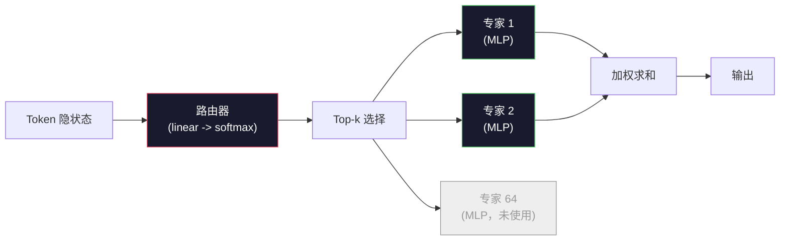

# 开源模型：架构解析

> 你在第 04 课从零实现了 GPT-2 Small。2026 年最前沿的开源模型其实同属一个家族，只做了五六处具体改动。LayerNorm 换成了 RMSNorm。GELU 换成了 SwiGLU。学到位置编码换成了 RoPE。MHA 换成了 GQA 或 MLA。大模型级别用上了 MoE。你已经掌握的数学知识覆盖了其中 95%。本课将 Llama 3、DeepSeek-V3、Mixtral、Qwen 和 Gemma 并列阅读，逐一点出每个架构具体在哪一行发生了分歧。

**类型：** 学习型
**语言：** Python（标准库）
**前置条件：** 阶段 10，第 04、05、12 课（预训练、扩展、推理）
**时间：** 约 45 分钟

## 学习目标

- 阅读 Llama 3、Mistral、Mixtral、Gemma 2、Qwen 2.5 和 DeepSeek-V3 的 config.json 并解释每个字段
- 说出每个模型相较于 GPT-2 Small 做了哪些具体架构改动，并从第一性原理说明理由
- 仅凭 config 就能计算任意开源模型的参数量、KV Cache 大小和激活内存
- 根据延迟、显存和能力约束为部署场景选对合适的开源模型

## 问题

在第 04 课你写了 350 行 numpy，得到一个 GPT-2 形状的模型。Llama 3 405B 的技术报告有 200 页。你的直觉是它们根本不是一回事。但它们是的。200 页描述的是同一个对象加了五六处有充分动机的改动，外加一千条关于扩展的工程细节。骨架——embedding、transformer 块、注意力、MLP、norm、head——没有变。

本课是一份 diff。对于每个主要的开源模型家族，我们列出相较于 GPT-2 具体改了什么、为什么改、改了多少代价。读完之后你能读一份新的模型卡并在脑中把它映射回 GPT-2 基线。

实际好处是：当 Meta 发布 Llama 5 或 DeepSeek 发布 V4 时，你不需要一套新的心智模型。你看一下 config，就能看出哪些众所周知的旋钮被拨动了，从而知道下游的影响是什么。2026 年的架构是一个有限的工具箱。每个新模型选其中不同的子集。

## 概念

### 不变的核心

所有自回归开源模型都共享：

- Token embedding 矩阵（vocab_size x hidden_dim）。
- N 个解码器块的堆叠：norm、self-attention、residual、norm、MLP、residual。
- 最终的 norm 和将隐状态投射回 vocab_size 的线性 head（常与 embeddings 权重绑定）。
- 因果掩码，下一个 token 的交叉熵损失。

这就是形状。其余都是旋钮。

### 真正起作用的六个旋钮

在所有 2024–2026 年最前沿的开源模型中，同样的六个设计选择被反复pick：

1. **归一化。** LayerNorm → RMSNorm。
2. **位置编码。** 学到的绝对位置 → RoPE（加变体：YaRN、NTK）。
3. **激活函数。** GELU → SwiGLU（或 GeGLU）。
4. **注意力头共享。** MHA → GQA → MQA → MLA。
5. **稠密 vs 稀疏 MLP。** 稠密 → 专家混合。
6. **Pre-norm 位置。** Pre-norm 保留。Post-norm 消失了。

其他一切（学习率调度、数据配比、batch size、上下文长度）都在训练 config 里，不在架构里。六个旋钮。

### 旋钮 1：RMSNorm

LayerNorm 减去均值、除以标准差、缩放、平移。RMSNorm 只保留缩放：

```
RMSNorm(x) = x / sqrt(mean(x^2) + eps) * gamma
```

不减均值。无偏置。每个 token 少一次矩阵乘法。Zhang 和 Sennrich（2019）证明它在机器翻译任务上与 LayerNorm 持平，同时快 10%。每一个现代开源模型都在用它。

代价：无。收益：小幅吞吐提升，代码更简单。

### 旋钮 2：RoPE

学到的位置 embedding 在 GPT-2 里是一个 1024 槽的查找表。上下文长度 1025 就超出表尾了。模型无法外推超出训练长度的地方。

旋转位置 embedding（RoPE，Su et al. 2021）通过在注意力点积之前对每对 Q 和 K 向量进行旋转来注入位置。旋转角度是位置的确定性函数，所以没有需要学习的东西，也没有"用完"一说。加上缩放技巧（NTK-aware 插值、YaRN），一个在 8k 上下文上训练的模型在推理时可以扩展到 128k，精度损失很小。

```
q_rotated = rotate(q, angle(pos))
k_rotated = rotate(k, angle(pos))
score = q_rotated . k_rotated
```

每一个 Llama、Mistral、Qwen、DeepSeek 和 Gemma 都用 RoPE。Gemma 2 用的是混合方案（大部分层用 RoPE，部分层用局部滑动窗口注意力）。

### 旋钮 3：SwiGLU

GPT-2 的 MLP 是 `x -> gelu(xW1 + b1) -> (...)W2 + b2`。SwiGLU（Shazeer 2020）用门控乘积替换了激活函数：

```
SwiGLU(x) = (xW1) * sigmoid(xW1) * xV
```

两个投影并行，用 Swish 激活做门控。在相同参数量下实证 perplexity 更低。Llama 2 采用了它，之后所有人都跟进了。MLP 的隐藏维度通常这样设置：使总参数量与原始稠密 MLP 匹配——如果 GPT-2 用 `ff_dim = 4 * hidden`，SwiGLU 就用 `ff_dim = (2/3) * 4 * hidden = 8/3 * hidden`。

### 旋钮 4：注意力头共享

GPT-2 用的是**多头注意力（MHA）**：每个头有自己的 Q、K、V 投影。

**多查询注意力（MQA，Shazeer 2019）** 在所有头之间共享一组 K 和 V。将 KV Cache 削减 num_heads 倍，在典型模型上是 12x 到 32x 的缩减。在难基准上精度略有下降。

**分组查询注意力（GQA，Ainslie et al. 2023）** 是中间方案：G 组 Q 头共享一组 K 和 V。Llama 3 8B 用 GQA，Q 头 32 个，KV 头 8 个（G=8），所以 KV Cache 比完整 MHA 缩小 4 倍。

**多头潜在注意力（MLA，DeepSeek 2024）** 将 K 和 V 压缩到一个共享的低秩潜在向量，再投影回每个头。在保持每头表达能力的同时进一步减少 KV Cache。DeepSeek-V2 和 V3 依靠它实现长上下文性能。

| 方案 | KV 头数 | KV Cache | 精度 |
|------|---------|----------|------|
| MHA  | num_heads | 完整 | 最好 |
| GQA  | num_groups（G < num_heads） | num_heads / G 的缩减 | 接近 MHA |
| MQA  | 1 | num_heads 的缩减 | 小幅下降 |
| MLA  | 潜在向量，每头解压 | 比 MQA 更小 | 接近 MHA |

对于任何 >13B 参数的模型，GQA 或 MLA 实际上是强制的。规模化的完整 MHA 是 KV Cache 灾难。

### 旋钮 5：专家混合

稠密 MLP 每个 token 激活所有参数。MoE MLP 每个块有 K 个专家，加上一个路由器，每个 token 选择 top-k 个专家（通常是 top-2）。只有被选中的专家权重对该 token 做前向传递。

```
router_logits = xW_r
indices, weights = top_k(router_logits, k=2)
output = sum_i weights[i] * expert[indices[i]](x)
```

吸引力在于：你可以有 64 个 7B 大小的专家（总参数量巨大），但每个 token 只跑其中 2 个（所以每个 token 的计算量与一个稠密 7B 模型匹配）。Mixtral 8x7B 总参数 47B，但每个 token 只激活 13B。DeepSeek-V3 总参数 671B，但每个 token 只激活 37B。



优点：相同计算量，更多参数，更强容量。缺点：专家显存仍然需要放在某处（所以服务需要比稠密等效模型更多的 VRAM），路由器的负载均衡很难，对齐时微调路由器本身是一个研究方向。

### 旋钮 6：Pre-norm 保留

原始 transformer 在每个子层之后应用 layer norm。GPT-2 之后的每一个开源模型都把它放在每个子层*之前*。Pre-norm 在深度上严格更容易训练。没什么可争的。

### 各模型逐一对标

下面这张表让一切都变得具体。

| 模型 | 年份 | 总参数量 | 激活参数量 | 归一化 | 激活函数 | 位置编码 | 注意力 | MoE | 上下文 |
|------|------|----------|------------|--------|----------|----------|---------|-----|--------|
| GPT-2 Small | 2019 | 124M | 124M | LayerNorm | GELU | Learned | MHA（12 个头） | 否 | 1k |
| Llama 3 8B | 2024 | 8B | 8B | RMSNorm | SwiGLU | RoPE | GQA（32/8） | 否 | 128k |
| Llama 3 70B | 2024 | 70B | 70B | RMSNorm | SwiGLU | RoPE | GQA（64/8） | 否 | 128k |
| Llama 3 405B | 2024 | 405B | 405B | RMSNorm | SwiGLU | RoPE | GQA（128/16） | 否 | 128k |
| Mistral 7B | 2023 | 7.2B | 7.2B | RMSNorm | SwiGLU | RoPE | GQA | 否 | 32k |
| Mixtral 8x7B | 2023 | 47B | 13B | RMSNorm | SwiGLU | RoPE | GQA | 是（8 专家，top-2） | 32k |
| Gemma 2 9B | 2024 | 9B | 9B | RMSNorm（pre+post） | GeGLU | RoPE + 滑动 | GQA | 否 | 8k |
| Qwen 2.5 72B | 2024 | 72B | 72B | RMSNorm | SwiGLU | RoPE（YaRN） | GQA（64/8） | 否 | 128k |
| DeepSeek V2 236B | 2024 | 236B | 21B | RMSNorm | SwiGLU | RoPE | MLA | 是（160 专家，top-6） | 128k |
| DeepSeek V3 | 2024 | 671B | 37B | RMSNorm | SwiGLU | RoPE | MLA | 是（256 专家，top-8） | 128k |

扫一遍列。RMSNorm 是通用的。SwiGLU 或其近亲 GeGLU 是通用的。RoPE 是通用的。GQA 在 7B 以上是通用的（除非被 MLA 取代）。MoE 是顶端玩家的差异化因素。

### 阅读 config.json

Llama 3 8B 配置：

```
{
  "hidden_size": 4096,
  "intermediate_size": 14336,
  "num_hidden_layers": 32,
  "num_attention_heads": 32,
  "num_key_value_heads": 8,
  "max_position_embeddings": 131072,
  "rope_theta": 500000.0,
  "rms_norm_eps": 1e-5,
  "vocab_size": 128256
}
```

每个字段都对应你已经实现过的东西。

- `hidden_size`：embedding 维度。
- `intermediate_size`：MLP 隐藏维度（3.5x hidden——SwiGLU 的数学）。
- `num_hidden_layers`：堆叠深度。
- `num_attention_heads`：Q 头数。
- `num_key_value_heads`：KV 头数（GQA）。
- `max_position_embeddings`：训练上下文长度。
- `rope_theta`：RoPE 基频。Meta 从默认的 10k 缩放到 500k 以实现长上下文外推。
- `rms_norm_eps`：数值稳定性。
- `vocab_size`：词表大小。

仅凭这些你可以计算总参数、KV Cache 和峰值激活内存。精确公式见 `code/main.py`。

### 激活内存预算

在数十亿参数规模以上，激活主导训练内存。预训练的经验法则（开启梯度检查点）：

```
activation_mem ~ batch_size * seq_len * hidden_size * num_layers * bytes_per_element
```

对于 Llama 3 8B，batch=1，seq=8192，BF16，32 层，hidden=4096：仅激活内存（有检查点）约 8 GB，无检查点 40 GB。这就是 flash-attention 和 ring-attention 重要的原因——它们重写了注意力计算，使激活恰好能放进去。

### KV Cache 预算

在最大上下文下推理：

```
kv_cache = 2 * num_layers * num_kv_heads * head_dim * max_seq_len * bytes_per_element
```

Llama 3 8B，128k 上下文，BF16，head_dim = hidden / num_heads = 128：
`2 * 32 * 8 * 128 * 131072 * 2 = 17.2 GB` 每条序列。

8B 权重在 BF16 下是 16 GB。一条 128k 序列的 KV Cache 比权重还大。这就是推动 GQA、MLA 和 KV Cache 量化的内存压力。

### 各模型何时胜出

- **单卡 80GB，无 MoE**：Llama 3 8B、Mistral 7B、Gemma 2 9B。易部署，工具链完善。
- **单节点（8x80GB），大容量**：Llama 3 70B、Qwen 2.5 72B。最高稠密开源能力。
- **最强开源能力，接受 MoE 复杂度**：DeepSeek V3、Mixtral 8x22B。每激活 FLOP 的能力最强。
- **长上下文需求**：Llama 3（RoPE 缩放支持 128k）、DeepSeek（MLA 优势）。
- **低延迟服务**：Gemma 2 9B（滑动窗口削减长上下文计算）。

## 动手实现

本课代码是一个计算器。给定任意 config.json，它打印各组件的参数量、最大上下文下的 KV Cache、SwiGLU MLP 扩展比，以及对架构的简短评判（稠密 / GQA / MLA / MoE）。

```python
config = {
    "hidden_size": 4096, "intermediate_size": 14336,
    "num_hidden_layers": 32, "num_attention_heads": 32,
    "num_key_value_heads": 8, "vocab_size": 128256,
    "max_position_embeddings": 131072,
}
```

脚本逐字段遍历架构，计算 embedding、注意力（GQA 缩减）、MLP（SwiGLU 扩展）、layernorms 和 head 的参数量。然后在指定上下文长度下计算 KV Cache 并打印摘要。

实现见 `code/main.py`。

## 实际使用

在 Llama 3 8B、Mistral 7B、Mixtral 8x7B 和 DeepSeek V3 配置上运行计算器（脚本中已打包）。比较参数分解。注意 MoE 模型的总参数量远超稠密模型，但激活参数量往往更小。注意 DeepSeek V3 的 KV Cache 比 Llama 3 405B 还小——尽管它的总参数更多——那是 MLA 在起作用。

然后把你本地的任意模型 config 输进去，读摘要，决定它是否符合你的 GPU。

## 交付物

本课产出 `outputs/skill-open-model-picker.md`。给定一个部署目标（GPU 类型、VRAM、上下文长度、延迟预算）和任务画像（聊天、代码、推理、长上下文），它推荐一个开源模型、第 11 课的量化方案和第 12 课的推理栈，并对六个架构旋钮给出显式的推理过程。

## 练习

1. 从 HuggingFace 读取 Qwen 2.5 72B 的 config。从零计算总参数量。与 HF 报告值比较，找出差异来源（头维度取整、KV 共享因子等）。

2. DeepSeek V3 用 256 个专家和 top-8 路由。计算激活专家与总专家的比例，并与 Mixtral 8x7B 的 top-2 of 8 比较。从稀疏（25%）到更密集的稀疏（3%）的转变对每 FLOP 的容量意味着什么？

3. 在 FP8 和 BF16 下计算 Llama 3 405B 在 128k 上下文下的 KV Cache。FP8 下是 BF16 的一半。在单台 8xH100 节点（每卡 80GB = 总共 640GB，去掉权重内存后）上能并行服务多少条序列？

4. Gemma 2 在全注意力和滑动窗口注意力层之间交替。当一半层用 4096 token 的滑动窗口而不是完整上下文时，写出 KV Cache 的数学表达式。在 8k 总上下文下这能节省多少显存？

5. 找一个在本课编写之后发布的最前沿开源模型。识别它选择了哪六个旋钮，是否引入了第七个旋钮。 curriculum 在新架构发布时会立刻感觉过时——目标是更新你的表，而不是重建你的心智模型。

## 关键术语

| 术语 | 大家怎么说的 | 实际含义 |
|------|----------------|------------------------|
| RMSNorm | "不带均值的 LayerNorm" | 只用均方根归一化，外加一个可学习的缩放——比 LayerNorm 更便宜，效果相当 |
| RoPE | "旋转位置" | 以取决于位置的角度对每对 Q 和 K 向量进行 2D 旋转——通过缩放技巧可以外推到训练长度之外 |
| SwiGLU | "新的 MLP 激活" | 带 Swish 的门控线性单元：`(xW1) * sigmoid(xW1) * xV`——每个 2024+ 开源模型的标准配置 |
| GQA | "中间地带的注意力" | 分组查询注意力：G 组 Q 头共享一组 K 和 V 头——在不让 MQA 精度受损的情况下缩减 KV Cache |
| MLA | "DeepSeek 的注意力" | 多头潜在注意力：将 K/V 压缩到共享低秩潜在向量，每头解压——大模型 KV Cache 最小的方案 |
| MoE | "稀疏专家" | 专家混合：每个块有 N 个 MLP，路由器每个 token 选 top-k——总参数量巨大，激活参数量小 |
| Top-k 路由 | "每个 token 选 k 个专家" | 路由器给每个专家算一个分数，激活最高的 k 个——典型 k 从 2（Mixtral）到 8（DeepSeek） |
| YaRN | "拉伸 RoPE" | 又一个 RoPE 扩展——在推理时将旋转角度插值，使上下文从 8k 扩展到 128k+ |
| 滑动窗口注意力 | "不必attend到所有地方" | 每个 token 只attend到最近 W 个 token——将每 token 注意力代价上限设为 O(W)，用于 Gemma 2 和早期 Mistral |
| 激活参数量 | "每个 token 跑什么" | 对于 MoE 模型，每个 token 前向传递所见的参数量（远小于总参数）——控制每 token FLOPs |

## 延伸阅读

- [Dubey et al., 2024 -- "The Llama 3 Herd of Models"](https://arxiv.org/abs/2407.21783) -- 稠密 Llama 3 家族的架构和训练参考
- [DeepSeek-AI, 2024 -- "DeepSeek-V3 Technical Report"](https://arxiv.org/abs/2412.19437) -- MLA 加上无辅助损失的负载均衡加 671B MoE
- [Jiang et al., 2024 -- "Mixtral of Experts"](https://arxiv.org/abs/2401.04088) -- 经典的 MoE 开源模型论文
- [Su et al., 2021 -- "RoFormer: Enhanced Transformer with Rotary Position Embedding"](https://arxiv.org/abs/2104.09864) -- RoPE 论文
- [Shazeer, 2020 -- "GLU Variants Improve Transformer"](https://arxiv.org/abs/2002.05202) -- SwiGLU、GeGLU 及其相关工作
- [Ainslie et al., 2023 -- "GQA: Training Generalized Multi-Query Transformer Models"](https://arxiv.org/abs/2305.13245) -- GQA 论文
- [Gemma 2 Team, 2024 -- "Gemma 2: Improving Open Language Models at a Practical Size"](https://arxiv.org/abs/2408.00118) -- 混合全注意力和滑动注意力、pre+post-norm
- [Qwen Team, 2024 -- "Qwen 2.5 Technical Report"](https://arxiv.org/abs/2412.15115) -- YaRN 上下文扩展和长上下文训练配方