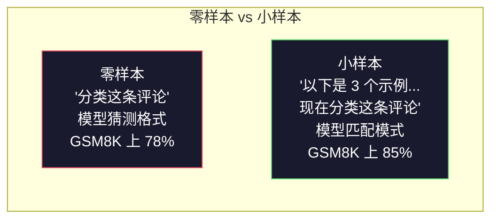
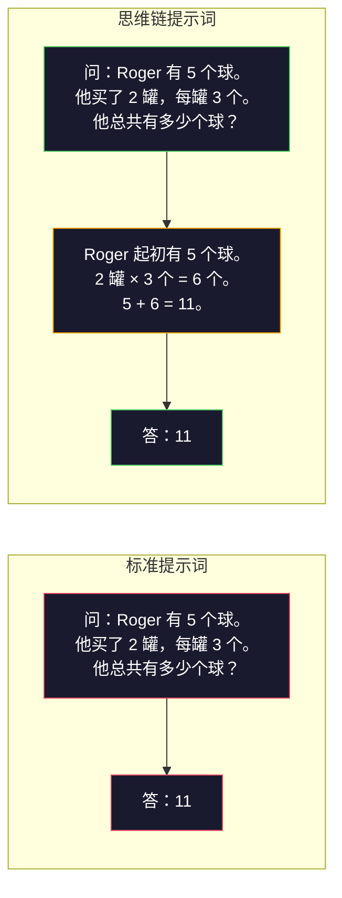
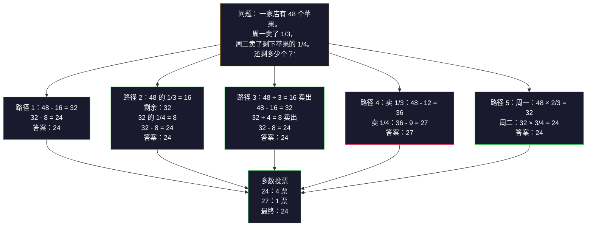
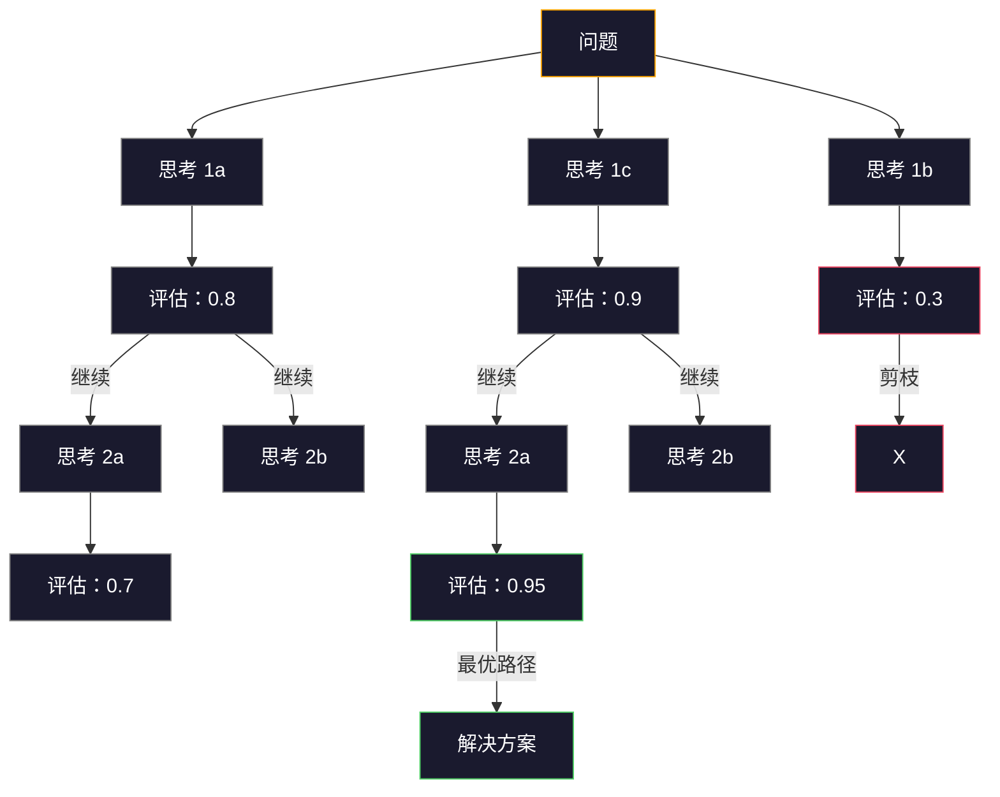

# 小样本、思维链、思维树

> 告诉模型该做什么是提示词（prompting）。教它该怎么思考才是工程（engineering）。同一模型、同一任务、同一数据，从 78% 到 91% 的准确率差距，不是更好的模型，而是更好的推理策略。

**类型：** 构建型
**语言：** Python
**前置条件：** 第 11.01 课（提示词工程）
**时间：** 约 45 分钟

## 学习目标

- 通过选取并格式化示例演示来优化任务准确率，实现小样本提示词
- 应用思维链（CoT）推理提升多步骤问题（如数学应用题）的准确率
- 构建思维树提示词，探索多条推理路径并选择最优解
- 在标准基准上测量零样本 vs 小样本 vs 思维链的准确率提升

## 问题

你做了一个数学辅导应用。你的提示词是："解这道应用题。"在同一模型、同一温度、同一 API 成本下，GPT-5 在 GSM8K（标准小学数学基准）上的准确率是 94%。你以为已经触及天花板了——不，思维链还能再提升 3-4 分。

只需加五个词——"让我们一步一步思考"——准确率就跃升到 91%。再加上几个完整示例，就能达到 95%。同一个模型，同一个温度，同等的 API 费用。唯一的区别是你给模型递了一张草稿纸。

这不是什么黑科技。这就是推理的工作原理。人类不会在一次思维跳跃中解决多步骤问题。Transformer 也不会。当你迫使模型生成中间 token 时，这些 token 就成为了下一个 token 的上下文。每个推理步骤都喂给下一步。模型实际上是在一步步计算出答案。

但"一步一步思考"只是起点，不是终点。如果你采样五条推理路径并取多数投票呢？如果你让模型探索一棵可能性树，评估并剪枝分支呢？如果你将推理与工具调用交织呢？这些都不是假设。它们是有实测改进的已发表技术，你将在本课中构建所有这些。

## 概念

### 零样本 vs 小样本：示例何时优于指令

零样本提示词只给模型一个任务，不给其他东西。小样本提示词则先给出示例。

Wei 等人（2022）在 8 个基准上测量了这一点。对于简单任务（如情感分类），零样本和小样本的性能相差在 2% 以内。对于复杂任务（如多步骤算术和符号推理），小样本将准确率提升了 10-25%。

直觉是：示例是压缩后的指令。不描述输出格式，而是直接展示。不解释推理过程，而是亲身示范。模型对示例的模式匹配比它对抽象指令的解释可靠得多。



**小样本胜出时：** 格式敏感型任务、分类、结构化提取、领域特定术语，或任何模型需要匹配特定模式的场景。

**零样本胜出时：** 简单的事实问题、示例会限制创造力的创造性任务、找到好示例比写好指令更困难的任务。

### 示例选择：相似优于随机

不是所有示例都相等。选择与目标输入相似的示例，在分类任务上比随机选择优 5-15%（Liu 等，2022）。三条原则：

1. **语义相似性**：选取 embedding 空间中与输入最接近的示例
2. **标签多样性**：示例中覆盖所有输出类别
3. **难度匹配**：与目标问题的复杂程度相匹配

大多数任务的最佳示例数量是 3-5 个。少于 3 个，模型没有足够信号来提取模式。超过 5 个，收益递减，并浪费上下文窗口 token。对于多标签分类，每个标签用一个示例。

### 思维链：给模型递草稿纸

思维链（CoT）提示词由谷歌大脑的 Wei 等人（2022）提出。理念很简单：不要只要求模型给出答案，而是先让它展示推理步骤。



为什么这在机制上有效？Transformer 生成的每个 token 都成为下一个 token 的上下文。没有 CoT，模型必须在单次前向传播的隐藏状态中压缩所有推理。有了 CoT，模型将中间计算外化为 token。每个推理 token 都延伸了有效的计算深度。

**GSM8K 基准（小学数学，8500 道题）：**

| 模型 | 零样本 | 零样本 CoT | 小样本 CoT |
|-------|-----------|---------------|--------------|
| GPT-4o | 78% | 91% | 95% |
| GPT-5 | 94% | 97% | 98% |
| o4-mini（推理模型） | 97% | — | — |
| Claude Opus 4.7 | 93% | 97% | 98% |
| Gemini 3 Pro | 92% | 96% | 98% |
| Llama 4 70B | 80% | 89% | 94% |
| DeepSeek-V3.1 | 89% | 94% | 96% |

**关于推理模型的说明。** 像 OpenAI 的 o 系列（o3、o4-mini）和 DeepSeek-R1 这样的模型在输出答案之前已经在内部运行思维链。在推理模型上添加"Let's think step by step"是多余的，有时甚至适得其反——它们已经做过了。

CoT 有两种形式：

**零样本 CoT**：在提示词末尾附加"让我们一步一步思考"。不需要示例。Kojima 等人（2022）证明这一句话就能在算术、常识和符号推理任务上提升准确率。

**小样本 CoT**：提供包含推理步骤的示例。比零样本 CoT 更有效，因为模型能看到你所期望的确切推理格式。

**CoT 有害的情况**：简单的事实回忆（"法国的首都是什么？"）、单步分类、速度比准确率更重要的任务。CoT 每次查询增加 50-200 个 token 的推理开销。对于高吞吐量、低复杂度的任务，这是浪费的成本。

### 自洽性：多次采样，一次投票

Wang 等人（2023）引入了自洽性。洞察：单条思维链路径可能包含推理错误。但如果你用温度 > 0 采样 N 条独立的推理路径，并对最终答案取多数投票，错误就会相互抵消。



在原始 PaLM 540B 实验中，自洽性将 GSM8K 准确率从 56.5%（单条思维链）提升到 74.4%（N=40）。在 GPT-5 上提升很小（97% 到 98%），因为基础准确率已经饱和。这项技术最适用于基础思维链准确率在 60-85% 的模型——这是单路径错误频繁但非系统性的最佳区间。对于推理模型（o 系列、R1），自洽性已被内置的内部采样所取代。

权衡：N 次采样意味着 N 倍的 API 成本和延迟。实际上，N=5 就能捕获大部分收益。N=3 是有意义的投票所需的最少次数。N > 10 对大多数任务来说收益递减。

### 思维树：分支探索

Yao 等人（2023）提出了思维树（ToT）。思维链遵循一条线性推理路径，而思维树则探索多个分支，并在继续之前评估哪些最有希望。



思维树有三个组成部分：

1. **思考生成**：产生多个候选的下一步
2. **状态评估**：对每个候选方案打分（可以用 LLM 本身作为评估器）
3. **搜索算法**：通过树的 BFS 或 DFS，剪枝低评分分支

在"24 点"任务（用四个数字通过算术运算凑成 24）上，GPT-4 标准提示词解决了 7.3% 的问题。加上思维链是 4.0%（思维链在这里反而帮倒忙，因为搜索空间很宽）。加上思维树，是 74%。

思维树很贵。树中每个节点都需要一次 LLM 调用。分支因子为 3、深度为 3 的树最多需要 39 次 LLM 调用。只在搜索空间大但可评估的问题上使用——规划、谜题解决、有约束的创造性问题解决。

### ReAct：思考 + 行动

Yao 等人（2022）将推理轨迹与动作相结合。模型在思考（生成推理）和行动（调用工具、搜索、计算）之间交替。


ReAct 在知识密集型任务上优于纯思维链，因为它能够将其推理基于真实数据。在 HotpotQA（多跳问答）上，ReAct + GPT-4 达到 35.1% 的精确匹配，而纯思维链只有 29.4%。真正的力量在于推理错误会被观察纠正——模型可以在执行过程中更新其计划。

ReAct 是现代 AI 智能体（agent）的基础。每个智能体框架（LangChain、CrewAI、AutoGen）都实现了某种形式的"思考-行动-观察"循环。你将在第 14 阶段构建完整的智能体。本课涵盖的是提示词模式。

### 结构化提示词：XML 标签、分隔符、标题

随着提示词变得复杂，结构化可以防止模型混淆各个部分。三种方法：

**XML 标签**（最适合 Claude，其他模型也很好用）：
```
<context>
你正在审查一个拉取请求。
代码库使用 TypeScript 和 React。
</context>

<task>
审查以下差异，查找错误、安全问题和样式违规。
</task>

<diff>
{diff_content}
</diff>

<output_format>
列出每个问题：文件、行号、严重程度（critical/warning/info）、描述。
</output_format>
```

**Markdown 标题**（通用）：
```
## 角色
金融科技公司的高级安全工程师。

## 任务
分析此 API 端点的漏洞。

## 输入
{api_code}

## 规则
- 关注 OWASP Top 10
- 评估每个发现：critical、high、medium、low
- 包含修复步骤
```

**分隔符**（简洁但有效）：
```
---INPUT---
{user_text}
---END INPUT---

---INSTRUCTIONS---
用 3 个要点总结上述内容。
---END INSTRUCTIONS---
```

### 提示词链：顺序分解

有些任务对单个提示词来说太复杂。提示词链将它们分解成步骤，每个提示词的输出成为下一个的输入。


提示词链在三个方面优于单提示词：

1. **每个步骤更简单**：模型处理一个专注的任务，而不是同时兼顾一切
2. **中间输出可检查**：你可以在步骤之间验证和纠正
3. **不同步骤可以使用不同模型**：用便宜的模型做提取，用贵的模型做推理

### 性能对比

| 技术 | 最适合场景 | GSM8K 准确率（GPT-5） | API 调用次数 | Token 开销 | 复杂度 |
|-----------|----------|------------------------|-----------|----------------|------------|
| 零样本 | 简单任务 | 94% | 1 | 无 | 极简 |
| 小样本 | 格式匹配 | 96% | 1 | 200-500 token | 低 |
| 零样本 CoT | 快速推理提升 | 97% | 1 | 50-200 token | 极简 |
| 小样本 CoT | 单次调用最大准确率 | 98% | 1 | 300-600 token | 低 |
| 自洽性（N=5） | 高风险推理 | 98.5% | 5 | 5 倍 token 成本 | 中 |
| 推理模型（o4-mini） | 无缝替代 CoT | 97% | 1 | 隐藏（内部 2-10 倍） | 极简 |
| 思维树 | 搜索/规划问题 | N/A（24 点上 74%） | 10-40+ | 10-40 倍 token 成本 | 高 |
| ReAct | 知识锚定推理 | N/A（HotpotQA 上 35.1%） | 3-10+ | 可变 | 高 |
| 提示词链 | 复杂多步骤任务 | 96%（流水线） | 2-5 | 2-5 倍 token 成本 | 中 |

正确的技术取决于三个因素：准确率要求、延迟预算和成本容忍度。对于大多数生产系统，带有 3 次采样自洽性回退的小样本 CoT 覆盖了 90% 的用例。

## 动手构建

我们将构建一个将小样本提示词、思维链推理和自洽性投票组合成单一流水线的数学问题求解器。然后为难题添加思维树。

完整实现在 `code/advanced_prompting.py` 中。以下是关键组件。

### 第 1 步：小样本示例库

第一个组件管理小样本示例，并为给定问题选择最相关的示例。

```python
GSM8K_EXAMPLES = [
    {
        "question": "Janet 的鸭子每天下 16 个蛋。她每天早餐吃 3 个，并为朋友烤松糕用掉 4 个。她在农贸市场以每个 2 美元的价格出售剩下的鸡蛋。她每天在农贸市场赚多少钱？",
        "reasoning": "Janet 的鸭子每天下 16 个蛋。她吃 3 个，烤松糕用 4 个，共用掉 3 + 4 = 7 个。所以她还剩 16 - 7 = 9 个蛋。她以每个 2 美元出售，所以她每天赚 9 × 2 = 18 美元。",
        "answer": "18"
    },
    ...
]
```

每个示例包含三部分：问题、推理链和最终答案。推理链是将普通小样本示例转化为思维链小样本示例的关键。

### 第 2 步：思维链提示词构建器

提示词构建器将系统消息、带推理链的小样本示例和目标问题组合成单个提示词。

```python
def build_cot_prompt(question, examples, num_examples=3):
    system = (
        "你是一个数学问题求解器。"
        "对于每个问题，先展示你的分步推理，"
        "然后在最后一行以格式'The answer is [number]'给出最终数值答案。"
    )

    example_text = ""
    for ex in examples[:num_examples]:
        example_text += f"问：{ex['question']}\n"
        example_text += f"答：{ex['reasoning']} The answer is {ex['answer']}.\n\n"

    user = f"{example_text}问：{question}\n答："
    return system, user
```

格式约束（"The answer is [number]"）至关重要。没有它，自洽性就无法跨采样提取和比较答案。

### 第 3 步：自洽性投票

采样 N 条推理路径，取多数答案。

```python
def self_consistency_solve(question, examples, client, model, n_samples=5):
    system, user = build_cot_prompt(question, examples)

    answers = []
    reasonings = []
    for _ in range(n_samples):
        response = client.chat.completions.create(
            model=model,
            messages=[
                {"role": "system", "content": system},
                {"role": "user", "content": user}
            ],
            temperature=0.7
        )
        text = response.choices[0].message.content
        reasonings.append(text)
        answer = extract_answer(text)
        if answer is not None:
            answers.append(answer)

    vote_counts = Counter(answers)
    best_answer = vote_counts.most_common(1)[0][0] if vote_counts else None
    confidence = vote_counts[best_answer] / len(answers) if best_answer else 0

    return best_answer, confidence, reasonings, vote_counts
```

温度 0.7 很重要。在温度 0.0 下，所有 N 次采样都相同，就失去了意义。你需要足够的随机性来产生多样化的推理路径，但又不能太多，否则模型会产生乱码。

### 第 4 步：思维树求解器

对于线性推理失败的难题，ToT 探索多种方法并评估哪个方向最有希望。

```python
def tree_of_thought_solve(question, client, model, breadth=3, depth=3):
    thoughts = generate_initial_thoughts(question, client, model, breadth)
    scored = [(t, evaluate_thought(t, question, client, model)) for t in thoughts]
    scored.sort(key=lambda x: x[1], reverse=True)

    for current_depth in range(1, depth):
        next_thoughts = []
        for thought, score in scored[:2]:
            extensions = extend_thought(thought, question, client, model, breadth)
            for ext in extensions:
                ext_score = evaluate_thought(ext, question, client, model)
                next_thoughts.append((ext, ext_score))
        scored = sorted(next_thoughts, key=lambda x: x[1], reverse=True)

    best_thought = scored[0][0] if scored else ""
    return extract_answer(best_thought), best_thought
```

评估器本身就是一次 LLM 调用。你问模型："从 0.0 到 1.0，这个推理路径对于解决这个问题有多大希望？"这就是 ToT 的关键洞察——模型评估自己的部分解。

### 第 5 步：完整流水线

流水线将所有技术结合在一起，并带有升级策略。

```python
def solve_with_escalation(question, examples, client, model):
    system, user = build_cot_prompt(question, examples)
    single_response = call_llm(client, model, system, user, temperature=0.0)
    single_answer = extract_answer(single_response)

    sc_answer, confidence, _, _ = self_consistency_solve(
        question, examples, client, model, n_samples=5
    )

    if confidence >= 0.8:
        return sc_answer, "self_consistency", confidence

    tot_answer, _ = tree_of_thought_solve(question, client, model)
    return tot_answer, "tree_of_thought", None
```

升级逻辑：先尝试廉价的（单次思维链）。如果自洽性置信度低于 0.8（5 次采样中少于 4 次一致），升级到思维树。这在成本和准确率之间取得平衡——大多数问题被廉价解决，难题获得更多计算资源。

## 使用方式

### 使用 LangChain

LangChain 为提示词模板和输出解析提供内置支持，简化了小样本和思维链模式：

```python
from langchain_core.prompts import FewShotPromptTemplate, PromptTemplate
from langchain_openai import ChatOpenAI

example_prompt = PromptTemplate(
    input_variables=["question", "reasoning", "answer"],
    template="问：{question}\n答：{reasoning} The answer is {answer}."
)

few_shot_prompt = FewShotPromptTemplate(
    examples=examples,
    example_prompt=example_prompt,
    suffix="问：{input}\n答：让我们一步一步思考。",
    input_variables=["input"]
)

llm = ChatOpenAI(model="gpt-4o", temperature=0.7)
chain = few_shot_prompt | llm
result = chain.invoke({"input": "如果一列火车以 120 km/h 行驶 2 小时..."})
```

LangChain 也有 `ExampleSelector` 类用于语义相似性选择：

```python
from langchain_core.example_selectors import SemanticSimilarityExampleSelector
from langchain_openai import OpenAIEmbeddings

selector = SemanticSimilarityExampleSelector.from_examples(
    examples,
    OpenAIEmbeddings(),
    k=3
)
```

### 使用 DSPy

DSPy 将提示词策略视为可优化的模块。你定义一个签名，让 DSPy 优化提示词，而不是手工制作思维链提示词：

```python
import dspy

dspy.configure(lm=dspy.LM("openai/gpt-4o", temperature=0.7))

class MathSolver(dspy.Module):
    def __init__(self):
        self.solve = dspy.ChainOfThought("question -> answer")

    def forward(self, question):
        return self.solve(question=question)

solver = MathSolver()
result = solver(question="Janet 的鸭子每天下 16 个蛋...")
```

DSPy 的 `ChainOfThought` 自动添加推理轨迹。`dspy.majority` 实现了自洽性：

```python
result = dspy.majority(
    [solver(question=q) for _ in range(5)],
    field="answer"
)
```

### 对比：从零实现 vs 框架

| 功能 | 从零实现（本课） | LangChain | DSPy |
|---------|--------------------------|-----------|------|
| 对提示词格式的控制 | 完全掌控 | 基于模板 | 自动 |
| 自洽性 | 手动投票 | 手动 | 内置（`dspy.majority`） |
| 示例选择 | 自定义逻辑 | `ExampleSelector` | `dspy.BootstrapFewShot` |
| 思维树 | 自定义树搜索 | 社区链 | 非内置 |
| 提示词优化 | 手动迭代 | 手动 | 自动编译 |
| 最适合 | 学习、自定义流水线 | 标准工作流 | 研究、优化 |

## 交付物

本课产生两个产物。

**1. 推理链提示词**（`outputs/prompt-reasoning-chain.md`）：可用于生产的小样本 CoT 加自洽性提示词模板。插入你的示例和问题领域即可使用。

**2. CoT 模式选择技能**（`outputs/skill-cot-patterns.md`）：根据任务类型、准确率要求和成本约束选择正确推理技术的决策框架。

## 练习

1. **测量差距**：取 10 道 GSM8K 问题。分别用零样本、小样本、零样本 CoT 和小样本 CoT 解答。记录每种技术的准确率。哪种技术给你的模型带来最大提升？

2. **示例选择实验**：对同样的 10 道问题，比较随机示例选择与手动挑选相似示例。测量准确率差异。示例质量在什么时候比示例数量更重要？

3. **自洽性成本曲线**：在 20 道 GSM8K 问题上运行 N=1、3、5、7、10 的自洽性。绘制准确率 vs 成本（总 token 数）的曲线。对于你的模型，曲线拐点在哪里？

4. **构建 ReAct 循环**：用计算器工具扩展流水线。当模型生成数学表达式时，用 Python 的 `eval()`（在沙箱中）执行它，并将结果反馈回去。测量工具锚定的推理是否优于纯 CoT。

5. **ToT 用于创意任务**：为创意写作任务改编思维树求解器："写一个既有趣又悲伤的 6 词故事。"用 LLM 作为评估器。分支探索是否比单次生成产生更好的创意输出？

## 关键术语

| 术语 | 大家怎么说 | 实际含义 |
|------|----------------|----------------------|
| 小样本提示词 | "给它一些示例" | 在提示词中包含输入-输出演示，以锚定模型的输出格式和行为 |
| 思维链 | "让它一步一步思考" | 引出中间推理 token，在产生最终答案之前延伸模型的有效计算 |
| 自洽性 | "多次运行" | 在温度 > 0 时采样 N 条多样化推理路径，通过多数投票选择最常见的最终答案 |
| 思维树 | "让它探索选项" | 在推理分支上进行结构化搜索，其中每个部分解都被评估，只有有希望的路径被扩展 |
| ReAct | "思考 + 工具使用" | 在"思考-行动-观察"循环中将推理轨迹与外部动作（搜索、计算、API 调用）交织 |
| 提示词链 | "将其分解为步骤" | 将复杂任务分解为顺序提示词，每个输出作为下一个输入 |
| 零样本 CoT | "只需加上'一步一步思考'" | 在提示词后附加推理触发短语，不使用任何示例，依赖模型的潜在推理能力 |

## 延伸阅读

- [Chain-of-Thought Prompting Elicits Reasoning in Large Language Models](https://arxiv.org/abs/2201.11903) —— Wei 等人 2022。谷歌大脑的原始 CoT 论文。阅读第 2-3 节了解核心结果。
- [Self-Consistency Improves Chain of Thought Reasoning in Language Models](https://arxiv.org/abs/2203.11171) —— Wang 等人 2023。自洽性论文。表 1 有你需要的所有数据。
- [Tree of Thoughts: Deliberate Problem Solving with Large Language Models](https://arxiv.org/abs/2305.10601) —— Yao 等人 2023。ToT 论文。第 4 节中的 24 点结果是亮点。
- [ReAct: Synergizing Reasoning and Acting in Language Models](https://arxiv.org/abs/2210.03629) —— Yao 等人 2022。现代 AI 智能体的基础。第 3 节解释了"思考-行动-观察"循环。
- [Large Language Models are Zero-Shot Reasoners](https://arxiv.org/abs/2205.11916) —— Kojima 等人 2022。"让我们一步一步思考"论文。就其简单程度而言，效果出奇地好。
- [DSPy: Compiling Declarative Language Model Calls into Self-Improving Pipelines](https://arxiv.org/abs/2310.03714) —— Khattab 等人 2023。将提示词视为编译问题。如果你想超越手动提示词工程，请阅读。
- [OpenAI —— 推理模型指南](https://platform.openai.com/docs/guides/reasoning) —— 供应商指南，说明思维链何时成为内部的、按 token 计费的"推理"模式，何时是提示词级别的技巧。
- [Lightman 等人，"Let's Verify Step by Step"（2023）](https://arxiv.org/abs/2305.20050) —— 过程奖励模型（PRM），对链的每一步进行评分；推理监督信号优于仅结果奖励。
- [Snell 等人，"Scaling LLM Test-Time Compute Optimally"（2024）](https://arxiv.org/abs/2408.03314) —— CoT 长度、自洽性采样和 MCTS 的系统研究；当准确率比延迟更重要时，"一步一步思考"走向何方。