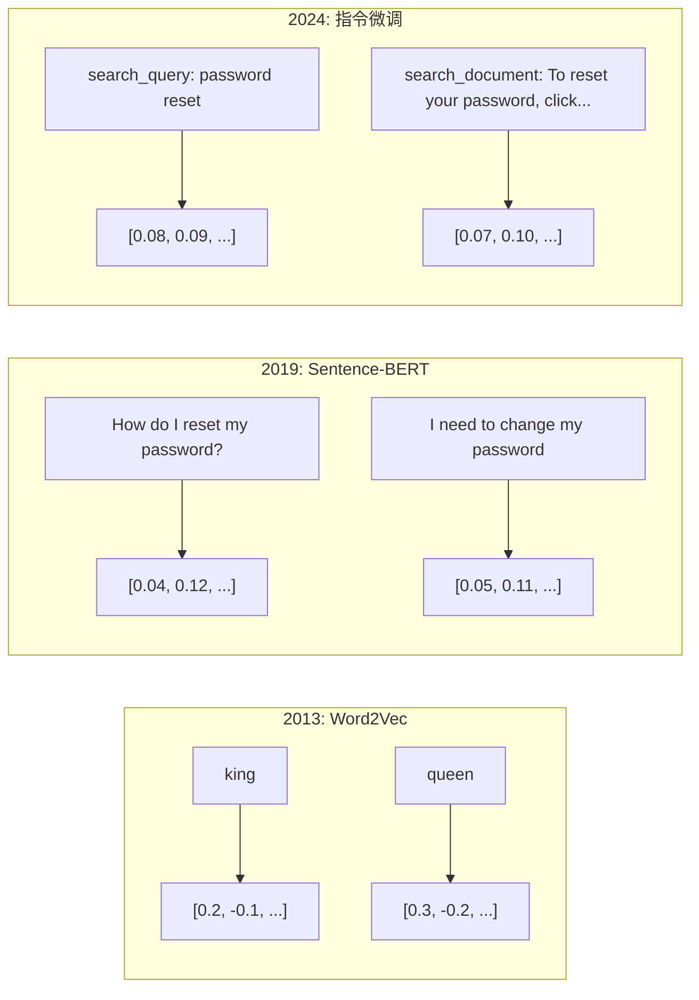
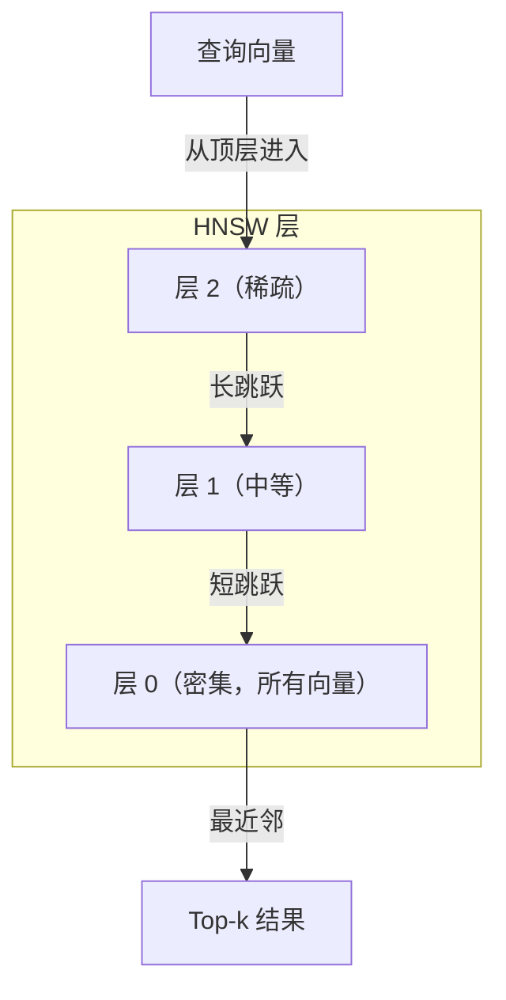

# Embeddings 与向量表示

> 文本是离散的。数学是连续的。每当你让 LLM 查找"相似"文档、比较语义、或进行超越关键词的搜索时，你依赖的是这两个世界之间的桥梁——那就是 embedding。如果你不懂 embedding，你就不懂现代 AI。你只是在使用它。

**类型：** 构建型
**语言：** Python
**前置条件：** 阶段 11，第 01 课（Prompt Engineering）
**时间：** 约 75 分钟
**相关：** 阶段 5 · 22（Embedding 模型深度解读）涵盖了 dense vs sparse vs multi-vector、Matryoshka 截断，以及按 axis 的模型选择。本课聚焦生产流水线（向量数据库、HNSW、相似度计算）。选模型前先读阶段 5 · 22。

## 学习目标

- 使用 API 提供商和开源模型生成文本 embedding，并计算它们之间的余弦相似度
- 解释为什么 embedding 能解决关键词搜索无法处理的词汇失配问题
- 构建一个按语义（而非精确关键词匹配）检索文档的语义搜索索引
- 使用检索基准（Precision@k、Recall）评估 embedding 质量，并为任务选择合适的 embedding 模型

## 问题

你有 10,000 条客服工单。一位客户写道"我的付款没有通过"。你需要找到相似的历史工单。关键词搜索会找到包含"payment"和"didn't go through"的工单。但它会错过"transaction failed"、"charge was declined"和"billing error"。这些工单用完全不同的词语描述了完全相同的问题。

这就是词汇失配问题。人类语言对同一件事有数十种表达方式。关键词搜索把每个词当作一个独立符号，没有含义。它无法知道"declined"和"didn't go through"指的是同一个概念。

你需要一个文本表示，其中含义而非拼写决定了相似性。你需要一种方法，让"my payment didn't go through"和"transaction was declined"在某个数学空间中靠得很近，而把"my payment arrived on time"推得远远的——尽管它们共享"payment"这个词。

这种表示就是 embedding。

## 概念

### 什么是 Embedding？

Embedding 是一个密集的浮点数向量，用来表示文本的含义。"密集"这个词很重要——每个维度都携带信息，不像稀疏表示（词袋、TF-IDF）那样大多数维度为零。

"The cat sat on the mat" 变成类似 `[0.023, -0.041, 0.087, ..., 0.012]` 的东西——一个 768 到 3072 个数字的列表，取决于模型。这些数字编码了含义。你从不直接查看它们。你只比较它们。

### Word2Vec 的突破

2013 年，Google 的 Tomas Mikolov 和同事发表了 Word2Vec。核心洞察：训练一个神经网络根据邻居预测一个词（或根据一个词预测邻居），隐藏层的权重就变成了有意义的向量表示。

著名的结果：

```
king - man + woman = queen
```

词 embedding 上的向量运算捕获了语义关系。"man"到"woman"的方向与"king"到"queen"的方向大致相同。这一刻学界意识到，几何可以编码语义。

Word2Vec 生成 300 维向量。每个词一个向量，不管上下文。"river bank"中的"Bank"和"bank account"中的"Bank" embedding 相同。这个局限推动了接下来十年的研究。

### 从词到句子

词 embedding 表示单个 token。生产系统需要 embedding 整个句子、段落或文档。出现了四种方法：

**平均法**：取句子中所有词向量的均值。便宜、有损、短期文本效果出奇地好。完全丢失词序——"dog bites man"和"man bites dog"得到相同的 embedding。

**CLS token**：Transformer 模型（BERT，2018 年）输出一个特殊的 [CLS] token embedding，表示整个输入。比平均法更好，但 [CLS] token 是为下一个句子预测训练的，不是为相似度训练的。

**对比学习**：明确训练模型把相似的配对拉近，不相似的推远。Sentence-BERT（Reimers & Gurevych，2019）用了这种方法，成为现代 embedding 模型的基础。对于"How do I reset my password?"和"I need to change my password"，模型学到它们应该有几乎相同的向量。

**指令微调的 embedding**：最新方法。E5 和 GTE 等模型接受任务前缀（"search_query:"、"search_document:"）来告诉模型生成什么类型的 embedding。这让一个模型可以服务多个任务。



### 现代 Embedding 模型

市场已经收敛到少数几个生产级选项（2026 年初的 MTEB 分数，MTEB v2）：

| 模型 | 提供商 | 维度 | MTEB | 上下文 | 成本 / 100 万 token |
|-------|----------|-----------|------|---------|------------------|
| Gemini Embedding 2 | Google | 3072（Matryoshka） | 67.7（检索） | 8192 | $0.15 |
| embed-v4 | Cohere | 1024（Matryoshka） | 65.2 | 128K | $0.12 |
| voyage-4 | Voyage AI | 1024/2048（Matryoshka） | 66.8 | 32K | $0.12 |
| text-embedding-3-large | OpenAI | 3072（Matryoshka） | 64.6 | 8192 | $0.13 |
| text-embedding-3-small | OpenAI | 1536（Matryoshka） | 62.3 | 8192 | $0.02 |
| BGE-M3 | BAAI | 1024（dense+sparse+ColBERT） | 63.0 多语言 | 8192 | 开源权重 |
| Qwen3-Embedding | Alibaba | 4096（Matryoshka） | 66.9 | 32K | 开源权重 |
| Nomic-embed-v2 | Nomic | 768（Matryoshka） | 63.1 | 8192 | 开源权重 |

MTEB（大规模文本 Embedding 基准）v2 覆盖 100+ 任务，涵盖检索、分类、聚类、重排序和摘要。越高越好。到 2026 年，开源权重模型（Qwen3-Embedding、BGE-M3）在大多数维度上匹配或超越闭源托管模型。Gemini Embedding 2 领跑纯检索；Voyage/Cohere 领跑特定领域（金融、法律、代码）。承诺之前务必用自己的查询做基准测试。

### 相似度指标

给定两个 embedding 向量，有三种方法衡量它们的相似程度：

**余弦相似度**：两个向量夹角的余弦。范围从 -1（相反）到 1（相同方向）。忽略大小——一个 10 词的句子和一个 500 词的文档如果方向相同可以得到 1.0。这是 90% 用例的默认选择。

```
cosine_sim(a, b) = dot(a, b) / (||a|| * ||b||)
```

**点积**：两个向量的原始内积。当向量被归一化（单位长度）时，与余弦相似度相同。计算更快。OpenAI 的 embedding 是归一化的，所以点积和余弦给出相同的排序。

```
dot(a, b) = sum(a_i * b_i)
```

**欧氏（L2）距离**：向量空间中的直线距离。越小越相似。对大小差异敏感。当绝对位置重要而不仅仅是方向时使用。

```
L2(a, b) = sqrt(sum((a_i - b_i)^2))
```

何时使用哪种：

| 指标 | 适用于 | 避免用于 |
|--------|----------|------------|
| 余弦相似度 | 比较不同长度的文本；大多数检索任务 | 大小携带信息 |
| 点积 | Embedding 已经归一化；追求最大速度 | 向量大小不一致 |
| 欧氏距离 | 聚类；空间最近邻问题 | 比较长度差异很大的文档 |

### 向量数据库与 HNSW

暴力相似度搜索将查询与每个存储的向量进行比较。在 100 万个向量、1536 维的情况下，每次查询需要 15 亿次乘加运算。太慢了。

向量数据库用近似最近邻（ANN）算法解决这个问题。主导算法是 HNSW（分层可导航小世界）：

1. 构建向量的多层图
2. 顶层稀疏——远距离簇之间的长程连接
3. 底层密集——相邻向量之间的细粒度连接
4. 搜索从顶层开始，贪心地向下细化
5. 用 O(log n) 时间返回近似 top-k 结果，而不是 O(n)

HNSW 以少量精度损失（通常 95-99% 召回率）换取大规模提速。在 1000 万个向量上，暴力搜索需要秒级。HNSW 需要毫秒级。



生产选项：

| 数据库 | 类型 | 最适合 | 最大规模 |
|----------|------|----------|-----------|
| Pinecone | 托管 SaaS | 零运维生产 | 十亿级 |
| Weaviate | 开源 | 自托管，混合搜索 | 1 亿+ |
| Qdrant | 开源 | 高性能，带过滤 | 1 亿+ |
| ChromaDB | 嵌入式 | 原型设计，本地开发 | 100 万 |
| pgvector | Postgres 扩展 | 已在用 Postgres | 1000 万 |
| FAISS | 库 | 进程内，研究 | 10 亿+ |

### 分块策略

文档太长了，无法作为单个向量 embedding。一份 50 页的 PDF 涵盖十几个主题——它的 embedding 成为所有内容的平均，类似于什么都没有。你把文档分割成块，然后对每个块进行 embedding。

**固定大小分块**：每 N 个 token 分割一次，M token 重叠。简单且可预测。当文档没有清晰结构时效果很好。512 token 块、50 token 重叠：块 1 是 token 0-511，块 2 是 token 462-973。

**基于句子的分块**：在句子边界分割，将句子分组直到达到 token 限制。每个块至少是一个完整句子。比固定大小更好，因为你永远不会把一个想法切成两半。

**递归分块**：首先尝试在最大的边界分割（章节标题）。如果仍然太大，尝试段落边界。然后句子边界。然后字符限制。这是 LangChain 的 `RecursiveCharacterTextSplitter`，对混合格式语料库效果很好。

**语义分块**：对每个句子进行 embedding，然后将连续句子中 embedding 相似的分组。当 embedding 相似度低于阈值时，开始一个新块。昂贵（需要单独 embedding 每个句子）但产生最连贯的块。

| 策略 | 复杂度 | 质量 | 最适合 |
|----------|-----------|---------|----------|
| 固定大小 | 低 | 一般 | 非结构化文本、日志 |
| 基于句子 | 低 | 良好 | 文章、邮件 |
| 递归 | 中等 | 良好 | Markdown、HTML、混合文档 |
| 语义 | 高 | 最佳 | 关键检索质量 |

大多数系统的最佳点：256-512 token 块，50 token 重叠。

### Bi-Encoder 与 Cross-Encoder

Bi-encoder 独立 embedding 查询和文档，然后比较向量。快——你只 embedding 查询一次，然后与预计算的文档 embedding 比较。这是你用于检索的方式。

Cross-encoder 将查询和文档作为单一输入，输出一个相关性分数。慢——它通过完整模型处理每个查询-文档对。但准确得多，因为它可以同时关注查询和文档的 token。

生产模式：bi-encoder 检索 top-100 候选，cross-encoder 将它们重排序到 top-10。这是先检索后重排序的流水线。


重排序模型：Cohere Rerank 3.5（$2 每 1000 次查询）、BGE-reranker-v2（免费，开源）、Jina Reranker v2（免费，开源）。

### Matryoshka Embedding

传统 embedding 是全有或全无的。一个 1536 维向量使用 1536 个浮点数。你无法在不重新训练的情况下截断到 256 维。

Matryoshka 表示学习（Kusupati 等，2022）解决了这个问题。模型被训练成前 N 个维度捕获最重要的信息，就像俄罗斯套娃。将 1536 维 Matryoshka embedding 截断到 256 维会损失一些精度但仍然可用。

OpenAI 的 text-embedding-3-small 和 text-embedding-3-large 通过 `dimensions` 参数支持 Matryoshka 截断。请求 256 维而不是 1536 维可将存储减少 6 倍，MTEB 基准上的精度损失约为 3-5%。

### 二值量化

一个 1536 维 embedding 存储为 float32 使用 6,144 字节。乘以 1000 万文档：仅向量就需要 61 GB。

二值量化将每个浮点数转换为单个比特：正值变为 1，负值变为 0。存储从 6,144 字节减少到 192 字节——减少 32 倍。相似度用汉明距离（计算不同比特数）计算，CPU 可以用一条指令完成。

精度损失约为检索召回率的 5-10%。常见模式：对数百万向量的第一轮搜索使用二值量化，然后用全精度向量重新评分 top-1000。这样可以用 32 倍更少的内存获得 95%+ 的全精度精度。

## 构建它

我们从零开始构建一个语义搜索引擎。没有向量数据库。没有外部 embedding API。纯 Python + numpy 做数学运算。

### 第 1 步：文本分块

```python
def chunk_text(text, chunk_size=200, overlap=50):
    words = text.split()
    chunks = []
    start = 0
    while start < len(words):
        end = start + chunk_size
        chunk = " ".join(words[start:end])
        chunks.append(chunk)
        start += chunk_size - overlap
    return chunks


def chunk_by_sentences(text, max_chunk_tokens=200):
    sentences = text.replace("\n", " ").split(".")
    sentences = [s.strip() + "." for s in sentences if s.strip()]
    chunks = []
    current_chunk = []
    current_length = 0
    for sentence in sentences:
        sentence_length = len(sentence.split())
        if current_length + sentence_length > max_chunk_tokens and current_chunk:
            chunks.append(" ".join(current_chunk))
            current_chunk = []
            current_length = 0
        current_chunk.append(sentence)
        current_length += sentence_length
    if current_chunk:
        chunks.append(" ".join(current_chunk))
    return chunks
```

### 第 2 步：从零构建 Embedding

我们使用带 L2 归一化的 TF-IDF 实现一个简单的密集 embedding。这不是神经 embedding，但它遵循相同的契约：文本输入，固定大小向量输出，相似文本产生相似向量。

```python
import math
import numpy as np
from collections import Counter

class SimpleEmbedder:
    def __init__(self):
        self.vocab = []
        self.idf = []
        self.word_to_idx = {}

    def fit(self, documents):
        vocab_set = set()
        for doc in documents:
            vocab_set.update(doc.lower().split())
        self.vocab = sorted(vocab_set)
        self.word_to_idx = {w: i for i, w in enumerate(self.vocab)}
        n = len(documents)
        self.idf = np.zeros(len(self.vocab))
        for i, word in enumerate(self.vocab):
            doc_count = sum(1 for doc in documents if word in doc.lower().split())
            self.idf[i] = math.log((n + 1) / (doc_count + 1)) + 1

    def embed(self, text):
        words = text.lower().split()
        count = Counter(words)
        total = len(words) if words else 1
        vec = np.zeros(len(self.vocab))
        for word, freq in count.items():
            if word in self.word_to_idx:
                tf = freq / total
                vec[self.word_to_idx[word]] = tf * self.idf[self.word_to_idx[word]]
        norm = np.linalg.norm(vec)
        if norm > 0:
            vec = vec / norm
        return vec
```

### 第 3 步：相似度函数

```python
def cosine_similarity(a, b):
    dot = np.dot(a, b)
    norm_a = np.linalg.norm(a)
    norm_b = np.linalg.norm(b)
    if norm_a == 0 or norm_b == 0:
        return 0.0
    return float(dot / (norm_a * norm_b))


def dot_product(a, b):
    return float(np.dot(a, b))


def euclidean_distance(a, b):
    return float(np.linalg.norm(a - b))
```

### 第 4 步：向量索引与暴力搜索

```python
class VectorIndex:
    def __init__(self):
        self.vectors = []
        self.texts = []
        self.metadata = []

    def add(self, vector, text, meta=None):
        self.vectors.append(vector)
        self.texts.append(text)
        self.metadata.append(meta or {})

    def search(self, query_vector, top_k=5, metric="cosine"):
        scores = []
        for i, vec in enumerate(self.vectors):
            if metric == "cosine":
                score = cosine_similarity(query_vector, vec)
            elif metric == "dot":
                score = dot_product(query_vector, vec)
            elif metric == "euclidean":
                score = -euclidean_distance(query_vector, vec)
            else:
                raise ValueError(f"Unknown metric: {metric}")
            scores.append((i, score))
        scores.sort(key=lambda x: x[1], reverse=True)
        results = []
        for idx, score in scores[:top_k]:
            results.append({
                "text": self.texts[idx],
                "score": score,
                "metadata": self.metadata[idx],
                "index": idx
            })
        return results

    def size(self):
        return len(self.vectors)
```

### 第 5 步：语义搜索引擎

```python
class SemanticSearchEngine:
    def __init__(self, chunk_size=200, overlap=50):
        self.embedder = SimpleEmbedder()
        self.index = VectorIndex()
        self.chunk_size = chunk_size
        self.overlap = overlap

    def index_documents(self, documents, source_names=None):
        all_chunks = []
        all_sources = []
        for i, doc in enumerate(documents):
            chunks = chunk_text(doc, self.chunk_size, self.overlap)
            all_chunks.extend(chunks)
            name = source_names[i] if source_names else f"doc_{i}"
            all_sources.extend([name] * len(chunks))
        self.embedder.fit(all_chunks)
        for chunk, source in zip(all_chunks, all_sources):
            vec = self.embedder.embed(chunk)
            self.index.add(vec, chunk, {"source": source})
        return len(all_chunks)

    def search(self, query, top_k=5, metric="cosine"):
        query_vec = self.embedder.embed(query)
        return self.index.search(query_vec, top_k, metric)

    def search_with_scores(self, query, top_k=5):
        results = self.search(query, top_k)
        return [
            {
                "text": r["text"][:200],
                "source": r["metadata"].get("source", "unknown"),
                "score": round(r["score"], 4)
            }
            for r in results
        ]
```

### 第 6 步：比较相似度指标

```python
def compare_metrics(engine, query, top_k=3):
    results = {}
    for metric in ["cosine", "dot", "euclidean"]:
        hits = engine.search(query, top_k=top_k, metric=metric)
        results[metric] = [
            {"score": round(h["score"], 4), "preview": h["text"][:80]}
            for h in hits
        ]
    return results
```

## 使用它

使用生产级 embedding API，架构保持不变。只有 embedder 改变：

```python
from openai import OpenAI

client = OpenAI()

def openai_embed(texts, model="text-embedding-3-small", dimensions=None):
    kwargs = {"model": model, "input": texts}
    if dimensions:
        kwargs["dimensions"] = dimensions
    response = client.embeddings.create(**kwargs)
    return [item.embedding for item in response.data]
```

OpenAI 的 Matryoshka 截断——相同模型，更少维度，更低存储：

```python
full = openai_embed(["semantic search query"], dimensions=1536)
compact = openai_embed(["semantic search query"], dimensions=256)
```

256 维向量使用 6 倍更少的存储。对于 1000 万文档，是 10 GB 对 61 GB。标准基准上的精度损失约为 3-5%。

使用 Cohere 进行重排序：

```python
import cohere

co = cohere.ClientV2()

results = co.rerank(
    model="rerank-v3.5",
    query="What is the refund policy?",
    documents=["Full refund within 30 days...", "No refunds after 90 days..."],
    top_n=3
)
```

用于本地 embedding 无 API 依赖：

```python
from sentence_transformers import SentenceTransformer

model = SentenceTransformer("BAAI/bge-small-en-v1.5")
embeddings = model.encode(["semantic search query", "another document"])
```

我们构建的 VectorIndex 类适用于以上任何一种。替换 embedding 函数，保留搜索逻辑。

## 交付它

本课产出：
- `outputs/prompt-embedding-advisor.md`——一个用于选择 embedding 模型和策略的提示词，适用于特定用例
- `outputs/skill-embedding-patterns.md`——一个教 agent 如何在生产中有效使用 embedding 的技能

## 练习

1. **指标比较**：对样本文档用余弦相似度、点积和欧氏距离运行相同的 5 个查询。记录每个的 top-3 结果。对于哪些查询各指标结果不一致？为什么？

2. **块大小实验**：用 50、100、200 和 500 词的块大小对样本文档建索引。对于每个，运行 5 个查询并记录 top-1 相似度分数。绘制块大小与检索质量的关系图。找出更大块开始损害质量的拐点。

3. **Matryoshka 模拟**：构建一个产生 500 维向量的 SimpleEmbedder。截断到 50、100、200 和 500 维。测量每个截断级别上检索召回率的退化。这模拟了 Matryoshka 行为，不需要真正的训练技巧。

4. **二值量化**：从搜索引擎获取 embedding，转换为二值（正为 1，负为 0），实现汉明距离搜索。将 top-10 结果与全精度余弦相似度比较。测量重叠百分比。

5. **基于句子的分块**：用 `chunk_by_sentences` 替换固定大小分块。运行相同的查询并比较检索分数。尊重句子边界是否改善了结果？

## 关键术语

| 术语 | 大家怎么说 | 实际含义 |
|------|----------------|----------------------|
| Embedding | "文本转数字" | 一个密集向量，其中几何邻近性编码了语义相似性 |
| Word2Vec | "最早的 embedding" | 2013 年模型，通过预测上下文词学习词向量；证明了向量运算可以编码含义 |
| 余弦相似度 | "两个向量有多相似" | 向量夹角的余弦；1 = 同方向，0 = 正交，-1 = 相反 |
| HNSW | "快速向量搜索" | 分层可导航小世界图——多层结构实现 O(log n) 近似最近邻搜索 |
| Bi-encoder | "分开 embedding，快速比较" | 将查询和文档独立编码为向量；支持预计算和快速检索 |
| Cross-encoder | "慢但准确的重排序" | 将查询-文档对通过完整模型联合处理；更高准确度，无预计算 |
| Matryoshka embedding | "可截断的向量" | Embedding 被训练成前 N 个维度捕获最重要的信息，支持可变大小存储 |
| 二值量化 | "1 比特 embedding" | 将浮点向量转换为二值（只保留符号位），32 倍存储减少 + 汉明距离搜索 |
| 分块 | "分割文档用于 embedding" | 将文档分成 256-512 token 段，使每个可以独立进行 embedding 和检索 |
| 向量数据库 | "Embedding 的搜索引擎" | 为存储向量和大规模近似最近邻搜索优化的数据存储 |
| 对比学习 | "通过比较训练" | 将相似对的 embedding 拉近、将不相似对的 embedding 推远的训练方法 |
| MTEB | "Embedding 基准" | 大规模文本嵌入基准——56 个数据集覆盖 8 个任务；比较 embedding 模型的标准 |

## 延伸阅读

- Mikolov 等，《Efficient Estimation of Word Representations in Vector Space》（2013）——Word2Vec 论文，用 king-queen 类比开启了 embedding 革命
- Reimers & Gurevych，《Sentence-BERT: Sentence Embeddings using Siamese BERT-Networks》（2019）——如何训练用于句子级相似度的 bi-encoder，现代 embedding 模型的基础
- Kusupati 等，《Matryoshka Representation Learning》（2022）——OpenAI 为 text-embedding-3 采纳的可变维度 embedding 技术背后的原理
- Malkov & Yashunin，《Efficient and Robust Approximate Nearest Neighbor using Hierarchical Navigable Small World Graphs》（2018）——HNSW 论文，大多数生产向量搜索背后的算法
- OpenAI Embeddings 指南（platform.openai.com/docs/guides/embeddings）——text-embedding-3 模型的实用参考，包括 Matryoshka 维度缩减
- MTEB 排行榜（huggingface.co/spaces/mteb/leaderboard）——实时基准，比较所有 embedding 模型在各项任务和语言上的表现
- [Muennighoff 等，《MTEB: Massive Text Embedding Benchmark》（EACL 2023）](https://arxiv.org/abs/2210.07316)——基准定义了 8 个任务类别（分类、聚类、配对分类、重排序、检索、STS、摘要、双语挖掘），排行榜据此报告；信任任何单一 MTEB 分数前先读这篇。
- [Sentence Transformers 文档](https://www.sbert.net/)——bi-encoder vs cross-encoder、池化策略以及 ingest-split-embed-store RAG 流水线的规范参考，本课实现的就是这条流水线。