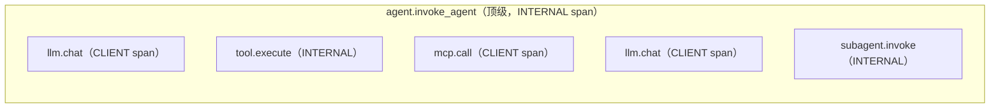

# OpenTelemetry GenAI — 端到端追踪工具调用

> 一个代理调用五个工具、三个 MCP 服务器和两个子代理。你需要一条跨越所有这一切的追踪。OpenTelemetry GenAI 语义约定（v1.37 及以上中的稳定属性）是 2026 年标准，被 Datadog、Langfuse、Arize Phoenix、OpenLLMetry 和 AgentOps 原生支持。本课命名 LLM span 和工具执行 span 所需的属性，遍历 span 层级（agent → LLM → tool），并发布一个你可以插入任何 OTel 导出器的标准库 span 发射器。

**类型：** 构建型
**语言：** Python（标准库，OTel span 发射器）
**前置条件：** 阶段 13 · 07（MCP 服务器）、阶段 13 · 08（MCP 客户端）
**时间：** 约 75 分钟

## 学习目标

- 命名 LLM span 和工具执行 span 所需的 OTel GenAI 属性。
- 构建覆盖代理循环、LLM 调用、工具调用和 MCP 客户端调度的追踪层级。
- 决定捕获什么内容（opt-in）vs 脱敏什么（默认）。
- 将 span 发射到本地收集器（Jaeger、Langfuse）而不重写工具代码。

## 问题

2026 年 2 月的一个调试：用户报告"我的代理有时需要 30 秒响应；其他时候只需 3 秒。"没有追踪。日志显示 LLM 调用，但没有工具调度、没有 MCP 服务器往返、没有子代理。你只能猜测。最终你发现：一个 MCP 服务器偶尔在冷启动时挂起。

没有端到端追踪，你无法找到这个问题。OTel GenAI 解决了它。

这些约定在 2025-2026 年在 OpenTelemetry 语义约定组下确定。它们定义稳定的属性名称，因此 Datadog、Langfuse、Phoenix、OpenLLMetry 和 AgentOps 都解析相同的 span。一次插桩；发送到任何后端。

## 概念

### Span 层级

整个过程嵌套在一个 trace id 下。Span id 链接父子关系。

### 必需属性

根据 2025-2026 年 semconv：

- `gen_ai.operation.name` — `"chat"`、`"text_completion"`、`"embeddings"`、`"execute_tool"`、`"invoke_agent"`。
- `gen_ai.provider.name` — `"openai"`、`"anthropic"`、`"google"`、`"azure_openai"`。
- `gen_ai.request.model` — 请求的模型字符串（例如 `"gpt-4o-2024-08-06"`）。
- `gen_ai.response.model` — 实际服务的模型。
- `gen_ai.usage.input_tokens` / `gen_ai.usage.output_tokens`。
- `gen_ai.response.id` — 提供商响应 ID 用于关联。

对于工具 span：

- `gen_ai.tool.name` — 工具标识符。
- `gen_ai.tool.call.id` — 特定调用 ID。
- `gen_ai.tool.description` — 工具描述（可选）。

对于代理 span：

- `gen_ai.agent.name` / `gen_ai.agent.id` / `gen_ai.agent.description`。

### Span 种类

- `SpanKind.CLIENT` 用于跨进程边界的调用（LLM 提供商、MCP 服务器）。
- `SpanKind.INTERNAL` 用于代理自身的循环步骤和工具执行。

### Opt-in 内容捕获

默认情况下，span 携带指标和时间 —— 而不是提示词或补全。大载荷和 PII 默认关闭。设置 `OTEL_SEMCONV_STABILITY_OPT_IN=gen_ai_latest_experimental` 和特定的内容捕获环境变量来包含内容。在生产中启用前仔细审查。

### Span 上的事件

可以添加令牌级事件作为 span 事件：

- `gen_ai.content.prompt` — 输入消息。
- `gen_ai.content.completion` — 输出消息。
- `gen_ai.content.tool_call` — 记录的工具调用。

事件在 span 内按时间顺序排列，用于详细回放。

### 导出器

OTel span 导出到：

- **Jaeger / Tempo。** 开源，本地部署。
- **Langfuse。** LLM 可观察性特定；可视化令牌使用情况。
- **Arize Phoenix。** 评估 + 追踪结合。
- **Datadog。** 商业版；原生解析 `gen_ai.*` 属性。
- **Honeycomb。** 列导向；查询友好。

所有都使用 OTLP（线格式）。你的代码不需要关心。

### 跨 MCP 的传播

当 MCP 客户端调用服务器时，将 W3C traceparent 头注入请求。Streamable HTTP 支持标准头。Stdio 原生不携带 HTTP 头；2026 年路线图讨论在 JSON-RPC 调用上添加 `_meta.traceparent` 字段。

在那之前：手动将 traceparent 包含在每个请求的 `_meta` 中。服务器记录 trace id。

### 指标

除了 span，GenAI semconv 还定义指标：

- `gen_ai.client.token.usage` — 直方图。
- `gen_ai.client.operation.duration` — 直方图。
- `gen_ai.tool.execution.duration` — 直方图。

将这些用于不需要逐调用细节的仪表板。

### AgentOps 层

AgentOps（成立于 2024 年）专注于 GenAI 可观察性。它包装了流行框架（LangGraph、Pydantic AI、CrewAI）以自动发出 OTel span。如果你的技术栈使用支持的框架，这很有用；否则使用手动插桩。

## 使用它

`code/main.py` 向 stdout 发出 OTel 形状的 span（OTLP-JSON 类似格式），用于调用 LLM、调度两个工具并进行一次 MCP 往返的代理。没有真正的导出器 —— 本课专注于 span 形状和属性集。将输出粘贴到 OTLP 兼容查看器或直接阅读。

需要关注的重点：

- Trace id 在所有 span 中共享。
- 父子链接通过 `parentSpanId` 编码。
- 必需的 `gen_ai.*` 属性已填充。
- 内容捕获默认关闭；一种场景通过环境变量打开它。

## 交付它

本课产出 `outputs/skill-otel-genai-instrumentation.md`。给定一个代理代码库，该技能生成一个插桩计划：在哪里添加 span、填充哪些属性，以及针对哪些导出器。

## 练习

1. 运行 `code/main.py`。计算 span 数量并识别哪些是 CLIENT vs INTERNAL。

2. 打开内容捕获（环境变量）并确认 `gen_ai.content.prompt` 和 `gen_ai.content.completion` 事件出现。注意对 PII 的影响。

3. 添加工具执行指标 `gen_ai.tool.execution.duration` 并将每次调用作为直方图样本发出。

4. 将 traceparent 从父代理 span 传播到 MCP 请求的 `_meta.traceparent` 字段。验证 MCP 服务器会看到相同的 trace id。

5. 阅读 OTel GenAI semconv 规范。识别本课代码**未**发出的一个 semconv 中列出的属性。添加它。

## 关键术语

| 术语 | 大家怎么说的 | 实际含义 |
|------|----------------|------------------------|
| OTel | "OpenTelemetry" | 追踪、指标、日志的开放标准 |
| GenAI semconv | "GenAI 语义约定" | LLM / 工具 / 代理 span 的稳定属性名称 |
| `gen_ai.*` | "属性命名空间" | 所有 GenAI 属性共享此前缀 |
| Span | "计时操作" | 具有开始、结束和属性的工作单元 |
| Trace | "跨 span 世系" | 共享 trace id 的 span 树 |
| SpanKind | "CLIENT / SERVER / INTERNAL" | 关于 span 方向的提示 |
| OTLP | "OpenTelemetry 行协议" | 导出器的线格式 |
| Opt-in 内容 | "提示词/补全捕获" | 默认关闭；环境变量启用 |
| traceparent | "W3C 头" | 在服务之间传播追踪上下文 |
| 导出器 | "后端特定的发货人" | 将 span 发送到 Jaeger / Datadog 等的组件 |

## 延伸阅读

- [OpenTelemetry — GenAI semconv](https://opentelemetry.io/docs/specs/semconv/gen-ai/) — GenAI span、指标和事件的规范约定
- [OpenTelemetry — GenAI span](https://opentelemetry.io/docs/specs/semconv/gen-ai/gen-ai-spans/) — LLM 和工具执行 span 属性列表
- [OpenTelemetry — GenAI 代理 span](https://opentelemetry.io/docs/specs/semconv/gen-ai/gen-ai-agent-spans/) — 代理级 `invoke_agent` span
- [open-telemetry/semantic-conventions — GenAI span](https://github.com/open-telemetry/semantic-conventions/blob/main/docs/gen-ai/gen-ai-spans.md) — GitHub 托管的事实来源
- [Datadog — LLM OTel 语义约定](https://www.datadoghq.com/blog/llm-otel-semantic-convention/) — 生产集成演练