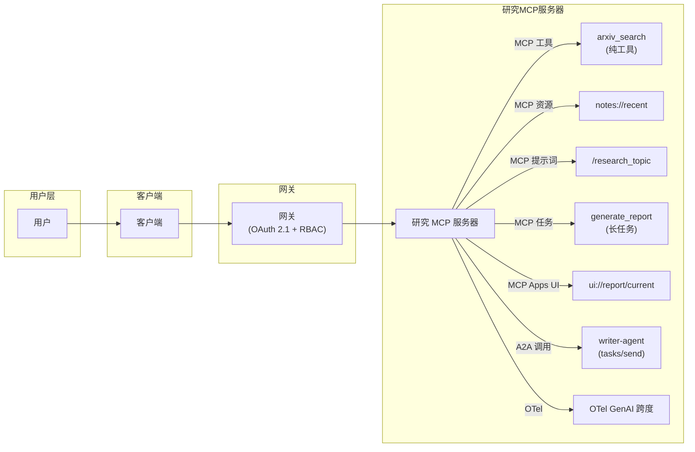
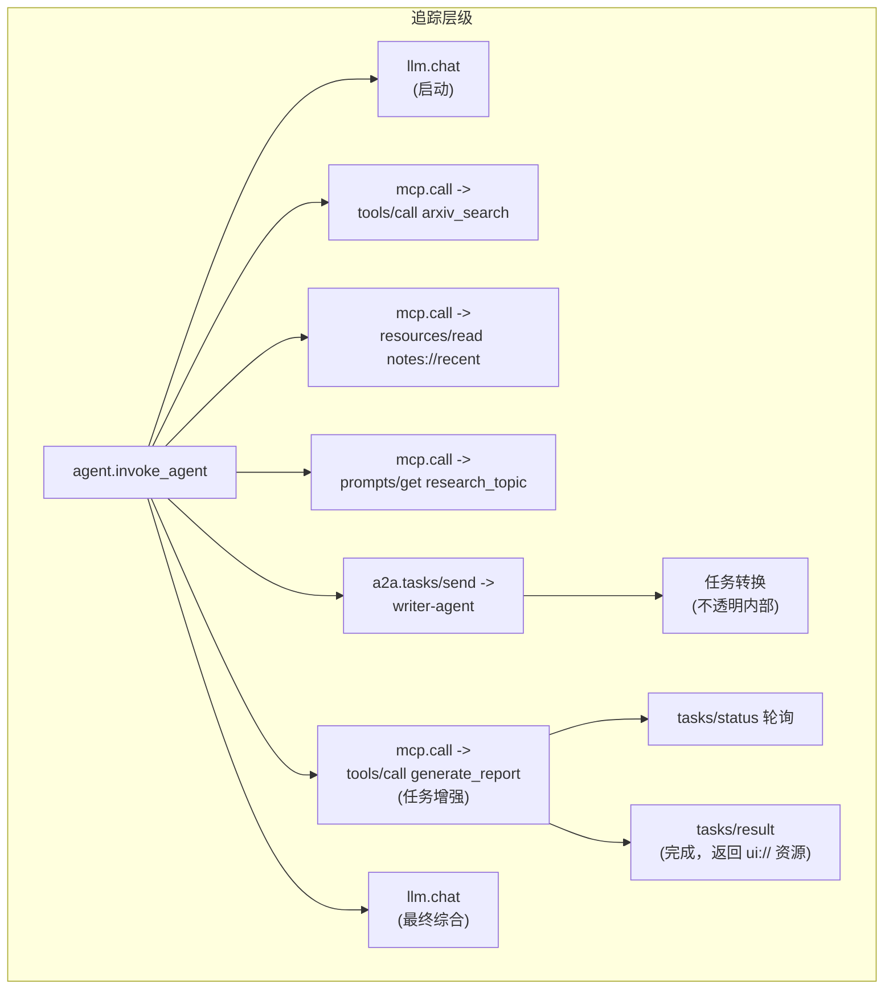

# Capstone — 构建完整的工具生态系统

> 阶段 13 教了每一块内容。本 Capstone 将它们连接成一个生产形态的系统：一个带有工具 + 资源 + 提示词 + 任务 + UI 的 MCP 服务器、边缘的 OAuth 2.1、一个 RBAC 网关、一个多服务器客户端、一个 A2A 子 Agent 调用、指向收集器的 OTel 追踪、CI 中的工具投毒检测，以及一个 AGENTS.md + SKILL.md 包。学完之后你能为每个架构决策辩护。

**类型：** 构建型
**语言：** Python（标准库，端到端生态系统 harness）
**前置条件：** 阶段 13 · 01 至 21
**时间：** 约 120 分钟

## 学习目标

- 组合一个暴露工具、资源、提示词和带 `ui://` 应用任务的 MCP 服务器。
- 用强制 RBAC 和固定哈希的 OAuth 2.1 网关作为服务器的前置。
- 编写一个用 OTel GenAI 属性端到端追踪的多服务器客户端。
- 将部分工作负载委托给 A2A 子 Agent；验证不透明性得以保持。
- 用 AGENTS.md + SKILL.md 打包整个技术栈，以便其他 Agent 能驱动它。

## 问题

交付"研究和报告"系统：

- 用户问："总结 2026 年 arXiv 上关于 Agent 协议的三个被引用最多的论文。"
- 系统：通过 MCP 搜索 arXiv；通过 A2A 将论文摘要委托给专门的写手 Agent；聚合结果；将交互式报告渲染为 MCP Apps `ui://` 资源；将每一步记录到 OTel。

阶段 13 的所有原语都出现了。这不是玩具——2026 年由 Anthropic（Claude Research 产品）、OpenAI（带 Apps SDK 的 GPTs）和第三方发货的生产研究助手系统正是这个形态。

## 概念

### 架构



### 追踪层级



一个追踪 ID。每个跨度都有正确的 `gen_ai.*` 属性。

### 安全态势

- OAuth 2.1 + PKCE，资源指示符将受众固定到网关。
- 网关持有上游凭证；用户永远不会看到它们。
- RBAC：`alice` 有 `research:read`、`research:write`，可以调用所有工具。`bob` 只有 `research:read`，不能调用 `generate_report`。
- 固定描述清单：任何工具哈希发生变化的服务器都会被丢弃。
- 双规则审计：没有工具将不受信任输入、敏感数据和后果性操作组合在一起。

### 渲染

最终的 `generate_report` 任务返回内容块加上 `ui://report/current` 资源。客户端的主机（Claude Desktop 等）在沙箱 iframe 中渲染交互式仪表盘。仪表盘包含排序后的论文列表、引用计数，以及一个按钮，调用 `host.callTool('summarize_paper', {arxiv_id})`，用于用户点击的任何论文。

### 打包

整个系统以如下形式发布：

```
research-system/
  AGENTS.md                     # 项目约定
  skills/
    run-research/
      SKILL.md                  # 顶层工作流
  servers/
    research-mcp/               # MCP 服务器
      pyproject.toml
      src/
  agents/
    writer/                     # A2A Agent
  gateway/
    config.yaml                 # RBAC + 固定清单
```

用户用 `docker compose up` 部署。Claude Code、Cursor、Codex 和 opencode 用户可以通过调用 `run-research` 技能来驱动系统。

### 每个阶段 13 课程的贡献

| 课程 | Capstone 使用的部分 |
|--------|------------------------|
| 01-05 | 工具接口、提供商可移植性、并行调用、schema、lint |
| 06-10 | MCP 原语、服务器、客户端、传输、资源 + 提示词 |
| 11-14 | 采样、根 + 引出、异步任务、`ui://` 应用 |
| 15-17 | 工具投毒、OAuth 2.1、网关 + 注册表 |
| 18 | A2A 子 Agent 委托 |
| 19 | OTel GenAI 追踪 |
| 20 | LLM 层的路由网关 |
| 21 | SKILL.md + AGENTS.md 打包 |

## 使用

`code/main.py` 将前面课程的各模式缝合到一个可运行的演示中。全部使用标准库，全部进程内运行，所以你可以从头读到尾。它为研究和报告场景运行完整流程：与网关握手、模拟 OAuth 2.1、合并 tools/list、generate_report 作为任务、A2A 调用 writer、返回 ui:// 资源、发出 OTel 跨度。

需要关注的地方：

- 每个跳跃都有同一个追踪 ID。
- 网关策略阻止第二个用户写入。
- 任务生命周期经过 working → completed，并同时返回文本和 ui:// 内容。
- A2A 调用的内部状态对编排器不透明。
- AGENTS.md 和 SKILL.md 是另一个 Agent 再现工作流所需的唯一文件。

## 交付

本课产出 `outputs/skill-ecosystem-blueprint.md`。给定一个产品需求（研究、摘要、自动化），该技能生成完整架构：使用哪些 MCP 原语、哪些网关控制、哪些 A2A 调用、哪些遥测、哪些打包方式。

## 练习

1. 运行 `code/main.py`。注意单一追踪 ID 和跨度如何嵌套。统计演示触及了阶段 13 的多少原语。

2. 扩展演示：添加第二个后端 MCP 服务器（例如 `bibliography`），确认网关将其工具合并到同一命名空间。

3. 用真实 A2A 写手 Agent（运行在子进程中）替换假的。使用课程 19 的 harness。

4. 在编排器和 LLM 之间的路由网关中添加一个 PII 脱敏步骤。确认用户查询中的电子邮件被清洗。

5. 为将维护此系统的队友写一个 AGENTS.md。它应该能在五分钟内读完，并给出他们在 Cursor 或 Codex 中驱动 Capstone 所需的全部内容。

## 关键术语

| 术语 | 大家怎么说的 | 实际含义 |
|------|----------------|------------------------|
| Capstone | "阶段 13 集成演示" | 使用每个原语的端到端系统 |
| 研究和报告 | "这个场景" | 搜索、摘要、渲染模式 |
| 生态系统 | "所有部分在一起" | 服务器 + 客户端 + 网关 + 子 Agent + 遥测 + 打包 |
| 追踪层级 | "单一追踪 ID" | 每个跳跃的跨度共享追踪；通过跨度 ID 建立父子关系 |
| 网关颁发的令牌 | "传递性认证" | 客户端只看到网关的令牌；网关持有上游凭证 |
| 合并命名空间 | "所有工具在一个扁平列表中" | 多服务器在网关处合并，发生冲突时加前缀 |
| 不透明边界 | "A2A 调用隐藏内部" | 子 Agent 的推理对编排器不可见 |
| 三层技术栈 | "AGENTS.md + SKILL.md + MCP" | 项目上下文 + 工作流 + 工具 |
| 纵深防御 | "多层安全" | 固定哈希、OAuth、RBAC、双规则、审计日志 |
| 规范合规矩阵 | "我们发货的规范要求的内容" | 将交付物映射到 2025-11-25 需求的清单 |

## 进一步阅读

- [MCP — 规范 2025-11-25](https://modelcontextprotocol.io/specification/2025-11-25) — 综合参考
- [MCP 博客 — 2026 路线图](https://blog.modelcontextprotocol.io/posts/2026-mcp-roadmap/) — 协议发展方向
- [a2a-protocol.org](https://a2a-protocol.org/latest/) — A2A v1.0 参考
- [OpenTelemetry — GenAI semconv](https://opentelemetry.io/docs/specs/semconv/gen-ai/) — 规范追踪约定
- [Anthropic — Claude Agent SDK 概述](https://code.claude.com/docs/en/agent-sdk/overview) — 生产 Agent 运行时模式