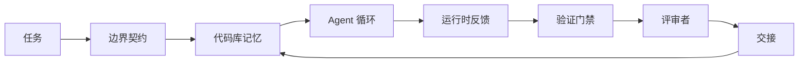

# Agent 工作台工程：为何能力强大的模型仍然会失败

> 一个能力强大的模型是不够的。可靠的 Agent 需要一个工作台：指令、状态、边界、反馈、验证、评审和交接。没有这些，即便前沿模型产生的代码也不敢安全发布。

**类型：** 学习 + 构建
**语言：** Python（标准库）
**前置条件：** 阶段 14 · 01（Agent 循环），阶段 14 · 26（故障模式）
**时间：** 约 45 分钟

## 学习目标

- 将模型能力与执行可靠性区分开来。
- 说出决定 Agent 能否交付的七个工作台表面。
- 对比仅用提示词的运行与带工作台引导的运行，在一个小型代码库任务上的表现。
- 生成一份故障模式报告，将每个缺失的表面对应到其引发的症状。

## 问题

你将一个前沿模型放进一个真实代码库，让它添加输入验证。它打开了四个文件，写出看似合理的代码，宣告成功，然后停止了。你运行测试。两个失败。第三个文件被修改了，而这个文件与验证毫无关系。没有记录显示 Agent 假定了什么、最初尝试了什么、还有什么没做完。

模型对 Python 没有判断错误。它对工作本身判断错误了。它不知道什么算"完成"、可以在哪里写入、哪些测试是权威的、或者下一个会话该如何接续。

这不是模型 bug。这是工作台 bug。Agent 外围的表面缺少了将一次性生成转化为可靠、可恢复的工程过程所需的那些部分。

## 概念

工作台是任务期间包裹模型的操作系统环境。它有七个表面：

| 表面 | 承载内容 | 缺失时的故障 |
|---------|-----------------|----------------------|
| 指令（Instructions） | 启动规则、禁止行为、完成定义 | Agent 猜测什么叫"发布" |
| 状态（State） | 当前任务、已修改文件、阻塞项、下一步行动 | 每个会话都从零开始 |
| 边界（Scope） | 允许的文件、禁止的文件、验收标准 | 编辑泄漏到无关代码中 |
| 反馈（Feedback） | 捕获到循环中的真实命令输出 | Agent 在收到 400 时宣告成功 |
| 验证（Verification） | 测试、lint、冒烟运行、边界检查 | "看起来不错"进入了主线 |
| 评审（Review） | 不同角色的第二轮检查 | 构建者给自己的作业打分 |
| 交接（Handoff） | 改变了什么、为什么、还有什么没做 | 下一个会话重新发现一切 |

工作台与模型无关。你可以换掉模型而保留表面。你不能换掉表面而保留可靠性。



循环在状态文件上闭合，而非在聊天历史上。聊天是不稳定的。代码库才是系统记录。

### 工作台与提示词工程的对比

提示词告诉模型本次轮次你想要什么。工作台告诉模型如何跨轮次和跨会话工作。大多数 Agent 故障故事都是穿着提示词工程外衣的工作台故障。

### 工作台与框架的对比

框架给你一个运行时（LangGraph、AutoGen、Agents SDK）。工作台给 Agent 在该运行时内一个工作的地方。两者都需要。这个迷你轨道讲的是第二个。

### 从原语出发推理，而非从供应商分类出发

现在有很多关于"工具链工程"的写作。Addy Osmani、OpenAI、Anthropic、LangChain、Martin Fowler、MongoDB、HumanLayer、Augment Code、Thoughtworks、walkinglabs awesome 列表，以及持续的 Medium 和 Hacker News 文章都在推进这件事。它们在工具链的边界、范围和词汇上存在分歧。我们不需要选边站。七个表面是一个 UX 层；在每个工作台下面，都是同一套分布式系统原语在支撑着任何可靠的后端。

把 Agent 这个标签先拿掉。一个 Agent 运行就是跨越时间、进程和机器的计算。要让它可靠，你需要任何生产系统需要的相同原语。

| 原语 | 是什么 | 为 Agent 承载什么 |
|-----------|------------|------------------------------|
| 函数（Function） | 类型化处理器。尽可能纯。拥有自己的输入和输出。 | 一次工具调用、一次规则检查、一步验证、一次模型调用 |
| Worker（Worker） | 拥有一个或多个函数和一个生命周期的长期进程 | 构建者、评审者、验证器、一个 MCP 服务器 |
| 触发器（Trigger） | 调用函数的事件源 | Agent 循环滴答、HTTP 请求、队列消息、cron、文件变更、钩子 |
| 运行时（Runtime） | 决定什么在哪里运行、用什么超时和资源的边界 | Claude Code 的进程、LangGraph 的运行时、一个 worker 容器 |
| HTTP / RPC | 调用者和 worker 之间的线路 | 工具调用协议、MCP 请求、模型 API |
| 队列（Queue） | 触发器和 worker 之间的持久缓冲；背压、重试、幂等性 | 任务板、反馈日志、评审收件箱 |
| 会话持久化（Session persistence） | 跨崩溃、重启、模型切换存活的state | `agent_state.json`、检查点、KV 存储、代码库本身 |
| 授权策略（Authorization policy） | 谁可以用什么范围调用什么函数 | 允许/禁止的文件、审批边界、MCP 能力列表 |

现在将七个工作台表面映射到这些原语上。

- **指令** — 策略 + 函数元数据。规则是检查（函数）。路由器（`AGENTS.md`）是附加在运行时启动上的策略。
- **状态** — 会话持久化。运行时在每一步都读取的键控存储。文件、KV 或 DB；持久化语义重要，存储后端不重要。
- **边界** — 每个任务的授权策略。允许/禁止的 glob 模式是一种 ACL。需要审批的是一个权限格。
- **反馈** — 写入队列的调用日志。每次 shell 调用都是一条持久、可重放的记录。
- **验证** — 一个函数。对输入是确定性的。在任务关闭时触发。故障时关闭。
- **评审** — 一个独立的 worker，对构建者产物有只读 authz，对评审报告有只写 authz。
- **交接** — 会话结束触发器发出的持久记录。下一个会话的启动触发器读取它。

Agent 循环本身就是一个 worker，消费事件（用户消息、工具结果、定时器滴答），调用函数（模型，然后是模型选择的工具），写入记录（状态、反馈），并发出触发器（验证、评审、交接）。没什么神秘；和作业处理器是一样的形状。

### 流通中的模式，翻译成原语

每个流行的工具链模式都能归约到八个原语。翻译表如下。

| 供应商或社区模式 | 实际是什么 |
|------------------------------|--------------------|
| Ralph 循环（Claude Code、Codex、agentic_harness 书）—— 当 Agent 提前停止时，将原始意图重新注入新的上下文窗口 | 一个重新将任务入队并携带干净上下文的触发器；会话持久化将目标向前传递 |
| Plan / Execute / Verify（PEV） | 三个 worker，每个角色一个，通过状态和阶段间的队列通信 |
| 工具链-计算分离（OpenAI Agents SDK，2026 年 4 月）—— 将控制平面与执行平面分离 | 重申控制平面/数据平面。这个概念在 Agent 这个标签出现之前几十年就有了 |
| Open Agent Passport（OAP，2026 年 3 月）—— 在执行前对每次工具调用签名并根据声明式策略审计 | 由执行前 worker 强制的授权策略，带签名审计队列 |
| 指南与传感器（Birgitta Böckeler / Thoughtworks）—— 前馈规则 + 反馈可观测性 | 授权策略 + 验证函数 + 可观测性追踪 |
| 渐进压缩，5 阶段（Claude Code 逆向工程，2026 年 4 月） | 一个状态管理 worker，像 cron 一样在会话持久化上运行，以保持其在预算内 |
| 钩子/中间件（LangChain、Claude Code）—— 拦截模型和工具调用 | 包装在运行时调用路径周围的触发器 + 函数 |
| 作为 Markdown 的技能及渐进披露（Anthropic、Flue） | 一个函数注册表，其中函数元数据在恰当时机加载到上下文中 |
| 沙箱 Agent（Codex、Sandcastle、Vercel Sandbox） | 计算平面：一个运行时，带隔离的文件系统、网络和生命周期 |
| MCP 服务器 | 通过稳定 RPC 暴露函数的 worker，能力列表作为授权 |

表中每个条目都是 Agent 社区到达一个分布式系统中已有名称的原语并给它起了个新名字。对营销有用；作为工程词汇则没用。

### 实际数据怎么说

工具链优于模型的论断现在有数据支撑了。值得了解，因为它们也是对"只要等待更聪明的模型"唯一诚实的反驳。

- Terminal Bench 2.0 — 同一模型，工具链变更将编码 Agent 从前 30 之外移至第五名（LangChain，《Anatomy of an Agent Harness》）。
- Vercel — 删除了 Agent 80% 的工具；成功率从 80% 跃升至 100%（MongoDB）。
- Harvey — 仅通过工具链优化，法律 Agent 的准确率就翻了一倍以上（MongoDB）。
- 88% 的企业 AI Agent 项目未能进入生产环境。故障集中在运行时，而非推理上（preprints.org，《Harness Engineering for Language Agents》，2026 年 3 月）。
- 2025 年一项针对三个流行开源框架的基准研究报告约 50% 的任务完成率；长上下文 WebAgent 在长上下文条件下从 40-50% 崩溃至不到 10%，主要是无限循环和目标丢失（广泛覆盖于 2026 年初的报道中）。

要点不是"工具链永远赢"。模型确实会随时间吸收工具链技巧。要点是今天，负载最重的工程在模型周围，而非模型内部，承载这些负载的原语是每个生产系统一直都需要的那一套。

### 供应商报道止步之处

这部分你不需要客气。

- LangChain 的《Anatomy of an Agent Harness》列举了十一个组件——提示词、工具、钩子、沙箱、编排、内存、技能、子 Agent 和一个运行时"傻瓜循环"。它没有命名队列、作为部署单元的 worker、触发器语义、作为独立关注的会话持久化，或授权策略。它把工具链当作一个你配置的对象，而不是一个你部署的系统。
- Addy Osmani 的《Agent Harness Engineering》落地了 `Agent = Model + Harness` 的框架和棘轮模式，但没有说清楚工具链是由什么构成的。它读起来像一种立场，而非一种规范。
- Anthropic 和 OpenAI 在表面上讲得最深，但停留在自己的运行时内。2026 年 4 月 Agents SDK 中"工具链-计算分离"的宣布是第一个明确认可控制平面/数据平面分离的供应商文章。这是一个原语思想，不是新思想。
- agentic_harness 这本书把工具链当作一个配置对象（Jaymin West 的《Agentic Engineering》，第 6 章），其中最强的台词是"工具链是 Agent 系统中主要的安全边界"。这只是授权策略的另一种说法。
- Hacker News 帖子不断到达同一个地方。2026 年 4 月的帖子《The agent harness belongs outside the sandbox》认为工具链应该像"一个位于所有东西外部并根据上下文和用户授权访问的超级虚拟机"那样坐着。这 Again，是把授权策略作为一个独立的平面。

你不需要不同意这些文章中的任何一篇就能注意到这个差距。它们在写一个已经存在的系统的 UX 描述。我们在写这个系统。当系统构建正确时，七个表面从原语中自然产生。当系统构建错误时，再多的 `AGENTS.md` 打磨也修复不了缺失的队列。

所以当你在别处听到"工具链工程"时，翻译成原语。提示词和规则是策略和函数。脚手架是运行时。护栏是授权 + 验证。钩子是触发器。内存是会话持久化。Ralph 循环是重新入队。子 Agent 是 worker。沙箱是计算平面。词汇变了，工程没变。工作台是 Agent 面向用户的 UX；而在经历了下一个供应商重构之后仍然存活的那种工具链，是函数、worker、触发器、运行时、队列、持久化和策略正确连接在一起的东西。

## 构建它

`code/main.py` 两次运行一个小型代码库任务。第一次仅用提示词，第二次接入七个表面。同一个模型，同一个任务。脚本统计失败运行中缺少了哪些表面，并打印一份故障模式报告。

代码库任务有意做得很小：给一个单文件 FastAPI 风格的处理程序添加输入验证，并写一个通过的测试。

运行它：

```
python3 code/main.py
```

输出：两次运行的并排日志、一份 `failure_modes.json` 总结仅用提示词的运行、以及工作台运行的一行裁决。

Agent 是一个微小的基于规则的 stub；重点是表面，而非模型。在这个迷你轨道的其余部分，你将把每个表面重建为一个真实的、可复用的构件。

## 使用它

工作台表面已经在自然界中存在了三处，即便没人这么叫它们：

- **Claude Code、Codex、Cursor。** `AGENTS.md` 和 `CLAUDE.md` 是指令表面。斜杠命令是边界。钩子是验证。
- **LangGraph、OpenAI Agents SDK。** 检查点和会话存储是状态表面。交接是交接表面。
- **真实代码库上的 CI。** 测试、lint 和类型检查是验证。PR 模板是交接。CODEOWNERS 是评审。

工作台工程是让这些表面变得显式和可复用的学科，而不是让每个团队重新发现它们。

## 发布它

`outputs/skill-workbench-audit.md` 是一个可移植的技能，审计现有代码库的七个工作台表面，并报告哪些缺失、哪些部分、哪些健康。把它放到任何 Agent 设置旁边；它告诉你先修什么。

## 练习

1. 选一个你已经运行过 Agent 的代码库。对七个表面打分，0（缺失）到 2（健康）。你最弱的表面是哪个？
2. 扩展 `main.py`，让仅用提示词的运行也产生一个假的"成功"声明。验证验证门禁本可以捕获它。
3. 为你自己的产品添加第八个表面。说明为什么它不会崩溃成现有七个之一。
4. 用一个会幻觉额外文件写入的不同 stub Agent 重新运行脚本。哪个表面最先捕获它？
5. 将阶段 14 · 26 中的五个行业反复出现的故障模式映射到七个表面上。每个表面设计用来吸收哪种模式？

## 关键术语

| 术语 | 大家怎么说 | 实际含义 |
|------|----------------|------------------------|
| 工作台（Workbench） | "这个设置" | 模型周围让工作变得可靠的工程化表面 |
| 表面（Surface） | "一个文档"或"一个脚本" | 一个命名的、机器可读的 Agent 每轮都读取或写入的输入 |
| 系统记录（System of record） | "这些笔记" | Agent 在聊天历史消失时当作真理的文件 |
| 完成定义（Definition of done） | "验收" | Agent 无法伪造的客观的、文件支撑的检查清单 |
| 工作台审计（Workbench audit） | "代码库就绪检查" | 在工作开始前对七个表面进行全面检查，标记缺失的部分 |

## 延伸阅读

把这些当作数据点来读，而不是权威。每个都是不完整的分类。在决定是否采纳之前，把每个概念都翻译回一个原语（函数、worker、触发器、运行时、HTTP/RPC、队列、持久化、策略）。

供应商框架：

- [Addy Osmani, Agent Harness Engineering](https://addyosmani.com/blog/agent-harness-engineering/) — `Agent = Model + Harness` 和棘轮模式；对基础设施着墨不多
- [LangChain, The Anatomy of an Agent Harness](https://blog.langchain.com/the-anatomy-of-an-agent-harness/) — 十一个组件：提示词、工具、钩子、编排、沙箱、内存、技能、子 Agent、运行时；缺少队列、部署、authz
- [OpenAI, Harness engineering: leveraging Codex in an agent-first world](https://openai.com/index/harness-engineering/) — Codex 团队对他们运行时周围表面的看法
- [OpenAI, Unrolling the Codex agent loop](https://openai.com/index/unrolling-the-codex-agent-loop/) — Agent 循环归约为 `while` 循环遍历函数调用
- [Anthropic, Effective harnesses for long-running agents](https://www.anthropic.com/engineering/effective-harnesses-for-long-running-agents) — 特定运行时内的长时域表面
- [Anthropic, Harness design for long-running application development](https://www.anthropic.com/engineering/harness-design-long-running-apps) — 应用设计笔记
- [LangChain Deep Agents harness capabilities](https://docs.langchain.com/oss/python/deepagents/harness) — 运行时配置表面

实践者文章，有可用细节：

- [Martin Fowler / Birgitta Böckeler, Harness engineering for coding agent users](https://martinfowler.com/articles/harness-engineering.html) — 指南（前馈）+ 传感器（反馈）；最清晰的控制论框架
- [HumanLayer, Skill Issue: Harness Engineering for Coding Agents](https://www.humanlayer.dev/blog/skill-issue-harness-engineering-for-coding-agents) — "这不是模型问题，这是配置问题"
- [MongoDB, The Agent Harness: Why the LLM Is the Smallest Part of Your Agent System](https://www.mongodb.com/company/blog/technical/agent-harness-why-llm-is-smallest-part-of-your-agent-system) — 收据：Vercel 80% 到 100%，Harvey 2 倍准确率，Terminal Bench 前 30 到前 5
- [Augment Code, Harness Engineering for AI Coding Agents](https://www.augmentcode.com/guides/harness-engineering-ai-coding-agents) — 约束优先的演练
- [Sequoia podcast, Harrison Chase on Context Engineering Long-Horizon Agents](https://sequoiacap.com/podcast/context-engineering-our-way-to-long-horizon-agents-langchains-harrison-chase/) — 运行时关注大于模型关注

书籍、论文和参考实现：

- [Jaymin West, Agentic Engineering — Chapter 6: Harnesses](https://www.jayminwest.com/agentic-engineering-book/6-harnesses) — 书级 treatment，将工具链作为主要安全边界
- [preprints.org, Harness Engineering for Language Agents (March 2026)](https://www.preprints.org/manuscript/202603.1756) — 作为控制/代理/运行时的学术框架
- [walkinglabs/awesome-harness-engineering](https://github.com/walkinglabs/awesome-harness-engineering) — 跨上下文、评估、可观测性、编排的精选阅读列表
- [ai-boost/awesome-harness-engineering](https://github.com/ai-boost/awesome-harness-engineering) — 备用精选列表（工具、评估、内存、MCP、权限）
- [andrewgarst/agentic_harness](https://github.com/andrewgarst/agentic_harness) — 生产级参考实现，带 Redis 后端内存和评估套件
- [HKUDS/OpenHarness](https://github.com/HKUDS/OpenHarness) — 带内置个人 Agent 的开放 Agent 工具链

值得一读的 Hacker News 帖子，看分歧而非共识：

- [HN: Effective harnesses for long-running agents](https://news.ycombinator.com/item?id=46081704)
- [HN: Improving 15 LLMs at Coding in One Afternoon. Only the Harness Changed](https://news.ycombinator.com/item?id=46988596)
- [HN: The agent harness belongs outside the sandbox](https://news.ycombinator.com/item?id=47990675) — 主张授权作为一个独立平面

本课程内部交叉引用：

- 阶段 14 · 23 — OpenTelemetry GenAI 约定：传感器文献指向的可观测性层
- 阶段 14 · 26 — 故障模式目录：七个表面设计用来吸收的故障
- 阶段 14 · 27 — 提示词注入防御：位于授权策略原语上的防御
- 阶段 14 · 29 — 生产运行时（队列、事件、cron）：本课中原语在部署中的位置