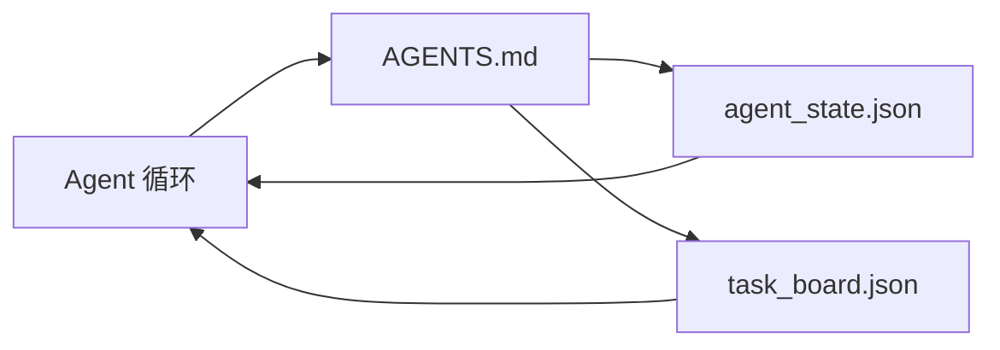

# 最小 Agent 工作台

> 最小可用的工作台只需要三个文件：一个根指令路由文件、一个状态文件、一个任务看板。其它都是在此基础上堆叠。如果一个代码库连这三个都带不动，没有任何模型能救它。

**类型：** 构建
**语言：** Python（标准库）
**前置条件：** 阶段 14 · 31（为什么有能力模型仍然失败）
**时间：** 约 45 分钟

## 学习目标

- 定义构成最小可用工作台的三个文件。
- 解释为什么一个简短的根路由文件比一个冗长的单体 `AGENTS.md` 更好。
- 构建一个状态文件，Agent 每轮开始前读取、结束时写入。
- 构建一个任务看板，支持多会话工作，不依赖聊天历史。

## 问题

大多数团队搭建工作台的方式是写一个 3000 行的 `AGENTS.md`，然后宣布大功告成。模型加载了它，忽略了它无法概括的部分，依然在那些一直失败的地方失败。

你需要反过来。一个极简的根文件，仅在相关时才将 Agent 路由到更深层的文件。持久化状态——Agent 在行动前读取，行动后写入。一个任务看板——说明正在进行什么、什么被阻塞、下一步是什么。

三个文件。每个文件各司其职。机器可读性足够强，以便将来演进为真正的系统。

## 概念



### AGENTS.md 是路由器，不是手册

一个好的 `AGENTS.md` 很短。它指向 Agent：

- 状态文件（你当前在哪里）。
- 任务看板（还有什么没做）。
- 更深层的规则（在 `docs/agent-rules.md` 下）。
- 验证命令（如何知道它正常工作）。

任何更长的内容都放在更深的文档中，仅在需要时加载。长篇手册会被忽略。简短的路由文件会被遵循。

### agent_state.json 是系统记录

状态包含：当前任务 ID、已触碰的文件、已做出的假设、阻塞项、下一步行动。Agent 每轮都读取它。下一个会话读取它而不是回放聊天。

状态存在文件中，因为聊天历史不可靠。会话会终止。对话会被截断。文件不会。

### task_board.json 是队列

任务看板携带所有任务，状态为 `todo | in_progress | done | blocked`。当状态为空时，Agent 从这里拉取任务；当你想知道 Agent 是否在正轨上时，你读取它。

看板上的任务有 id、goal、owner（`builder`、`reviewer` 或 `human`）和验收标准。看板故意保持小规模：当它超过一屏时，你面对的是一个规划问题，而不是看板问题。

### 三个文件是下限，不是上限

后面的课程会添加范围契约、反馈运行器、验证门、审核清单和交接数据包。这三个文件是它们所有人的基础。

## 构建它

`code/main.py` 将最小工作台写入一个空仓库，并演示单个 Agent 轮次：

1. 读取 `agent_state.json`。
2. 如果状态为空，从 `task_board.json` 拉取下一个任务。
3. 在范围内触碰一个文件。
4. 写回更新后的状态。

运行它：

```
python3 code/main.py
```

该脚本在自身旁边创建 `workdir/`，铺设三个文件，运行一轮，然后打印差异。重新运行它，可以看到第二轮如何从第一轮停下的地方继续。

## 使用它

在生产环境的 Agent 产品中，相同的三个文件以不同名称出现：

- **Claude Code：** `AGENTS.md` 或 `CLAUDE.md` 作为路由器，`.claude/state.json` 风格的存储作为状态，hooks 作为看板。
- **Codex / Cursor：** workspace rules 作为路由器，session memory 作为状态，聊天侧边栏的队列任务作为看板。
- **自定义 Python Agent：** 就是你刚写的那些文件。

名称会变。形状不变。

## 实际模式

当三个模式叠加在最小工作台上时，它可以在真正的 monorepo 中存活。它们是独立的；选择你仓库真正需要的那些。

**最近的 `AGENTS.md` 获胜的嵌套优先级。** OpenAI 在其主仓库中发布了 88 个 `AGENTS.md` 文件，每个子组件一个。Codex、Cursor、Claude Code 和 Copilot 都从工作文件向仓库根目录遍历，拼接沿途发现的每个 `AGENTS.md`。子目录文件扩展根文件。Codex 添加 `AGENTS.override.md` 来替换而不是扩展；覆盖机制是 Codex 特有的，为跨工具工作应避免使用。Augment Code 的衡量标准才是关键：最好的 `AGENTS.md` 文件带来的质量提升相当于从 Haiku 升级到 Opus；最差的文件让它产生的输出比没有任何文件时更差。

**需要拒绝的反模式，即使它们看起来像是覆盖。** 冲突指令会将 Agent 从交互模式静默降级为贪婪模式（ICLR 2026 AMBIG-SWE：48.8% → 28% 解决率）；用数字优先级而不是扁平堆叠。使用未配验证命令的不可验证风格规则（"遵循 Google Python 风格指南"）会让 Agent 捏造合规；每条风格规则都要配上精确的 lint 命令。先说风格而不是命令会埋没验证路径；命令优先，风格最后。为人类而不是 Agent 写作会浪费上下文预算；简洁是一种功能。

**跨工具符号链接。** 一个带符号链接的根文件（`ln -s AGENTS.md CLAUDE.md`，`ln -s AGENTS.md .github/copilot-instructions.md`，`ln -s AGENTS.md .cursorrules`）让每个编码 Agent 都在同一个真相来源上。Nx 的 `nx ai-setup` 从单一配置跨 Claude Code、Cursor、Copilot、Gemini、Codex 和 OpenCode 自动化这一过程。

## 交付它

`outputs/skill-minimal-workbench.md` 为任何新仓库生成三文件工作台：一个针对项目调优的 `AGENTS.md` 路由器、一个带正确键的 `agent_state.json`、以及一个用当前积压种子初始化的 `task_board.json`。

## 练习

1. 在 `agent_state.json` 中添加 `last_run` 时间戳。如果文件超过 24 小时，拒绝运行，除非操作员确认。
2. 在任务看板中添加 `priority` 字段，并将拉取器改为始终选择优先级最高的 `todo`。
3. 将 `task_board.json` 迁移到 JSON Lines，使每个任务占一行，在版本控制中差异清晰。
4. 写一个 `lint_workbench.py`，如果 `AGENTS.md` 超过 80 行或引用了不存在的文件就失败。
5. 决定三个文件中失去哪个伤害最大。为它辩护。

## 关键术语

| 术语 | 大家怎么说的 | 实际含义 |
|------|----------------|------------------------|
| 路由器 | `AGENTS.md` | 简短的根文件，将 Agent 指向更深的文档和文件 |
| 状态文件 | "笔记" | 机器可读的记录，说明 Agent 在哪里，每轮写入 |
| 任务看板 | "积压" | JSON 队列，工作有状态、owner、验收标准 |
| 系统记录 | "真相来源" | 当聊天消失时，工作台将其视为权威的文件 |

## 延伸阅读

- [agents.md — 开放规范](https://agents.md/) — 被 Cursor、Codex、Claude Code、Copilot、Gemini、OpenCode 采用
- [Augment Code, 一份好的 AGENTS.md 是模型升级。一份坏的是最差文档。](https://www.augmentcode.com/blog/how-to-write-good-agents-dot-md-files) — 有质量提升的衡量数据
- [Blake Crosley, AGENTS.md 模式：什么真正改变 Agent 行为](https://blakecrosley.com/blog/agents-md-patterns) — 什么通过实证有效，什么无效
- [Datadog Frontend, 在 Monorepo 中用 AGENTS.md 引导 AI Agent](https://dev.to/datadog-frontend-dev/steering-ai-agents-in-monorepos-with-agentsmd-13g0) — 嵌套优先级的实践
- [Nx Blog, 教你的 AI Agent 如何在 Monorepo 中工作](https://nx.dev/blog/nx-ai-agent-skills) — 跨六个工具的单一来源生成
- [The Prompt Shelf, AGENTS.md 最佳实践：结构、范围和真实案例](https://thepromptshelf.dev/blog/agents-md-best-practices/) — 经得起审查的部分排序
- [Anthropic, Claude Code 子 Agent 和会话存储](https://docs.anthropic.com/en/docs/agents-and-tools/claude-code/sub-agents)
- 阶段 14 · 31 — 这个最小配置所吸收的失败模式
- 阶段 14 · 34 — 这节课预览的持久状态 schema