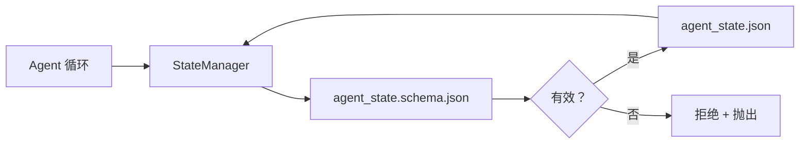

# 仓库记忆与持久状态

> 聊天历史是易失的。仓库是持久的。工作台将 Agent 状态存储在版本化文件中，以便下一个会话、下一个 Agent 和下一个审核者都从同一个真相来源读取。

**类型：** 构建
**语言：** Python（标准库 + `jsonschema` 可选）
**前置条件：** 阶段 14 · 32（最小工作台）
**时间：** 约 60 分钟

## 学习目标

- 定义什么属于仓库记忆，什么属于聊天历史。
- 为 `agent_state.json` 和 `task_board.json` 编写 JSON Schema。
- 构建一个状态管理器，原子地加载、验证、变更和持久化状态。
- 使用 schema 在坏写入破坏工作台之前拒绝它们。

## 问题

Agent 完成了会话。聊天关闭。下一个会话打开并询问从哪里开始。模型说"让我检查文件"，读取过时的笔记，重新做已经完成的工作。或者更糟的是，它重写了一个已完成的文件，因为没有人告诉它文件已经完成了。

工作台的修复是仓库记忆：状态存在于仓库中的 JSON 文件中，在 schema 下写入，原子持久化，在代码审查中对 diff 友好。聊天是一个瞬态 feed；仓库是系统记录。

## 概念



### 什么属于仓库记忆

| 属于 | 不属于 |
|---------|-----------------|
| 当前任务 ID | 原始聊天记录 |
| 本会话触碰的文件 | 令牌级推理追踪 |
| Agent 所做的假设 | "用户似乎很沮丧" |
| 开放阻塞项 | 采样的完成结果 |
| 下一步行动 | 供应商特定的模型 ID |

测试标准是持久性：这个在三个月后的 CI 重运行中会有用吗？如果有，属于仓库。如果没有，属于遥测。

### Schema 优先的状态

JSON Schema 是契约。没有它，每个 Agent 发明新字段，每个审核者学习新形状，每个 CI 脚本都必须对过去的版本进行特殊处理。有了它，坏写入就是被拒绝的写入。

schema 覆盖：

- 必需键。
- 允许的 `status` 值。
- 禁止的值（例如数组的 `null`）。
- 模式约束（任务 ID 匹配 `T-\d{3,}`）。
- 用于迁移的版本字段。

### 原子写入

状态写入需要承受部分失败：写入临时文件、fsync、重命名覆盖目标。状态文件是真相来源；半写入的状态文件比没有文件更糟糕。

### 迁移

当 schema 变化时，在 schema 升级旁边附带一个迁移脚本。状态文件携带 `schema_version` 字段；管理器拒绝加载无法迁移的版本的文件。

## 构建它

`code/main.py` 实现：

- `agent_state.schema.json` 和 `task_board.schema.json`。
- 仅标准库的验证器（JSON Schema 子集：required、type、enum、pattern、items）。
- `StateManager.load`、`StateManager.update`、`StateManager.commit`，带有原子临时文件和重命名写入。
- 一个演示，跨两轮变更状态、持久化、重新加载，并证明往返。

运行它：

```
python3 code/main.py
```

该脚本写入 `workdir/agent_state.json` 和 `workdir/task_board.json`，跨两轮变更它们，并在每步打印验证后的状态。

## 实际模式

四个模式将这节课的最小值变成多 Agent monorepo 可以存活的系统。

**原子临时文件和重命名不是可选项。** 2026 年 3 月的一个 Hive 项目 bug 报告干净地记录了失败模式：`state.json` 通过 `write_text()` 写入，异常被捕获并静默。半写入使会话在损坏的状态上恢复，没有信号。修复始终是：`tempfile.mkstemp` 在目标相同目录，写入，`fsync`，`os.replace`（POSIX 和 Windows 上的原子重命名）。这节课的 `atomic_write` 正是这样做的。

**每个非幂等工具调用上的幂等键。** 如果 Agent 在调用工具后、检查点结果前崩溃，恢复会重试工具调用。对读取安全；对邮件、数据库插入、文件上传危险。模式：在执行前将每个工具调用 ID 记录到 `pending_calls.jsonl`。重试时，检查 ID；如果存在，跳过调用并使用缓存结果。Anthropic 和 LangChain 在 2026 年指南中都提到了这一点；LangGraph 的检查点持久化器出于相同原因持久化待写入。

**将大型工件与状态分开。** 不要将 CSV、长记录或生成的文件存储在 `agent_state.json` 中。将工件保存为单独的文件（或上传到对象存储），只在状态中保留路径。检查点保持小而快；工件独立增长。

**用于审计的事件溯源，用于恢复的快照。** 每次变更时追加到事件日志（`state.events.jsonl`）；定期快照到 `state.json`。恢复读取快照，然后重放快照时间戳之后的任何事件。这消耗更多磁盘，但让你逐字逐句地重放 Agent 决策——调试长期运行时必不可少的。Postgres 在内部对 WAL 使用相同的形状。

**Schema 迁移或拒绝加载。** `schema_version` 整数是契约。当管理器加载未知版本的文件时，它拒绝读取。在 schema 升级旁边附带迁移脚本；`tools/migrate_state.py` 在每次启动时幂等运行。

## 使用它

在生产中：

- **LangGraph 检查点。** 相同想法，不同存储。检查点持久化图状态到 SQLite、Postgres 或自定义后端。这节课教的 schema 是当检查点失效、你需要手动读取状态时的目标。
- **Letta 记忆块。** 带结构化 schema 的持久块（阶段 14 · 08）。相同原则，限定到长期运行的角色。
- **OpenAI Agents SDK 会话存储。** 可插拔后端，schema 感知。这节课的状态文件是本地文件后端。

## 交付它

`outputs/skill-state-schema.md` 生成项目特定的 JSON Schema 对（state + board）、一个连接到原子写入的 Python `StateManager`，以及一个迁移脚手架，以便下次 schema 升级不会破坏工作台。

## 练习

1. 添加 `last_human_touch` 时间戳。如果人类编辑后五秒内有 Agent 写入，拒绝任何写入。
2. 扩展验证器以支持 `oneOf`，以便任务可以是构建任务或审查任务，带有不同的必需字段。
3. 添加 `schema_version` 字段并编写从 v1 到 v2 的迁移（将 `blockers` 重命名为 `risks`）。
4. 将存储后端从本地文件移到 SQLite。保持 `StateManager` API 不变。
5. 用 50ms 写入竞速运行两个 Agent 针对同一个状态文件。会出现什么问题，原子重命名如何挽救你？

## 关键术语

| 术语 | 大家怎么说的 | 实际含义 |
|------|----------------|------------------------|
| 仓库记忆 | "笔记文件" | 存储在仓库中跟踪文件中的状态，在 schema 下 |
| Schema 优先 | "验证输入" | 在写入者之前定义契约，拒绝漂移 |
| 原子写入 | "只是重命名" | 写入临时文件、fsync、重命名，因此部分失败不能破坏 |
| 迁移 | "Schema 升级" | 将 vN 状态转换为 v(N+1) 状态的脚本 |
| 系统记录 | "真相来源" | 工作台将其视为权威的工件 |

## 延伸阅读

- [JSON Schema 规范](https://json-schema.org/specification.html)
- [LangGraph 检查点](https://langchain-ai.github.io/langgraph/concepts/persistence/)
- [Letta 记忆块](https://docs.letta.com/concepts/memory)
- [Fast.io, AI Agent 状态检查点：实用指南](https://fast.io/resources/ai-agent-state-checkpointing/) — 带幂等性的 schema 优先检查点
- [Fast.io, AI Agent 工作流状态持久化：2026 最佳实践](https://fast.io/resources/ai-agent-workflow-state-persistence/) — 并发控制、TTL、事件溯源
- [Hive Issue #6263 — 非原子 state.json 写入被静默忽略](https://github.com/aden-hive/hive/issues/6263) — 真实项目中的失败模式
- [eunomia, 检查点/恢复系统：演进、技术、应用](https://eunomia.dev/blog/2025/05/11/checkpointrestore-systems-evolution-techniques-and-applications-in-ai-agents/) — 从 OS 历史应用到 Agent 的 CR 原语
- [Indium, 2026 年长期运行 AI Agent 的 7 种状态持久化策略](https://www.indium.tech/blog/7-state-persistence-strategies-ai-agents-2026/)
- [Microsoft Agent 框架, 压缩](https://learn.microsoft.com/en-us/agent-framework/agents/conversations/compaction) — 供应商检查点管理器
- 阶段 14 · 08 — 记忆块和睡眠时间计算
- 阶段 14 · 32 — 这节课 schema 化的三文件最小值
- 阶段 14 · 40 — 从相同 schema 读取的交接数据包