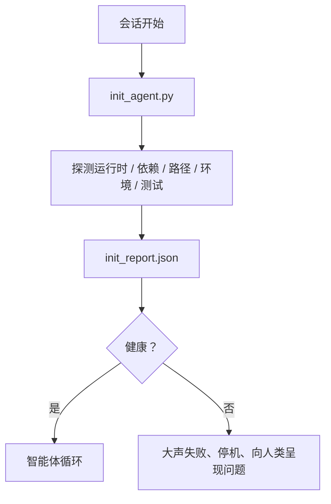

# 智能体初始化脚本

> 每个从零开始的会话都要付出代价。智能体读取相同的文件、重试相同的探测、重新发现相同的路径。初始化脚本只需支付一次代价，然后把答案写入状态中。

**类型：** 构建型
**语言：** Python（标准库）
**前置条件：** 阶段 14 · 32（最小工作台）、阶段 14 · 34（仓库记忆）
**时间：** 约 45 分钟

## 学习目标

- 识别每个会话中智能体永远不必重做的工作。
- 构建一个确定性初始化脚本，探测运行时、依赖项和仓库健康状态。
- 持久化探测结果，让智能体在启动时读取而非重新运行检查。
- 当初始化失败时大声、快速地失败，并提供唯一的排查入口。

## 问题

打开一个会话。智能体猜测 Python 版本。猜测测试命令。五次列出仓库根目录以找到入口点。尝试导入一个未安装的包。询问用户配置文件在哪里。等到它真正开始编辑时，一万个 token 已经花在了本该用一个脚本完成的设置工作上。

修复方案是一个初始化脚本，它在智能体做任何事之前运行，并把一份 `init_report.json` 写入磁盘，智能体在启动时读取。

## 概念



### 初始化脚本探测的内容

| 探测项 | 为什么重要 |
|-------|----------------|
| 运行时版本 | 错误的 Python 或 Node 版本意味着静默的版本错误 |
| 依赖可用性 | 缺少一个包后来的代价是现在发现它的十倍 |
| 测试命令 | 智能体必须知道如何验证；如果命令缺失，工作台就是坏的 |
| 仓库路径 | 硬编码的路径会漂移；一次性解析并固定 |
| 环境变量 | 缺少 `OPENAI_API_KEY` 是失败面，不是运行时谜团 |
| 状态 + 面板新鲜度 | 崩溃会话的过期状态是一个隐患 |
| 最近已知良好提交 | 会话结束时交接差异的锚点 |

### 大声失败、快速失败、在一处失败

探测失败意味着停机并向人类呈现问题。不是说"智能体会想出来的"。初始化的全部意义在于当工作台损坏时拒绝启动。

### 幂等性

连续运行两次。第二次运行应该是一个空操作，只有时间戳是新的。幂等性让你可以把脚本接入 CI、钩子或预任务斜杠命令。

### 初始化与启动规则

规则（阶段 14 · 33）描述了行动前必须为真的条件。初始化是建立这些条件可被检查的脚本。没有规则的初始化变成"小心点"。没有初始化规则的规则变成一个光鲜的失败。

## 构建它

`code/main.py` 实现了 `init_agent.py`：

- 五个探测：Python 版本、通过 `importlib.util.find_spec` 列出的依赖、测试命令可解析性、必需的环境变量、状态文件新鲜度。
- 每个探测返回 `(name, status, detail)`。
- 脚本写入包含完整探测集的 `init_report.json`，如果任何阻塞级探测失败则非零退出。

运行它：

```
python3 code/main.py
```

脚本打印探测表格，写入 `init_report.json`，并在成功路径上零退出，或非零退出并列出失败的探测。

## 生产中的真实模式

三个模式把有用的初始化脚本和走过场区分开来。

**最近已知良好提交锚定。** 探测当前提交与上一次成功合并时写入的 `LKG` 文件的差异。如果差异超过预算（默认 50 个文件），拒绝启动并要求人类批准新的基线。这就是 Cloudflare AI 代码审查用来范围化审查智能体的方式：每个审查会话都锚定到相同的最近已知良好状态，不会跨会话复合漂移。

**带 TTL 的锁文件。** 在第一次成功探测通过后写入 `prereqs.lock`。后续运行在 N 小时内信任该锁（默认 24 小时）并跳过昂贵的探测。初始化脚本首先读取锁；如果它是最新的且依赖清单哈希匹配，则短路。这与 Docker 用于层缓存的模式相同：幂等探测 + 内容哈希 = 跳过。

**热路径中无网络、无 LLM、无意外。** 初始化探测是确定性管道。调用 LLM 来分类失败或访问外部服务来检查许可证的探测不是探测；它是工作流。如果探测在试运行中花费超过三秒，将其视为工作台异味，要么将其移出初始化，要么缓存其结果。

## 使用它

在生产中：

- **Claude Code 钩子。** `pre-task` 钩子调用初始化脚本，如果脚本失败则拒绝启动智能体。
- **GitHub Actions。** `setup-agent` 作业运行初始化脚本；智能体作业依赖它。
- **Docker 入口点。** 智能体容器在 exec-ing 智能体运行时之前运行初始化脚本；日志在失败时呈现。

初始化脚本是可移植的，因为它不调用特定框架。Bash、Make 或任务文件都可以包装它。

## 交付它

`outputs/skill-init-script.md` 采访项目，将其设置工作分类为探测，发射一个项目特定的 `init_agent.py` 加上一个 CI 工作流，在任何智能体步骤之前运行它。

## 练习

1. 添加一个探测，对比当前提交与最近已知良好提交的差异，如果超过 50 个文件改变则拒绝启动。
2. 将脚本连接到写入 `prereqs.lock` 文件，如果锁超过七天则拒绝启动。
3. 添加一个 `--fix` 标志，自动安装缺失的开发依赖，但不修改运行时依赖（除非获得批准）。
4. 将探测从硬编码函数移至 YAML 注册表。为权衡辩护。
5. 为每个探测添加计时预算。运行超过三秒的探测是工作台异味。

## 关键术语

| 术语 | 大家怎么说的 | 实际含义 |
|------|----------------|------------------------|
| 探测 (Probe) | "一次检查" | 返回 `(name, status, detail)` 的确定性函数 |
| 初始化报告 (Init report) | "设置输出" | 写在状态旁边的 JSON，包含探测结果 |
| 幂等性 (Idempotent) | "可以安全重跑" | 连续两次运行产生相同的报告（时间戳除外） |
| 大声失败 (Fail loud) | "不要吞掉" | 停机并向人类呈现；无静默回退 |
| 设置税 (Setup tax) | "引导成本" | 智能体每个会话重新发现明显事物所花费的 token |

## 延伸阅读

- [Anthropic, Effective harnesses for long-running agents](https://www.anthropic.com/engineering/effective-harnesses-for-long-running-agents)
- [GitHub Actions, composite actions for setup](https://docs.github.com/en/actions/sharing-automations/creating-actions/creating-a-composite-action)
- [microservices.io, GenAI dev platform: guardrails](https://microservices.io/post/architecture/2026/03/09/genai-development-platform-part-1-development-guardrails.html) — pre-commit + CI checks as init
- [Augment Code, How to Build Your AGENTS.md (2026)](https://www.augmentcode.com/guides/how-to-build-agents-md) — init expectations
- [Codex Blog, Codex CLI Context Compaction](https://codex.danielvaughan.com/2026/03/31/codex-cli-context-compaction-architecture/) — session start as compaction-aware init
- 阶段 14 · 33 — 本脚本启用的规则集
- 阶段 14 · 34 — 本脚本播种的状态文件
- 阶段 14 · 38 — 本脚本供给的验证门
- 阶段 14 · 40 — 消费初始化报告中最近已知良好的交接