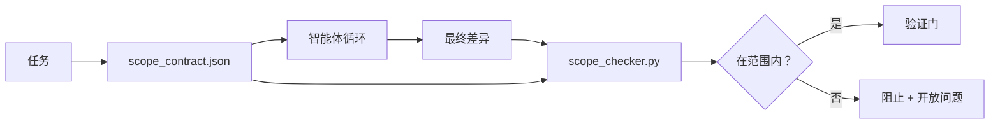

# 范围契约与任务边界

> 模型不知道工作在哪里结束。范围契约是一份每个任务的文件，说明工作从哪里开始、在哪里结束，以及如何在其溢出时回滚。契约把"保持在范围内"从愿望变成检查。

**类型：** 构建型
**语言：** Python（标准库）
**前置条件：** 阶段 14 · 32（最小工作台）、阶段 14 · 33（规则作为约束）
**时间：** 约 50 分钟

## 学习目标

- 编写一份范围契约，智能体在任务开始时读取，验证者在任务结束时读取。
- 指定允许的文件、禁止的文件、验收标准、回滚计划和批准边界。
- 实现一个范围检查器，对比差异与契约并标记违规。
- 使范围蔓延可见、自动化和可审查。

## 问题

智能体蔓延。任务是"修复登录 bug"。差异触及登录路由、邮件辅助函数、数据库驱动、README 和发布脚本。每个修改在当时都有一个合理的理由。它们合在一起是一个与审查的那个不同变更。

范围蔓延是智能体工作中最不被监控的失败模式，因为智能体以善意叙述每个步骤。修复不是更严格的提示词。修复是磁盘上的一份契约，说明承诺了什么，以及将结果与承诺进行对比的检查。

## 概念



### 范围契约中包含什么

| 字段 | 用途 |
|-------|---------|
| `task_id` | 链接到面板上的任务 |
| `goal` | 审查者可以验证的一句话 |
| `allowed_files` | 智能体可以写入的文件 glob |
| `forbidden_files` | 智能体即使不小心也不能触碰的文件 glob |
| `acceptance_criteria` | 证明完成的测试命令或断言行 |
| `rollback_plan` | 操作员在需要停机时可以执行的一段话 |
| `approvals_required` | 范围外需要明确人类签名的操作 |

没有 `forbidden_files` 的契约是不完整的。负空间是契约的一半。

### Glob，而不是原始路径

真实的仓库会移动文件。将契约固定到 glob（`app/**/*.py`、`tests/test_signup*.py`），这样会话之间的重构不会使契约失效。

### 回滚是范围的一部分

列出如何回滚迫使契约作者思考什么可能出错。你无法回滚的契约是不应该被批准的契约。

### 范围检查是差异检查

智能体写一个差异。检查器读取差异、允许的 glob、禁止的 glob，以及任何运行的验收命令列表。每个违规都是一个带标签的发现，验证门可以拒绝。

## 构建它

`code/main.py` 实现了：

- `scope_contract.json` 模式（JSON Schema 子集，glob 数组）。
- 一个差异解析器，将触及文件列表和运行命令列表转换为 `RunSummary`。
- 一个 `scope_check`，返回针对契约的 `(violations, in_scope, off_scope)`。
- 两次演示运行：一次保持在范围内，一次蔓延。检查器用确切的文件和原因标记蔓延。

运行它：

```
python3 code/main.py
```

输出：契约、两次运行、每次运行的裁决，以及保存的 `scope_report.json`。

## 生产中的真实模式

一个从业者报告，在调用智能体之前用 YAML 编写范围契约（"规范最大化"），兔子洞率在两周内从 52% 降至 21%，而没有改变智能体。契约完成了工作，而不是模型。三个模式使收益持久。

**违规预算，而非二元失败。** `agent-guardrails`（Claude Code、Cursor、Windsurf、Codex 通过 MCP 使用的开源合并门）随任务附带每个任务的 `violationBudget`：预算内的小范围滑移作为警告呈现；只有当预算超过时合并门才拒绝。将 `violationSeverity: "error" | "warning"` 配对。预算是发货的门和被讨厌它的团队禁用的门之间的区别。

**按路径族的严重性不对称。** 对 `docs/**` 的范围外写入通常是 `warn`；对 `scripts/**`、`migrations/**`、`config/prod/**` 的范围外写入总是 `block`。这种不对称必须存在于契约中，而不是运行时，因为它特定于项目并随任务变化。

**时间和网络预算与文件预算并列。** `time_budget_minutes` 字段限制墙钟时间；运行时在超过时拒绝继续而不重新批准。主机名上的 `network_egress` 白名单防止智能体悄悄访问不属于任务一部分的外部 API。这些也是范围维度；文件 glob 是必要的，但不够。

**多契约合并语义（最小特权）。** 当两个范围契约适用时（例如，一个项目范围的契约加一个任务特定的契约），合并方式是：**交集** `allowed_files`（两个契约都必须允许该路径），**并集** `forbidden_files`（任何一个都可以禁止），`time_budget_minutes` 是最严格的（最小值），`approvals_required` 累积。`network_egress` 是 `None` 表示不执行，`[]` 表示拒绝所有，`[...]` 作为白名单；在合并下，`None` 服从另一侧，两个列表取交集，拒绝所有保持拒绝所有。在契约模式中说明这一点，使合并是机械的和可审查的。

## 使用它

生产模式：

- **Claude Code 斜杠命令。** `/scope` 命令写入契约并将其固定为会话上下文。子智能体在行动前读取契约。
- **GitHub PR。** 将契约作为 PR 正文中或作为签入工件推送的 JSON 文件。CI 对合并差异运行范围检查器。
- **LangGraph 中断。** 范围违规触发中断；处理程序询问人类契约需要扩展还是智能体需要退让。

契约随任务一起旅行。当任务关闭时，契约存档在 `outputs/scope/closed/`。

## 交付它

`outputs/skill-scope-contract.md` 为任务描述生成范围契约，并生成一个在每个智能体差异上在 CI 中运行的 glob 感知检查器。

## 练习

1. 添加一个 `network_egress` 字段，列出允许的外部主机。拒绝触碰其他主机的运行。
2. 扩展检查器以对 `docs/**` 软失败、对 `scripts/**` 硬失败。为不对称性辩护。
3. 使契约从 `goal` 字段使用静态规则集（无 LLM）派生 `allowed_files`。在第一个边缘情况下什么会出错？
4. 添加 `time_budget_minutes`，一旦墙钟超过则拒绝继续。
5. 对同一差异运行两个契约。当两者都适用时正确的合并语义是什么？

## 关键术语

| 术语 | 大家怎么说的 | 实际含义 |
|------|----------------|------------------------|
| 范围契约 (Scope contract) | "任务简报" | 每个任务的 JSON，列出允许/禁止的文件、验收、回滚 |
| 范围蔓延 (Scope creep) | "还触碰了..." | 同一任务中被契约排除的文件被更改 |
| 回滚计划 (Rollback plan) | "我们可以回滚" | 停机时操作员运行的一段文字 |
| 批准边界 (Approval boundary) | "需要签名" | 契约中列为需要明确人类批准的操作 |
| 差异检查 (Diff check) | "路径审计" | 将触碰的文件与契约 glob 进行对比 |

## 延伸阅读

- [LangGraph human-in-the-loop interrupts](https://langchain-ai.github.io/langgraph/concepts/human_in_the_loop/)
- [OpenAI Agents SDK tool approval policies](https://platform.openai.com/docs/guides/agents-sdk)
- [logi-cmd/agent-guardrails — merge gates and scope validation](https://github.com/logi-cmd/agent-guardrails) — violation budgets, severity tiers
- [Dev|Journal, Preventing AI Agent Configuration Drift with Agent Contract Testing](https://earezki.com/ai-news/2026-05-05-i-built-a-tiny-ci-tool-to-keep-ai-agent-configs-from-drifting-in-my-repo/) — `--strict` mode without external deps
- [Agentic Coding Is Not a Trap (production logs)](https://dev.to/jtorchia/agentic-coding-is-not-a-trap-i-answered-the-viral-hn-post-with-my-own-production-logs-33d9) — specsmaxxing receipts: 52% → 21%
- [OpenCode permission globs](https://opencode.ai/docs/agents/) — fine-grained per-permission scope
- [Knostic, AI Coding Agent Security: Threat Models and Protection Strategies](https://www.knostic.ai/blog/ai-coding-agent-security) — scope as part of least privilege
- [Augment Code, AI Spec Template](https://www.augmentcode.com/guides/ai-spec-template) — three-tier boundary system (must/ask/never)
- 阶段 14 · 27 — 与范围锁配对的提示注入防御
- 阶段 14 · 33 — 本契约专门化的规则集
- 阶段 14 · 38 — 检查器报告到的验证门