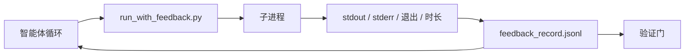

# 运行时反馈循环

> 看不到真实命令输出的智能体只能猜测。反馈运行器捕获 stdout、stderr、退出码和计时，存入结构化记录，下一个回合可以读取。然后智能体根据事实而不是自己对事实的预测做出反应。

**类型：** 构建型
**语言：** Python（标准库）
**前置条件：** 阶段 14 · 32（最小工作台）、阶段 14 · 35（初始化脚本）
**时间：** 约 50 分钟

## 学习目标

- 区分运行时反馈与可观测性遥测。
- 构建一个包装 shell 命令并持久化结构化记录的反馈运行器。
- 确定性截断大输出，使循环保持在 token 预算内。
- 当反馈缺失时拒绝推进循环。

## 问题

智能体说"现在运行测试"。下一条消息说"所有测试通过"。现实是没有测试运行。智能体想象了输出，或者运行了命令但没有读取结果，或者读取了结果但静默截断了失败行。

反馈运行器消除了这个鸿沟。每个命令都通过运行器。每个记录都带有命令、捕获的 stdout 和 stderr、退出码、墙钟时长和一行智能体笔记。智能体在下一个回合读取记录。验证门在任务结束时读取记录。

## 概念



### 反馈记录中包含什么

| 字段 | 为什么重要 |
|-------|----------------|
| `command` | 精确的 argv，无 shell 扩展惊喜 |
| `stdout_tail` | 最后 N 行，确定性截断 |
| `stderr_tail` | 最后 N 行，与 stdout 分开 |
| `exit_code` | 明确的成功信号 |
| `duration_ms` | 暴露慢探测和失控进程 |
| `started_at` | 重放的时间戳 |
| `agent_note` | 智能体写的一行关于其预期的笔记 |

### 截断是确定性的

50 MB 的日志会摧毁循环。运行器用 `...截断了 N 行...` 标记从头尾截断，确定性使得相同输出总是产生相同记录。不采样；智能体需要看到部分（最终错误、最终摘要）位于尾部。

### 反馈与遥测

遥测（阶段 14 · 23，OTel GenAI 约定）供人类操作员跨时间审查运行。反馈供本次运行的下一个回合使用。它们共享字段但存在于不同文件并有不同的保留期。

### 没有反馈则拒绝推进

如果运行器在捕获退出前出错，记录带有 `exit_code: null` 和 `error: <原因>`。智能体循环必须拒绝在 `null` 退出时声称成功。没有退出，没有进展。

## 构建它

`code/main.py` 实现了：

- `run_with_feedback(command, agent_note)`，包装 `subprocess.run`，捕获 stdout/stderr/exit/时长，确定性截断，追加到 `feedback_record.jsonl`。
- 一个小型加载器，将 JSONL 流式读取为 Python 列表。
- 一个演示，运行三个命令（成功、失败、慢），并打印每个命令的最后一条记录。

运行它：

```
python3 code/main.py
```

输出：三条反馈记录追加到 `feedback_record.jsonl`，每个命令的最后一条打印在行内。在重新运行之间追踪文件可以看到循环累积。

## 生产中的真实模式

三个模式使运行器足够坚固以交付。

**写入时脱敏，而非读取时。** 任何触及 stdout 或 stderr 的记录都可能泄露秘密。运行器在 JSONL 追加之前发送一个脱敏通道：剥离匹配 `^Bearer `、`password=`、`api[_-]?key=`、`AKIA[0-9A-Z]{16}`（AWS）、`xox[baprs]-`（Slack）的行。在读取时脱敏是一个隐患；攻击者触及的是磁盘上的文件。每个季度根据生产运行时观察到的秘密格式审计脱敏模式。

**轮换策略，而非单一文件。** 将 `feedback_record.jsonl` 每个文件限制在 1 MB；溢出时轮换到 `.1`、`.2`，删除 `.5`。智能体的循环只读取当前文件，所以运行时成本是有界的。CI 工件存储获取完整的轮换集。没有轮换，文件在每次加载器调用时成为瓶颈。

**父命令 ID 用于重试链。** 每条记录获取 `command_id`；重试携带 `parent_command_id` 指向前一次尝试。审查者的"失败尝试"列表（阶段 14 · 40）和验证门的审计都遵循这条链。没有这个链接，重试看起来像独立成功，审计隐藏了失败历史。

## 使用它

生产模式：

- **Claude Code Bash 工具。** 该工具已经捕获 stdout、stderr、exit 和时长。本课中的运行器是任何智能体产品的框架无关等价物。
- **LangGraph 节点。** 在任何 shell 节点上包装运行器，使记录在图状态之外持久化。
- **CI 日志。** 将 JSONL 管道传输到 CI 工件存储；审查者可以在不重新运行会话的情况下重放任何命令。

运行器是一个薄包装，因为它拥有记录的形状，在每个框架迁移中都能存活。

## 交付它

`outputs/skill-feedback-runner.md` 生成一个项目特定的 `run_with_feedback.py`，包含正确的截断预算、一个连接到工作台的 JSONL 写入器，以及一个智能体在每个回合读取的加载器。

## 练习

1. 每条记录添加一个 `cwd` 字段，这样从不同目录运行的相同命令可以区分。
2. 添加一个 `redaction` 步骤，剥离匹配 `^Bearer ` 或 `password=` 的行。在一个夹具记录上测试。
3. 将 `feedback_record.jsonl` 总大小限制在 1 MB，轮换到 `.1`、`.2` 文件。为轮换策略辩护。
4. 添加 `parent_command_id`，使重试链可见：哪个命令产生了下一个命令消耗的输入。
5. 将 JSONL 管道传输到一个小型 TUI，高亮最新的非零退出。TUI 必须显示的八个关键功能，使其在审查中有用。

## 关键术语

| 术语 | 大家怎么说的 | 实际含义 |
|------|----------------|------------------------|
| 反馈记录 (Feedback record) | "运行日志" | 结构化 JSONL 条目，包含命令、输出、退出、时长 |
| 尾部截断 (Tail truncation) | "修剪日志" | 确定性的头尾捕获，使记录适合 token 预算 |
| 空时拒绝 (Refuse-on-null) | "阻止缺失数据" | 当 `exit_code` 为 null 时循环不得推进 |
| 智能体笔记 (Agent note) | "预期标签" | 智能体在读取结果前写的一行预测 |
| 遥测分裂 (Telemetry split) | "两个日志文件" | 下一个回合的反馈，操作员的遥测 |

## 延伸阅读

- [OpenTelemetry GenAI semantic conventions](https://opentelemetry.io/docs/specs/semconv/gen-ai/)
- [Anthropic, Effective harnesses for long-running agents](https://www.anthropic.com/engineering/effective-harnesses-for-long-running-agents)
- [Guardrails AI x MLflow — deterministic safety, PII, quality validators](https://guardrailsai.com/blog/guardrails-mlflow) — redaction patterns as regression tests
- [Aport.io, Best AI Agent Guardrails 2026: Pre-Action Authorization Compared](https://aport.io/blog/best-ai-agent-guardrails-2026-pre-action-authorization-compared/) — pre/post-tool capture
- [Andrii Furmanets, AI Agents in 2026: Practical Architecture for Tools, Memory, Evals, Guardrails](https://andriifurmanets.com/blogs/ai-agents-2026-practical-architecture-tools-memory-evals-guardrails) — observability surfaces
- 阶段 14 · 23 — OTel GenAI 约定的遥测方面
- 阶段 14 · 24 — 智能体可观测性平台（Langfuse、Phoenix、Opik）
- 阶段 14 · 33 — 要求在声明完成前有反馈的规则
- 阶段 14 · 38 — 读取 JSONL 的验证门