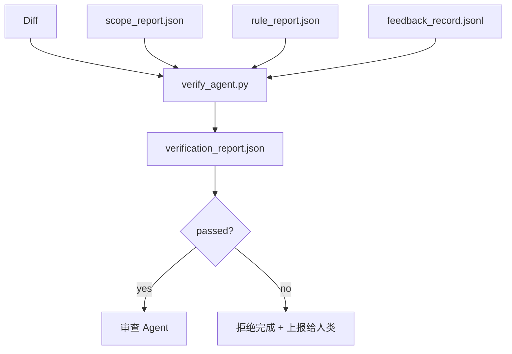

# 验证门控

> Agent 不能自行宣布工作完成。验证门控读取范围契约、反馈日志、规则报告和 diff，回答一个核心问题：任务真的完成了吗？如果门控说不，任务就没完成，无论对话里怎么说。

**类型：** 构建型
**语言：** Python（标准库）
**前置条件：** 阶段 14 · 33（规则）、阶段 14 · 36（范围）、阶段 14 · 37（反馈）
**时间：** 约 55 分钟

## 学习目标

- 将验证门控定义为一个针对工作台工件进行运算的确定性函数。
- 将规则报告、范围报告、反馈记录和 diff 合并为单一裁决。
- 发出一份 `verification_report.json`，供审查 Agent 和 CI 读取。
- 拒绝在任意 block 级别失败的情况下推进任务，无例外。

## 问题

Agent 太容易宣告成功了。三种失败形态占主导：

- "看起来不错。" 模型读取了自己的 diff，认为自己是对的。
- "测试通过了。" 信心满满地说。但没有测试实际运行的记录。
- "验收标准满足了。" 验收标准被宽松解读，足以包含"任何看起来像完成的东西"。

工作台的修复方案是一个单一的验证门控，它读取 Agent 已经生成的工件并做出判断。门控是确定性的。门控在版本控制中。门控接入 CI。Agent 无法贿赂它。

## 概念



### 门控检查什么

| 检查项 | 来源工件 | 严重级别 |
|-------|-----------------|----------|
| 所有验收命令都已运行 | `feedback_record.jsonl` | block |
| 所有验收命令都退出码为 0 | `feedback_record.jsonl` | block |
| 范围检查无禁止写入 | `scope_report.json` | block |
| 范围检查无超出范围写入 | `scope_report.json` | block 或 warn |
| 所有 block 级别规则通过 | `rule_report.json` | block |
| 反馈中无 `null` 退出码 | `feedback_record.jsonl` | block |
| 触及的文件匹配 `scope.allowed_files` | 两者 | warn |

`warn` 结果注释裁决；`block` 结果阻止 `passed: true`。

### 确定性，而非概率性

门控必须对相同的工件集每次产生相同的裁决。不使用 LLM 评判。LLM 评判属于审查侧（阶段 14 · 39），那里的目标是定性评估，而非状态判定。

### 一个报告，一个路径

门控为每个任务收尾发出一份 `verification_report.json`，写入 `outputs/verification/<task_id>.json`。CI 消费同一路径。多个不同路径的门控会分裂真相来源。

### 无例外地拒绝

Block 级别的结果不能被 Agent 覆盖。只能被人类覆盖，需记录 `override_reason` 和 `overridden_by` 用户 ID。覆盖是一个签名变更，不是 Agent 的决定。

## 构建它

`code/main.py` 实现：

- 每个输入工件的加载器，全部为本地存根，使课程自包含。
- 一个 `verify(task_id, artifacts) -> VerdictReport` 纯函数。
- 一个打印机，显示每个检查的结果和最终通过/失败。
- 三个任务场景的演示：干净通过、范围蔓延、缺少验收。

运行它：

```
python3 code/main.py
```

输出：三个裁决报告，每个保存在脚本旁边。

## 实际使用中的生产模式

四种模式将门控从"又一个 lint 任务"提升为"决定性边界"。

**纵深防御，而非单一门控。** 预提交钩子 → CI 状态检查 → 预工具授权钩子 → 预合并门控。每一层都是确定性的，因此某一层的失败会被下一层捕获。microservices.io 的 2026 年 3 月 playbook 明确指出：预提交钩子是不可绕过的，因为与模型端技能不同，它不依赖于 Agent 遵循指令。验证门控位于 CI / 预合并层。

**通过确定性检查防御，模型评判仅用于细微之处。** Anthropic 的 2026 混合规范配对：可验证的奖励（单元测试、schema 检查、退出码）回答"代码解决问题了吗？"—— LLM 量规回答"代码可读、安全、符合风格吗？"门控运行第一类；审查侧（阶段 14 · 39）运行第二类。混淆它们会 collapse 信号。

**签名覆盖日志，而非 Slack 讨论串。** 每次覆盖都在 `outputs/verification/overrides.jsonl` 中发出一行，包含：时间戳、结果代码、原因、签名用户、当前 HEAD 提交。运行时拒绝任何缺少签名的覆盖；审计追踪由 git 管理。这是覆盖策略与覆盖表演之间的分界线。

**覆盖率下限作为一等公民检查。** `coverage_report.json` 馈入 `coverage_floor` 检查（默认 80%）。如果测得的覆盖率降至下限以下，或比上一次合并的下限低超过 1 个百分点，门控失败。没有这个检查，Agent 会悄悄删除失败的测试，验证报告仍然一片绿。

**`--strict` 模式将 warn 提升为 block。** 对于发布分支、阻止合并的 PR 或事后排查，`--strict` 将每个警告变为硬失败。该标志按分支选择加入；不是全局默认，因为严格模式会腐蚀日常工作流程。

## 使用它

生产模式：

- **CI 步骤。** `verify_agent` 作业对 Agent 的最终工件运行门控。合并保护在没有 `passed: true` 的情况下拒绝。
- **预交接钩子。** Agent 运行时在生成交接文档前调用门控。没有绿色裁决就不交接。
- **人工分类。** 当 Agent 声称成功而人类怀疑时，运营商读取报告。

门控是工作台流程中的决定性边界。其他所有表面都在它之前。

## 交付它

`outputs/skill-verification-gate.md` 将门控接入特定项目：哪些验收命令馈入，哪些规则是 block 级别，哪些超出范围的写入可容忍，覆盖审计日志如何存储。

## 练习

1. 添加 `coverage_floor` 检查：测试命令必须生成覆盖率至少 80% 的报告。决定哪个工件携带该下限。
2. 支持 `--strict` 模式，将每个 `warn` 提升为 `block`。记录 strict 模式是正确默认的情况。
3. 让门控额外生成 Markdown 摘要。论证哪些字段属于摘要。
4. 添加 `time_since_last_human_touch` 检查：在人类按键 60 秒内编辑的任何文件免于超出范围标记。
5. 在你产品的真实 Agent diff 上运行门控。有多少发现是真实的，多少是噪音？门控需要在哪里成长？

## 关键术语

| 术语 | 大家怎么说 | 实际含义 |
|------|----------------|------------------------|
| 验证门控 | "阻止事情的检查" | 对工作台工件进行运算的确定性函数，产生通过/失败裁决 |
| Block 严重级别 | "硬失败" | 阻止 `passed: true` 且需要签名覆盖的结果 |
| 覆盖日志 | "我们为什么让它通过" | 带有原因和用户 ID 的签名条目，由审查审计 |
| 验收命令 | "证明" | 一个 shell 命令，其零退出意味着 `done` |
| 一个报告路径 | "真相来源" | `outputs/verification/<task_id>.json`，CI 和人类都消费 |

## 延伸阅读

- [Anthropic, Harness design for long-running application development](https://www.anthropic.com/engineering/harness-design-long-running-apps)
- [OpenAI Agents SDK guardrails](https://platform.openai.com/docs/guides/agents-sdk/guardrails)
- [microservices.io, GenAI dev platform: guardrails](https://microservices.io/post/architecture/2026/03/09/genai-development-platform-part-1-development-guardrails.html) — 预提交和 CI 之间的纵深防御
- [ICMD, The 2026 Playbook for Agentic AI Ops](https://icmd.app/article/the-2026-playbook-for-agentic-ai-ops-guardrails-costs-and-reliability-at-scale-1776661990431) — 审批门控阶梯（草稿 → 审批 → 阈值下自动）
- [Type-Checked Compliance: Deterministic Guardrails (arXiv 2604.01483)](https://arxiv.org/pdf/2604.01483) — Lean 4 作为确定性门控的上界
- [logi-cmd/agent-guardrails — merge gate spec](https://github.com/logi-cmd/agent-guardrails) — 范围 + 变更测试门控
- [Guardrails AI x MLflow](https://guardrailsai.com/blog/guardrails-mlflow) — 确定性验证器作为 CI 评分器
- [Akira, Real-Time Guardrails for Agentic Systems](https://www.akira.ai/blog/real-time-guardrails-agentic-systems) — 预/后工具门控
- 阶段 14 · 27 — 提示注入防御（门控的对抗配对）
- 阶段 14 · 36 — 门控执行的范围契约
- 阶段 14 · 37 — 门控评分的反馈日志
- 阶段 14 · 39 — 门控交接给的审查 Agent