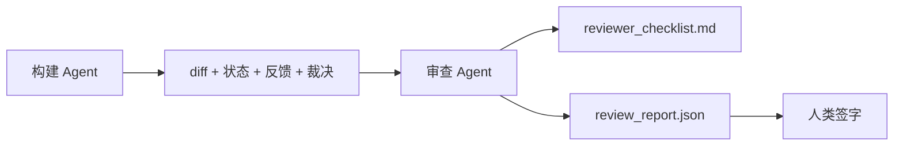

# 审查 Agent：将构建者与评判者分离

> 写代码的 Agent 不能给自己的作品评分。审查者是一个带不同系统提示、不同目标且对构建者所有产物只有只读访问权限的第二循环。构建者与审查者之间的 gap 是大多数可靠性所在。

**类型：** 构建型
**语言：** Python（标准库）
**前置条件：** 阶段 14 · 38（验证门控）
**时间：** 约 55 分钟

## 学习目标

- 阐述为什么同一 Agent 不能可靠地审查自己的工作。
- 构建一个消费构建者产物并发出结构化审查报告的审查者 Agent 循环。
- 编写一个对特定维度而非感觉评分的审查量规。
- 将审查者接入工作台，使人工审查步骤从真实工件开始。

## 问题

你让 Agent 修一个 bug。它编辑了四个文件，运行了测试，报告完成。验证门控（阶段 14 · 38）确认验收运行了，范围守住了。门控说 `passed: true`。你合并了。两天后你发现修复解决了 bug 的错误一半。

验收是必要条件，非充分条件。审查者问验收无法问的问题：这是解决了正确的问题吗？它是否在未标记的情况下扩大了范围？它是否记录了应该被质疑的假设？它是否将工作台留在了下一次会话可以接手的状态？

## 概念



### 审查量规

五个维度，每个 0 到 2 分。

| 维度 | 问题 |
|-----------|----------|
| 问题契合度 | 变更是否解决了任务本身，而非一个附近的任务？ |
| 范围纪律 | 编辑是否限制在契约内，还是契约被故意扩大了？ |
| 假设 | 所有隐藏的假设是否都写在了某个可审查的地方？ |
| 验证质量 | 验收命令是否真正证明了目标，还是只证明了一个更弱的版本？ |
| 交接就绪度 | 下一个会话能否从前一个状态干净地接手？ |

满分 10 分。低于 7 分是软失败；低于 5 分是硬失败。

### 审查者是独立角色，不是独立模型

你可以用与构建者相同的模型运行审查者。纪律在于角色分离：不同的系统提示、不同的输入、不写入 diff 的权限。姿态的改变就是信号的改变。

### 审查者不能编辑 diff

审查者读取 diff、状态、反馈、裁决。它写报告。它不打补丁 diff。如果报告说"修复这个"，下一个构建者回合做修复；审查者回去做审查。混合角色会破坏 gap。

### 审查量规与验证门控

门控（阶段 14 · 38）检查确定性事实：验收是否运行了、规则是否通过了、范围是否守住了。审查者做定性判断：这是正确的工作吗，它有文档记录吗，交接可用吗。两者都需要。

## 构建它

`code/main.py` 实现：

- 一个 `ReviewerInputs` 数据类，捆绑审查者读取的产物。
- 一个量规评分器，每个维度一个函数。每个函数是确定性的，在课程中是存根级别；真实实现会调用 LLM。
- 一个 `review_report.json` 写入器，包含五个分数、总分和一个裁决（`pass`、`soft_fail`、`hard_fail`）。
- 两个演示案例：一个干净的变更和一个"正确测试、错误问题"的变更。

运行它：

```
python3 code/main.py
```

输出：两个写入磁盘的审查报告，以及一个维度数分的控制台表格。

## 实际使用中的生产模式

实际数据：Cloudflare 的 2026 年 4 月 AI 代码审查系统在 30 天内跨 5,169 个仓库的 48,095 个合并请求运行了 131,246 次审查运行。中位审查在 3 分 39 秒完成。最多七个专业审查者（安全、性能、代码质量、文档、发布管理、合规、工程 Codex）在审查协调器下并行运行，该协调器对发现进行去重并判断严重级别。顶级模型仅保留给协调器；专业审查者在更便宜的层级运行。

四种模式使这种规模的工作成为可能。

**专业池，而非一个大审查者。** 一个带 5 维度量规的审查者适用于 solo 仓库。一旦代码库有了安全关键、性能关键和文档表面，就拆分为专业审查者，每个有更小的提示。协调器做去重；专业审查者永远不需要运行完整的量规。模型层级分离自然产生：便宜的专业审查者，昂贵的协调器。

**偏差缓解作为设计需求，而非优化。** LLM 评判者表现出四种可靠偏差（Adnan Masood，2026 年 4 月）：位置偏差（GPT-4 在 (A,B) vs (B,A) 顺序上约 40% 不一致）、冗长偏差（~15% 分数膨胀朝向更长输出）、自我偏好（评判者偏爱来自同一模型家族的输出）、权威（评判者对已知作者引用给分过高）。缓解措施：评估两种顺序且仅计算一致获胜；使用 1-4 量表明确奖励简洁；在模型家族间轮换评判者；在评分前剥离作者姓名。

**校准集，而非感觉。** 一个包含已知正确裁决的 10-20 个任务历史集。每次提示变更时对校准集运行审查者。如果与历史记录的一致性低于 80%，审查者发布前量规需要修订。这是每个团队最终都会重新发现的；最好从一开始就以此为基础。

**与门控的混合规范。** 验证门控（阶段 14 · 38）处理确定性检查（验收是否运行了、测试是否通过了、范围是否守住了）。审查者处理语义检查（这是正确的工作吗，假设有文档记录吗，交接可用吗）。Anthropic 的 2026 年指导明确说明这种分离：不要让审查者重做门控已经证明的事情。

## 使用它

生产模式：

- **Claude Code 子 Agent。** 构建者关闭任务后，审查子 Agent 运行。它用维量分数在 PR 上发布评论。
- **OpenAI Agents SDK 交接。** 构建者在任务完成时交接给审查者。审查者可以交回发现列表，或上报给人类。
- **双模型配对。** 构建者在更快更便宜的模型上运行。审查者在更强但上下文更小的模型上运行，专注于判断。

审查者是工作台在人类无法自行完成每项审查时生长的第二双眼睛。

## 交付它

`outputs/skill-reviewer-agent.md` 生成一个针对项目的审查量规、一个接入构建者产物的审查者 Agent 存根，以及与验证门控的集成，使人工审查从书面报告而非空白页面开始。

## 练习

1. 添加一个特定于你产品领域的第六维度。论证为什么它不能被现有五个维度吸收。
2. 用两个不同的系统提示（简洁、冗长）运行审查者。哪个更可能产生人类愿意阅读的报告？
3. 添加每个维度的 `confidence` 字段。当最低维度置信度低于 0.6 时拒绝发出报告。
4. 构建校准集：10 个有已知正确裁决的历史任务收尾。在它们上面运行审查者。它在哪里与历史记录不一致？
5. 添加"请求更多证据"功能：审查者可以在评分前请求构建者进行特定测试运行。什么是正确的回退以防止循环？

## 关键术语

| 术语 | 大家怎么说 | 实际含义 |
|------|----------------|------------------------|
| 审查量规 | "检查清单" | 五维度 0-2 评分，每个维度带有书面问题 |
| 软失败 | "需要修订" | 总分低于 7；构建者获得要处理的发现 |
| 硬失败 | "拒绝" | 总分低于 5 或任何维度为 0；停止并上报给人类 |
| 角色分离 | "不同提示" | 同一模型可以充当两个角色；纪律在于输入和姿态 |
| 置信度下限 | "不发出低信号报告" | 当量规不确定时拒绝发出裁决 |

## 延伸阅读

- [OpenAI Agents SDK handoffs](https://platform.openai.com/docs/guides/agents-sdk/handoffs)
- [Anthropic Claude Code subagents](https://docs.anthropic.com/en/docs/agents-and-tools/claude-code/sub-agents)
- [Cloudflare, Orchestrating AI Code Review at Scale](https://blog.cloudflare.com/ai-code-review/) — 7 专业审查者 + 协调器架构，131k 次运行 / 30 天
- [Agent-as-a-Judge: Evaluating Agents with Agents (OpenReview / ICLR)](https://openreview.net/forum?id=DeVm3YUnpj) — DevAI 基准，366 个分层解决方案需求
- [Adnan Masood, Rubric-Based Evaluations and LLM-as-a-Judge: Methodologies, Biases, Empirical Validation](https://medium.com/@adnanmasood/rubric-based-evals-llm-as-a-judge-methodologies-and-empirical-validation-in-domain-context-71936b989e80) — 四种偏差和缓解措施
- [MLflow, LLM-as-a-Judge Evaluation](https://mlflow.org/llm-as-a-judge) — 分离构建者/评估者的生产工具
- [LangChain, How to Calibrate LLM-as-a-Judge with Human Corrections](https://www.langchain.com/articles/llm-as-a-judge) — 校准集工作流
- [Evidently AI, LLM-as-a-judge: a complete guide](https://www.evidentlyai.com/llm-guide/llm-as-a-judge)
- [Arize, LLM as a Judge — Primer and Pre-Built Evaluators](https://arize.com/llm-as-a-judge/)
- 阶段 14 · 05 — 自我改进和 CRITIC（单 Agent 自我审查基准）
- 阶段 14 · 30 — 评估驱动的 Agent 开发（校准集生成器）
- 阶段 14 · 38 — 审查者读取的验证门控
- 阶段 14 · 40 — 审查报告馈入的交接包