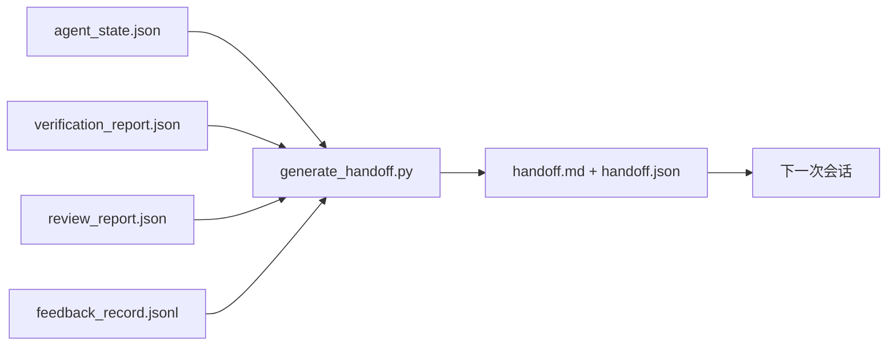

# 多会话交接

> 会话即将结束。工作没有。交接包是将"Agent 工作了一小时"转化为"下一次会话第一分钟就高效工作"的工件。有意构建，而非事后补救。

**类型：** 构建型
**语言：** Python（标准库）
**前置条件：** 阶段 14 · 34（仓库内存）、阶段 14 · 38（验证）、阶段 14 · 39（审查者）
**时间：** 约 50 分钟

## 学习目标

- 识别每个交接包需要的七个字段。
- 从工作台工件生成交接包，无需手写正文。
- 将大型反馈日志压缩为交接大小的摘要。
- 使下一次会话的第一个动作具有确定性。

## 问题

会话结束。Agent 说"太好了，我们取得了进展"。下一次会话打开。下一个 Agent 问"我们停在哪里了？"第一个 Agent 的答案没了。下一个 Agent 重新发现、重新运行相同命令、重新问人类相同问题，花了 30 分钟恢复前一个会话最后 30 秒的工作。

糟糕交接的成本在任务生命周期内每次会话都要支付。修复方案是在会话结束时自动生成的一个包：什么变了、为什么、尝试了什么、什么失败了、还剩什么、下次第一步做什么。

## 概念



### 每个交接都携带的七个字段

| 字段 | 它回答的问题 |
|-------|---------------------|
| `summary` | 一段关于做了什么的话 |
| `changed_files` | 一眼看到 diff |
| `commands_run` | 实际执行了什么 |
| `failed_attempts` | 尝试了什么以及为什么不行 |
| `open_risks` | 下一次会话可能遇到的坑，带严重级别 |
| `next_action` | 下一次会话采取的第一个具体步骤 |
| `verdict_pointer` | 验证和审查报告的路径 |

`next_action` 字段是承载重量的那个。除了 `next_action` 之外包含所有东西的交接是状态报告，不是交接。

### 交接是生成的，不是写的

手写的交接是在艰难日子里会被跳过的交接。生成器读取工作台工件并发出包。Agent 的工作是让生成器可以总结的工作台状态，而不是写摘要。

### 两种形式：人类可读和机器可读

`handoff.md` 是人类读取的。`handoff.json` 是下一个 Agent 加载的。两者来自相同的源工件。如果它们出现分歧，以 JSON 为准。

### 反馈日志压缩

完整的 `feedback_record.jsonl` 可能有数百条记录。交接只携带最后 K 条加上每条非零退出的记录。下一次会话如果需要可以加载完整日志，但包保持小巧。

## 构建它

`code/main.py` 实现：

- 一个加载器，将状态、裁决、审查和反馈收集到一个 `WorkbenchSnapshot` 中。
- 一个 `generate_handoff(snapshot) -> (markdown, payload)` 函数。
- 一个过滤器，选择最后 K 条反馈记录加上所有非零退出。
- 一个演示运行，将 `handoff.md` 和 `handoff.json` 写在脚本旁边。

运行它：

```
python3 code/main.py
```

输出：打印的交接正文，加上磁盘上的两个文件。

## 实际使用中的生产模式

Codex CLI、Claude Code 和 OpenCode 各自采用不同的压缩策略；结构化交接包坐落在三者之上。

**压缩策略各异；包 schema 不变。** Codex CLI 的 POST /v1/responses/compact 是一个服务器端不透明的 AES blob（OpenAI 模型的快速路径）；后备方案是本地"交接摘要"，作为 `_summary` 用户角色消息追加。Claude Code 在 95% 上下文时运行五阶段渐进压缩。OpenCode 做基于时间戳的消息隐藏加上 5 个标题的 LLM 摘要。三种不同机制，相同需求：将压缩后存活的内容序列化为可移植的工件。包就是那个工件。

**新会话交接不是压缩。** 压缩延长一个会话；交接干净地关闭一个并启动下一个。Hermes Issue #20372 的框架（2026 年 4 月）是对的：当原地压缩开始降级时，Agent 应该写一个紧凑交接，结束会话，在新上下文中恢复。包使这种转换廉价。错误是一直压缩到质量崩溃；修复是为一个早的、干净的交接做预算。

**每个分支和主题一个活跃交接。** 多 Agent 协调在过时交接上比在糟糕模型输出上更容易崩溃。始终包含 `branch`、`last_known_good_commit` 和 `status` 为 `active | superseded | archived`。过时交接被归档；只有活跃的交接驱动下一次会话。这是交接-as-笔记与交接-as-状态的区别。

**在 50-75% 上下文时收尾，而非撞墙。** 手写模式 playbook（CLAUDE.md + HANDOVER.md）报告在会话在 50-75% 上下文预算而非 95% 时结束效果最好。包生成器在压缩伪影污染源状态之前干净地运行。在上下文完整时写入成本低；在模型已经丢失位置时写入成本高。

## 使用它

生产模式：

- **会话结束钩子。** 运行时在用户关闭聊天时触发生成器。包进入 `outputs/handoff/<session_id>/`。
- **PR 模板。** 生成器的 markdown 也可以作为 PR 正文。审查者无需打开其他五个文件就能阅读。
- **跨 Agent 交接。** 用一个产品（Claude Code）构建，用另一个（Codex）继续。包是通用语言。

包很小、规律、成本低廉。每次会话都会产生成本节约。

## 交付它

`outputs/skill-handoff-generator.md` 生成一个针对项目工件路径调优的生成器、一个运行它的会话结束钩子，以及一个 `handoff.json` schema，下一个 Agent 在启动时读取。

## 练习

1. 添加一个 `assumptions_to_validate` 字段，呈现构建者记录但审查者未评分为 1 分以上的每个假设。
2. 对失败运行与通过运行使用不同的反馈摘要修剪。论证不对称性。
3. 包含一个"给人类的问题"列表。什么问题阈值使问题进入包而非进入聊天消息？
4. 使生成器幂等：运行两次产生相同的包。这需要什么稳定？
5. 添加一个"下一次会话前置条件"部分，列出下一次会话在行动前必须加载的确切工件。

## 关键术语

| 术语 | 大家怎么说 | 实际含义 |
|------|----------------|------------------------|
| 交接包 | "会话摘要" | 携带七个字段的生成工件，markdown 和 JSON 都有 |
| 下一个动作 | "首先做什么" | 开始下一次会话的那一个具体步骤 |
| 反馈压缩 | "日志摘要" | 最后 K 条记录加上每条非零退出 |
| 状态报告 | "我们做了什么" | 缺少 `next_action` 的文档；有用，但不是交接 |
| 裁决指针 | "收据" | 验证和审查报告的路径，用于可追溯性 |

## 延伸阅读

- [Anthropic, Effective harnesses for long-running agents](https://www.anthropic.com/engineering/effective-harnesses-for-long-running-agents)
- [OpenAI Agents SDK handoffs](https://platform.openai.com/docs/guides/agents-sdk/handoffs)
- [Codex Blog, Codex CLI Context Compaction: Architecture, Configuration, Managing Long Sessions](https://codex.danielvaughan.com/2026/03/31/codex-cli-context-compaction-architecture/) — POST /v1/responses/compact 和本地后备
- [Justin3go, Shedding Heavy Memories: Context Compaction in Codex, Claude Code, OpenCode](https://justin3go.com/en/posts/2026/04/09-context-compaction-in-codex-claude-code-and-opencode) — 三供应商压缩比较
- [JD Hodges, Claude Handoff Prompt: How to Keep Context Across Sessions (2026)](https://www.jdhodges.com/blog/ai-session-handoffs-keep-context-across-conversations/) — CLAUDE.md + HANDOVER.md，50-75% 上下文预算
- [Mervin Praison, Managing Handoffs in Multi-Agent Coding Sessions: Fresh Context Without Losing Continuity](https://mer.vin/2026/04/managing-handoffs-in-multi-agent-coding-sessions-fresh-context-without-losing-continuity/) — 分布式系统框架
- [Hermes Issue #20372 — 压缩变得危险时自动新会话交接](https://github.com/NousResearch/hermes-agent/issues/20372)
- [Hermes Issue #499 — 上下文压缩质量大修](https://github.com/NousResearch/hermes-agent/issues/499) — Codex CLI 中的面向交接的提示
- [Microsoft Agent Framework, Compaction](https://learn.microsoft.com/en-us/agent-framework/agents/conversations/compaction)
- [OpenCode, Context Management and Compaction](https://deepwiki.com/sst/opencode/2.4-context-management-and-compaction)
- [LangChain, Context Engineering for Agents](https://www.langchain.com/blog/context-engineering-for-agents)
- 阶段 14 · 34 — 生成器读取的状态文件
- 阶段 14 · 38 — 包指向的验证裁决
- 阶段 14 · 39 — 打包到包中的审查报告