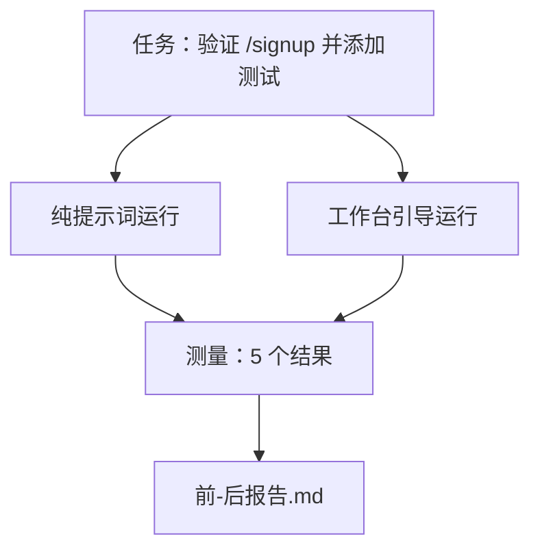

# 在真实代码仓库上的工作台

> 十一个关于表面的教训，如果不能在真实代码库中经受住检验，就毫无价值。本课在同一个小型示例应用上运行同一任务两次：纯提示词版 versus 工作台引导版。数字会说话。

**类型：** 构建型
**语言：** Python（标准库）
**前置条件：** 阶段 14·32 至 14·40
**时间：** 约 60 分钟

## 学习目标

- 在一个小型应用上将七个工作台表面整合在一起。
- 两次运行同一任务（纯提示词和工作台引导），并测量五个结果。
- 阅读前/后报告，判断哪些表面杠杆效应最大。
- 抵御"但我的模型已经足够好了"的反驳。

## 问题

在玩具任务上的演示无法说服任何人。当一个看起来真实的任务在一个看起来真实的代码仓库中投入生产、失败更少、回滚更少、下一轮会话可以使用的交付物更多时，工作台的价值才能成立。

本课发布了那个看起来真实的代码仓库，并通过两条管道运行同一任务。结果是一份前/后报告，你可以把它交给怀疑者。

## 概念



### 示例应用

`sample_app/` 中的极简 FastAPI 风格处理器：

- `app.py`，含 `/signup`（尚无验证）。
- `test_app.py`，含一条愉快路径测试。
- `README.md` 和 `scripts/release.sh` 作为禁区的诱饵。

### 任务

> 为 `/signup` 添加输入验证：拒绝少于 8 个字符的密码，返回 422 并附带类型化的错误信封。添加一条测试来证明新行为。

### 两条管道

纯提示词：

1. 读取 README。
2. 读取 `app.py`。
3. 编辑文件。
4. 声称完成。

工作台引导：

1. 运行初始化脚本（第 35 课）。
2. 读取范围契约（第 36 课）。
3. 读取状态（第 34 课）。
4. 仅编辑允许范围内的文件。
5. 通过反馈运行器运行验收命令（第 37 课）。
6. 运行验证门（第 38 课）。
7. 运行审查器（第 39 课）。
8. 生成交接（第 40 课）。

### 测量的五个结果

| 结果 | 为什么重要 |
|---------|----------------|
| `tests_actually_run` | 大多数"测试通过"声明无法验证 |
| `acceptance_met` | 证明目标的测试必须是实际运行的测试 |
| `files_outside_scope` | 范围蔓延是主要的隐性失败 |
| `handoff_quality` | 下一轮会话为此付出或受益 |
| `reviewer_total` | 在门之上的定性判断 |

## 构建它

`code/main.py` 针对同一个示例应用固件编排两条管道。两条管道都是脚本化的（循环中无 LLM），因此测量可复现。脚本将对比写入 `before-after-report.md` 和 `comparison.json`。

运行它：

```
python3 code/main.py
```

输出：每个管道结果的控制台表格，markdown 报告保存在脚本旁边，以及供想要绘图的人使用的 JSON。

## 现实中的生产模式

怀疑者的问题是"工作台实际上帮了多少？"2026 年的数字比任何解释都更有说服力。

**Terminal Bench 从 Top-30 到 Top-5，同一模型。** LangChain 的《Agent Harness 剖析》（2026 年 4 月）：一个编码 agent 仅通过更换 harness 就从 30 名之外跃升至 Terminal Bench 2.0 第五名。同样的模型，不同的表面。25 名的差距。

**Vercel 从 80% 到 100%，靠删除工具。** Vercel 报告称删除 agent 80% 的工具将成功率从 80% 提升到 100%。更小的工具表面、更清晰的范围、更少的失败方式。负空间胜出。

**Harvey 仅靠 harness 实现 2 倍准确率。** 法律 agent 仅通过 harness 优化就实现了准确率翻倍以上，无需更换模型。

**88% 的企业 AI agent 项目未能投入生产。** preprint.org 的《Language Agents 的 Harness 工程》（2026 年 3 月）将失败归因于运行时而非推理：过时状态、脆弱的重试、过度生长的上下文、从中间错误中恢复不良。

**长上下文崩溃。** WebAgent 基线在长上下文条件下成功率从 40-50% 下降到 10% 以下，主要来自无限循环和目标丢失。Ralph 循环和交接包的存在就是为了吸收这一点。

**假阴性仍然存在。** 单步事实任务、一行代码的检查、格式化器运行、模型已经逐字记忆的任何内容——这些用纯提示词反而更快。基准测试应该诚实地列举它们，这样工作台就不会被描述为过度工程。

要旨不是"harness 永远胜出"。模型确实会随着时间吸收 harness 技巧。要旨是今天，工程负载落在七个表面上，数字已经证明了这一点。

## 使用它

本课是你在以下情况下引用的案例文件：

- 有人问为什么每个 PR 都带有一个 `agent-rules.md` 和一个范围契约。
- 一个团队想要"就在这个 sprint 中"去掉验证门。
- 一个新的 agent 产品上线，你需要一份可移植的基准来衡量它是否真的节省了时间。

数字比解释更能传播。

## 交付它

`outputs/skill-workbench-benchmark.md` 是一个可移植的评估 harness，它将任何 agent 产品针对项目的示例应用运行两条管道，并报告五个结果。

## 练习

1. 添加第六个结果：到第一次有意义编辑的时间。你如何干净地测量它？
2. 在你的代码库中针对真实的第二天任务运行对比。工作台数字在哪里出现了下滑？
3. 添加一个"假阴性"通过：纯提示词会更快、而工作台开销是真实成本的任务。论证无论如何都要保留工作台。
4. 用真正的 LLM 调用替换脚本化的"agent"。哪些结果会变得更嘈杂？
5. 编写一份面向非工程师的一页摘要。什么能在削减中存活下来？

## 关键术语

| 术语 | 大家怎么说的 | 实际含义 |
|------|----------------|------------------------|
| 示例应用 | "玩具仓库" | 小但足够真实，可以锻炼所有七个表面 |
| 管道 | "工作流" | agent 遵循的表面读写有序序列 |
| 前/后报告 | "收据" | 你交给怀疑者的产物 |
| 假阴性 | "工作台过度工程" | 纯提示词更快的任务；诚实地列举出来很有用 |
| 工作台基准 | "可靠性评分" | 可移植的 harness，在你的代码库上运行对比 |

## 延伸阅读

- [LangChain, The Anatomy of an Agent Harness](https://blog.langchain.com/the-anatomy-of-an-agent-harness/) — Terminal Bench Top-30 到 Top-5 的凭据
- [MongoDB, The Agent Harness: Why the LLM Is the Smallest Part of Your Agent System](https://www.mongodb.com/company/blog/technical/agent-harness-why-llm-is-smallest-part-of-your-agent-system) — Vercel + Harvey 的数字
- [preprints.org, Harness Engineering for Language Agents](https://www.preprints.org/manuscript/202603.1756) — 88% 企业失败率，运行根本原因
- [HN: Improving 15 LLMs at Coding in One Afternoon. Only the Harness Changed](https://news.ycombinator.com/item?id=46988596) — 在 15 个模型上复现
- [Cloudflare, Orchestrating AI Code Review at Scale](https://blog.cloudflare.com/ai-code-review/) — 30 天内 131k 次审查运行在生产中
- [Anthropic, Building Effective Agents](https://www.anthropic.com/research/building-effective-agents)
- 阶段 14·32 至 14·40 — 本课端到端锻炼的表面
- 阶段 14·19 — SWE-bench、GAIA、AgentBench 作为本课补充的宏观基准
- 阶段 14·30 — eval 驱动的 agent 开发，同样的 harness 插入其中