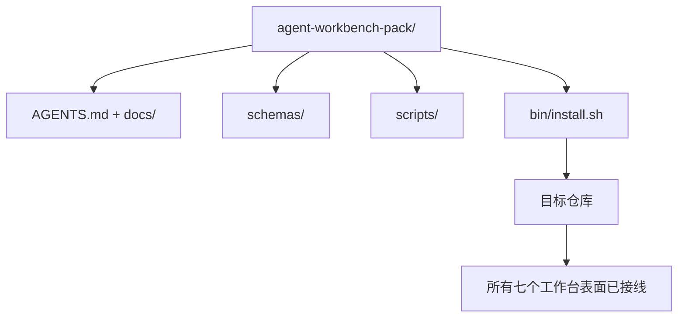

#  capstone 作品集：交付一个可复用的 Agent 工作台套件

> 这条迷你赛道以一个你可以放入任何仓库的套件结束。十一个关于表面的教训压缩进一个目录，你可以 `cp -r` 然后在第二天早上就拥有一个可靠运行的 agent。capstone 是这门课程交易所依托的产物。

**类型：** 构建型
**语言：** Python（标准库）
**前置条件：** 阶段 14·31 至 14·41
**时间：** 约 75 分钟

## 学习目标

- 将七个工作台表面打包成一个可放入的目录。
- 固定模式、脚本和模板，以便新仓库获得已知良好的基线。
- 添加一个单一安装脚本，以幂等方式铺设套件。
- 决定什么留在套件里、什么放在外面，并为每次取舍辩护。

## 问题

一个活在 Google Doc、聊天历史和三个半忘记的脚本中的工作台，每个季度都要重建。疗法是一个版本化套件：一个包含表面、模式、脚本和一个命令安装程序的仓库或目录。

本课结束时，`outputs/agent-workbench-pack/` 已交付到磁盘上，`bin/install.sh` 可以将其放入任何目标仓库。

## 概念



### 套件布局

```
outputs/agent-workbench-pack/
├── AGENTS.md
├── docs/
│   ├── agent-rules.md
│   ├── reliability-policy.md
│   ├── handoff-protocol.md
│   └── reviewer-rubric.md
├── schemas/
│   ├── agent_state.schema.json
│   ├── task_board.schema.json
│   └── scope_contract.schema.json
├── scripts/
│   ├── init_agent.py
│   ├── run_with_feedback.py
│   ├── verify_agent.py
│   └── generate_handoff.py
├── bin/
│   └── install.sh
└── README.md
```

### 什么留在里面，什么放在外面

留在里面：

- 表面模式。它们是契约。
- 上述四个脚本。它们是运行时。
- 四个文档。它们是规则和评分标准。

放在外面：

- 项目特定任务。任务属于目标仓库的面板，不属于套件。
- 供应商 SDK 调用。套件是框架无关的。
- 入职说明文字。套件与团队现有的入职流程相邻，不在其中。

### 安装程序

一个简短的 `bin/install.sh`（或 `bin/install.py`）：

1. 拒绝在没有 `--force` 的情况下覆盖现有套件。
2. 将套件复制到目标仓库。
3. 如果存在 `.github/workflows/`，则接入 CI。
4. 打印后续步骤：填写面板、设置验收命令、运行初始化脚本。

### 版本控制

套件携带一个 `VERSION` 文件。需要迁移的模式增加和脚本更改为主版本递增。只改文档的补丁版本递增。目标仓库的 `agent_state.json` 记录了它初始化时对应的套件版本。

## 构建它

`code/main.py` 将套件组装到课程旁边的 `outputs/agent-workbench-pack/` 中，用本迷你赛道前几课的模式和脚本以及你已经编写的文档来填充。

运行它：

```
python3 code/main.py
```

脚本复制并固定表面，写入 README，打印套件树，然后以零退出。重新运行是幂等的。

## 现实中的生产模式

一个套件只有在它能经受住分叉、更新和不友好的上游时才有价值。四个模式使这成为可能。

**`VERSION` 是契约，不是营销。** 主版本递增需要状态迁移。次版本递增需要检查器重新运行。补丁版本递增只是文档。安装程序在每次安装时都将 `.workbench-version` 写入目标仓库；如果目标仓库的锁与套件的 `VERSION` 不一致，`lint_pack.py` 拒绝发货。这就是 `npm`、`Cargo` 和 `pyproject.toml` 存活 10 年动荡的方式；agent 的特性并不改变这些规则。

**跨工具分发的单一来源。** Nx 发布一个 `nx ai-setup`，从单一配置铺设 `AGENTS.md`、`CLAUDE.md`、`.cursor/rules/`、`.github/copilot-instructions.md` 和一个 MCP 服务器。套件应该做同样的事情；安装程序发出符号链接（`ln -s AGENTS.md CLAUDE.md`），以便单一事实来源分叉到每个编码 agent。分叉套件以支持某个工具而牺牲另一个工具是一种失败模式。

**在非平凡状态上拒绝的 `uninstall.sh`。** 卸载套件不能删除用户的 `agent_state.json`、`task_board.json` 或 `outputs/`。卸载程序删除模式、脚本、文档和 `AGENTS.md`（可选择用 `--keep-agents-md` 退出），如果状态文件有任何未提交的更改则拒绝继续。状态属于用户；套件不拥有它。

**技能即发布。SkillKit 风格的分发。** 套件作为 SkillKit 技能发布：`skillkit install agent-workbench-pack` 从单一来源铺设到 32 个 AI agent。套件仓库是事实来源；SkillKit 是分发渠道。供应商锁定崩塌；七个表面保持不变。

## 使用它

套件交付的三个地方：

- **作为一个你放入仓库的目录。** `cp -r outputs/agent-workbench-pack /path/to/repo`。
- **作为一个公开的模板仓库。** 分叉并自定义，`VERSION` 控制漂移。
- **作为一个 SkillKit 技能。** 接入你的 agent 产品，以便一个命令铺设它。

套件是食谱。每次安装是一份出品。

## 交付它

`outputs/skill-workbench-pack.md` 生成一个针对项目调整的套件：规则根据团队历史打磨，范围 glob 与仓库匹配，评分标准维度扩展了一个特定领域的条目。

## 练习

1. 决定哪个可选的第五个文档值得晋升到规范套件中。为这个取舍辩护。
2. 将安装程序重写为 Python，带有 `--dry-run` 标志。与 bash 相比 Ergonomics 如何？
3. 添加一个 `bin/uninstall.sh`，安全地移除套件，如果状态文件有非平凡历史则拒绝。什么算作非平凡？
4. 添加一个 `lint_pack.py`，当套件偏离 `VERSION` 时失败。为套件自己的仓库在 CI 中接入它。
5. 编写从手摇工作台到本套件的迁移手册。最小化停机时间的操作顺序是什么？

## 关键术语

| 术语 | 大家怎么说的 | 实际含义 |
|------|----------------|------------------------|
| 工作台套件 | "入门套件" | 一个携带所有七个表面的版本化目录 |
| 安装程序 | "安装脚本" | 幂等铺设套件的 `bin/install.sh` |
| 套件版本 | "VERSION" | 模式/脚本更改为主版本递增，仅文档为补丁版本 |
| 可放入的套件 | "cp -r 就能跑" | 套件在第一天无需按仓库定制即可工作 |
| 可分叉模板 | "GitHub 模板" | GitHub 的"使用此模板"可以克隆的公开仓库 |

## 延伸阅读

- 阶段 14·31 至 14·41 — 本套件捆绑的每个表面
- [SkillKit](https://github.com/rohitg00/skillkit) — 跨 32 个 AI agent 安装此技能
- [Nx Blog, Teach Your AI Agent How to Work in a Monorepo](https://nx.dev/blog/nx-ai-agent-skills) — 跨六个工具的单一来源生成器
- [agents.md — 开放规范](https://agents.md/) — 你的套件路由器必须实现的内容
- [HKUDS/OpenHarness](https://github.com/HKUDS/OpenHarness) — 套件等效物的参考实现
- [andrewgarst/agentic_harness](https://github.com/andrewgarst/agentic_harness) — 带评估套件的 Redis 支持参考
- [Augment Code, A good AGENTS.md is a model upgrade](https://www.augmentcode.com/blog/how-to-write-good-agents-dot-md-files) — 套件文档质量栏
- [Anthropic, Effective harnesses for long-running agents](https://www.anthropic.com/engineering/effective-harnesses-for-long-running-agents)
- [Anthropic, Harness design for long-running application development](https://www.anthropic.com/engineering/harness-design-long-running-apps)
- 阶段 14·30 — eval 驱动的 agent 开发，消耗套件的验证门
- 阶段 14·41 — 本套件改进的前/后基准