# 通信协议

> 无法使用相同语言交流的智能体不是团队。他们只是向虚空呐喊的陌生人。

**类型：** 构建
**语言：** TypeScript
**前置条件：** 第14阶段（智能体工程）、第16课01节（为什么需要多智能体）
**时长：** 约120分钟

## 学习目标

- 实现MCP工具发现与调用，使智能体能够使用外部服务器暴露的工具
- 构建A2A智能体卡片和任务端点，允许一个智能体通过HTTP将工作委托给另一个智能体
- 比较MCP（工具访问）、A2A（智能体间协作）、ACP（企业审计）和ANP（去中心化信任），并解释每种协议解决的是什么问题
- 在单一系统中连接多个协议，使智能体通过MCP发现工具，通过A2A委托任务

## 问题背景

你将系统拆分为多个智能体。一个研究员、一个编码员、一个评审员。他们各自的工作都很出色。但现在你需要让他们真正地互相交流。

你的第一个尝试很直接：传递字符串。研究员返回一个文本块，编码员尽可能地解析它。这种方式在编码员误解研究摘要、两个智能体互相等待而死锁、或者需要不同团队构建的智能体协作时就会崩溃。"直接传递字符串"的方法突然就不管用了。

这就是通信协议问题。如果没有智能体之间交换信息的共享契约，多智能体系统就会变得脆弱、无法审计，而且无法扩展到超过你亲自编写的少数几个智能体。

AI生态系统对此提出了四种协议，每种解决不同层面的问题：

- **MCP** 用于工具访问
- **A2A** 用于智能体间协作
- **ACP** 用于企业审计能力
- **ANP** 用于去中心化身份和信任

这节课深入探讨。你将阅读每个规范中的真实线格式，构建可工作的实现，并将所有四种协议连接到一个统一的系统中。

## 核心概念

### 协议格局

将这四种协议想象为不同的层级，每个解决不同的问题：

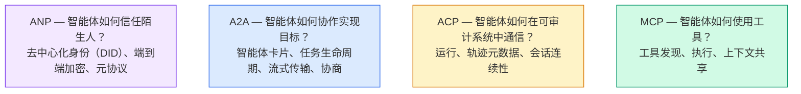

它们不是竞争关系。它们在不同层面解决不同问题。

### MCP（回顾）

MCP在第13阶段有深入讲解。简要回顾：MCP标准化了LLM如何连接外部工具和数据源。它是一种**客户端-服务器**协议，智能体（客户端）发现并调用服务器暴露的工具。

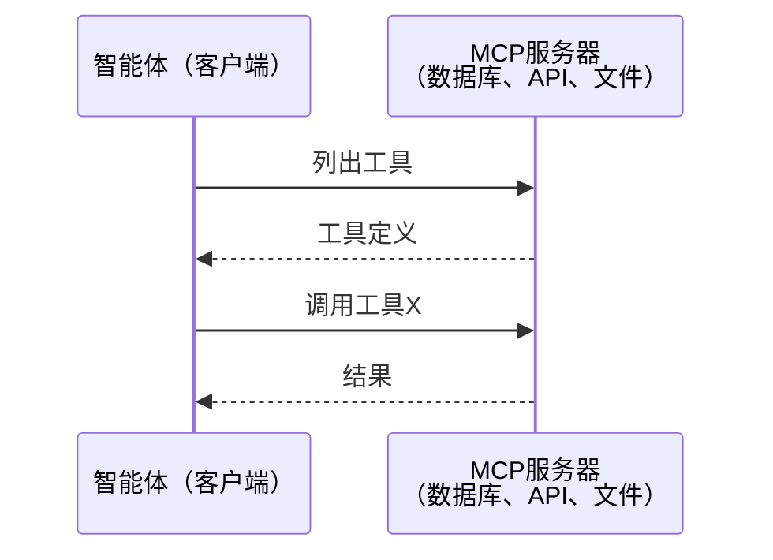

MCP是**智能体到工具**的通信。它不能帮助智能体之间互相交谈。

### A2A（Agent2Agent协议）

**创建者：** Google（现归属Linux Foundation，名为`lf.a2a.v1`）
**规范版本：** 1.0.0
**解决的问题：** 自主智能体如何相互协作、协商和委托任务？

A2A是**点对点智能体协作**的协议。MCP将智能体连接到工具，A2A则将智能体连接到其他智能体。每个智能体在一个已知URL上发布**智能体卡片**，其他智能体通过它来发现、协商和委托任务。

#### A2A工作原理

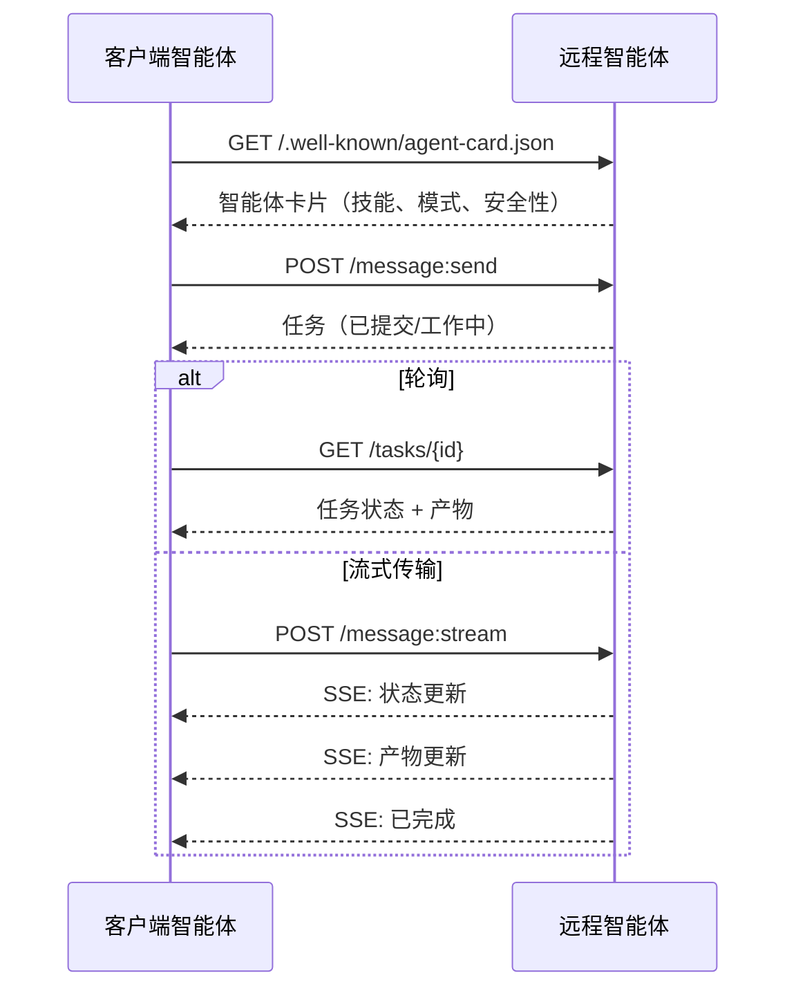

#### 真实的智能体卡片

这是A2A智能体卡片在真实环境中的样子。服务在`GET /.well-known/agent-card.json`：

```json
{
  "name": "Research Agent",
  "description": "Searches documentation and summarizes findings",
  "version": "1.0.0",
  "supportedInterfaces": [
    {
      "url": "https://research-agent.example.com/a2a/v1",
      "protocolBinding": "JSONRPC",
      "protocolVersion": "1.0"
    },
    {
      "url": "https://research-agent.example.com/a2a/rest",
      "protocolBinding": "HTTP+JSON",
      "protocolVersion": "1.0"
    }
  ],
  "provider": {
    "organization": "Your Company",
    "url": "https://example.com"
  },
  "capabilities": {
    "streaming": true,
    "pushNotifications": false
  },
  "defaultInputModes": ["text/plain", "application/json"],
  "defaultOutputModes": ["text/plain", "application/json"],
  "skills": [
    {
      "id": "web-research",
      "name": "Web Research",
      "description": "Searches the web and synthesizes findings",
      "tags": ["research", "search", "summarization"],
      "examples": ["Research the latest changes in React 19"]
    },
    {
      "id": "doc-analysis",
      "name": "Documentation Analysis",
      "description": "Reads and analyzes technical documentation",
      "tags": ["docs", "analysis"],
      "inputModes": ["text/plain", "application/pdf"],
      "outputModes": ["application/json"]
    }
  ],
  "securitySchemes": {
    "bearer": {
      "httpAuthSecurityScheme": {
        "scheme": "Bearer",
        "bearerFormat": "JWT"
      }
    }
  },
  "security": [{ "bearer": [] }]
}
```

需要注意的关键点：
- **技能（Skills）**是智能体能做的事情。每个技能都有ID、标签和支持的输入/输出MIME类型。这是客户端智能体决定远程智能体是否能处理其请求的方式。
- **supportedInterfaces**列出了多种协议绑定。一个智能体可以同时使用JSON-RPC、REST和gRPC。
- **安全性**内置于卡片中。客户端在发出单个请求之前就知道需要什么认证。

#### 任务生命周期

任务是A2A中的核心工作单元。它们经历定义好的状态：

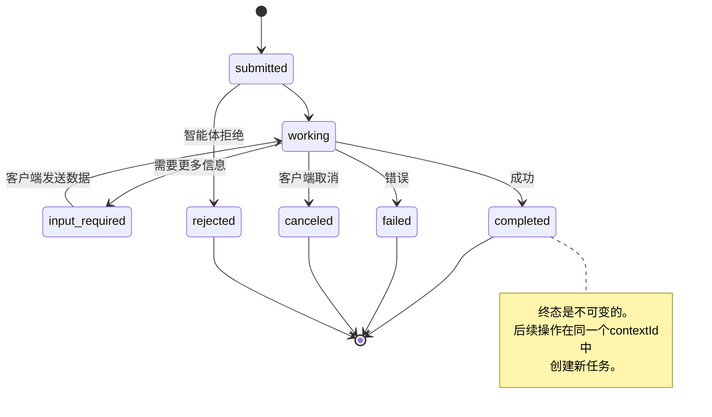

全部8个状态（规范还定义了`UNSPECIFIED`作为哨兵值，此处省略）：

| 状态 | 终态？ | 含义 |
|---|---|---|
| `TASK_STATE_SUBMITTED` | 否 | 已确认，尚未处理 |
| `TASK_STATE_WORKING` | 否 | 正在处理中 |
| `TASK_STATE_INPUT_REQUIRED` | 否 | 智能体需要来自客户端的更多信息 |
| `TASK_STATE_AUTH_REQUIRED` | 否 | 需要认证 |
| `TASK_STATE_COMPLETED` | 是 | 成功完成 |
| `TASK_STATE_FAILED` | 是 | 以错误结束 |
| `TASK_STATE_CANCELED` | 是 | 在完成前被取消 |
| `TASK_STATE_REJECTED` | 是 | 智能体拒绝了任务 |

一旦任务达到终态，它就是不可变的。不会再有进一步的消息。后续操作在同一个`contextId`中创建新任务。

#### 线格式

A2A使用JSON-RPC 2.0。以下是真实消息交换的样子：

**客户端发送任务：**
```json
{
  "jsonrpc": "2.0",
  "id": 1,
  "method": "SendMessage",
  "params": {
    "message": {
      "messageId": "msg-001",
      "role": "ROLE_USER",
      "parts": [{ "text": "研究React 19编译器特性" }]
    },
    "configuration": {
      "acceptedOutputModes": ["text/plain", "application/json"],
      "historyLength": 10
    }
  }
}
```

**智能体返回任务：**
```json
{
  "jsonrpc": "2.0",
  "id": 1,
  "result": {
    "task": {
      "id": "task-abc-123",
      "contextId": "ctx-xyz-789",
      "status": {
        "state": "TASK_STATE_COMPLETED",
        "timestamp": "2026-03-27T10:30:00Z"
      },
      "artifacts": [
        {
          "artifactId": "art-001",
          "name": "research-results",
          "parts": [{
            "data": {
              "findings": [
                "React 19编译器自动记忆化组件",
                "不再需要手动使用useMemo/useCallback",
                "编译器在构建时运行，而非运行时"
              ]
            },
            "mediaType": "application/json"
          }]
        }
      ]
    }
  }
}
```

**通过SSE流式传输：**
```text
POST /message:stream HTTP/1.1
Content-Type: application/json
A2A-Version: 1.0

data: {"task":{"id":"task-123","status":{"state":"TASK_STATE_WORKING"}}}

data: {"statusUpdate":{"taskId":"task-123","status":{"state":"TASK_STATE_WORKING","message":{"role":"ROLE_AGENT","parts":[{"text":"正在搜索文档..."}]}}}}

data: {"artifactUpdate":{"taskId":"task-123","artifact":{"artifactId":"art-1","parts":[{"text":"部分研究结果..."}]},"append":true,"lastChunk":false}}

data: {"statusUpdate":{"taskId":"task-123","status":{"state":"TASK_STATE_COMPLETED"}}}
```

### ACP（智能体通信协议）

**创建者：** IBM / BeeAI
**规范版本：** 0.2.0（OpenAPI 3.1.1）
**状态：** 正在合并到Linux Foundation下的A2A
**解决的问题：** 智能体如何在具有完全可审计性、会话连续性和轨迹跟踪的情况下通信？

ACP是**企业协议**。与许多摘要所说的不同，ACP**不**使用JSON-LD。它是通过OpenAPI定义的简单REST/JSON API。它的特别之处在于**TrajectoryMetadata**：每个智能体响应都可以携带详细日志，记录产生它的推理步骤和工具调用。

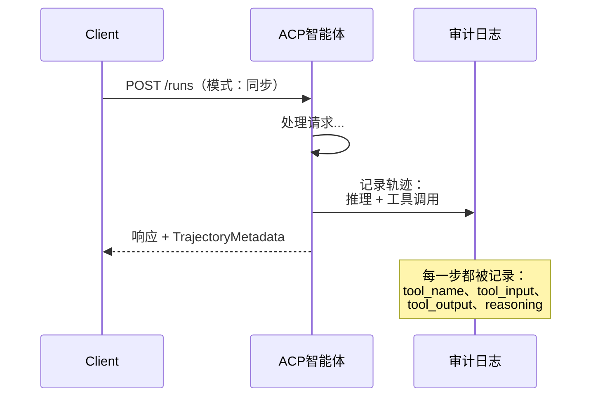

#### ACP中的智能体发现

ACP定义了四种发现方法：

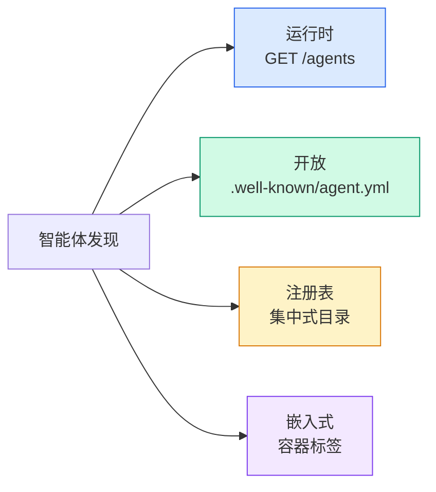

**AgentManifest**比A2A的智能体卡片更简单：

```json
{
  "name": "summarizer",
  "description": "Summarizes documents with source citations",
  "input_content_types": ["text/plain", "application/pdf"],
  "output_content_types": ["text/plain", "application/json"],
  "metadata": {
    "tags": ["summarization", "RAG"],
    "framework": "BeeAI",
    "capabilities": [
      {
        "name": "Document Summarization",
        "description": "Condenses long documents into key points"
      }
    ],
    "recommended_models": ["llama3.3:70b-instruct-fp16"],
    "license": "Apache-2.0",
    "programming_language": "Python"
  }
}
```

#### 运行生命周期

ACP使用"运行（Run）"而不是"任务（Task）"。运行是具有三种模式的智能体执行：

| 模式 | 行为 |
|---|---|
| `sync` | 阻塞。响应包含完整结果。 |
| `async` | 立即返回202。轮询`GET /runs/{id}`获取状态。 |
| `stream` | SSE流。事件在智能体工作时触发。 |

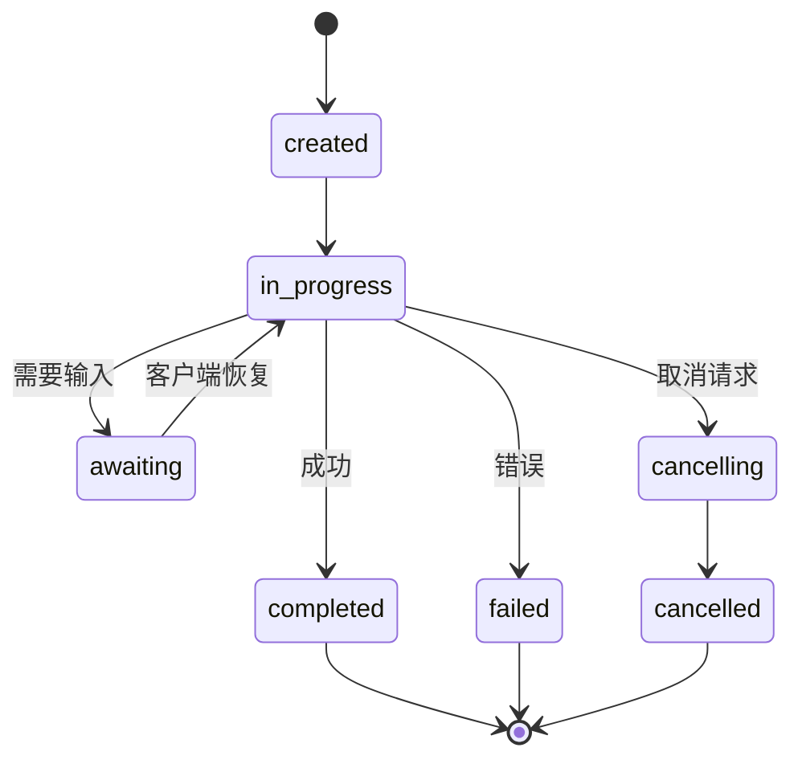

#### TrajectoryMetadata（审计跟踪）

这是ACP的关键差异化特性。每个消息部分都可以包含元数据，显示智能体到底做了什么：

```json
{
  "role": "agent/researcher",
  "parts": [
    {
      "content_type": "text/plain",
      "content": "The weather in San Francisco is 72F and sunny.",
      "metadata": {
        "kind": "trajectory",
        "message": "I need to check the weather for this location",
        "tool_name": "weather_api",
        "tool_input": { "location": "San Francisco, CA" },
        "tool_output": { "temperature": 72, "condition": "sunny" }
      }
    }
  ]
}
```

对于受监管的行业来说，这是宝贵的。每个答案都带有可证明的推理链：调用了哪些工具、使用了哪些输入、收到了哪些输出。没有黑箱。

ACP还支持**CitationMetadata**用于来源归因：

```json
{
  "kind": "citation",
  "start_index": 0,
  "end_index": 47,
  "url": "https://weather.gov/sf",
  "title": "NWS San Francisco Forecast"
}
```

### ANP（智能体网络协议）

**创建者：** 开源社区（由GaoWei Chang创立）
**仓库：** [github.com/agent-network-protocol/AgentNetworkProtocol](https://github.com/agent-network-protocol/AgentNetworkProtocol)
**解决的问题：** 来自不同组织的智能体如何在没有中央权威的情况下相互信任？

ANP是**去中心化身份协议**。它使用W3C去中心化标识符（DID）和端到端加密来构建信任。与A2A通过已知端点发现智能体不同，ANP让智能体通过加密方式证明其身份。

ANP有三个层级：

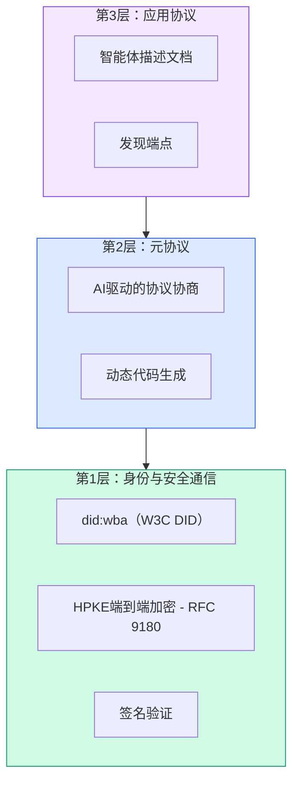

#### DID文档（真实结构）

ANP使用名为`did:wba`（基于Web的智能体）的自定义DID方法。DID `did:wba:example.com:user:alice`解析为`https://example.com/user/alice/did.json`：

```json
{
  "@context": [
    "https://www.w3.org/ns/did/v1",
    "https://w3id.org/security/suites/jws-2020/v1",
    "https://w3id.org/security/suites/secp256k1-2019/v1"
  ],
  "id": "did:wba:example.com:user:alice",
  "verificationMethod": [
    {
      "id": "did:wba:example.com:user:alice#key-1",
      "type": "EcdsaSecp256k1VerificationKey2019",
      "controller": "did:wba:example.com:user:alice",
      "publicKeyJwk": {
        "crv": "secp256k1",
        "x": "NtngWpJUr-rlNNbs0u-Aa8e16OwSJu6UiFf0Rdo1oJ4",
        "y": "qN1jKupJlFsPFc1UkWinqljv4YE0mq_Ickwnjgasvmo",
        "kty": "EC"
      }
    },
    {
      "id": "did:wba:example.com:user:alice#key-x25519-1",
      "type": "X25519KeyAgreementKey2019",
      "controller": "did:wba:example.com:user:alice",
      "publicKeyMultibase": "z9hFgmPVfmBZwRvFEyniQDBkz9LmV7gDEqytWyGZLmDXE"
    }
  ],
  "authentication": [
    "did:wba:example.com:user:alice#key-1"
  ],
  "keyAgreement": [
    "did:wba:example.com:user:alice#key-x25519-1"
  ],
  "humanAuthorization": [
    "did:wba:example.com:user:alice#key-1"
  ],
  "service": [
    {
      "id": "did:wba:example.com:user:alice#agent-description",
      "type": "AgentDescription",
      "serviceEndpoint": "https://example.com/agents/alice/ad.json"
    }
  ]
}
```

需要注意的关键点：
- **密钥分离**是强制执行的。签名密钥（secp256k1）与加密密钥（X25519）是分开的。
- **`humanAuthorization`**是ANP独有的。这些密钥在使用前需要明确的真人批准（生物识别、密码、HSM）。像资金转移这样的高风险操作会经过这个路径。
- **`keyAgreement`**密钥用于HPKE端到端加密（RFC 9180）。
- **service**部分链接到智能体描述文档。

#### ANP中信任如何运作

ANP**不**使用信任网络或背书图。信任是双边的，每次交互都需要验证：

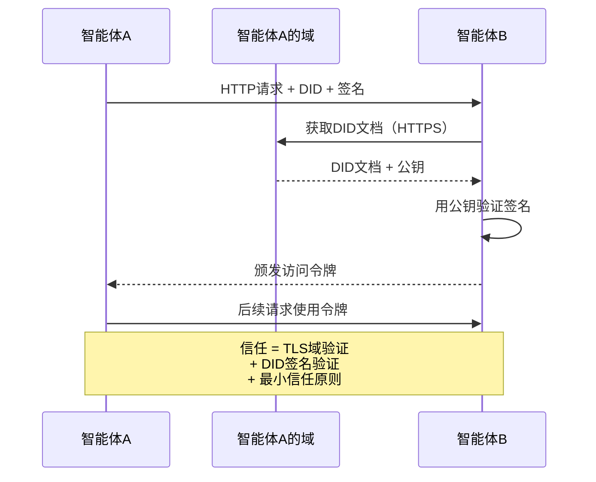

信任来自三个来源：
1. **域级TLS**验证DID文档主机
2. **DID加密签名**验证智能体身份
3. **最小信任原则**仅授予最低权限

没有基于 gossip 的信任传播或 PageRank 评分。你通过DID直接验证每个智能体。

#### 元协议协商

这是ANP最创新的特性。当来自不同生态系统的两个智能体相遇时，他们不需要预先商定的数据格式。他们用自然语言协商：

```json
{
  "action": "protocolNegotiation",
  "sequenceId": 0,
  "candidateProtocols": "I can communicate using:\n1. JSON-RPC with hotel booking schema\n2. REST with OpenAPI 3.1 spec\n3. Natural language over HTTP",
  "modificationSummary": "Initial proposal",
  "status": "negotiating"
}
```

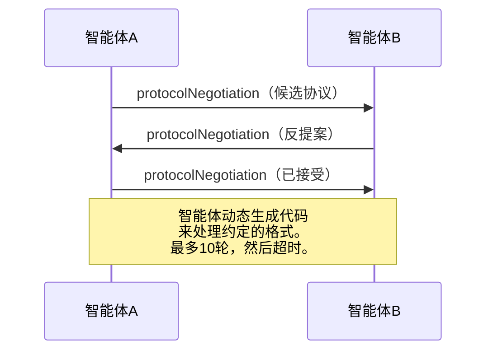

智能体来回协商（最多10轮）直到就格式达成一致，然后动态生成代码来处理它。状态值：`negotiating`、`rejected`、`accepted`、`timeout`。

这意味着两个之前从未见过的智能体可以弄清楚如何在没有人事先定义共享模式的情况下进行通信。

### 对比（修正版）

| | MCP | A2A | ACP | ANP |
|---|---|---|---|---|
| **创建者** | Anthropic | Google / Linux Foundation | IBM / BeeAI | 社区 |
| **规范格式** | JSON-RPC | JSON-RPC / REST / gRPC | OpenAPI 3.1（REST） | JSON-RPC |
| **主要用途** | 智能体到工具 | 智能体到智能体 | 智能体到智能体 | 智能体到智能体 |
| **发现方式** | 工具列表 | `/.well-known/agent-card.json` | `GET /agents`、`/.well-known/agent.yml` | `/.well-known/agent-descriptions`、DID服务端点 |
| **身份** | 隐式（本地） | 安全方案（OAuth、mTLS） | 服务器级别 | W3C DID（`did:wba`）+ 端到端加密 |
| **审计跟踪** | 不适用 | 基础（任务历史） | TrajectoryMetadata（工具调用、推理） | 正式未规定 |
| **状态机** | 不适用 | 9个任务状态 | 7个运行状态 | 不适用 |
| **流式传输** | 不适用 | SSE | SSE | 传输无关 |
| **独特功能** | 工具模式 | 智能体卡片 + 技能 | 轨迹审计跟踪 | 元协议协商 |
| **最适合** | 工具和数据 | 动态协作 | 受监管行业 | 跨组织信任 |
| **状态** | 稳定 | 稳定（v1.0） | 正在合并到A2A | 活跃开发中 |

### 它们如何协同工作

这些协议不是互斥的。现实的企業系统使用多种：

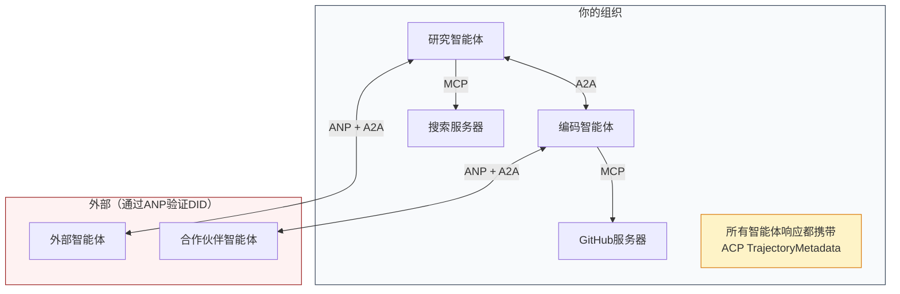

- **MCP**连接每个智能体到其工具
- **A2A**处理智能体之间的协作（内部和外部）
- **ACP**用轨迹元数据包装响应以实现可审计性
- **ANP**为你不控制的智能体提供身份验证

## 构建它

### 步骤1：核心消息类型

每个多智能体系统都从消息格式开始。我们定义映射到真实协议使用的类型：

```typescript
import crypto from "node:crypto";

type MessageRole = "user" | "agent";

type MessagePart =
  | { kind: "text"; text: string }
  | { kind: "data"; data: unknown; mediaType: string }
  | { kind: "file"; name: string; url: string; mediaType: string };

type TrajectoryEntry = {
  reasoning: string;
  toolName?: string;
  toolInput?: unknown;
  toolOutput?: unknown;
  timestamp: number;
};

type AgentMessage = {
  id: string;
  role: MessageRole;
  parts: MessagePart[];
  trajectory?: TrajectoryEntry[];
  replyTo?: string;
  timestamp: number;
};

function createMessage(
  role: MessageRole,
  parts: MessagePart[],
  replyTo?: string
): AgentMessage {
  return {
    id: crypto.randomUUID(),
    role,
    parts,
    replyTo,
    timestamp: Date.now(),
  };
}

function textMessage(role: MessageRole, text: string): AgentMessage {
  return createMessage(role, [{ kind: "text", text }]);
}
```

注意：`MessagePart`是多模态的（文本、结构化数据、文件），就像真实的A2A和ACP规范一样。`TrajectoryEntry`捕获推理链，匹配ACP的TrajectoryMetadata。

### 步骤2：A2A智能体卡片和注册表

构建符合真实A2A规范的智能体发现：

```typescript
type Skill = {
  id: string;
  name: string;
  description: string;
  tags: string[];
  inputModes: string[];
  outputModes: string[];
};

type AgentCard = {
  name: string;
  description: string;
  version: string;
  url: string;
  capabilities: {
    streaming: boolean;
    pushNotifications: boolean;
  };
  defaultInputModes: string[];
  defaultOutputModes: string[];
  skills: Skill[];
};

class AgentRegistry {
  private cards: Map<string, AgentCard> = new Map();

  register(card: AgentCard) {
    this.cards.set(card.name, card);
  }

  discoverBySkillTag(tag: string): AgentCard[] {
    return [...this.cards.values()].filter((card) =>
      card.skills.some((skill) => skill.tags.includes(tag))
    );
  }

  discoverByInputMode(mimeType: string): AgentCard[] {
    return [...this.cards.values()].filter(
      (card) =>
        card.defaultInputModes.includes(mimeType) ||
        card.skills.some((skill) => skill.inputModes.includes(mimeType))
    );
  }

  resolve(name: string): AgentCard | undefined {
    return this.cards.get(name);
  }

  listAll(): AgentCard[] {
    return [...this.cards.values()];
  }
}
```

这比简单的名称到能力映射要丰富得多。你可以通过技能标签、输入MIME类型或名称来发现智能体，就像真实的A2A规范支持的那样。

### 步骤3：A2A任务生命周期

构建完整的状态机：

```typescript
type TaskState =
  | "submitted"
  | "working"
  | "input-required"
  | "auth-required"
  | "completed"
  | "failed"
  | "canceled"
  | "rejected";

const TERMINAL_STATES: TaskState[] = [
  "completed",
  "failed",
  "canceled",
  "rejected",
];

type TaskStatus = {
  state: TaskState;
  message?: AgentMessage;
  timestamp: number;
};

type Artifact = {
  id: string;
  name: string;
  parts: MessagePart[];
};

type Task = {
  id: string;
  contextId: string;
  status: TaskStatus;
  artifacts: Artifact[];

  history: AgentMessage[];
};

type TaskEvent =
  | { kind: "statusUpdate"; taskId: string; status: TaskStatus }
  | {
      kind: "artifactUpdate";
      taskId: string;
      artifact: Artifact;
      append: boolean;
      lastChunk: boolean;
    };

type TaskHandler = (
  task: Task,
  message: AgentMessage
) => AsyncGenerator<TaskEvent>;

class TaskManager {
  private tasks: Map<string, Task> = new Map();
  private handlers: Map<string, TaskHandler> = new Map();
  private listeners: Map<string, ((event: TaskEvent) => void)[]> = new Map();

  registerHandler(agentName: string, handler: TaskHandler) {
    this.handlers.set(agentName, handler);
  }

  subscribe(taskId: string, listener: (event: TaskEvent) => void) {
    const existing = this.listeners.get(taskId) ?? [];
    existing.push(listener);
    this.listeners.set(taskId, existing);
  }

  async sendMessage(
    agentName: string,
    message: AgentMessage,
    contextId?: string
  ): Promise<Task> {
    const handler = this.handlers.get(agentName);
    if (!handler) {
      const task = this.createTask(contextId);
      task.status = {
        state: "rejected",
        timestamp: Date.now(),
        message: textMessage("agent", `No handler for ${agentName}`),
      };
      return task;
    }

    const task = this.createTask(contextId);
    task.history.push(message);
    task.status = { state: "submitted", timestamp: Date.now() };

    this.processTask(task, handler, message).catch((err) => {
      task.status = {
        state: "failed",
        timestamp: Date.now(),
        message: textMessage("agent", String(err)),
      };
    });
    return task;
  }

  getTask(taskId: string): Task | undefined {
    return this.tasks.get(taskId);
  }

  cancelTask(taskId: string): boolean {
    const task = this.tasks.get(taskId);
    if (!task || TERMINAL_STATES.includes(task.status.state)) return false;
    task.status = { state: "canceled", timestamp: Date.now() };
    this.emit(taskId, {
      kind: "statusUpdate",
      taskId,
      status: task.status,
    });
    return true;
  }

  private createTask(contextId?: string): Task {
    const task: Task = {
      id: crypto.randomUUID(),
      contextId: contextId ?? crypto.randomUUID(),
      status: { state: "submitted", timestamp: Date.now() },
      artifacts: [],
      history: [],
    };
    this.tasks.set(task.id, task);
    return task;
  }

  private async processTask(
    task: Task,
    handler: TaskHandler,
    message: AgentMessage
  ) {
    task.status = { state: "working", timestamp: Date.now() };
    this.emit(task.id, {
      kind: "statusUpdate",
      taskId: task.id,
      status: task.status,
    });

    try {
      for await (const event of handler(task, message)) {
        if (TERMINAL_STATES.includes(task.status.state)) break;

        if (event.kind === "statusUpdate") {
          task.status = event.status;
        }
        if (event.kind === "artifactUpdate") {
          const existing = task.artifacts.find(
            (a) => a.id === event.artifact.id
          );
          if (existing && event.append) {
            existing.parts.push(...event.artifact.parts);
          } else {
            task.artifacts.push(event.artifact);
          }
        }
        this.emit(task.id, event);
      }
    } catch (err) {
      task.status = {
        state: "failed",
        timestamp: Date.now(),
        message: textMessage("agent", String(err)),
      };
      this.emit(task.id, {
        kind: "statusUpdate",
        taskId: task.id,
        status: task.status,
      });
    }
  }

  private emit(taskId: string, event: TaskEvent) {
    for (const listener of this.listeners.get(taskId) ?? []) {
      listener(event);
    }
  }
}
```

这实现了真实的 A2A 任务生命周期：submitted、working、input-required、terminal states。处理器是异步生成器，生成与 SSE 流式传输模型相匹配的事件（状态更新和产物块）。

### 步骤 4：ACP 风格审计跟踪

用轨迹跟踪包装通信：

```typescript
type AuditEntry = {
  runId: string;
  agentName: string;
  input: AgentMessage[];
  output: AgentMessage[];
  trajectory: TrajectoryEntry[];
  status: "created" | "in-progress" | "completed" | "failed" | "awaiting";
  startedAt: number;
  completedAt?: number;
  sessionId?: string;
};

class AuditableRunner {
  private log: AuditEntry[] = [];
  private handlers: Map<
    string,
    (input: AgentMessage[]) => Promise<{
      output: AgentMessage[];
      trajectory: TrajectoryEntry[];
    }>
  > = new Map();

  registerAgent(
    name: string,
    handler: (input: AgentMessage[]) => Promise<{
      output: AgentMessage[];
      trajectory: TrajectoryEntry[];
    }>
  ) {
    this.handlers.set(name, handler);
  }

  async run(
    agentName: string,
    input: AgentMessage[],
    sessionId?: string
  ): Promise<AuditEntry> {
    const entry: AuditEntry = {
      runId: crypto.randomUUID(),
      agentName,
      input: structuredClone(input),
      output: [],
      trajectory: [],
      status: "created",
      startedAt: Date.now(),
      sessionId,
    };
    this.log.push(entry);

    const handler = this.handlers.get(agentName);
    if (!handler) {
      entry.status = "failed";
      return entry;
    }

    entry.status = "in-progress";
    try {
      const result = await handler(input);
      entry.output = structuredClone(result.output);
      entry.trajectory = structuredClone(result.trajectory);
      entry.status = "completed";
      entry.completedAt = Date.now();
    } catch (err) {
      entry.status = "failed";
      entry.trajectory.push({
        reasoning: `Error: ${String(err)}`,
        timestamp: Date.now(),
      });
      entry.completedAt = Date.now();
    }
    return entry;
  }

  getFullAuditLog(): AuditEntry[] {
    return structuredClone(this.log);
  }

  getAuditLogForAgent(agentName: string): AuditEntry[] {
    return structuredClone(
      this.log.filter((e) => e.agentName === agentName)
    );
  }

  getAuditLogForSession(sessionId: string): AuditEntry[] {
    return structuredClone(
      this.log.filter((e) => e.sessionId === sessionId)
    );
  }

  getTrajectoryForRun(runId: string): TrajectoryEntry[] {
    const entry = this.log.find((e) => e.runId === runId);
    return entry ? structuredClone(entry.trajectory) : [];
  }
}
```

每次智能体执行都会产生一条完整的审计记录：输入了什么、输出了什么，以及介于两者之间的完整工具调用和推理步骤轨迹。你可以通过智能体、会话或单独运行来查询。

### 步骤 5：ANP 风格身份验证

构建基于 DID 的身份和验证：

```typescript
type VerificationMethod = {
  id: string;
  type: string;
  controller: string;
  publicKeyDer: string;
};

type DIDDocument = {
  id: string;
  verificationMethod: VerificationMethod[];
  authentication: string[];
  keyAgreement: string[];
  humanAuthorization: string[];
  service: { id: string; type: string; serviceEndpoint: string }[];
};

type AgentIdentity = {
  did: string;
  document: DIDDocument;
  privateKey: crypto.KeyObject;
  publicKey: crypto.KeyObject;
};

class IdentityRegistry {
  private documents: Map<string, DIDDocument> = new Map();

  publish(doc: DIDDocument) {
    this.documents.set(doc.id, doc);
  }

  resolve(did: string): DIDDocument | undefined {
    return this.documents.get(did);
  }

  verify(did: string, signature: string, payload: string): boolean {
    const doc = this.documents.get(did);
    if (!doc) return false;

    const authKeyIds = doc.authentication;
    const authKeys = doc.verificationMethod.filter((vm) =>
      authKeyIds.includes(vm.id)
    );

    for (const key of authKeys) {
      const publicKey = crypto.createPublicKey({
        key: Buffer.from(key.publicKeyDer, "base64"),
        format: "der",
        type: "spki",
      });
      const isValid = crypto.verify(
        null,
        Buffer.from(payload),
        publicKey,
        Buffer.from(signature, "hex")
      );
      if (isValid) return true;
    }
    return false;
  }

  requiresHumanAuth(did: string, operationKeyId: string): boolean {
    const doc = this.documents.get(did);
    if (!doc) return false;
    return doc.humanAuthorization.includes(operationKeyId);
  }
}

function createIdentity(domain: string, agentName: string): AgentIdentity {
  const did = `did:wba:${domain}:agent:${agentName}`;
  const { publicKey, privateKey } = crypto.generateKeyPairSync("ed25519");

  const publicKeyDer = publicKey
    .export({ format: "der", type: "spki" })
    .toString("base64");

  const keyId = `${did}#key-1`;
  const encKeyId = `${did}#key-x25519-1`;

  const document: DIDDocument = {
    id: did,
    verificationMethod: [
      {
        id: keyId,
        type: "Ed25519VerificationKey2020",
        controller: did,
        publicKeyDer,
      },
      {
        id: encKeyId,
        type: "X25519KeyAgreementKey2019",
        controller: did,
        publicKeyDer,
      },
    ],
    authentication: [keyId],
    keyAgreement: [encKeyId],
    humanAuthorization: [],
    service: [
      {
        id: `${did}#agent-description`,
        type: "AgentDescription",
        serviceEndpoint: `https://${domain}/agents/${agentName}/ad.json`,
      },
    ],
  };

  return { did, document, privateKey, publicKey };
}

function signPayload(identity: AgentIdentity, payload: string): string {
  return crypto
    .sign(null, Buffer.from(payload), identity.privateKey)
    .toString("hex");
}
```

这反映了真实的 ANP 身份模型：智能体拥有 DID 文档，包含独立的认证密钥、密钥协议密钥和人工授权密钥。`IdentityRegistry` 模拟 DID 解析（在生产环境中，这将是向智能体域的 HTTP 请求）。

### 步骤 6：协议网关

将四个协议连接成一个统一系统：

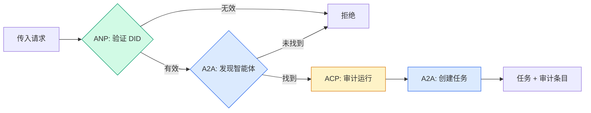

```typescript
class ProtocolGateway {
  private registry: AgentRegistry;
  private taskManager: TaskManager;
  private auditRunner: AuditableRunner;
  private identityRegistry: IdentityRegistry;

  constructor(
    registry: AgentRegistry,
    taskManager: TaskManager,
    auditRunner: AuditableRunner,
    identityRegistry: IdentityRegistry
  ) {
    this.registry = registry;
    this.taskManager = taskManager;
    this.auditRunner = auditRunner;
    this.identityRegistry = identityRegistry;
  }

  async delegateTask(
    fromDid: string,
    signature: string,
    targetAgent: string,
    message: AgentMessage,
    sessionId?: string
  ): Promise<{ task: Task; audit: AuditEntry } | { error: string }> {
    if (!this.identityRegistry.verify(fromDid, signature, message.id)) {
      return { error: "Identity verification failed" };
    }

    const card = this.registry.resolve(targetAgent);
    if (!card) {
      return { error: `Agent ${targetAgent} not found in registry` };
    }

    const audit = await this.auditRunner.run(
      targetAgent,
      [message],
      sessionId
    );
    const task = await this.taskManager.sendMessage(targetAgent, message);

    return { task, audit };
  }

  discoverAndDelegate(
    fromDid: string,
    signature: string,
    skillTag: string,
    message: AgentMessage
  ): Promise<{ task: Task; audit: AuditEntry } | { error: string }> {
    const candidates = this.registry.discoverBySkillTag(skillTag);
    if (candidates.length === 0) {
      return Promise.resolve({
        error: `No agents found with skill tag: ${skillTag}`,
      });
    }
    return this.delegateTask(
      fromDid,
      signature,
      candidates[0].name,
      message
    );
  }
}
```

网关在一次调用中完成四件事：
1. **ANP**：通过 DID 签名验证调用者身份
2. **A2A**：发现目标智能体并检查其能力
3. **ACP**：用轨迹将执行包装在审计跟踪中
4. **A2A**：创建具有完整生命周期跟踪的任务

### 步骤 7：将一切连接起来

```typescript
async function protocolDemo() {
  const registry = new AgentRegistry();
  registry.register({
    name: "researcher",
    description: "Searches and summarizes findings",
    version: "1.0.0",
    url: "https://researcher.local/a2a/v1",
    capabilities: { streaming: true, pushNotifications: false },
    defaultInputModes: ["text/plain"],
    defaultOutputModes: ["text/plain", "application/json"],
    skills: [
      {
        id: "web-research",
        name: "Web Research",
        description: "Searches the web",
        tags: ["research", "search", "summarization"],
        inputModes: ["text/plain"],
        outputModes: ["application/json"],
      },
    ],
  });
  registry.register({
    name: "coder",
    description: "Writes code from specs",
    version: "1.0.0",
    url: "https://coder.local/a2a/v1",
    capabilities: { streaming: false, pushNotifications: false },
    defaultInputModes: ["text/plain", "application/json"],
    defaultOutputModes: ["text/plain"],
    skills: [
      {
        id: "code-gen",
        name: "Code Generation",
        description: "Generates code",
        tags: ["coding", "generation"],
        inputModes: ["text/plain", "application/json"],
        outputModes: ["text/plain"],
      },
    ],
  });

  const taskManager = new TaskManager();
  const auditRunner = new AuditableRunner();

  const researchTrajectory: TrajectoryEntry[] = [];

  taskManager.registerHandler(
    "researcher",
    async function* (task, message) {
      yield {
        kind: "statusUpdate" as const,
        taskId: task.id,
        status: { state: "working" as const, timestamp: Date.now() },
      };

      researchTrajectory.push({
        reasoning: "Searching for React 19 documentation",
        toolName: "web_search",
        toolInput: { query: "React 19 compiler features" },
        toolOutput: {
          results: ["react.dev/blog/react-19", "github.com/react/react"],
        },
        timestamp: Date.now(),
      });

      researchTrajectory.push({
        reasoning: "Extracting key findings from search results",
        toolName: "doc_analysis",
        toolInput: { url: "react.dev/blog/react-19" },
        toolOutput: {
          summary:
            "React 19 compiler auto-memoizes, no manual useMemo needed",
        },
        timestamp: Date.now(),
      });

      yield {
        kind: "artifactUpdate" as const,
        taskId: task.id,
        artifact: {
          id: crypto.randomUUID(),
          name: "research-results",
          parts: [
            {
              kind: "data" as const,
              data: {
                findings: [
                  "React 19 compiler auto-memoizes components",
                  "No more manual useMemo/useCallback needed",
                  "Compiler runs at build time, not runtime",
                ],
                sources: ["react.dev/blog/react-19"],
              },
              mediaType: "application/json",
            },
          ],
        },
        append: false,
        lastChunk: true,
      };

      yield {
        kind: "statusUpdate" as const,
        taskId: task.id,
        status: { state: "completed" as const, timestamp: Date.now() },
      };
    }
  );

  auditRunner.registerAgent("researcher", async () => ({
    output: [
      textMessage("agent", "React 19 compiler auto-memoizes components"),
    ],
    trajectory: researchTrajectory,
  }));

  const identityRegistry = new IdentityRegistry();

  const coderIdentity = createIdentity("coder.local", "coder");
  const researcherIdentity = createIdentity("researcher.local", "researcher");

  identityRegistry.publish(coderIdentity.document);
  identityRegistry.publish(researcherIdentity.document);

  const gateway = new ProtocolGateway(
    registry,
    taskManager,
    auditRunner,
    identityRegistry
  );

  console.log("=== Protocol Demo ===\n");

  console.log("1. Agent Discovery (A2A)");
  const researchAgents = registry.discoverBySkillTag("research");
  console.log(
    `   Found ${researchAgents.length} agent(s):`,
    researchAgents.map((a) => a.name)
  );

  console.log("\n2. Identity Verification (ANP)");
  const message = textMessage("user", "Research React 19 compiler features");
  const signature = signPayload(coderIdentity, message.id);
  const verified = identityRegistry.verify(
    coderIdentity.did,
    signature,
    message.id
  );
  console.log(`   Coder DID: ${coderIdentity.did}`);
  console.log(`   Signature verified: ${verified}`);

  console.log("\n3. Task Delegation (A2A + ACP + ANP)");
  const result = await gateway.delegateTask(
    coderIdentity.did,
    signature,
    "researcher",
    message,
    "session-001"
  );

  if ("error" in result) {
    console.log(`   Error: ${result.error}`);
    return;
  }

  console.log(`   Task ID: ${result.task.id}`);
  console.log(`   Task state: ${result.task.status.state}`);
  console.log(`   Artifacts: ${result.task.artifacts.length}`);

  console.log("\n4. Audit Trail (ACP)");
  console.log(`   Run ID: ${result.audit.runId}`);
  console.log(`   Status: ${result.audit.status}`);
  console.log(`   Trajectory steps: ${result.audit.trajectory.length}`);
  for (const step of result.audit.trajectory) {
    console.log(`     - ${step.reasoning}`);
    if (step.toolName) {
      console.log(`       Tool: ${step.toolName}`);
    }
  }

  console.log("\n5. Full Audit Log");
  const fullLog = auditRunner.getFullAuditLog();
  console.log(`   Total runs: ${fullLog.length}`);
  for (const entry of fullLog) {
    const duration = entry.completedAt
      ? `${entry.completedAt - entry.startedAt}ms`
      : "in-progress";
    console.log(`   ${entry.agentName}: ${entry.status} (${duration})`);
  }
}

protocolDemo().catch((err) => {
  console.error("Protocol demo failed:", err);
  process.exitCode = 1;
});
```

## 会出什么问题

协议解决的是理想路径。以下是生产环境中会出问题的地方：

**Schema 漂移。** 智能体 A 发布了一张 Agent Card，声明支持 `application/json` 输出。但 JSON schema 在不同版本之间发生了变化。智能体 B 解析旧格式后得到的是垃圾数据。解决方案：对技能和输出 schema 进行版本控制。A2A 规范支持在 Agent Card 上设置 `version` 就是为了这个原因。

**状态机违规。** 智能体处理器发出 `completed` 事件后，还试图继续产出产物。任务是不可变的。你的代码会静默丢弃更新或抛出异常。解决方案：在产出前检查终端状态。上面的 `TaskManager` 在遇到终端状态后用 `break` 来强制执行此规则。

**信任解析失败。** 智能体 A 试图验证智能体 B 的 DID，但智能体 B 的域名宕机了。DID 文档无法获取。你是失败时开放（接受未验证的智能体）还是失败时关闭（拒绝一切）？ANP 推荐遵循最小信任原则的关闭式失败。

**轨迹膨胀。** ACP 轨迹日志很强大，但代价高昂。一个每次运行调用 200 次工具的复杂智能体会产生大量的审计条目。解决方案：按可配置的详细程度记录轨迹。为合规记录工具名称和 IO，为非监管工作负载跳过推理步骤。

**发现的雷鸣群效应。** 50 个智能体在启动时同时查询 `GET /agents`。解决方案：用 TTL 缓存 Agent Card，错开发现间隔，或使用推送式注册而非轮询。

## 使用它

### 真实实现

**A2A** 是最成熟的方案。谷歌的[官方规范](https://github.com/google/A2A)是开源的，隶属于 Linux Foundation。有 Python 和 TypeScript 的 SDK。如果你的智能体需要动态发现和协作，从这里开始。

**ACP** 正在合并到 A2A 中。IBM 的 [BeeAI 项目](https://github.com/i-am-bee/acp) 创建了 ACP 作为 REST 优先的替代方案，但轨迹元数据的概念正在被吸收到 A2A 生态系统中。即使你使用 A2A 作为传输层，也应该使用 ACP 模式（轨迹日志、运行生命周期）。

**ANP** 是最具实验性的。[社区仓库](https://github.com/agent-network-protocol/AgentNetworkProtocol) 有 Python SDK（AgentConnect）。元协议协商概念是真正新颖的。对于跨组织智能体部署值得持续关注。

**MCP** 已在第 13 章介绍。如果你想让智能体使用工具，MCP 是标准。

### 选择正确的协议

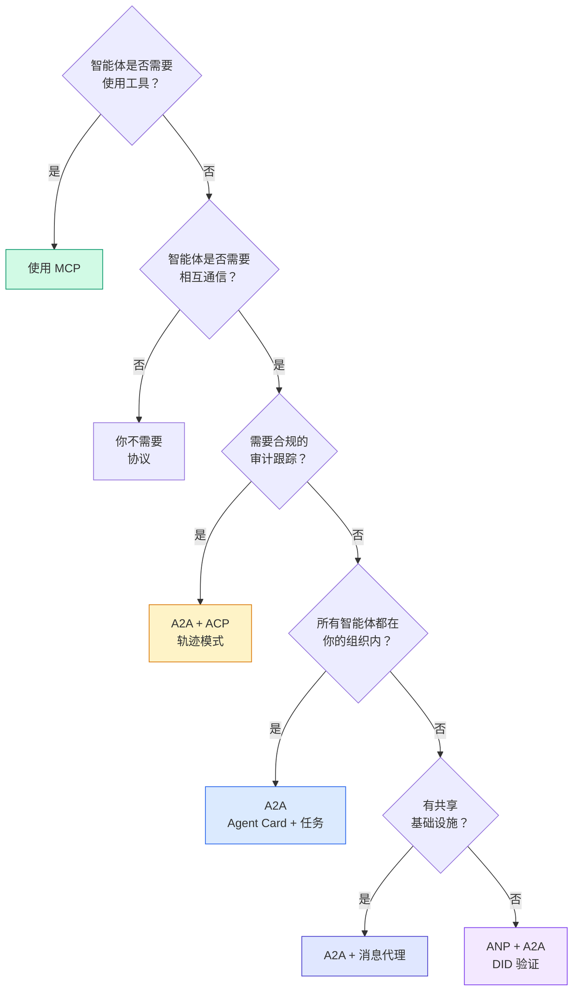

## 发版

本课时产出：
- `code/main.ts` -- 四个协议模式的完整实现
- `outputs/prompt-protocol-selector.md` -- 一个帮助你为系统选择协议的提示词

## 练习

1. **多跳任务委托。** 扩展 `TaskManager`，使智能体处理器可以将子任务委托给其他智能体。研究智能体收到任务后，将"搜索"和"总结"子任务委托给两个专业智能体，等待两者完成，然后将结果合并到自己的产物中。

2. **流式审计跟踪。** 修改 `AuditableRunner` 以支持流式模式。不再等待完整结果，而是在轨迹条目添加时实时产出 `AuditEntry` 更新。使用异步生成器来生成审计快照。

3. **DID 轮换。** 为 `IdentityRegistry` 添加密钥轮换功能。智能体应该能够发布带有更新密钥的新 DID 文档，同时保持 `previousDid` 引用。在宽限期内，验证者应接受当前密钥和先前密钥的签名。

4. **协议协商。** 实现 ANP 的元协议概念。两个智能体交换 `protocolNegotiation` 消息，包含候选格式（例如，"我可以讲 JSON-RPC"与"我更喜欢 REST"）。最多 3 轮后，它们商定一种格式或超时。商定的格式决定了它们使用的 `TaskManager` 或 `AuditableRunner`。

5. **限速发现。** 添加 `RateLimitedRegistry` 包装器，用可配置的 TTL 缓存 Agent Card 查找，并限制每个智能体每秒的发现查询。模拟 100 个智能体在启动时互相发现，测量差异。

## 关键术语

| 术语 | 人们通常说 | 实际含义 |
|------|----------------|----------------------|
| MCP | "AI 工具的协议" | 智能体发现和使用工具的客户端-服务器协议。智能体到工具，而非智能体到智能体。 |
| A2A | "谷歌的智能体协议" | Linux Foundation 下的智能体协作点对点协议。通过 Agent Card 发现，9 状态任务生命周期，通过 SSE 流式传输。支持 JSON-RPC、REST 和 gRPC 绑定。 |
| ACP | "企业智能体消息" | IBM/BeeAI 的 REST API，用于智能体运行和 TrajectoryMetadata：每个响应都携带完整的推理和工具调用链。正在合并到 A2A。 |
| ANP | "去中心化智能体身份" | 使用 `did:wba`（DID）的社区协议，用于加密身份、HPKE 端到端加密，以及用于从未见过的智能体之间的 AI 驱动的元协议协商。 |
| Agent Card | "智能体的名片" | 位于 `/.well-known/agent-card.json` 的 JSON 文档，描述技能、支持 MIME 类型、安全方案和协议绑定。 |
| DID | "去中心化 ID" | W3C 标准，用于托管在智能体自己域名上的加密可验证身份。ANP 使用 `did:wba` 方法。 |
| TrajectoryMetadata | "审计收据" | ACP 的机制，用于在每个智能体响应中附加推理步骤、工具调用及其输入/输出。 |
| Meta-protocol | "智能体协商如何交流" | ANP 的方法，智能体使用自然语言动态协商数据格式，然后生成代码来处理它们。 |
| Task | "工作单元" | A2A 的有状态对象，从提交到完成跟踪工作。一旦到达终端状态则不可变。 |

## 进一步阅读

- [Google A2A 规范](https://github.com/google/A2A) -- 官方规范和 SDK（v1.0.0，Linux Foundation）
- [IBM/BeeAI ACP 规范](https://github.com/i-am-bee/acp) -- 智能体运行和轨迹元数据的 OpenAPI 3.1 规范
- [Agent Network Protocol](https://github.com/agent-network-protocol/AgentNetworkProtocol) -- 基于 DID 的身份、端到端加密、元协议协商
- [Model Context Protocol 文档](https://modelcontextprotocol.io/) -- Anthropic 的 MCP 规范（第 13 章已介绍）
- [W3C 去中心化标识符](https://www.w3.org/TR/did-core/) -- 支撑 ANP 的身份标准
- [RFC 9180 (HPKE)](https://www.rfc-editor.org/rfc/rfc9180) -- ANP 用于端到端加密的加密方案
- [FIPA 智能体通信语言](http://www.fipa.org/specs/fipa00061/SC00061G.html) -- 现代智能体协议的学术先驱