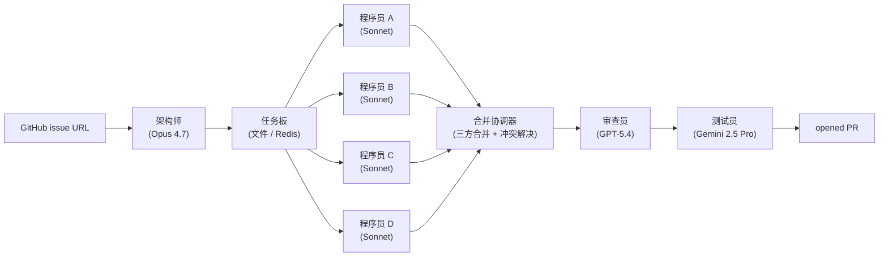

# 终极项目 10 —— 多智能体软件工程团队

> SWE-AF 的工厂架构、MetaGPT 的角色化提示词、AutoGen 0.4 的类型化执行者图谱、Cognition 的 Devin，以及 Factory 的 Droids，在 2026 年殊途同归：一位架构师做规划，N 名程序员在并行工作树中工作，一位审查员把关，一位测试员验证。并行工作树将墙钟时间转化为吞吐量。共享状态和交接协议成为故障高发地带。本终极项目的目标是构建这个团队，在 SWE-bench Pro 上评估，并报告哪些交接环节出了问题以及频率。

**类型：** 终极项目
**语言：** Python / TypeScript（智能体），Shell（工作树脚本）
**前置条件：** 阶段 11（LLM 工程）、阶段 13（工具）、阶段 14（智能体）、阶段 15（自主）、阶段 16（多智能体）、阶段 17（基础设施）
**涉及阶段：** P11 · P13 · P14 · P15 · P16 · P17
**时间：** 40 小时

## 问题

单体智能体编码框架在大型任务上遇到了瓶颈。不是因为某个智能体太弱，而是因为 200k-token 的上下文无法同时容纳架构规划、四条并行代码片段、审查员意见和测试输出。多智能体工厂将问题拆分：一位架构师负责规划，程序员在并行工作树中独立实现代码，审查员把关，测试员验证。SWE-AF 的"工厂"架构、MetaGPT 的角色化方案、AutoGen 的类型化执行者图谱——三种表述描述的是同一个形态。

故障高发地带是交接环节。架构师规划的东西程序员无法实现。程序员产生了冲突的 diff。审查员批准了一个幻觉出来的修复。测试员与仍在写代码的程序员赛跑。你将构建这样一个团队，在 50 个 SWE-bench Pro 问题上运行它，跟踪每一次交接，并发布事后分析报告。

## 概念

角色即类型化智能体。**架构师**（Claude Opus 4.7）阅读 issue，撰写计划，并将任务分解为具有明确接口的子任务。**程序员**（Claude Sonnet 4.7，N 个并行实例，每个实例在 `git worktree` + Daytona 沙箱中）独立实现子任务。**审查员**（GPT-5.4）阅读合并后的 diff，批准或请求具体修改。**测试员**（Gemini 2.5 Pro）在隔离环境中运行测试套件，报告通过/失败状态及产物。

通信通过共享任务板（文件后端或 Redis）进行。每个角色只能处理被允许的任务。交接使用 A2A 协议类型的消息。主要协调问题包括：合并冲突解决（协调者角色或自动三方合并）、共享状态同步（程序员开始时计划冻结；重新规划是独立事件）、审查员把关（审查员不能批准自己提出或自己修改的内容）。

Token 放大是隐性成本。每个角色边界都会添加摘要提示词和交接上下文。一个 40 轮的单体智能体运行变成四个角色共 160 轮。评估标准明确权重 token 效率与单体智能体基线对比，因为问题不是"多智能体是否有效"而是"它是否物有所值"。

## 架构



## 技术栈

- 编排：LangGraph，共享状态 + 每智能体子图
- 消息传递：Google 2025 年制定的 A2A 协议，用于类型化智能体间消息
- 模型：Opus 4.7（架构师）、Sonnet 4.7（程序员）、GPT-5.4（审查员）、Gemini 2.5 Pro（测试员）
- 工作树隔离：每位程序员一个 `git worktree add` + Daytona 沙箱
- 合并协调器：自定义三方合并 + LLM 介导的冲突解决
- 评估：SWE-bench Pro（50 个问题）、SWE-AF 场景、HumanEval++ 单元测试
- 可观测性：Langfuse，带角色标签的 span，每智能体 token 统计
- 部署：K8s，每个角色作为独立 Deployment + 基于积压的 HPA

## 构建步骤

1. **任务板。** 文件后端的 JSONL，带类型化消息：`plan_request`、`subtask`、`diff_ready`、`review_needed`、`test_needed`、`approved`、`rejected`、`replan_needed`。智能体订阅标签。

2. **架构师。** 阅读 GitHub issue，使用要求明确子任务接口（涉及文件、公共函数、测试影响）的计划模板运行 Opus 4.7。发出一个带子任务 DAG 的 `plan_request`。

3. **程序员。** N 个并行工作器，每个从任务板认领一个子任务。每个工作器生成一个全新的 `git worktree add` 分支加一个 Daytona 沙箱。实现子任务。发出带补丁和测试增量的 `diff_ready`。

4. **合并协调器。** 所有程序员完成后，将 N 个分支三方合并到 staging 分支。仅在存在文件级重叠时才启用 LLM 介导的冲突解决。

5. **审查员。** GPT-5.4 阅读合并后的 diff。不能批准自己撰写的 diff。发出 `approved`（空操作）或带具体修改请求的 `review_feedback`，路由回相关程序员。

6. **测试员。** Gemini 2.5 Pro 在干净沙箱中运行测试套件。捕获产物。发出 `test_passed` 或带堆栈跟踪的 `test_failed`。失败的测试循环回到拥有失败子任务的程序员。

7. **交接统计。** 每条跨角色边界的消息在 Langfuse 中获得一个 span，包含载荷大小和使用的模型。计算每子任务的 token 放大率（coder_tokens + reviewer_tokens + tester_tokens + architect_share / coder_tokens）。

8. **评估。** 在 50 个 SWE-bench Pro 问题上运行。与单体智能体基线（一个 Sonnet 4.7 在单个工作树中）对比 pass@1 和每个已解决问题 $-成本。

9. **事后分析。** 对每个失败的问题，识别出问题的交接环节（计划太模糊、合并冲突、审查员误批准、测试员 flaky）。生成交接失败直方图。

## 使用示例

```
$ team run --issue https://github.com/acme/widget/issues/842
[architect] plan: 4 subtasks (parser, cache, api, migration)
[board]     dispatched to 4 coders in parallel worktrees
[coder-A]   subtask parser  -> 42 lines, tests pass locally
[coder-B]   subtask cache   -> 88 lines, tests pass locally
[coder-C]   subtask api     -> 31 lines, tests pass locally
[coder-D]   subtask migration -> 19 lines, tests pass locally
[merge]     3-way merge: 0 conflicts
[reviewer]  comments on cache (thread pool sizing); routed to coder-B
[coder-B]   revision: 92 lines; submits
[reviewer]  approved
[tester]    all 412 tests pass
[pr]        opened #3382   4 coders, 1 revision, $4.90, 18m
```

## 交付

`outputs/skill-multi-agent-team.md` 是交付物。给定一个 issue URL 和并行度，团队产出带有每角色 token 统计的合并就绪 PR。

| 权重 | 标准 | 衡量方式 |
|:-:|---|---|
| 25 | SWE-bench Pro pass@1 | 匹配的 50 问题子集，pass@1 |
| 20 | 并行加速比 | 墙钟时间 vs 单体智能体基线 |
| 20 | 审查质量 | 在注入 bug 探测上的误批准率 |
| 20 | Token 效率 | 每个已解决问题总 token 数 vs 单体智能体 |
| 15 | 协调工程 | 合并冲突解决、交接失败直方图 |
| **100** | | |

## 练习

1. 在运行中途向 diff 注入一个明显 bug（在主体代码前加一个 `return None`）。测量审查员的误批准率。调整审查员提示词直到误批准率低于 5%。

2. 缩减到两名程序员（架构师 + 程序员 + 审查员 + 测试员，程序员顺序执行两个子任务）。对比墙钟时间和通过率。

3. 用单写者约束替代合并协调器（子任务涉及互不重叠的文件集）。测量对架构师规划负担的影响。

4. 将审查员从 GPT-5.4 换成 Claude Opus 4.7。测量误批准率和 token 成本变化。

5. 添加第五个角色：文档员（Haiku 4.5）。审查后，它生成变更日志条目。测量文档质量是否值得额外的 token 消耗。

## 关键术语

| 术语 | 大家怎么说 | 实际含义 |
|------|-----------------|------------------------|
| 并行工作树 | "隔离分支" | 每个程序员一个 `git worktree add`，产生独立工作树 |
| 任务板 | "共享消息总线" | 智能体订阅的文件或 Redis 类型化消息存储 |
| 交接 | "角色边界" | 任何从一个角色上下文跨到另一个角色的消息 |
| Token 放大 | "多智能体开销" | 跨角色总 token 数 / 单体智能体完成相同任务的 token 数 |
| A2A 协议 | "智能体间协议" | Google 2025 年制定的类型化智能体消息规范 |
| 合并协调器 | "集成器" | 运行三方合并并调解冲突的组件 |
| 误批准 | "审查员幻觉" | 审查员批准了带有已知 bug 的 diff |

## 延伸阅读

- [SWE-AF 工厂架构](https://github.com/Agent-Field/SWE-AF) — 参考性 2026 多智能体工厂
- [MetaGPT](https://github.com/FoundationAgents/MetaGPT) — 角色化多智能体框架
- [AutoGen v0.4](https://github.com/microsoft/autogen) — 微软的类型化执行者框架
- [Cognition AI (Devin)](https://cognition.ai) — 参考产品
- [Factory Droids](https://www.factory.ai) — 备选参考产品
- [Google A2A 协议](https://developers.google.com/agent-to-agent) — 智能体消息规范
- [git worktree 文档](https://git-scm.com/docs/git-worktree) — 隔离底层设施
- [SWE-bench Pro](https://www.swebench.com) — 评估目标