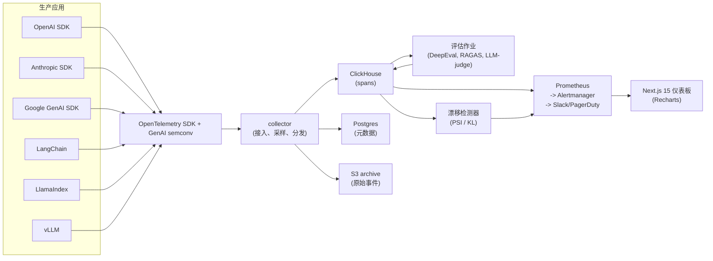

# 终极项目 11 —— LLM 可观测性与评估仪表板

> Langfuse 走向开源核心。Arize Phoenix 发布了 2026 GenAI semconv 映射。Helicone 和 Braintrust 都加倍押注按用户成本归因。Traceloop 的 OpenLLMetry 成为事实上的 SDK 插桩标准。生产形态为：ClickHouse 存 traces，Postgres 存元数据，Next.js 做 UI，外加一小批评估作业（DeepEval、RAGAS、LLM-judge）在采样的 traces 上运行。构建一个自托管版本，从至少四个 SDK 家族接入数据，并演示在五分钟内catch住注入的回归。

**类型：** 终极项目
**语言：** TypeScript（UI）、Python / TypeScript（接入 + 评估）、SQL（ClickHouse）
**前置条件：** 阶段 11（LLM 工程）、阶段 13（工具）、阶段 17（基础设施）、阶段 18（安全）
**涉及阶段：** P11 · P13 · P17 · P18
**时间：** 25 小时

## 问题

2026 年，每一个在生产流量上运行 AI 的团队都会在模型旁边维护一个可观测性平面。成本归因、幻觉检测、漂移监控、越狱信号、SLO 仪表板、PII 泄露告警。开源参考——Langfuse、Phoenix、OpenLLMetry——都收敛到 OpenTelemetry GenAI 语义约定作为接入模式。现在你可以用一个 SDK 插桩 OpenAI、Anthropic、Google、LangChain、LlamaIndex 和 vLLM，并发送兼容的 span。

你将构建一个自托管仪表板，从至少四个 SDK 家族接入数据，在采样的 traces 上运行一小批评估作业，检测漂移并告警。衡量标准：给定一个故意注入的回归（一个开始产生 PII 的提示词），仪表板在五分钟内检测到并发出告警。

## 概念

接入使用 OTLP HTTP。SDK 生成 GenAI-semconv span：`gen_ai.system`、`gen_ai.request.model`、`gen_ai.usage.input_tokens`、`gen_ai.response.id`、`llm.prompts`、`llm.completions`。Span 进入 ClickHouse 进行列式分析；元数据（用户、会话、应用）进入 Postgres。

评估作为批处理作业在采样的 traces 上运行。DeepEval 打分 faithfulness、toxicity 和答案相关性。当 trace 带有检索上下文时，RAGAS 打分检索指标。自定义 LLM-judge 运行领域特定检查（PII 泄露、策略外响应）。评估运行将评估 span 写回同一个 ClickHouse，链接到父 trace。

漂移检测随时间监控 embedding 空间分布（提示词 embedding 上的 PSI 或 KL 散度）以及评估分数趋势。告警送入 Prometheus Alertmanager 然后到 Slack / PagerDuty。UI 是 Next.js 15 配合 Recharts。

## 架构



## 技术栈

- 接入：OpenTelemetry SDK + GenAI 语义约定；OTLP HTTP 传输
- Collector：OpenTelemetry Collector，带尾采样处理器（控制成本）
- 存储：ClickHouse 存 spans，Postgres 存元数据，S3 存原始事件归档
- 评估：DeepEval、RAGAS 0.2、Arize Phoenix 评估包、自定义 LLM-judge
- 漂移检测：sentence-transformers 对汇总提示词 embedding 每周计算 PSI / KL
- 告警：Prometheus Alertmanager -> Slack / PagerDuty
- UI：Next.js 15 App Router + Recharts + 服务端 actions
- 开箱即支持的 SDK：OpenAI、Anthropic、Google GenAI、LangChain、LlamaIndex、vLLM

## 构建步骤

1. **Collector 配置。** OpenTelemetry Collector 带 OTLP HTTP 接收器、一个尾采样器（保留 100% 错误 traces 和 10% 成功 traces）以及到 ClickHouse 和 S3 的导出器。

2. **ClickHouse schema。** 表 `spans`，列镜像 GenAI semconv：`gen_ai_system`、`gen_ai_request_model`、`input_tokens`、`output_tokens`、`latency_ms`、`prompt_hash`、`trace_id`、`parent_span_id`，外加一个 JSON bag 用于长载荷。按 user_id 和 app_id 添加二级索引。

3. **SDK 覆盖测试。** 编写一个使用每个 SDK（OpenAI、Anthropic、Google、LangChain、LlamaIndex、vLLM）的小型客户端应用，配合 OpenLLMetry 自动插桩。验证每个 SDK 产生规范的 GenAI span 并进入 ClickHouse。

4. **评估作业。** 调度作业读取最近 15 分钟采样的 traces，运行 DeepEval faithfulness、toxicity 和答案相关性。输出链接到父 trace 的评估 span。

5. **自定义 LLM-judge。** PII 泄露 judge：给定一个响应，调用 guard LLM 打分 PII 泄露可能性。高分响应进入分诊队列。

6. **漂移检测。** 每周作业计算本周汇总提示词 embedding 与过去 4 周基线之间的 PSI。若 PSI 超过阈值则告警。

7. **仪表板。** Next.js 15 页面：概览（spans/sec、cost/user、p95 延迟）、traces（搜索 + 瀑布图）、评估（faithfulness 趋势、toxicity）、漂移（PSI 随时间变化）、告警。

8. **告警链。** Prometheus 导出器读取评估分数聚合和延迟百分位；Alertmanager 路由到 Slack（警告）和 PagerDuty（严重违规）。

9. **回归探测。** 注入一个 bug：被评估的聊天机器人有 1% 的时间开始泄露伪造 SSN。测量 MTTR：从 bug 部署到 Slack 告警的时间。

## 使用示例

```
$ curl -X POST https://my-otel-collector/v1/traces -d @trace.json
[collector]  accepted 1 trace, 3 spans
[clickhouse] inserted 3 spans (app=chat, user=u_42)
[eval]       DeepEval faithfulness 0.82, toxicity 0.03
[drift]      weekly PSI 0.08 (below 0.2 threshold)
[ui]         live at https://obs.example.com
```

## 交付

`outputs/skill-llm-observability.md` 是交付物。给定一个 LLM 应用，仪表板接入其 traces，运行评估，在漂移时告警，并在 Next.js 中呈现按用户划分的成本明细。

| 权重 | 标准 | 衡量方式 |
|:-:|---|---|
| 25 | Trace schema 覆盖 | 能产生规范 GenAI span 的 SDK 家族数量（目标：6+） |
| 20 | 评估正确性 | DeepEval / RAGAS 分数 vs 人工标注集 |
| 20 | 仪表板 UX | 注入回归上的 MTTR（目标 5 分钟内） |
| 20 | 成本 / 规模 | 在 1k spans/sec 持续接入且无积压 |
| 15 | 告警 + 漂移检测 | Prometheus/Alertmanager 链端到端演练 |
| **100** | | |

## 练习

1. 为 Haystack 框架添加自定义插桩。验证规范的 span 带着忠实的 `gen_ai.*` 属性进入 ClickHouse。

2. 在相同 traces 上将 DeepEval 换成 Phoenix 评估器。测量两个评估引擎之间的分数漂移。

3. 精化漂移检测器：按 app-id 而非全局计算 PSI。展示每个应用的漂移曲线。

4. 添加"用户影响"页面：每用户成本和每用户失败率配迷你图。

5. 构建一个尾采样策略，保留 toxicity > 0.5 的 traces 100% 加上其余的 10% 分层样本。测量引入的采样偏差。

## 关键术语

| 术语 | 大家怎么说 | 实际含义 |
|------|-----------------|------------------------|
| GenAI semconv | "OTel LLM 属性" | 2025 OpenTelemetry LLM span 属性规范（system、model、tokens） |
| 尾采样 | "trace 后采样" | Collector 在 trace 完成后决定保留或丢弃（可以窥探错误） |
| PSI | "人口稳定性指数" | 比较两个分布的漂移指标；> 0.2 通常标志有意义漂移 |
| LLM-judge | "模型评估" | 用一个 LLM 按评分标准给另一个 LLM 的输出打分（faithfulness、toxicity、PII） |
| 尾采样策略 | "保留规则" | 决定保留还是丢弃哪些 trace 的规则；错误 + 采样率 |
| 评估 span | "链接的评估 trace" | 携带评估分数的子 span，链接到原始 LLM 调用 span |
| 每用户成本 | "单位经济学" | 一个时间窗口内归因到 user_id 的美元成本；关键产品指标 |

## 延伸阅读

- [Langfuse](https://github.com/langfuse/langfuse) — 参考开源核心可观测性平台
- [Arize Phoenix](https://github.com/Arize-ai/phoenix) — 备选参考，漂移支持强
- [OpenLLMetry (Traceloop)](https://github.com/traceloop/openllmetry) — 自动插桩 SDK 家族
- [OpenTelemetry GenAI 语义约定](https://opentelemetry.io/docs/specs/semconv/gen-ai/) — 接入模式
- [Helicone](https://www.helicone.ai) — 备选托管可观测性
- [Braintrust](https://www.braintrust.dev) — 备选评估优先平台
- [ClickHouse 文档](https://clickhouse.com/docs) — 列式 span 存储
- [DeepEval](https://github.com/confident-ai/deepeval) — 评估库