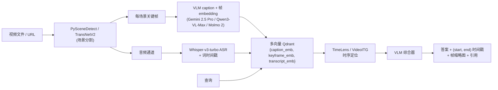

# 终极项目 12 —— 视频理解流水线（场景、问答、搜索）

> Twelve Labs 产品化了 Marengo + Pegasus。VideoDB 交付了视频 CRUD API。AI2 的 Molmo 2 发布了开源 VLM 检查点。Gemini 长上下文原生处理数小时视频。TimeLens-100K 定义了大规模时序定位。2026 年流水线已定型：场景分割、每场景 caption + embedding、字幕对齐、多向量索引，以及用（起始、结束）时间戳加帧预览来回答的查询。本终极项目的目标是接入 100 小时视频，冲击公开基准，并在计数和动作问题上测量幻觉率。

**类型：** 终极项目
**语言：** Python（流水线），TypeScript（UI）
**前置条件：** 阶段 4（CV）、阶段 6（语音）、阶段 7（Transformer）、阶段 11（LLM 工程）、阶段 12（多模态）、阶段 17（基础设施）
**涉及阶段：** P4 · P6 · P7 · P11 · P12 · P17
**时间：** 30 小时

## 问题

长视频问答是 2026 年规模下带宽需求最大的多模态问题。Gemini 2.5 Pro 可以原生阅读 2 小时视频，但将 100 小时视频接入可查询语料库仍需要一个场景级索引。生产形态结合了场景分割（TransNetV2 或 PySceneDetect）、每场景 VLM caption（Gemini 2.5、Qwen3-VL-Max 或 Molmo 2）、字幕对齐（带词级时间戳的 Whisper-v3-turbo）以及多向量索引（caption、帧 embedding 和字幕并排存储）。查询流水线用（起始、结束）时间戳加帧预览来回答。

基准是公开的（ActivityNet-QA、NeXT-GQA）外加你自己的 100 查询自定义集。计数和动作类问题的幻觉是已知困难失败类；本终极项目明确测量它。

## 概念

三条流水线在接入时并行运行。**场景分割** 将视频切分为场景。**VLM caption** 为每个场景生成 caption 并从关键帧生成帧 embedding。**ASR 对齐** 产生词级时间戳。三条流通过（scene_id, time range）连接。每个场景在多向量索引（Qdrant）中获得三种向量类型：caption embedding、关键帧 embedding、字幕 embedding。

在查询时，自然语言问题同时向三种向量发起查询；结果用 RRF 合并；时序定位适配器（TimeLens 风格）在 top 场景内细化（起始、结束）窗口。VLM 综合器（Gemini 2.5 Pro 或 Qwen3-VL-Max）接收查询 + top 场景 + 裁剪帧并用带时间戳引用和帧预览来回答。

幻觉测量至关重要。计数（"有多少人进入房间？"）和动作类（"厨师在搅拌之前倒了吗？"）问题以不可靠著称。将准确率按描述性问题单独报告。

## 架构



## 技术栈

- 场景分割：TransNetV2（2024-26 先进水平）或 PySceneDetect
- ASR：faster-whisper 运行的 Whisper-v3-turbo，带词时间戳
- VLM captioner + answerer：Gemini 2.5 Pro 或 Qwen3-VL-Max 或 Molmo 2
- 时序定位：TimeLens-100K 训练的适配器或 VideoITG
- 索引：Qdrant，多向量支持（caption / 帧 / 字幕）
- UI：Next.js 15，HTML5 视频播放器配场景缩略图
- 评估：ActivityNet-QA、NeXT-GQA、自定义 100 题人工标注集
- 幻觉基准：计数和动作类子集，有人标注标签

## 构建步骤

1. **接入爬虫。** 接受 YouTube URL 或本地 MP4。需要时降采样到 720p。持久化 `{video_id, file_path}`。

2. **场景分割。** 运行 TransNetV2 或 PySceneDetect 产生 `[{scene_id, start_ms, end_ms, keyframe_path}]`。目标 100 小时：约 6k-8k 个场景。

3. **ASR 通道。** 在音频上运行 Whisper-v3-turbo；导出词级时间戳；切分为每场景字幕片段。

4. **VLM caption。** 每场景用关键帧和短 caption 模板调用 Gemini 2.5 Pro（或 Qwen3-VL-Max）。生成 caption + 帧 embedding。

5. **多向量索引。** Qdrant 集合带三个命名向量。载荷：`{video_id, scene_id, start_ms, end_ms, keyframe_url}`。

6. **查询。** 自然语言问题发起三条密集查询；用倒数排名融合合并；top-k=5 场景。

7. **时序定位。** 在 top 场景上运行 TimeLens 风格适配器，在场景内细化（起始、结束）窗口。

8. **VLM 综合。** 用查询 + top-3 场景片段（作为图像或短视频）+ 字幕调用 Gemini 2.5 Pro。要求 `(video_id, start_ms, end_ms)` 引用。

9. **评估。** 运行 ActivityNet-QA 和 NeXT-GQA。构建 100 题自定义集。报告总准确率 + 分类 breakdown（计数、动作、描述）。

## 使用示例

```
$ video-qa ask --url=https://youtube.com/watch?v=X "how many cars pass the intersection in the first minute?"
[scene]    23 scenes detected
[asr]      transcript complete, 4m12s
[index]    69 vectors written (23 scenes x 3)
[query]    top scene: scene 3 [01:32-01:54], confidence 0.84
[ground]   refined window: [00:12-00:58]
[synth]    gemini 2.5 pro, 1.4s
answer:    5 cars pass the intersection between 00:12 and 00:58.
citations: [scene 3: 00:12-00:58]
          [frame preview at 00:14, 00:27, 00:44, 00:51, 00:57]
```

## 交付

`outputs/skill-video-qa.md` 是交付物。给定 YouTube URL 或上传视频，流水线索引场景并用带时间戳引用来回答问题。

| 权重 | 标准 | 衡量方式 |
|:-:|---|---|
| 25 | 时序定位 IoU | 在留出定位集上的交并比 |
| 20 | 问答准确率 | NeXT-GQA 和自定义 100 题 |
| 20 | 接入吞吐量 | 每美元花费的视频小时数 |
| 20 | UI 和引用 UX | 时间戳链接、缩略图条带、跳转到帧 |
| 15 | 幻觉率 | 计数和动作类准确率单独报告 |
| **100** | | |

## 练习

1. 在 caption 通道上将 Gemini 2.5 Pro 换成 Qwen3-VL-Max。在人工评分的 50 场景样本上报告 caption 质量变化。

2. 将每场景帧 embedding 缩减为一个池化向量而非多向量。测量检索回归。

3. 构建"严格计数"模式：综合器提取每个带时间戳的计数实例，用户点击验证。测量用户验证是否减少幻觉。

4. 基准接入成本：三种 VLM 选择下每美元视频小时数。找出最佳性价比。

5. 添加说话人分离字幕：在音频上运行 pyannote 说话人分离并嵌入每说话人字幕。演示"Alice 关于 X 说了什么？"查询。

## 关键术语

| 术语 | 大家怎么说 | 实际含义 |
|------|-----------------|------------------------|
| 场景分割 | "镜头检测" | 在镜头边界处将视频切割为场景 |
| 多向量索引 | "Caption + 帧 + 字幕" | Qdrant 集合，每种表示有命名向量 |
| 时序定位 | "这件事究竟何时发生" | 细化查询答案的（起始、结束）窗口 |
| 帧 embedding | "视觉表示" | 关键帧的向量 embedding；用于场景视觉相似性 |
| RRF 融合 | "倒数排名融合" | 跨多个排名列表的合并策略；经典的混合检索技巧 |
| 计数幻觉 | "数错" | VLMs 在"有多少个 X"问题上的已知失败模式 |
| ActivityNet-QA | "视频问答基准" | 长视频问答准确率基准 |

## 延伸阅读

- [AI2 Molmo 2](https://allenai.org/blog/molmo2) — 开源 VLM 检查点
- [TimeLens (CVPR 2026)](https://github.com/TencentARC/TimeLens) — 大规模时序定位
- [Gemini 视频长上下文](https://deepmind.google/technologies/gemini) — 托管参考
- [VideoDB](https://videodb.io) — 视频 CRUD API 参考
- [Twelve Labs Marengo + Pegasus](https://www.twelvelabs.io) — 商业参考
- [TransNetV2](https://github.com/soCzech/TransNetV2) — 场景分割模型
- [PySceneDetect](https://github.com/Breakthrough/PySceneDetect) — 经典开源替代
- [ActivityNet-QA](https://arxiv.org/abs/1906.02467) — 参考评估基准