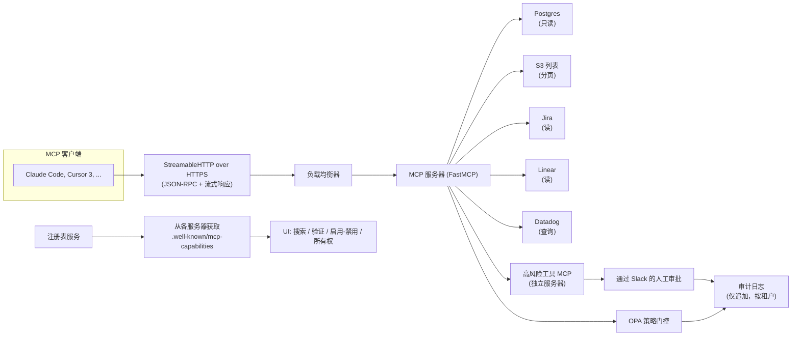

# 毕业项目 13 — MCP 服务器与注册表及治理

> 2026 年，模型上下文协议（Model Context Protocol）不再只是未来的设想，而成为了默认的工具使用规范。Anthropic、OpenAI、Google 以及所有主流 IDE 都已搭载 MCP 客户端。Pinterest 发布了其内部的 MCP 服务器生态系统。AAIF 注册表在 `.well-known` 上正式定义了能力元数据。AWS ECS 发布了参考性的无状态部署方案。Block 的 goose-agent 将同一协议内置于托管助手之中。2026 年的生产形态是：StreamableHTTP 传输、OAuth 2.1 作用域、OPA 策略门控，以及一个让平台团队能够发现、验证和启用服务器的注册表。让我们从头到尾构建它。

**类型：** 毕业项目
**语言：** Python（服务器，通过 FastMCP）或 TypeScript（@modelcontextprotocol/sdk）、Go（注册表服务）
**前置条件：** 阶段 11（LLM 工程）、阶段 13（工具与 MCP）、阶段 14（智能体）、阶段 17（基础设施）、阶段 18（安全）
**锻炼的阶段：** P11 · P13 · P14 · P17 · P18
**时间：** 25 小时

## 问题

MCP 已成为工具使用的通用语言。Claude Code、Cursor 3、Amp、OpenCode、Gemini CLI，以及所有托管智能体现在都在使用 MCP 服务器。生产层面的挑战不在于编写服务器（FastMCP 使这变得容易），而是在企业级需求下进行大规模部署：每租户 OAuth 作用域、高风险工具的 OPA 策略、StreamableHTTP 无状态横向扩展、用于发现目的的注册表、每次工具调用的审计日志。Pinterest 的内部 MCP 生态系统以及 AAIF 注册表规范代表了 2026 年的标杆。

你将构建一个 MCP 服务器，暴露 10 个内部工具（Postgres 只读、S3 列表、Jira、Linear、Datadog 等）、一个用于平台发现的注册表 UI，以及一个人工审批门控用于高风险工具。负载测试展示了 StreamableHTTP 的横向扩展能力。审计跟踪满足企业安全审查要求。

## 概念

MCP 2026 修订版规定 StreamableHTTP 作为默认传输方式。与早期的 stdio-and-SSE 形态不同，StreamableHTTP 默认无状态：一个 HTTP 端点接收 JSON-RPC 请求、流式响应，并支持用于通知的长连接。无状态意味着可以在负载均衡器后面横向扩展。

授权采用 OAuth 2.1，每工具一个作用域。令牌携带诸如 `jira:read`、`s3:list`、`postgres:query:readonly` 这样的作用域。MCP 服务器在工具调用时检查作用域，而不仅仅是会话开始时。对于高风险工具，服务器会拒绝任何在最近 N 分钟内未通过 Slack 审批卡提升到 `approved:by:human` 作用域的调用——这种提升来自 Slack 审批流程。

注册表是一个独立的服务。每个 MCP 服务器都在 `.well-known/mcp-capabilities` 上暴露其工具清单、传输 URL 和认证要求。注册表负责轮询、验证和索引。平台团队使用注册表 UI 来查看有哪些工具可用、需要哪些作用域，以及哪些团队拥有它们。

## 架构



## 技术栈

- 服务器框架：FastMCP（Python）或 `@modelcontextprotocol/sdk`（TypeScript）
- 传输：StreamableHTTP over HTTPS（无状态）
- 认证：OAuth 2.1，通过 SPIFFE / SPIRE 实现工作负载身份
- 策略：每个工具的 OPA / Rego 规则；每个请求的策略决策服务
- 注册表：自托管，消费 `.well-known/mcp-capabilities` 清单
- 人工审批：用于高风险工具的 Slack 交互消息
- 部署：AWS ECS Fargate 或 Fly.io，每租户一个服务器或通过租户隔离共享
- 审计：每租户的 JSONL 结构化日志，包含每次调用的来源追溯

## 构建它

1. **工具表面。** 暴露 10 个内部工具：Postgres 只读查询、S3 列出对象、Jira 搜索/获取、Linear 搜索/获取、Datadog 指标查询、PagerDuty值班查询、GitHub 只读、Notion 搜索、Slack 搜索、Salesforce 只读。每个工具都有类型化模式和一个作用域标签。

2. **FastMCP 服务器。** 挂载这些工具。配置 StreamableHTTP 传输。添加用于 OAuth 令牌检查和作用域执行的中间件。

3. **OPA 策略。** 每个工具的 Rego 策略：哪些作用域允许调用、哪些 PII 脱敏规则适用、哪些负载大小上限适用。决策服务在每次工具调用时被调用。

4. **注册表服务。** 独立的 Go 或 TS 服务，从已注册服务器轮询 `.well-known/mcp-capabilities`，用 JSON Schema 验证，并暴露列表/搜索/验证/启用-禁用 UI。

5. **能力清单。** 每个服务器在 `.well-known/mcp-capabilities` 上暴露：工具列表、认证要求、传输 URL、所属团队、SLO。

6. **高风险工具分离。** 会改变状态的工具（Jira 创建、Linear 创建、Postgres 写入）放在第二个 MCP 服务器上，带有更严格的认证流程：令牌必须在 15 分钟内通过 Slack 卡片将作用域提升到 `approved:by:human`。

7. **审计日志。** 每租户仅追加的 JSONL：`{timestamp, user, tool, args_redacted, response_redacted, outcome}`。写入前通过 Presidio 进行 PII 脱敏。

8. **负载测试。** 在 StreamableHTTP 上 100 个并发客户端。通过添加第二个副本演示横向扩展；展示负载均衡器重新分配且无会话粘性。

9. **一致性测试。** 对两个服务器运行官方 MCP 一致性套件。通过所有强制部分。

## 使用它

```
$ curl -H "Authorization: Bearer eyJhbGc..." \
       -X POST https://mcp.internal.example.com/ \
       -d '{"jsonrpc":"2.0","method":"tools/call",
            "params":{"name":"postgres.readonly","arguments":{"sql":"SELECT 1"}}}'
[registry]   能力已验证: postgres.readonly v1.2
[policy]    作用域 postgres:query:readonly 存在；允许
[audit]     已记录: user=u42 tool=postgres.readonly outcome=ok
response:    { "result": { "rows": [[1]] } }
```

## 交付它

`outputs/skill-mcp-server.md` 描述了交付物。一个生产级的 MCP 服务器 + 注册表 + 审计层，用于内部工具，带有 OAuth 2.1 作用域和 OPA 门控。

| 权重 | 标准 | 如何衡量 |
|:-:|---|---|
| 25 | 规范一致性 | StreamableHTTP + 能力清单通过 MCP 一致性测试 |
| 20 | 安全性 | 作用域执行、每个工具的 OPA 覆盖、密钥卫生 |
| 20 | 可观测性 | 每次工具调用的审计日志，带 PII 脱敏 |
| 20 | 规模 | 100 客户端负载测试横向扩展演示 |
| 15 | 注册表用户体验 | 发现 / 验证 / 启用-禁用工作流 |
| **100** | | |

## 练习

1. 添加一个新工具（Confluence 搜索）。通过注册表验证流程发布它，而无需触碰核心服务器。

2. 编写一个 OPA 策略，对包含名为 `email`、`ssn` 或 `phone` 的列的 Postgres 查询结果进行脱敏。用探测查询进行练习。

3. 在本地延迟上对 StreamableHTTP 与 stdio 进行基准测试。报告每次调用的 p50/p95。

4. 实现每租户配额：每个租户每个工具每分钟最多 N 次调用。通过第二个 OPA 规则强制执行。

5. 运行来自 [mcp-conformance-tests](https://github.com/modelcontextprotocol/conformance) 的 MCP 一致性套件，并修复每个失败项。

## 关键术语

| 术语 | 人们怎么说 | 实际意味着什么 |
|------|-----------------|------------------------|
| StreamableHTTP | "2026 MCP 传输" | 无状态 HTTP + 流式响应；为网络服务器替代 SSE + stdio |
| 能力清单 | "Well-known 文档" | `.well-known/mcp-capabilities`，包含工具列表、认证、传输 URL |
| OPA / Rego | "策略引擎" | Open Policy Agent，用于根据外部规则授权工具调用 |
| 作用域提升 | "人工审批通过" | 通过 Slack 审批授予的短期作用域，高风险工具必需 |
| 注册表 | "工具发现" | 从其能力清单索引 MCP 服务器的服务 |
| 工作负载身份 | "SPIFFE / SPIRE" | OAuth 令牌颁发的加密服务身份 |
| 一致性套件 | "规范测试" | StreamableHTTP + 工具清单正确性的官方 MCP 测试电池 |

## 延伸阅读

- [Model Context Protocol 2026 路线图](https://blog.modelcontextprotocol.io/posts/2026-mcp-roadmap/) — StreamableHTTP、能力元数据、注册表
- [AAIF MCP 注册表规范](https://github.com/modelcontextprotocol/registry) — 2026 年注册表规范
- [AWS ECS 参考部署](https://aws.amazon.com/blogs/containers/deploying-model-context-protocol-mcp-servers-on-amazon-ecs/) — 参考生产部署
- [Pinterest 内部 MCP 生态系统](https://www.infoq.com/news/2026/04/pinterest-mcp-ecosystem/) — 参考内部部署
- [Block `goose` MCP 使用](https://block.github.io/goose/) — 参考智能体消费模式
- [FastMCP](https://github.com/jlowin/fastmcp) — Python 服务器框架
- [Open Policy Agent](https://www.openpolicyagent.org/) — 策略引擎参考
- [SPIFFE / SPIRE](https://spiffe.io) — 工作负载身份参考
