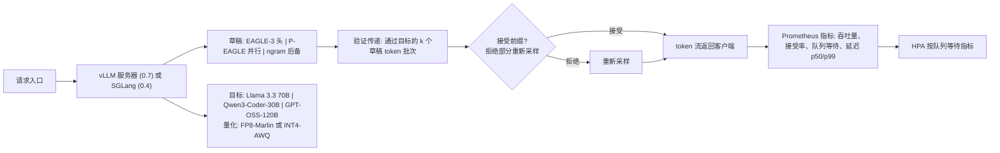

# 毕业项目 14 — 推测解码推理服务器

> EAGLE-3 在 vLLM 0.7 中实际流量吞吐量达到 2.5-3 倍。P-EAGLE（AWS 2026）将并行推测推得更远。SGLang 的 SpecForge 在规模上训练草稿头。Red Hat 的 Speculators 中心发布了针对通用开源模型的对齐草稿。TensorRT-LLM 在 NVIDIA 上将推测解码作为一级特性。2026 年的生产服务技术栈是带 EAGLE 系列草稿的 vLLM 或 SGLang、FP8 或 INT4 量化，以及 HPA 队列等待。这个毕业项目是用 2.5 倍及以上基线吞吐量服务两个开源模型，并附上完整的尾延迟报告。

**类型：** 毕业项目
**语言：** Python（服务）、C++ / CUDA（内核检查）、YAML（配置）
**前置条件：** 阶段 3（深度学习）、阶段 7（Transformer）、阶段 10（从零构建 LLM）、阶段 17（基础设施）
**锻炼的阶段：** P3 · P7 · P10 · P17
**时间：** 30 小时

## 问题

推测解码在 2026 年已成为一种通用技术。EAGLE-3 草稿头在目标模型的隐藏状态上训练，并预测 N 个 token；目标模型在一次传递中验证。60-80% 的接受率转化为 2-3 倍的端到端吞吐量。vLLM 0.7 原生集成。SGLang + SpecForge 提供了训练管道。Red Hat 的 Speculators 为 Llama 3.3 70B、Qwen3-Coder-30B MoE、GPT-OSS-120B 发布了对齐草稿。

艺术在于服务运营，而非模型本身。接受率随流量分布而漂移（ShareGPT 与代码与领域数据）。在拒绝时的尾延迟比没有推测时更差——你必须报告多个批大小下的 p99，而不仅仅是稳态的 tokens/秒。与 Anthropic / OpenAI API 相比，每 1M token 的成本是信誉杠杆。

## 概念

推测解码有两个层。**草稿**模型（EAGLE-3 头、ngram 或更小的目标对齐模型）在每一步提出 k 个候选 token。**目标**模型在一次传递中验证所有 k 个；任何被接受的前缀替换贪婪路径。接受率取决于草稿-目标对齐度和输入分布。

EAGLE-3 在大多数流量上优于 ngram 草稿。P-EAGLE 运行并行推测以获得更深的草稿树。权衡点：拒绝时的 P99 延迟更高，因为验证传递更大。服务配置必须报告按批大小分类的延迟以暴露这一点。

部署在 Kubernetes 上。vLLM 0.7 每个 GPU 或张量并行分片运行一个副本。HPA 根据队列等待而不是 CPU 进行自动扩展。FP8（Marlin）和 INT4（AWQ）量化将 GPU 内存保持在 H100 / H200  envelope 内。端到端报告包括吞吐量、接受率、批 1/8/32 下的 p50/p99，以及每 1M token 的美元成本。

## 架构



## 技术栈

- 服务：vLLM 0.7 或 SGLang 0.4
- 推测方法：EAGLE-3 草稿头、P-EAGLE 并行推测、ngram 后备
- 草稿训练：SpecForge（SGLang）或 Red Hat Speculators
- 目标模型：Llama 3.3 70B、Qwen3-Coder-30B MoE、GPT-OSS-120B
- 量化：FP8（Marlin）、INT4 AWQ
- 部署：Kubernetes + NVIDIA 设备插件；按队列等待指标 HPA
- 评估：ShareGPT、MT-Bench-v2、GSM8K、HumanEval 用于领域分布接受率测量
- 参考：TensorRT-LLM 推测解码作为供应商基线

## 构建它

1. **目标模型准备。** 选择 Llama 3.3 70B。通过 Marlin 量化为 FP8。在 1xH100（或 2x 张量并行）上通过 vLLM 0.7 部署。

2. **草稿来源。** 从 Red Hat Speculators 拉取对齐的 EAGLE-3 草稿头（或通过 SpecForge 训练一个）。加载到 vLLM 的推测解码配置中。

3. **基线数据。** 在推测之前：批 1/8/32 下的 tokens/s、p50/p99 延迟、GPU 利用率。发布。

4. **启用 EAGLE-3。** 翻转配置；重新运行相同基准测试。报告加速比、接受率、p99 尾延迟变化。

5. **P-EAGLE。** 启用并行推测；测量更深草稿树与串行 EAGLE-3 的对比。报告 P-EAGLE 帮助与伤害的拐点。

6. **领域流量。** 通过相同服务器运行 ShareGPT 与 HumanEval 与领域特定流量的对比。测量每个分布的接受率。识别草稿何时漂移。

7. **第二个目标模型。** 在 Qwen3-Coder-30B MoE 上运行相同管道。草稿更棘手（MoE 路由噪声）。报告。

8. **K8s HPA。** 在 K8s 上部署，HPA 跟踪 `queue_wait_ms`。演示负载 tripled 时扩展。

9. **成本对比。** 计算每 1M token 的美元成本与同一评估上 Anthropic Claude Sonnet 4.7 和 OpenAI GPT-5.4 的对比。发布。

## 使用它

```
$ curl https://infer.example.com/v1/chat/completions -d '{"messages":[...]}'
[serve]     vLLM 0.7, Llama 3.3 70B FP8, EAGLE-3 已激活
[decode]    bs=8, 每步接受 token 数=3.2, 接受率=0.76
[latency]   首个 token 42ms, 完整响应 980ms (620 tokens)
[cost]      持续吞吐量下每 1M 输出 token $0.34
```

## 交付它

`outputs/skill-inference-server.md` 描述了交付物。一个带推测解码的测量服务栈，完整的基准测试报告，以及一个 K8s 部署。

| 权重 | 标准 | 如何衡量 |
|:-:|---|---|
| 25 | 与基线相比的测量加速比 | 两个模型上匹配质量下 2.5 倍以上吞吐量 |
| 20 | 真实流量上的接受率 | 按分布的接受率报告 |
| 20 | P99 尾延迟纪律 | 有/无推测情况下批 1/8/32 的 p99 |
| 20 | 运维 | K8s 部署、按队列等待的 HPA、滚动平滑 |
| 15 | 写作和方法论 | 清晰解释什么改变了以及为什么 |
| **100** | | |

## 练习

1. 测量当草稿落后目标一个版本时接受率下降（例如 Llama 3.3 -> 3.4 漂移）。建立一个监控警报。

2. 实现 ngram 后备：如果 EAGLE-3 接受率低于阈值，切换到 ngram 草稿。报告可靠性改进。

3. 运行一个受控的 MoE 实验：相同 Qwen3-Coder-30B 有/无路由噪声注入。测量草稿接受敏感性。

4. 扩展到 H200（141 GB）。报告获得的每个副本模型大小余量，以及是否可以服务未量化的 Llama 3.3 70B。

5. 在同一 H100 硬件上对 TensorRT-LLM 推测解码进行基准测试。报告它在哪里赢 vLLM。

## 关键术语

| 术语 | 人们怎么说 | 实际意味着什么 |
|------|-----------------|------------------------|
| 草稿模型 | "推测器" | 提出 N 个 token 供目标验证的小模型 |
| EAGLE-3 | "2026 草稿架构" | 在目标隐藏状态上训练的草稿头；约 75% 接受率 |
| P-EAGLE | "并行推测" | 在一次目标传递中验证的草稿分支树 |
| 接受率 | "命中率" | 无需重新采样的草稿 token 比例 |
| 量化 | "FP8 / INT4" | 较低精度的权重以在 GPU 内存中容纳更多模型 |
| 队列等待 | "HPA 指标" | 请求在推理开始前在待处理队列中等待的时间 |
| Speculators 中心 | "对齐草稿" | Red Hat Neural Magic 的通用开源模型 EAGLE 草稿中心 |

## 延伸阅读

- [vLLM EAGLE 和 P-EAGLE 文档](https://docs.vllm.ai) — 参考服务栈
- [P-EAGLE (AWS 2026)](https://aws.amazon.com/blogs/machine-learning/p-eagle-faster-llm-inference-with-parallel-speculative-decoding-in-vllm/) — 并行推测解码论文 + 集成
- [SGLang SpecForge](https://github.com/sgl-project/SpecForge) — 草稿头训练管道
- [Red Hat Speculators](https://github.com/neuralmagic/speculators) — 对齐草稿中心
- [TensorRT-LLM 推测解码](https://nvidia.github.io/TensorRT-LLM/) — 供应商替代方案
- [Fireworks.ai 服务架构](https://fireworks.ai/blog) — 商业参考
- [EAGLE-3 论文 (arXiv:2503.01840)](https://arxiv.org/abs/2503.01840) — 方法论文
- [vLLM 仓库](https://github.com/vllm-project/vllm) — 代码和基准测试
