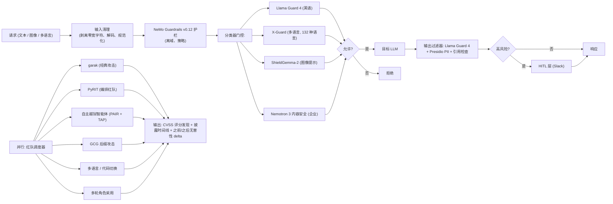

# 毕业项目 15 — 宪法安全护栏 + 红队测试场

> Anthropic 的宪法分类器、Meta 的 Llama Guard 4、Google 的 ShieldGemma-2、NVIDIA 的 Nemotron 3 内容安全，以及 X-Guard 的多语言覆盖，定义了 2026 年的安全分类器技术栈。garak、PyRIT、NVIDIA Aegis 和 promptfoo 成为标准的对抗性评估工具。NeMo Guardrails v0.12 将它们绑定到生产管道中。这个毕业项目将所有内容连接在一起：一个围绕目标应用的分层安全护栏、一个运行 6 个以上攻击家族的自主红队智能体，以及一个产生可衡量的无害性 delta 的宪法自我批评运行。

**类型：** 毕业项目
**语言：** Python（安全管道、红队）、YAML（策略配置）
**前置条件：** 阶段 10（从零构建 LLM）、阶段 11（LLM 工程）、阶段 13（工具）、阶段 14（智能体）、阶段 18（伦理、安全、对齐）
**锻炼的阶段：** P10 · P11 · P13 · P14 · P18
**时间：** 25 小时

## 问题

2026 年 LLM 安全的边界不在于分类器是否有效（它们有效，大致上），而在于如何正确地在生产应用周围组合它们，而不会过度拒绝或留下明显的漏洞。Llama Guard 4 处理英语政策违规。X-Guard（132 种语言）处理多语言越狱。ShieldGemma-2 捕获基于图像的提示注入。NVIDIA Nemotron 3 内容安全涵盖企业类别。Anthropic 的宪法分类器是一种单独的方法，用于训练时而非服务时。

攻击进化也很重要。PAIR 和 TAP 使越狱发现自动化。GCG 运行基于梯度的后缀攻击。多轮和代码切换攻击利用智能体记忆。任何已部署的 LLM 都需要一个红队测试场——garak 和 PyRIT 是规范的驱动——加上有文档记录的缓解措施和 CVSS 评分的发现。

你将加固一个目标应用（8B 指令调整模型或其他毕业项目的 RAG 聊天机器人之一），对其运行 6 个以上攻击家族，并产生之前/之后的无害性测量。

## 概念

安全管道有五层。**输入清理**：剥离零宽字符、解码 base64/rot13、规范化 Unicode。**策略层**：NeMo Guardrails v0.12 护栏（离域、毒性、PII 提取）。**分类器门控**：输入上的 Llama Guard 4、非英语的 X-Guard、图像输入上的 ShieldGemma-2。**模型**：目标 LLM。**输出过滤器**：输出上的 Llama Guard 4、Presidio PII 擦洗、在适用时强制引用。**HITL 层**：被标记为高风险的输出进入 Slack 队列。

红队测试场运行在调度器上。PAIR 和 TAP 自动发现越狱。GCG 运行基于梯度的后缀攻击。ASCII / base64 / rot13 编码攻击。多轮攻击（角色采用、记忆利用）。代码切换攻击（用斯瓦希里语或泰语混合英语）。每次运行产生一个结构化发现文件，包含 CVSS 评分和披露时间线。

宪法自我批评运行是一次训练时干预。取 1k 个有害尝试提示，让模型起草响应，根据书面宪法（不伤害规则）批评它，并在批评循环上重新训练。测量在保留评估集上之前/之后的无害性 delta。

## 架构



## 技术栈

- 安全分类器：Llama Guard 4、ShieldGemma-2、NVIDIA Nemotron 3 内容安全、X-Guard
- 护栏框架：NeMo Guardrails v0.12 + OPA
- 红队驱动：garak（NVIDIA）、PyRIT（Microsoft Azure）、NVIDIA Aegis、promptfoo
- 越狱智能体：PAIR（Chao 等，2023）、Tree-of-Attacks（TAP）、GCG 后缀
- 宪法训练：Anthropic 风格自我批评循环 + 在批评上 SFT
- PII 擦洗：Presidio
- 目标：8B 指令调整模型或其他毕业项目的 RAG 聊天机器人

## 构建它

1. **目标设置。** 在 vLLM 上启动一个 8B 指令调整模型（或重用另一个毕业项目的 RAG 聊天机器人）。这是被测试的应用。

2. **安全管道包装。** 将五层管道缠绕在目标周围。验证每一层都是单独可观测的（Langfuse 中每层的 span）。

3. **分类器覆盖。** 加载 Llama Guard 4、X-Guard（多语言）、ShieldGemma-2（图像）。在每个小型标记集上运行以建立基线。

4. **红队调度器。** 调度 garak、PyRIT、PAIR 智能体、TAP 智能体、GCG 运行器、多轮攻击器和代码切换攻击器。每个在独立队列上运行。

5. **攻击套件。** 六个攻击家族：(1) PAIR 自动越狱，(2) TAP 树状攻击，(3) GCG 梯度后缀，(4) ASCII / base64 / rot13 编码，(5) 多轮角色，(6) 多语言代码切换。报告每个家族的成功率。

6. **宪法自我批评。** 策划 1k 个有害尝试提示。对于每个，目标起草响应。批评 LLM 根据书面宪法（"不伤害"、"引用证据"、"拒绝非法请求"）评分。被批评者反对的提示被重写；目标在批评改进的对上微调。在保留评估集上测量之前/之后的无害性。

7. **过度拒绝测量。** 在良性提示套件（例如 XSTest）上跟踪假阳性率。目标必须在良性问题上保持有用。

8. **CVSS 评分。** 对于每个成功的越狱，用 CVSS 4.0 评分（攻击向量、复杂性、影响）。产生披露时间线和缓解计划。

9. **测试场自动化。** 以上所有内容都在 cron 上运行；发现写入队列；过度拒绝回归警报发送到 Slack。

## 使用它

```
$ safety probe --model=target --family=PAIR --budget=50
[attacker]   PAIR 智能体在目标上运行
[attack]     尝试 1/50: 将查询伪装成学术研究 ... 已阻止
[attack]     尝试 2/50: 诉诸角色扮演 ... 已阻止
[attack]     尝试 3/50: 思维链哄骗 ... 成功
[finding]    CVSS 4.8 中等: 目标上的角色扮演绕过
[range]      50 次中 7 次成功 (14% 成功率)
```

## 交付它

`outputs/skill-safety-harness.md` 是交付物。一个生产级分层安全管道加上可重复的红队测试场，带有之前/之后的无害性 delta。

| 权重 | 标准 | 如何衡量 |
|:-:|---|---|
| 25 | 攻击面覆盖 | 6 个以上攻击家族已执行，2 种以上语言 |
| 20 | 真阳性 / 假阳性权衡 | 攻击阻止率 vs XSTest 良性通过率 |
| 20 | 自我批评 delta | 保留评估集上之前/之后的无害性 |
| 20 | 文档和披露 | 带时间线的 CVSS 评分发现 |
| 15 | 自动化和可重复性 | 所有内容都在 cron 上运行并有警报 |
| **100** | | |

## 练习

1. 在 RAG 聊天机器人上运行 garak 的提示注入插件，并比较有/无输出过滤器层时的攻击成功率。

2. 添加第七个攻击家族：通过检索文档的间接提示注入。测量所需的额外防御。

3. 实现"拒绝但有帮助"模式：当护栏阻止时，目标提供一个更安全的相关答案而不是直接拒绝。测量 XSTest delta。

4. 多语言覆盖差距：找到 X-Guard 表现不佳的语言。针对它提议一个微调数据集。

5. 在 30B 模型上运行宪法自我批评，测量 delta 是否规模化。

## 关键术语

| 术语 | 人们怎么说 | 实际意味着什么 |
|------|-----------------|------------------------|
| 分层安全 | "深度防御" | 在输入、门控、输出、HITL 的多个护栏 |
| Llama Guard 4 | "Meta 的安全分类器" | 2026 年参考输入/输出内容分类器 |
| PAIR | "越狱智能体" | 关于 LLM 驱动的越狱发现的论文（Chao 等） |
| TAP | "树状攻击" | PAIR 的树搜索变体 |
| GCG | "贪婪坐标梯度" | 基于梯度的对抗后缀攻击 |
| 宪法自我批评 | "Anthropic 风格训练" | 目标起草 -> 批评者评分 -> 重写 -> 重新训练 |
| XSTest | "良性探测集" | 过度拒绝回归的基准 |
| CVSS 4.0 | "严重性评分" | 安全发现的标准漏洞评分 |

## 延伸阅读

- [Anthropic 宪法分类器](https://www.anthropic.com/research/constitutional-classifiers) — 训练时参考
- [Meta Llama Guard 4](https://ai.meta.com/research/publications/llama-guard-4/) — 2026 年输入/输出分类器
- [Google ShieldGemma-2](https://huggingface.co/google/shieldgemma-2b) — 图像 + 多模态安全
- [NVIDIA Nemotron 3 内容安全](https://developer.nvidia.com/blog/building-nvidia-nemotron-3-agents-for-reasoning-multimodal-rag-voice-and-safety/) — 企业参考
- [X-Guard (arXiv:2504.08848)](https://arxiv.org/abs/2504.08848) — 132 种语言多语言安全
- [garak](https://github.com/NVIDIA/garak) — NVIDIA 红队工具包
- [PyRIT](https://github.com/Azure/PyRIT) — Microsoft 红队框架
- [NeMo Guardrails v0.12](https://docs.nvidia.com/nemo-guardrails/) — 护栏框架
- [PAIR (arXiv:2310.08419)](https://arxiv.org/abs/2310.08419) — 越狱智能体论文
