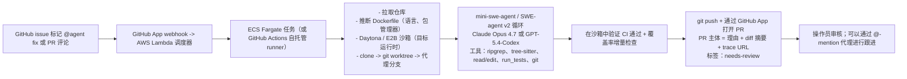

# Capstone 16 — GitHub Issue-to-PR 自主代理

> AWS Remote SWE Agents、Cursor Background Agents、OpenAI Codex cloud 和 Google Jules 在 2026 年都推出了相同的产品形态：标记 issue，得到一个 PR。在云沙箱中运行一个代理，验证测试通过，然后发布一个附带理由的 review-ready PR。难点在于：自动复现仓库的构建环境、防止凭证泄露、执行每个仓库的预算限制，以及确保代理无法强制推送。本 capstone 构建自托管版本，并与托管替代方案在成本和通过率上进行对比。

**类型：** Capstone
**语言：** Python（代理）、TypeScript（GitHub App）、YAML（Actions）
**前置条件：** 阶段 11（LLM 工程）、阶段 13（工具）、阶段 14（代理）、阶段 15（自主）、阶段 17（基础设施）
**涉及的阶段：** P11 · P13 · P14 · P15 · P17
**时间：** 30 小时

## 问题

异步云端编码代理是与交互式编码代理（capstone 01）不同的产品类别。用户体验是一个 GitHub 标签。你给一个 issue 打上 `@agent fix this` 标签，一个 worker 在云沙箱中启动，克隆仓库，运行测试，编辑文件，验证，然后打开一个 PR，主体中包含代理的理由。没有交互循环，没有终端。AWS Remote SWE Agents、Cursor Background Agents、OpenAI Codex cloud、Google Jules 和 Factory Droids 都收敛到这一点。

工程挑战是具体的：环境复现（代理必须从头构建仓库，而不是使用缓存的开发镜像）、 flaky 测试（必须重新运行或隔离）、凭证作用域（具有最小细粒度权限的 GitHub App）、每个仓库每天的预算执行，以及无强制推送策略。capstone 衡量通过率、成本和安全性，与托管替代方案进行对比。

## 概念

触发器是一个 GitHub webhook（issue 标签或 PR 评论）。调度器将工作入队到 ECS Fargate 或 Lambda。worker 将仓库拉入 Daytona 或 E2B 沙箱，并根据仓库（语言、框架）推断通用 Dockerfile。代理针对 Claude Opus 4.7 或 GPT-5.4-Codex 运行一个 mini-swe-agent 或 SWE-agent v2 循环。它迭代：读取代码、提出修复、应用补丁、运行测试。

验证是门控步骤。在 PR 打开之前，完整 CI 必须在沙箱中通过。计算覆盖率增量；如果为负且超过阈值，PR 仍会打开但会被标记为 `needs-review`。代理将理由作为 PR 描述发布，外加一个 `@agent` 线程供审核者进行跟进。

安全性通过两个不同的 GitHub 层面进行作用域控制：App 提供短期安装令牌，具有 `workflows: read` 和窄范围的 repo contents/PR 作用域；分支保护（唯一能做到这一点的层面）强制执行"不直接写入 `main`"和"不强制推送"——App 永远不会被添加到 bypass 列表。对 `.github/workflows` 的路径作用域只读访问不是真正的 GitHub App 原语，因此代理的文件编辑允许列表必须在 worker 层面强制执行。每个仓库每天的预算上限在调度器层面执行（例如，每个仓库每天最多 5 个 PR，每个 PR 最多 $20）。

## 架构



## 技术栈

- 触发器：通过 Lambda 或 Fly.io 接收 webhook 的细粒度令牌 GitHub App
- Worker：ECS Fargate 任务（或 GitHub Actions 自托管 runner）
- 沙箱：每个任务的 Daytona devcontainer 或 E2B 沙箱
- 代理循环：在 Claude Opus 4.7 / GPT-5.4-Codex 上运行的 mini-swe-agent 基线或 SWE-agent v2
- 检索：tree-sitter repo-map + ripgrep
- 验证：沙箱内完整 CI + 覆盖率增量门控
- 可观测性：Langfuse，每个 PR 的 trace 存档链接在 PR 主体中
- 预算：每个仓库每天的美元上限；每个仓库每天最多 PR 数

## 构建它

1. **GitHub App。** 细粒度安装令牌：issues read+write、pull_requests write、contents read+write、workflows read。分支保护（唯一能做到这一点的层面）强制执行"不直接推送到 `main`"和"不强制推送"；App 不在 bypass 列表中。Worker 在提议的 diff 上强制执行"不在 `.github/workflows` 下写入"作为允许列表检查，因为 GitHub App 权限不是路径作用域的。

2. **Webhook 接收器。** Lambda 函数接受 issue 标签/PR 评论 webhook。按标签 `@agent fix this` 过滤。入队到 SQS。

3. **调度器。** 从 SQS 弹出任务。强制执行每个仓库每天的预算。用仓库 URL、issue 主体和新的 Daytona 沙箱启动 ECS Fargate 任务。

4. **环境推断。** 检测语言（Python、Node、Go、Rust）和包管理器（uv、pnpm、go mod、cargo）。动态生成 Dockerfile（如果不存在）。

5. **代理循环。** 使用 Claude Opus 4.7 的 mini-swe-agent 或 SWE-agent v2。工具：ripgrep、tree-sitter repo-map、read_file、edit_file、run_tests、git。硬限制：$20 成本、30 分钟墙上时间、30 轮代理。

6. **验证。** 循环结束后，在沙箱内运行完整测试套件。通过 jacoco / coverage.py 计算覆盖率增量。如果 CI 失败：停止，不打开 PR。如果覆盖率下降超过 2%：打开 PR 并带有 `needs-review` 标签。

7. **发布 PR。** 推送代理分支。通过 GitHub API 打开 PR，包含：标题、理由、diff 摘要、trace URL、成本、轮次。

8. **凭证卫生。** Worker 使用短期 GitHub App 安装令牌运行。日志在归档前清除 secrets。

9. **评估。** 30 个不同难度的内部 issue。衡量通过率、PR 质量（diff 大小、风格、覆盖率）、成本、延迟。在相同 issue 上与 Cursor Background Agents 和 AWS Remote SWE Agents 进行对比。

## 使用它

```
# 在 github.com 上
  - 用户给 issue #842 标记 `@agent fix this`
  - 14 分钟后出现 PR #1903
  - 主体：
    > 修复了 widget.dedupe() 中由 null 比较器条目导致的 NPE。
    > 添加了回归测试 widget_test.go::TestDedupeNullComparator。
    > 覆盖率增量：+0.12%
    > 轮次：7  成本：$1.80  Trace：langfuse:...
    > 标签：needs-review
```

## 交付它

`outputs/skill-issue-to-pr.md` 是交付物。一个 GitHub App + 异步云端 worker，将标记的 issue 转化为带有有限成本和作用域凭证的 review-ready PR。

| 权重 | 标准 | 衡量方式 |
|:-:|---|---|
| 25 | 30 个 issue 的通过率 | 端到端成功（CI 绿色 + 覆盖率正常） |
| 20 | PR 质量 | Diff 大小、覆盖率增量、风格一致性 |
| 20 | 每个已解决 issue 的成本和延迟 | 每个 PR 的 $ 和墙上时间 |
| 20 | 安全性 | 作用域令牌、每个仓库预算、无强制推送、凭证卫生 |
| 15 | 操作员用户体验 | 理由注释、重试便利性、@-mention 跟进 |
| **100** | | |

## 练习

1. 添加"修复 flaky 测试"模式：标签 `@agent stabilize-flake TestX` 在沙箱中运行测试 50 次，并提出一个稳定它的最小更改。

2. 在三个共享 issue 上比较成本与 Cursor Background Agents。报告各自在哪些方面胜出。

3. 实现预算仪表板：每个仓库每天的成本、每个用户的成本。异常时告警。

4. 构建"试运行"模式：在不运行 CI 的情况下打开 draft PR，以便审核者可以廉价地检查计划。

5. 添加保留策略：超过 7 天未合并的 PR 分支自动删除。

## 关键术语

| 术语 | 大家怎么说 | 实际含义 |
|------|-----------------|------------------------|
| GitHub App | "作用域 bot 身份" | 具有细粒度权限 + 短期安装令牌的 App |
| 异步云端代理 | "后台代理" | 在云沙箱中运行的非交互式 worker，不是终端 |
| 环境推断 | "Dockerfile 合成" | 检测语言 + 包管理器，在不存在时生成 Dockerfile |
| 验证 | "沙箱内 CI" | 在打开 PR 之前在 worker 内部运行完整测试套件 |
| 覆盖率增量 | "覆盖率保持" | 从基线到代理分支的测试覆盖率 % 变化 |
| 每个仓库预算 | "每日上限" | 在调度器层面执行的美元和 PR 数量上限 |
| 理由 | "PR 主体解释" | 代理关于更改内容和原因的摘要；PR 主体中必须包含 |

## 延伸阅读

- [AWS Remote SWE Agents](https://github.com/aws-samples/remote-swe-agents) — 典型的异步云端代理参考
- [SWE-agent](https://github.com/SWE-agent/SWE-agent) — CLI 参考
- [Cursor Background Agents](https://docs.cursor.com/background-agent) — 商业替代方案
- [OpenAI Codex (cloud)](https://openai.com/codex) — 托管竞争对手
- [Google Jules](https://jules.google) — Google 的托管版本
- [Factory Droids](https://www.factory.ai) — 另类商业参考
- [GitHub App 文档](https://docs.github.com/en/apps) — 作用域 bot 身份
- [Daytona 云沙箱](https://daytona.io) — 参考沙箱