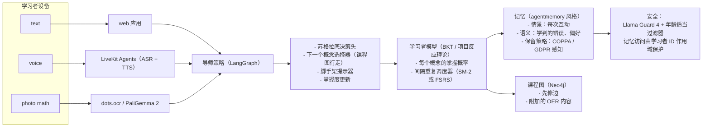

# Capstone 17 — 个人 AI 导师（自适应、多模态、带记忆）

> Khanmigo（Khan Academy）、Duolingo Max、Google LearnLM / Gemini for Education、Quizlet Q-Chat 和 Synthesis Tutor 在 2026 年都大规模推出了自适应多模态辅导。共同形态是：苏格拉底式策略（绝不直接抛出答案）、在学习者每次互动后更新的学习者模型（贝叶斯知识追踪风格）、语音 + 文本 + 拍照数学输入、课程图检索、间隔重复调度，以及面向年龄适当内容的严格安全过滤器。本 capstone 的目标是构建一个学科特定的导师（K-12 代数或入门 Python），对 10 名学习者进行两周有效性研究，并通过内容安全审计。

**类型：** Capstone
**语言：** Python（后端、学习者模型）、TypeScript（Web 应用）、SQL（通过 Postgres + Neo4j 的课程图）
**前置条件：** 阶段 5（NLP）、阶段 6（语音）、阶段 11（LLM 工程）、阶段 12（多模态）、阶段 14（代理）、阶段 17（基础设施）、阶段 18（安全）
**涉及的阶段：** P5 · P6 · P11 · P12 · P14 · P17 · P18
**时间：** 30 小时

## 问题

自适应辅导曾经是教育科技研究的一个小众领域。到 2026 年，它已成为一种消费产品。Khanmigo 已部署到大多数美国学区。Duolingo Max 达到数千万月活用户。Google 的 LearnLM / Gemini for Education 为 Google Classroom 中的辅导提供支持。Quizlet Q-Chat 与抽认卡并存。Synthesis Tutor 通过面向好奇孩子的导师实现了病毒式传播。共同要素：多模态输入（打字、说话、拍照数学题）、苏格拉底式教学法（先问后解释）、每次互动后更新的学习者模型，以及严格的年龄适当安全。

你将为特定群体构建其中之一。衡量标准是一项真正的有效性研究：10 名学习者、两周内的前后测分数。语音循环必须感觉自然（capstone 03 子栈）。记忆必须尊重隐私。安全过滤器必须通过面向 K-12 的 COPPA 意识红队测试。

## 概念

四个组件。**导师策略**是一个苏格拉底循环：当学习者要求答案时，策略问一个引导性问题；当他们答对时，它进入下一个概念；当他们卡住时，它提供脚手架式提示。**学习者模型**是贝叶斯知识追踪（或简单变体），在每次互动后更新每个课程节点的掌握概率。**课程图**是一个 Neo4j 概念图，包含先修边；策略在图中行走以选择下一个概念。**记忆**是一个情景 + 语义存储（类似 agentmemory），保存过去的互动、错误和偏好。

用户体验是多模态的。文本输入用于打字回答。语音输入通过 LiveKit + Whisper（复用 capstone 03）。拍照输入用于数学问题，通过 dots.ocr 或 PaliGemma 2。语音输出通过 Cartesia Sonic-2。安全使用 Llama Guard 4 加上年龄适当过滤器（屏蔽成人内容、暴力、自残）以及 COPPA 意识的记忆保留策略。

有效性研究是交付物。10 名学习者、前测和后测、两周。报告学习增益增量和置信区间。与非自适应基线（相同内容以线性方式传递，没有导师策略）进行对比。

## 架构



## 技术栈

- 学科选择：K-12 代数或入门 Python（选择一个深入）
- 导师策略：在 Claude Sonnet 4.7 上使用 LangGraph（带提示缓存）
- 学习者模型：贝叶斯知识追踪（经典）或 FSRS 间隔
- 课程图：Neo4j 概念 + 先修边 + OER 内容
- 记忆：类似 agentmemory 的持久向量 + 情景 + 语义存储
- 语音：LiveKit Agents 1.0 + Cartesia Sonic-2（复用 capstone 03 子栈）
- 拍照数学：dots.ocr 或 PaliGemma 2 用于公式识别
- 安全：Llama Guard 4 + 自定义年龄适当过滤器
- 评估：Bloom 级别问题生成、前后测测试工具、有效研究工具

## 构建它

1. **课程图。** 构建一个包含 50-150 个概念节点的 Neo4j（例如，从"数轴"到"二次公式"的 K-12 代数），并附上先修边。每个节点附加 OER 内容（开放教科书、OpenStax）。

2. **学习者模型。** 用先验初始化贝叶斯知识追踪：猜测率、失误率、学习率。每次互动后更新每个概念的掌握度。为每个学习者持久化。

3. **导师策略。** LangGraph 包含节点：`read_signal`（学习者的答案是正确/部分/卡住？）、`select_concept`（行走课程图选择最高优先级概念）、`scaffold`（苏格拉底提示）、`update_mastery`。

4. **记忆。** 每次互动写入情景存储。错误和偏好提升到语义记忆。COPPA 意识保留策略：1 年后自动删除，家长可访问。

5. **语音路径。** LiveKit Agents worker 连接到导师策略。ASR 通过 Whisper-v3-turbo。TTS 通过 Cartesia Sonic-2。支持打断（复用 capstone 03 机制）。

6. **拍照数学路径。** 上传或拍摄图像；运行 dots.ocr 或 PaliGemma 2 识别公式；作为结构化输入提供给导师。

7. **安全。** 每个模型输出都经过 Llama Guard 4 + 年龄适当过滤器（屏蔽自残、成人内容、暴力）。记忆访问由学习者 ID 作用域控制；家长访问面用于删除。

8. **有效性研究。** 10 名学习者、前测（标准化 30 题基线）、两周导师互动（每周 3 次）、后测。与相同内容的 10 名学习者非自适应基线队列进行对比。

9. **每周进度报告。** 为每个学习者自动生成 PDF 总结，包括已探索主题、掌握度轨迹和推荐的下一个步骤。

## 使用它

```
学习者："我不明白为什么 3x + 6 = 12 意味着 x = 2"
[信号]   卡住
[概念]   '解方程'（先修：加减法与等式）
[脚手架] "你从两边减去哪个数开始？"
学习者："6"
[信号]   正确
[掌握度] 加减法与等式：0.62 -> 0.77
[概念]   继续 '解方程'
[脚手架] "很好，现在 3x / 3 等于什么？"
```

## 交付它

`outputs/skill-ai-tutor.md` 是交付物。一个学科特定的自适应导师，具有多模态输入、学习者模型、记忆、安全性和可衡量的有效性。

| 权重 | 标准 | 衡量方式 |
|:-:|---|---|
| 25 | 学习增益增量 | 10 名学习者两周研究中的前后测增量 |
| 20 | 苏格拉底保真度 | 成绩单样本的评分量表分数 |
| 20 | 多模态用户体验 | 端到端语音 + 拍照 + 文本一致性 |
| 20 | 安全 + 隐私姿态 | Llama Guard 4 通过率 + COPPA 意识保留 |
| 15 | 课程广度和图质量 | 概念覆盖 + 先修图一致性 |
| **100** | | |

## 练习

1. 用和不用的自适应学习者模型运行有效性研究（随机概念顺序）。报告增量。预期自适应的会胜出，但大小才是有趣的数字。

2. 添加多模态探针：相同概念问题以文本、语音和照片形式传递。衡量学习者是否在他们喜欢的模态下收敛更快。

3. 构建家长仪表板：已练习的主题、掌握度轨迹、即将到来的概念、安全事件（任何护栏命中）。COPPA 对齐。

4. 添加语言切换模式：导师接受西班牙语输入并用西班牙语教学。测量 X-Guard 覆盖率。

5. 压力测试记忆隐私：验证学习者 A 即使通过语音片段重新摄入攻击也无法看到学习者 B 的数据。记录尝试的访问并告警。

## 关键术语

| 术语 | 大家怎么说 | 实际含义 |
|------|-----------------|------------------------|
| 苏格拉底策略 | "问，不要倾倒" | 导师问引导性问题而不是给出答案 |
| 贝叶斯知识追踪 | "BKT" | 经典的学习者模型方程，用于每个概念的掌握概率 |
| FSRS | "免费间隔重复调度器" | 2024 年间隔重复调度器，比 SM-2 更好 |
| 课程图 | "概念 DAG" | 包含先修边的 Neo4j 概念图 |
| 情景记忆 | "每次互动日志" | 每次互动存储以供后续检索 |
| 语义记忆 | "学习到的模式存储" | 从情景提升的压缩错误和偏好 |
| COPPA | "儿童隐私法" | 美国法律，限制从 13 岁以下儿童收集数据 |

## 延伸阅读

- [Khanmigo (Khan Academy)](https://www.khanmigo.ai) — 参考消费级 K-12 导师
- [Duolingo Max](https://blog.duolingo.com/duolingo-max/) — 参考语言学习导师
- [Google LearnLM / Gemini for Education](https://blog.google/technology/google-deepmind/learnlm) — 托管参考模型
- [Quizlet Q-Chat](https://quizlet.com) — 另类参考
- [Synthesis Tutor](https://www.synthesis.com) — 初创公司参考
- [FSRS 算法](https://github.com/open-spaced-repetition/fsrs4anki) — 间隔重复调度器
- [贝叶斯知识追踪](https://en.wikipedia.org/wiki/Bayesian_knowledge_tracing) — 学习者模型经典
- [LiveKit Agents](https://github.com/livekit/agents) — 语音栈