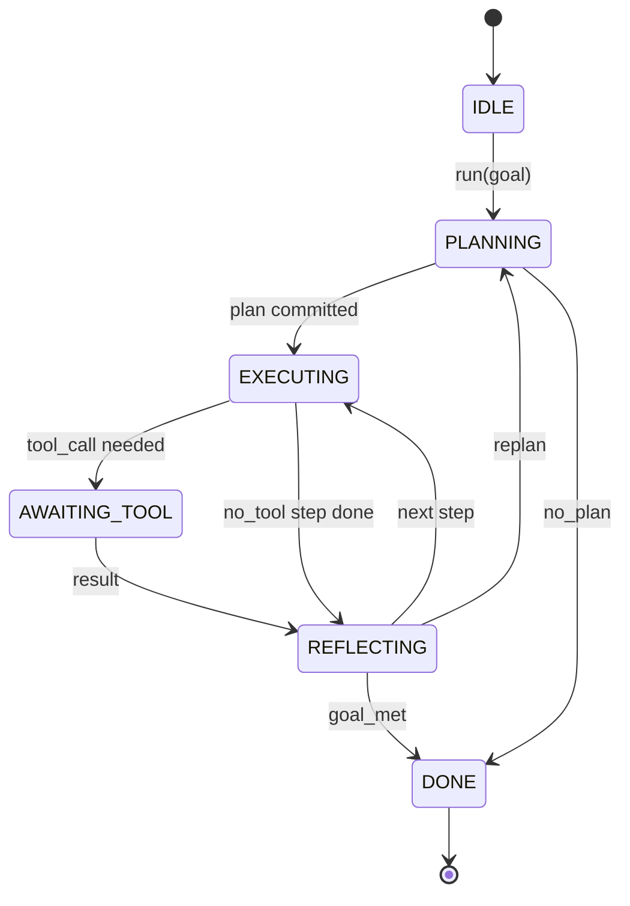

# 代理 Harness 循环契约

> Harness 就是代理。模型是协处理器。这节课冻结了你可以通过它连接任何模型的循环契约。

**类型：** 构建
**语言：** Python
**前置条件：** 阶段 13 课程 01-07、阶段 14 课程 01
**时间：** 约 90 分钟

## 学习目标

- 将代理 harness 循环指定为具有明确转换的确定性状态机。
- 实现十个生命周期钩子主题，运营商可以将策略、遥测和护栏接入其中。
- 定义两个拉取点，循环在此处将控制权交回调用者并在新输入上恢复。
- 在不泄露超额部分状态的情况下强制执行每次会话的预算（轮次、工具调用、墙上时间）。
- 发出typed的事件流，以便下游 UI 和追踪器可以订阅而不直接检查循环。

## 框架

一个无人值守运行四十轮的编码代理不是一个聊天循环。它是一个状态机，运营商可以拦截其节点，审计其边。一旦你把契约写下来，交换模型、工具或策略就不再是重构。它变成了一次注册调用。

这节课构建该契约。我们定义六个状态、十个钩子主题、两个拉取点、十一种事件类型和一个预算包络。Harness 中的其他所有内容（工具注册表、JSON-RPC 传输、调度器、规划器）都插入到这个形状中。

## 状态

循环有六个状态。五个是活跃的。一个是终态。



`IDLE` 是唯一合法的入口点。`DONE` 是唯一合法的出口。`AWAITING_TOOL` 是唯一产生拉取点的状态。其他所有转换都是内部的。

状态机是确定性的。给定相同的事件日志，harness 重新进入相同的状态。这一属性使你可以重放会话进行调试，而无需重新调用模型。

## 钩子主题

钩子是运营商进入循环的接缝。Harness 触发十个主题。每个主题接受任意数量的订阅者。订阅者按注册顺序触发。订阅者可以改变负载、raise 以中止轮次，或返回哨兵来跳过下一步。

```text
before_plan         after_plan
before_tool_call    after_tool_call
before_step         after_step
on_error
on_pause
on_budget_exceeded
on_complete
```

这个形状反映了 Claude Code、Cursor 和 OpenCode 在 2025 年中期都收敛到的样子。名称是功能性的，不是品牌化的。阻止 `rm -rf` 的钩子位于 `before_tool_call` 中。发送 OpenTelemetry span 的钩子位于 `after_step` 中。在暂停会话上恢复的钩子位于 `on_pause` 中。

## 拉取点

循环两次交出控制权。第一次在 `AWAITING_TOOL` 时，当它无法在没有工具结果的情况下取得进展。第二次在 `on_pause` 时，当预算耗尽或钩子明确请求人工审查时。

拉取点不是异常。它是一个返回。调用者检查 harness 状态，获取 harness 请求的内容，然后调用 `resume(payload)`。Harness 从停止的地方继续。这与 Python 生成器的形状相同。跨拉取点的传输是你的选择。在 TUI 中它是按键。在 MCP 上它是 `tools/call`。在队列上它是作业轮询。

## 事件流

循环在契约中的特定点向typed流追加事件。流是仅追加的，订阅者可以从任何偏移量重放。实现的十一种事件类型是：

- `session.start` — 调用 `run(goal)` 时发出一次
- `plan.draft` — 规划器返回草案计划时发出
- `plan.commit` — 草案被提交为活动计划后发出
- `step.start` — 每个执行步骤开始时发出
- `step.end` — 每个执行步骤结束时发出
- `tool.call` — 当需要工具的步骤向调用者交出控制权时发出
- `tool.result` — 带着工具结果恢复时发出
- `tool.error` — 带着错误恢复时或钩子中止调用时发出
- `budget.warn` — 达到预算限制时发出
- `session.pause` — 循环在暂停（预算或钩子）上交出时发出
- `session.complete` — 循环到达 `DONE` 时发出一次

事件不重复钩子负载。钩子是命令式的（改变、中止）。事件是观察性的（记录、发送）。将它们视为正交的。

## 预算包络

会话携带三个限制。轮次计数、工具调用计数、墙上秒数。每轮将轮次递增一。每调用一次工具将工具调用递增一。墙上时间在每次状态转换时检查。当达到任何限制时，循环触发 `on_budget_exceeded`，发出 `budget.warn`，然后转换到 `IDLE`，下次拉取点带有预算超限原因。

预算不是杀死开关。它是一个让步。调用者决定是延长预算并恢复，还是关闭会话。

## 这节课不做什么

它不调用模型。它不注册真实工具。它不实现传输。那些是接下来四节课的内容。这节课敲定契约，以便接下来四节课可以插入其中而无需重写。

`main.py` 中的确定性规划器是一个替代品。它返回一个包含三步的硬编码计划，其中两步需要工具结果。重点是循环，而不是计划。

## 如何阅读代码

`HarnessLoop` 是主类。它持有状态、触发钩子、发出事件。`Budget` 跟踪限制。`Event` 是流上的typed信封。`HookRegistry` 是调度表。`_transition` 是唯一改变状态的函数，因此状态机不变量存在于一个地方。

自上而下阅读 `main.py`。然后阅读 `code/tests/test_loop.py`。测试固定每个转换和每个钩子触发顺序。

## 进一步探索

在生产中构建 harness 最难的部分不是状态机。是使契约可强制执行。契约必须能够存活规划器的热重载。它必须能够存活返回格式错误 JSON 的工具。它必须能够存活在四十轮会话进行到三分之二时在 `before_tool_call` 中 raise 的钩子。这节课中的测试锻炼了这些失败模式。运行它们。破坏它们。添加案例。

下一节课添加工具注册表。之后是 JSON-RPC 传输。之后是调度器。到第二十四节课时，这个文件中的循环将针对真实工具运行真实计划，并执行真实预算。