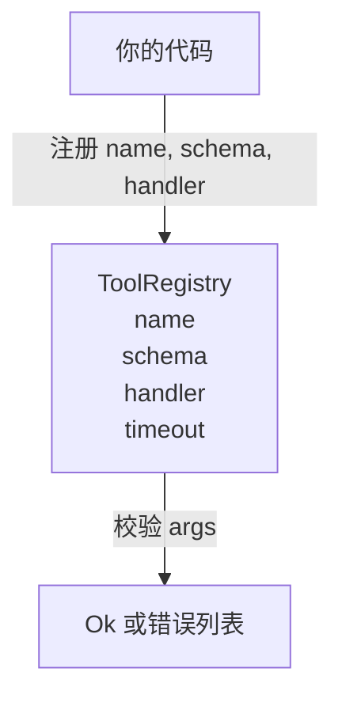

# 工具注册表与 Schema 校验

> 无法通过校验的工具，就是无法调用的工具。先把注册表和 schema 检查器搭好，再去建工具。

**类型：** 动手构建
**语言：** Python
**前置条件：** 阶段 13 第 01-07 课、阶段 14 第 01 课
**时间：** 约 90 分钟

## 学习目标

- 维护一个类型化的工具注册表：工具名 → schema → 处理器，调度器查询一次即可信任。
- 实现一个覆盖 90% 实际工具调用所用关键字的 JSON Schema 2020-12 子集。
- 返回精确的、符合 json-pointer 格式的错误路径，让模型在一轮交互中自我修正。
- 默认拒绝重复注册，必须显式传入 `override=True` 才能覆盖——静默覆盖是生产环境工具目录偏移的根源。
- 保持校验器纯函数（无 I/O、无时间依赖、无全局状态），以便在回放日志上重新运行。

## 为什么注册表要先于工具建

2026 年的编码 Agent 已注册的工具有可能超过模型单次上下文窗口能容纳的数量。一个像样的 harness 会注册两百个工具，而在任意一轮中只向模型暴露十个到四十个。注册表是以下三个问题的唯一真相来源："存在哪些工具"、"它们的参数是什么形状"、"调用哪个处理器"。这三个问题一旦确定，harness 的其余部分就不用再瞎猜了。

我们要避免的错误是：发布了处理器却不带 schema，或者发布了 schema 却不校验。两种都很常见。两种都会让下一层（第 23 课的调度器）变成猜谜游戏——唯一可能的失败结果就是来自处理器的堆栈跟踪。

## 工具记录的结构

```text
ToolRecord
  name        : str          (唯一，小写字母数字，下划线分段，点号分隔，如 snake_case.segment.case)
  description : str          (一行，展示给模型)
  schema      : dict         (JSON Schema 2020-12 子集)
  handler     : Callable     (async 或 sync，返回 Any)
  idempotent  : bool         (调度器用于判断是否重试)
  timeout_ms  : int          (覆盖调度器默认 per-tool 超时)
```

schema 是校验器唯一会触碰的字段。handler 对校验器是不透明的。我们刻意将它们分开。schema 是数据。handler 是代码。把它们混在一起会诱使你把校验逻辑写在 handler 里——这正是我们要阻止的 bug。

## JSON Schema 2020-12 子集

完整的 2020-12 规范是一整篇论文。我们只需要八个关键字。

```text
type           string / number / integer / boolean / object / array / null
properties     属性名 -> schema 的映射
required       属性名列表
enum           允许的原始值列表
minLength      整数，作用于字符串
maxLength      整数，作用于字符串
pattern        ECMA-262 兼容的正则，作用于字符串
items          作用于每个数组元素的 schema
```

这已经足够覆盖工具 API 的实际需求。我们没有加入的关键字（oneOf、anyOf、allOf、$ref、条件判断）在生产 schema 中是合法的，但会把校验器变成一个有环的树遍历器。我们建的是注册表，不是 JSON Schema 引擎。

## JSON Pointer 错误路径

当校验失败时，校验器返回一个错误列表。每条错误都带有一个指向输入的 json-pointer 路径。指针是斜杠前缀的属性名和数组索引序列。

```text
{"a": {"b": [1, 2, "x"]}}
                    ^
                    /a/b/2
```

模型读错误路径比读自然语言句子更拿手。如果 schema 要求 `args.user.email` 而模型传了一个整数，错误应该是 `/user/email` 且 `expected_type: string`。模型在下一轮调用中就能修正，无需自然语言交互。

## 注册与覆盖

`register(name, schema, handler, **opts)` 默认拒绝重复注册。调用方必须传入 `override=True` 才会替换。这是运维层面的卫生习惯。代码库的两个部分静默注册了同一个工具名——这种 bug 在生产环境里要花一周才能发现。

注册表暴露三个只读方法。`get(name)` 返回记录或抛出异常。`validate(name, args)` 返回 `Ok` 或错误列表。`names()` 按注册顺序返回工具名。

## 校验器是什么、不是什么

它是对 schema 树的单次遍历，递归执行。它是纯函数。它不调用处理器。它不强制类型转换（字符串 `"42"` 不会通过 number schema 的校验）。它不会静默截断。

它不是安全边界。恶意处理器在校验通过后仍然可以行为不端。第 23 课的调度器会增加超时和沙箱层。注册表只增加形状检查。

## 形状



## 如何阅读代码

`code/main.py` 定义了 `ToolRegistry`、`ToolRecord`、`ValidationError` 以及八个校验函数。校验器根据 `schema["type"]` 分发（或将带有 `enum` 的 schema 视为无类型枚举检查）。每种类型的校验器返回空列表或 `ValidationError` 列表。顶层遍历器在下降时拼接错误并 prepend 路径段。

`code/tests/test_registry.py` 覆盖了注册、覆盖、校验成功、带路径的校验失败以及子集中的每个关键字。

## 进一步探索

这一课之后你会想加的两个扩展是：针对本地定义块的 `$ref` 解析，以及 `additionalProperties: false` 用于严格形状约束。两个都很小。两个在工具目录超过五十个之后都很常见。我们把它们从课程中移除是为了让文件保持在一个可读的规模。

下一课（第 22 课）构建将这个注册表暴露给模型客户端的 JSON-RPC stdio 传输层。再下一课（第 23 课）将两者包装在带有超时和重试的调度器后面。
