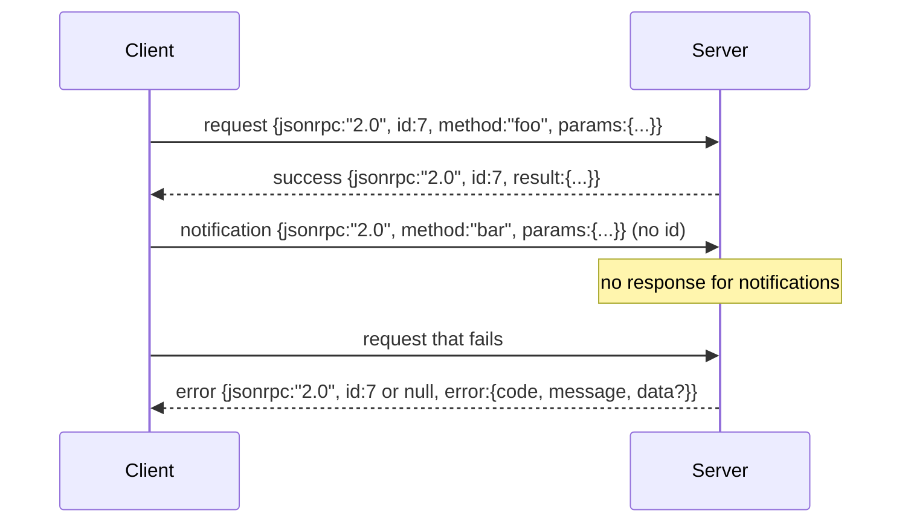

# 基于换行分隔 Stdio 的 JSON-RPC 2.0

> 模型客户端与工具服务器之间的传输层是 JSON-RPC over stdio。自己手写一遍，就能明白每一层封帧协议到底在做什么。

**类型：** 动手构建
**语言：** Python
**前置条件：** 阶段 13 第 01-07 课、阶段 14 第 01 课
**时间：** 约 90 分钟

## 学习目标

- 使用换行分隔的 JSON over stdin 和 stdout 实现 JSON-RPC 2.0 封帧。
- 映射五个标准错误码（-32700、-32600、-32601、-32602、-32603）并用正确的语义暴露它们。
- 区分请求、响应、通知和批量请求，不发明新的信封键。
- 每行一个解析错误，不污染后续数据流。
- 使用 io.BytesIO 构建自终止演示，使课程无需派生子进程即可运行。

## 为什么 JSON-RPC 一直是通用语言

2026 年的编码 Agent 在单次会话中可能与十二个工具服务器对话。每个服务器是一个独立进程或远程端点。线格式自 2013 年以来一直没变。JSON-RPC 2.0 是两页规范。它能存活下来是因为所有替代方案（gRPC、每次调用的 HTTP、自定义二进制）都有一个 JSON-RPC 没有的权衡：它们要么选流式、要么选批量、要么选传输耦合。JSON-RPC 在 stdio、socket、WebSocket 和 HTTP 上是对称的，如果客户端和服务端都遵守规范，一个客户端可以驱动它从未见过的服务端。

本课构建 stdio 变体。换行分隔的 JSON。每个请求一行。每个响应一行。传输边界是 `\n`。

## 线格式

四种信封形状。两种由客户端发出。两种由服务端发出。



通知没有 `id`。服务端不得响应它。如果服务端返回了对通知的响应，客户端没有办法将它挂回到调用点。这条规则使得封帧逻辑保持简单。

批量是一组请求或通知的 JSON 数组。服务端返回一个响应数组，顺序任意，每个非通知条目一个。如果批量中每个条目都是通知，服务端不返回任何内容。

## 五个错误码

```text
-32700  Parse error      无法解析的 JSON
-32600  Invalid Request  信封形状错误
-32601  Method not found
-32602  Invalid params
-32603  Internal error
```

-32000 到 -32099 之间的码保留给服务端定义的错误。其他的是应用定义的。本课只使用这五个。如果你的处理器抛出异常，传输层将其包装为 -32603，并在 `data.exception` 中放入异常类名。

解析错误有一条特殊规则。响应中的 `id` 是 `null`，因为请求从未解析出足够的部分来提取 id。

## 换行封帧与 BytesIO 演示

传输层每次读取一行。一行是从开始到并包含 `\n` 的字节。如果一行无法解析，传输层写入一个 `id: null` 的 -32700 响应并继续。流不会被污染。下一行会重新开始解析。

在本课中，我们将一对 `io.BytesIO` 作为 stdin 和 stdout 包装起来。服务端读取请求直到 EOF，为每个请求写入响应，然后返回。客户端读取响应。不派生进程。不涉及超时。传输层行为与真实的子进程管道完全相同，因为 Python 的 `io` 接口呈现相同的 `.readline()` 和 `.write()` 契约。

## 方法分发

传输层不知道存在哪些方法。它转交给 harness 提供的可调用对象 `handler(method, params)`。处理器返回结果或抛出异常。三个异常类暴露特定的错误码。

```text
MethodNotFound -> -32601
InvalidParams  -> -32602
Anything else  -> -32603 with exception name in data
```

传输层从不看到工具注册表。注册表在处理器后面。这是我们想要的分层。传输层说 JSON-RPC。注册表说工具形状。调度器（第 23 课）将它们缝合在一起。

## 错误时的流行为

```text
client writes              server reads             server writes
---------------            -----------              -------------
{...valid request...}      parses ok                {...response, id matches...}
{...broken json...         parse fails              {id:null, error: -32700}
{...valid request...}      parses ok                {...response, id matches...}
{...missing method...}     invalid envelope         {id:X, error: -32600}
```

损坏的 JSON 行不会停止循环。缺少 `method` 字段不会停止循环。处理器异常不会停止循环。传输层持续读取直到 EOF。

## 通知与非对称流

通知是"发射后不管"。harness 使用通知发送进度事件、取消信号和日志行。通知是长时运行工具可以在不往返获取每一步的情况下流式传输状态更新的方式。

本课实现了一个出站通知辅助函数 `write_notification`。服务端用它在一个请求进行中时发出进度。演示展示了这一模式：一个请求进来，处理器发出两个进度通知，然后写入最终响应。

## 如何阅读代码

`code/main.py` 定义了 `StdioTransport`、解析辅助函数（`parse_request`）、三个写入辅助函数（`write_response`、`write_error`、`write_notification`）以及分发循环 `serve`。错误码常量在模块作用域。

`code/tests/test_transport.py` 覆盖了五个错误码、通知（不写入响应）、批量（数组进数组出，跳过通知）、损坏的 JSON（解析错误后继续）以及处理器在调用中途写入通知的非对称流。

## 进一步探索

这个传输层对后续课程已经够用。生产传输层增加三样东西。一个能在转发中保留下来的关联 id 字段（你的 `id` 已经是这样了，但在网格中你还需要一个外层追踪 id）。一个取消通道（一个类似 `$/cancelRequest` 的通知，带有进行中调用的 id）。以及一个 content-type 协商握手，使同一个 socket 能说 JSON-RPC 和 Streamable HTTP。这些都不改变线格式。它们只是增加元数据。
