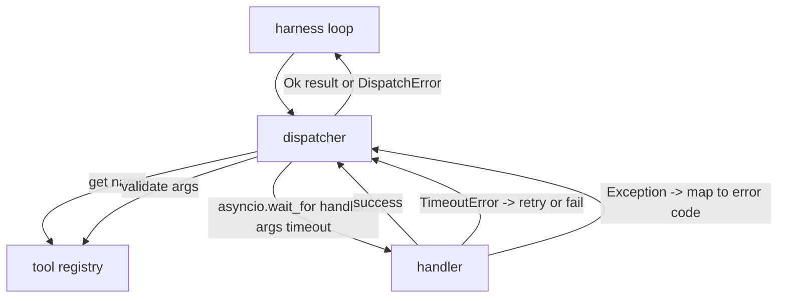
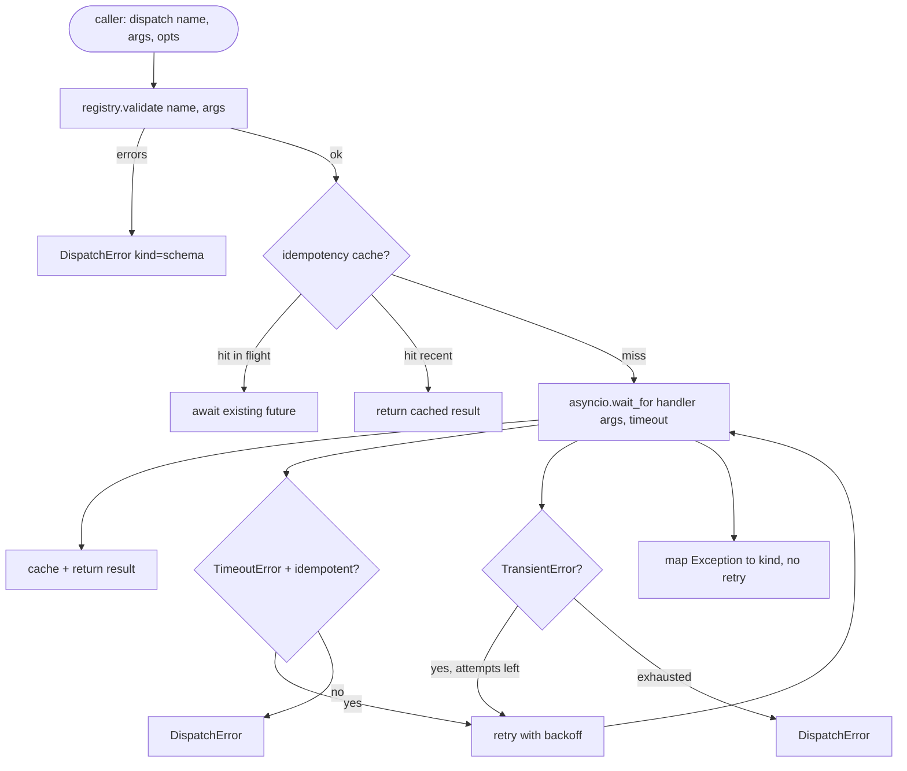

# 函数调用调度器

> 调度器是 harness 为 schema 所做的每一项承诺买单的地方。所有权衡——超时、重试、去重、错误映射——都集中在这一个交界面上。

**类型：** 动手构建
**语言：** Python
**前置条件：** 阶段 13 第 01-07 课、阶段 14 第 01 课
**时间：** 约 90 分钟

## 学习目标

- 用 per-call 超时包装工具处理器，超时返回类型化错误而不是挂起循环。
- 应用带抖动的指数退避重试，并设定最大重试次数。
- 用幂等性 key 去重，使与慢速原始请求竞态的重试不会运行两次。
- 将处理器异常和传输层故障映射到 harness 循环已经理解的单一错误信封。
- 用并发限制约束并行分发，使四十个工具调用的扇出不会耗尽事件循环。

## 调度器所处的位置

在 harness 循环（第 20 课）和工具注册表（第 21 课）之间。传输层（第 22 课）向循环提供数据。循环将工具调用交给调度器。调度器调用注册表、运行处理器、返回结果或 JSON-RPC 形状的错误信封。



调度器是唯一知道计时器、重试和幂等性的层。循环不知道。注册表不知道。处理器不知道。这种隔离是有意为之。

## 超时

每个工具有默认超时。注册表记录携带 `timeout_ms`。调度器在 harness 传入 per-call 覆盖时覆盖它。我们使用 `asyncio.wait_for`。超时时，处理器任务被取消，调度器返回 `DispatchError(kind="timeout")`。

超时默认不是可重试错误，对于非幂等性工具。一个超时的 `db.write` 可能已经提交也可能没有。重试会导致重复写入。调度器遵守注册表记录中的 `idempotent` 标志。幂等性工具重试。非幂等性工具不重试。

## 带指数退避的重试

重试策略是最多三次尝试。退避是带抖动的指数级。

```text
attempt 1  -> delay 0
attempt 2  -> delay 0.1s * (1 + random[0..0.5])
attempt 3  -> delay 0.4s * (1 + random[0..0.5])
```

只有 `timeout` 和 `transient` 错误会重试。`schema`、`not_found` 或 `internal` 错误不会重试。Schema 错误是确定性的。重试不会改变结果，只会耗尽预算。

重试循环遵守 harness 中的预算。如果调用方的预算中剩余工具调用次数为零，调度器在第一次尝试时快速失败并返回 `kind="budget_exceeded"`。

## 幂等性 key 去重

当原始请求仍在进行中时触发的重试是一个真实的生产 bug。第一次调用在 4.9 秒时挂起（刚好在超时前）。重试在 5 秒时触发。现在两个请求与同一个后端竞态。如果工具是 `payments.charge`，你就收了两次钱。

调度器接受一个可选的 `idempotency_key`。如果调用到达时同一个 key 正在飞行中，调度器等待那个进行中的 future 并返回其结果。缓存在完成后保留 key 六十秒，以吸收延迟的重试。

Key 是调用方的责任。Harness 从 planner 派生它：`f"{step_id}:{tool_name}:{hash(args)}"`。调度器不发明 key，因为仅从参数派生 key 会使两个语义上不同的调用看起来一样。

## 错误信封

失败的分发返回单一形状。

```text
DispatchError
  kind        : "timeout" | "transient" | "schema" | "not_found" | "internal" | "budget_exceeded"
  message     : str
  attempts    : int
  jsonrpc_code: int   (one of -32601, -32602, -32603)
```

Harness 循环将 `kind` 映射到下一个状态。`schema` 和 `not_found` 进入 `on_error` 并触发重新规划。`timeout` 和 `transient` 进入 `on_error`，是否重新规划取决于重试次数。`budget_exceeded` 触发 `on_budget_exceeded`。

## 扇出的并发限制

`gather(*calls)` 同时运行所有协程。四十个工具调用意味着四十个打开的 socket 或四十个子进程管道。大多数后端不喜欢来自一个客户端的四十个并行连接。

调度器用信号量包装 `gather`。默认并发限制为 8。每个调用在分派前获取信号量，完成后释放。调用方看到的是 `gather` 形状的输出，但实际调度是有界的。

## 单次调用的流程



## 如何阅读代码

`code/main.py` 定义了 `Dispatcher`、`DispatchError` 和 `TransientError`。调度器在构造时接收一个注册表。异步的 `dispatch(name, args, ...)` 是唯一的入口点。每次尝试的超时在 `_run_with_retries` 内部使用 `asyncio.wait_for` 内联应用。`gather_bounded(calls)` 用并发限制运行多个分发。

`code/tests/test_dispatcher.py` 覆盖了超时触发、瞬态错误重试、schema 错误不重试、幂等性去重（两个带相同 key 的并发调用合并为一次处理器调用）以及并发限制（信号量在行动）。

测试使用 `asyncio.sleep(0)` 和基于确定性的 `Counter` 的处理器，所以它们在几毫秒内完成，不依赖墙上时钟时间。

## 进一步探索

生产调度器会加的两个扩展。首先，在每个转换点进行结构化日志记录（这已经是循环事件流给你的，但调度器也应该发出 `dispatch.attempt` 和 `dispatch.retry` 事件）。其次，断路器：在一个窗口内 N 次失败后，一个工具进入冷却期，在此期间分发立即返回 `kind="circuit_open"` 而不是尝试处理器。两个都可以在这个调度器之上添加而不改变契约。

第 24 课将调度器粘合到计划-执行 Agent 上，这样你就能看到所有四个部分协同运作。
