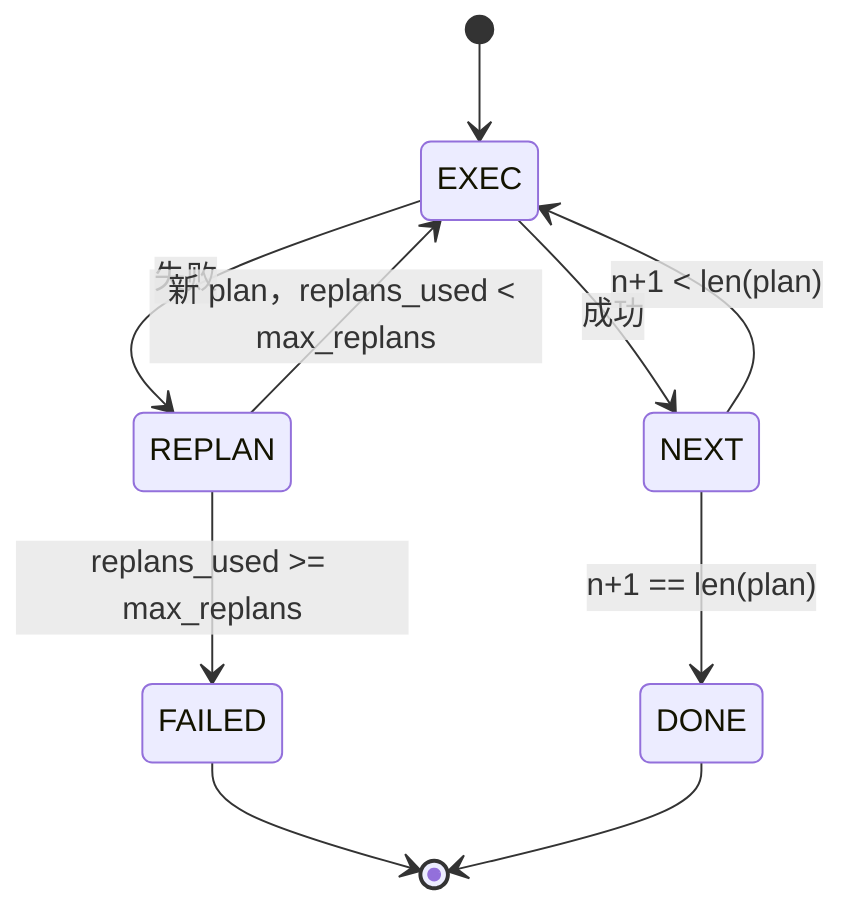

# Plan-Execute 控制流

> 一个无法承受失败的 plan 只是一个脚本。一个能够 replan 的脚本才是一个 agent。先把 replanner 搭起来。

**类型：** 构建型
**语言：** Python
**前置条件：** 阶段 13 课程 01-07，阶段 14 课程 01
**时间：** 约 90 分钟

## 学习目标

- 将 plan 表示为一个有序的类型化步骤列表，使 executor 能够推理进度和结果。
- 按顺序执行步骤，并在失败时将控制权交回 planner。
- 从当前游标处 replan，并将上一个错误放在上下文中，使下一个 plan informed。
- 每次修订时发出 plan diff，以便下游 tracer 或 UI 能展示 plan 为什么会变化。
- 强制执行两个预算：一个硬性步骤上限和一个硬性 replan 上限。

## Plan-and-execute，而非 chain-of-thought

Chain-of-thought agent 生成 token 并让循环猜测工具调用在哪里结束。Plan-and-execute agent 先发出一个结构化的 plan，然后再按顺序执行每个步骤。Plan 是 harness 可以内省的データ。执行是 harness 通过 dispatcher 运行该数据的过程。

两个部分。一个产生 plan 的 planner。一个运行 plan 的 executor。有趣的工作发生在 executor 遇到失败时。三个选项：

```text
1. Abort         (返回失败，表面错误)
2. Skip          (标记步骤失败，继续执行其余步骤)
3. Replan        (将错误交给 planner，从游标处获取新 plan)
```

Replan 才是把脚本变成 agent 的那个。

## Step 的结构

```text
Step
  id              : int           (在 plan 修订内单调递增)
  tool_name       : str
  args            : dict
  expected_outcome: str           (planner 声明的成功条件)
  result          : Any | None
  error           : str | None
```

`expected_outcome` 是 planner 与步骤一起发出的简短句子。Executor 不会强制执行它。它用于两个目的：replanner 在修订 plan 时会读取它；事件流发出它以便 tracer 能展示"这个步骤本应该做 X"。

## Planner 的结构

```python
def planner(goal: str, history: list[Step], last_error: str | None) -> list[Step]:
    ...
```

一个纯函数。`goal` 是用户目标。`history` 是已执行的步骤（结果和错误已填充）。`last_error` 在首次调用时为 None，之后每次调用时都是最近一次失败消息。Planner 从游标处返回下一个 plan。

Planner 不了解 executor。不了解重试。不了解超时。它只产生一个 plan。仅此而已。

## Executor

Executor 是一个小的状态机。每个步骤通过 dispatcher 运行。结果有三种：success、failure-replannable、failure-fatal。可重新规划的失败会交回给 planner。致命失败（超出预算、达到 replan 上限）返回 `FAILED` 会话结果。



## 修订时的 Plan Diffs

当 planner 在失败后返回新 plan 时，executor 发出一个包含三个字段的 `plan.diff` 事件。

```text
removed: 步骤 id 列表，这些步骤在旧 plan 中但不在新 plan 中
added  : 步骤 id 列表，这些步骤在新 plan 中但不在旧 plan 中
revised: 步骤 id 列表，这些步骤的 tool_name 或 args 发生了变化
```

Tracer 或 UI 可以将其渲染为删除步骤的删除线和对新增步骤的高亮。关键的不是 diff 格式，而是修订是一个可见事件，而不是静默重写。

## 两个预算，都是硬性的

`max_steps` 限制整个会话中（包括 replan）的总步骤执行次数。默认值为 12。一个线性五步 plan 如果 replan 两次并每次添加三个步骤，总共会执行 16 次并将超出预算。Executor 将拒绝 replan 并返回 FAILED。

`max_replans` 限制首次 plan 之后调用 planner 的次数。默认值为 5。这是一个更重要的限制。如果一个 planner 连续五次返回相同的有问题的 plan，就会循环直到步骤预算耗尽。限制 replan 次数使失败更快发生，原因更清晰。

## 本课中的确定性 Planner

本课不调用模型。本课附带了一个确定性 planner，它根据 `last_error` 选择 plan。

```text
last_error is None    -> 发出一个四步 plan
last_error matches X  -> 发出一个三步 plan，绕过 X
last_error matches Y  -> 发出一个两步 plan，优雅放弃
otherwise             -> 返回 []（表示没有东西需要 replan）
```

这足以测试 executor 在每条转换路径上的行为：成功、replan一次、replan两次、replan耗尽、步骤预算耗尽。

## 结果结构

```text
SessionResult
  status      : "completed" | "failed"
  reason      : str     ("goal_met" | "step_budget" | "replan_budget" | "no_plan")
  history     : list[Step]
  revisions   : list[PlanDiff]
  events      : list[Event]
```

第二十课的 harness 循环可以直接读取这个。第二十三课的 dispatcher 执行每个步骤。第二十一课的 registry 验证每个步骤的 args。第二十二课的 transport 会通过 JSON-RPC 将整个流程暴露给模型客户端。

## 如何阅读代码

`code/main.py` 定义了 `PlanExecuteAgent`、`Step`、`PlanDiff`、`SessionResult` 和确定性 planner。Executor 是一个返回 `SessionResult` 的单一 `run(goal)` 方法。Plan diff 通过比较步骤 id 和 `(tool_name, args)` 元组来计算。

`code/tests/test_agent.py` 覆盖了线性成功、中途失败并 replan 一次、replan 耗尽返回 `failed:replan_budget`、步骤预算耗尽，以及 plan-diff 事件格式。

## 进一步探索

一旦你将其连接到真实模型，你会想要两个扩展。首先是部分 plan 缓存：当一个 plan 在六个步骤中的前三个成功后失败，你不想重新运行前三个步骤。Executor 已经保留了 history；planner 只需要读取它。其次是并行分支：当前的 executor 是严格顺序的。发出独立分支（`gather_step` 而非 `next_step`）的 planner 可以通过 dispatcher 并发运行两个工具调用。

两者都增加了真正的复杂性。两者都在线性 executor 确定之后更容易添加。这正是本课所做的。