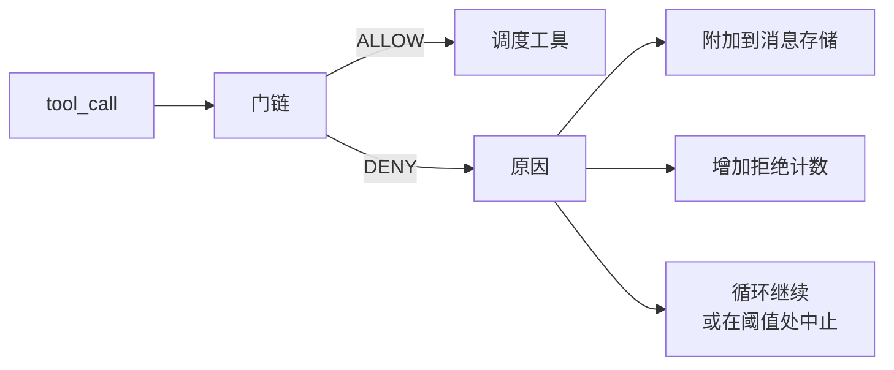
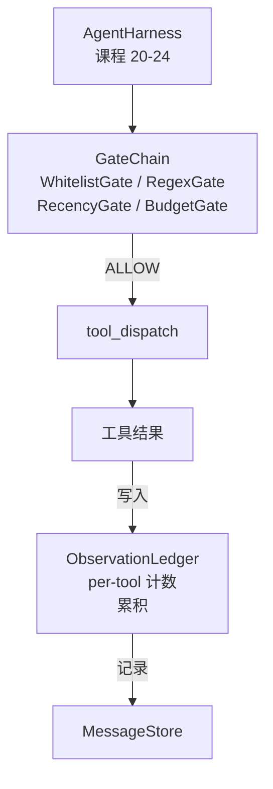

# 阶段 19 第 25 课：验证门与观测预算

> 没有验证层的 agent harness 就像穿着风衣许愿。本课构建确定性门链，决定工具调用是否允许发出、agent 被允许看到多少输出、以及当 agent 已读取太多而必须停止时循环何时退出。该链由小的、命名的门加上观测账本组成，追踪模型被展示的每一个 token。该链是一个由小的、命名的门加上观测账本组成的函数，追踪模型被展示的每一个 token。

**类型：** 构建型
**语言：** Python（标准库）
**前置条件：** 阶段 19 · 20-24（追踪 A1：agent 循环、工具注册表、消息存储、提示构建器、模型路由器），阶段 14 · 33（作为约束的指令），阶段 14 · 36（范围契约），阶段 14 · 38（验证门）
**时间：** 约 90 分钟

## 学习目标

- 构建一个带有确定性 `evaluate(call)` 方法的 `VerificationGate` 协议。
- 将预算、最近性、白名单和正则表达式门组合成一个具有短路语义的链。
- 通过 `ObservationLedger` 追踪每个观测，按工具和轮次索引。
- 当累积观测预算将超出时拒绝工具调用。
- 暴露下游可观测性可以摄取的Structured `GateDecision` 记录。

## 问题

当 agent harness 允许模型自由调用工具时，在实际使用的第一个小时内会出现三类 bug。

第一类是无界观测。对 20 万行代码仓库进行 grep 会将 50 万 token 的输出倒入下一轮。模型每 kilobyte 只看到一个匹配项，剩余的上下文被浪费。Token 账单很大，agent 在任务上变得更差，而不是更好。

第二类是过时最近性。一个长时间运行的任务积累了 50 次工具调用。模型将第三轮的最早 read_file 重新读取为最新状态。第四十七轮做出的编辑永远不会出现，因为提示构建器按时间顺序序列化最早的观测。

第三类是权限蔓延。一个研究任务开始调用 `web_search`，然后不知怎么变成了运行 `shell`，因为模型发明了一个工具名称而 harness 默认设置为宽松。当任何人阅读 trace 时，/tmp 中已有一个垃圾文件，curl 已针对私有 API 运行。

验证门是说出"不"的 harness 组件。它不是模型。不是裁判。它是一个 `(call, history, ledger)` 的确定性函数，返回 ALLOW 或 DENY 并附带原因。原因被记录。模型被告知。循环继续或中止。

## 概念



门是任何带有 `evaluate(call, ctx) -> GateDecision` 方法的东西。链是一个有序列表。评估在第一个拒绝时短路。顺序很重要：廉价结构性门在昂贵 token 计数门之前运行。

本课附带四个门：

- `WhitelistGate`。允许的工具名称是一个显式集合。任何不在集合中的都被拒绝。这是最便宜的门，最先运行。
- `RegexGate`。工具参数与正则表达式匹配。可用于拒绝包含 `rm -rf` 的 shell 调用，或针对内部 IP 的 HTTP 调用。对调用负载是纯函数。
- `RecencyGate`。模型只看到最近 N 轮的观测。更早的观测被屏蔽。当结果会延长已过期的观测窗口时，门会拒绝工具调用。
- `BudgetGate`。模型在整个会话中读取的累积 token 有一个上限。当账本说达到上限时，每个后续工具调用都被拒绝。

观测账本是记账。每一次成功的工具调用写入一行：工具名称、轮次、发出的 token、累积数。账本回答两个问题：模型总共看到了多少，以及它对工具 X 看到了多少。预算门读取第一个。Per-tool 预算门（你将作为练习编写）读取第二个。

## 架构



Harness 向链提问。链要么点头要么拒绝。如果点头，工具运行，账本增加，结果附加到消息存储。如果拒绝，模型收到拒绝作为系统消息，循环决定是重试还是中止。

## 你将要构建的内容

实现是一个单一的 `main.py` 加测试。

1. `Observation` 和 `ToolCall` 数据类定义了线路形状。
2. `ObservationLedger` 记录 `(turn, tool, tokens)` 行并回答 `cumulative()` 和 `per_tool(name)`。
3. `GateDecision` 携带 `(allow, reason, gate_name)`。
4. `VerificationGate` 是协议。每个门实现 `evaluate(call, ctx)`。
5. `GateChain` 包装一个有序列表。它调用每个门，返回第一个拒绝，或者如果每个门都通过则返回 allow。
6. 演示运行一个微小的合成 agent 循环。三轮。第三轮触发预算门，循环报告一个干净的拒绝并带有非零拒绝计数。

Token 计数器故意使用愚蠢的 `len(text) // 4` 启发式。本课的重点是门管道，而不是分词器。在生产环境中插入一个真正的分词器。

## 为什么链顺序很重要

拒绝比允许便宜。`WhitelistGate` 以 O(1) 哈希查找运行。`RegexGate` 以 O(pattern * argv) 运行。`RecencyGate` 读取消息存储的一小部分。`BudgetGate` 读取整个账本。你按升序排列它们，以便被拒绝的调用在执行昂贵工作之前短路。

你还按爆炸半径排序。白名单是最强的声明：该工具不在契约中。正则表达式门其次：该参数不在契约中。最近性在之后：harness 仍然关心但调用结构上是合法的。预算排在最后，因为根据定义，它只在其他一切都通过后才触发。

## 这如何与追踪 A 的其余部分组合

之前的课程给了你循环、工具注册表、消息存储、提示构建器和模型路由器。本课在模型和工具之间添加了一层。第二十六课发出 dispatcher 在门链说 ALLOW 后将工具调用交给沙箱的沙箱。第二十七课发出 eval harness，将沙箱结果与每个任务的预期退出码进行比较。第二十八课围绕每个 `Sandbox.run` 调用发出 `gen_ai.tool.execution` 跨度。第二十九课将所有内容缝合到一个工作的编码 agent 中。

## 运行它

```bash
cd phases/19-capstone-projects/25-verification-gates-observation-budget
python3 code/main.py
python3 -m pytest code/tests/ -v
```

演示打印逐轮 trace 包括每个门决策，退出为零。测试覆盖账本、每个门独立测试、链短路和合成循环端到端。