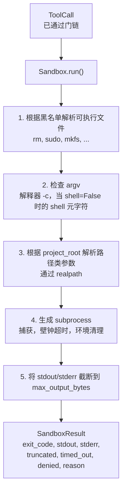
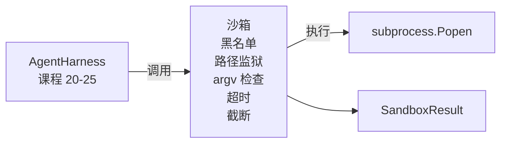

# 阶段 19 第 26 课：带黑名单和路径监狱的沙箱运行器

> 验证门决定工具调用是否应该运行。沙箱决定运行时会发生什么。本课发出一subprocess 运行器，拒绝危险的可执行文件、拒绝危险的 argv 形状、将每个文件路径囚禁到项目根目录、截断过大的输出，并在壁钟超时杀死失控进程。它是位于模型和操作系统之间的两层中的第二层。

**类型：** 构建型
**语言：** Python（标准库）
**前置条件：** 阶段 19 · 25（验证门和观测预算），阶段 14 · 33（作为约束的指令），阶段 14 · 38（验证门）
**时间：** 约 90 分钟

## 学习目标

- 构建一个包装 `subprocess.run` 的 `Sandbox` 类，带有超时、捕获和截断。
- 按名称拒绝命令对黑名单，按结构拒绝命令对 argv 检查器。
- 拒绝任何解析到声明的项目根目录之外的路径参数。
- 当 shell 模式关闭时拒绝 shell 元字符。
- 返回下游可观测性和 eval harness 可以摄取的结构化 `SandboxResult`。

## 问题

一个能够调用 shell 的编码 agent 可以在一轮中安装后门、窃取密钥、破坏开发人员笔记本电脑，并在单一轮次中累积云账单。最不昂贵的防御是不给它 shell。第二不昂贵的是一个沙箱，对精确的模式列表说"不"。

三个类别的失败在 agent trace 中反复出现。

第一类是危险的可执行文件。压力下修复路径问题的模型会尝试 `sudo`、`chmod -R 777`、`rm -rf`、`mkfs`、`dd`。这些都不属于 agent 运行。黑名单按名称和别名捕获它们。

第二类是 argv 技巧。被告知不能使用 shell 的模型会通过解释器管道攻击：`python3 -c "import os; os.system('rm -rf /')"`、`bash -c '...'`、`node -e '...'`、`perl -e '...'`。沙箱需要知道任何带有 `-c` 类标志的解释器运行都只是带有额外步骤的 shell 调用。

第三类是路径逃逸。模型被告知读取 `./src/main.py` 但实际读取 `../../etc/passwd`。沙箱通过 `os.path.realpath` 解析每个路径参数并断言前缀，将每个路径参数囚禁到项目中。

沙箱不是操作系统意义上的安全边界。有代码执行能力的坚定攻击者仍然可以逃逸。沙箱是一个开发时 guardrail：它使常见失败模式变得响亮，并阻止 agent 因纯粹的无能而造成损害。

## 概念



沙箱有四个拒绝轴：名称、argv、路径、结构。每个轴都是调用的纯函数，此时还没有 subprocess。只有在每个轴都通过后才会生成 subprocess。

`SandboxResult` 退出码是常规的：0 成功，非零失败，外加三个 sentinel 代码用于 denied (-100)、timed_out (-101) 和 truncated（退出码是真实的，设置一个标志）。下游课程读取这个结构化结果而不是解析 stderr。

## 架构



黑名单是 executable basenames 的 frozenset。别名（`/bin/rm`、`/usr/bin/rm`）都解析到相同的 basename。argv 检查器知道解释器形状：当 argv[0] 是解释器且任何后续参数以 `-c` 或 `-e` 开头时会被拒绝。当调用未明确请求 shell 时，shell 元字符（`;`、`|`、`&`、`>`、`<`、反引号、`$()`）导致拒绝。

路径监狱是最微妙的部分。沙箱在构造时接受 `project_root`。任何看起来像路径的参数（包含 `/` 或匹配现有文件）通过 `os.path.realpath` 规范化，然后对照项目根目录的 realpath 检查。如果解析后的目标不在根目录下，则拒绝。通过检查 realpath（而不是字面路径）阻止符号链接逃逸尝试（项目根目录中指向外部的符号链接）。

## 你将要构建的内容

实现是 `main.py` 加一个 tests 目录。

1. `SandboxResult` 数据类：exit_code、stdout、stderr、truncated、timed_out、denied、reason、duration_ms。
2. `SandboxConfig` 数据类：project_root、max_output_bytes、timeout_seconds、denylist、interpreter_block。
3. `Sandbox` 类：`run(argv, *, shell=False, cwd=None)` 返回 `SandboxResult`。
4. 内部拒绝辅助函数：`_check_executable_denylist`、`_check_argv_interpreter`、`_check_shell_metachars`、`_check_path_jail`。
5. 输出截断，带有清晰的 `truncated` 标志和捕获流中的标记行。
6. 底部演示：一系列合法和对抗性调用。每个都显示其结果。

沙箱使用 `shell=False` 作为默认值的 `subprocess.run` 和 `capture_output=True`。壁钟超时使用 `timeout` 参数；超时时，沙箱杀死进程组并合成一个 SandboxResult。

## 为什么这不是一个真正的沙箱

本课的沙箱不使用命名空间、cgroups、seccomp、gVisor、Firecracker 或任何内核级隔离。Subprocess 能做的任何事情，沙箱都能做。保护是结构性的：agent 被拒绝最常见的危险调用，响亮的拒绝进入可观测性而不是静默运行。

对于生产 agent，你在其上分层：在非特权 Docker 容器内运行，在 microVM 内运行，删除能力，将项目根目录挂载为只读和 scratch dir 读写，设置内存和 CPU 的 ulimit，将环境清理到已知安全的白名单。第二十九课做了一些这样的工作。操作系统隔离超出本课范围。

## 运行它

```bash
cd phases/19-capstone-projects/26-sandbox-runner-denylist
python3 code/main.py
python3 -m pytest code/tests/ -v
```

演示创建一个临时目录，将一个干净的文件放入其中，然后运行一系列调用。合法调用成功。被拒绝的调用返回 `denied=True` 和原因的 SandboxResult。超时返回 `timed_out=True`。截断设置 `truncated=True`。演示打印一个 JSON 结果表，退出为零。

## 这如何与追踪 A 的其余部分组合

第二十五课产生了门链。第二十六课是门 ALLOW 后运行的可执行文件。第二十七课的 eval harness 将沙箱结果与每个任务的预期退出码进行比较。第二十八课围绕每个 `Sandbox.run` 调用发出 `gen_ai.tool.execution` 跨度。第二十九课的端到端演示通过两层连接一个真实的编码 agent。