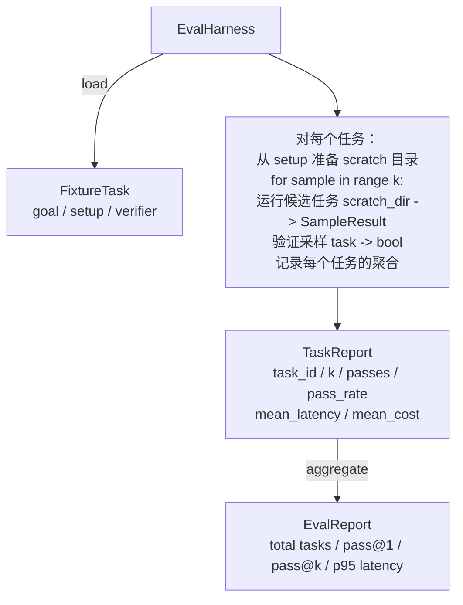

# Capstone 课程 27：Eval 测试套件与 Fixture 任务

> 编程智能体的评估质量取决于你用来衡量它的任务套件。本课程构建一个评估测试套件：接收一个 fixture 任务文件夹，对每个任务运行候选智能体，通过确定性验证器打分（通过或失败），并将结果聚合成 pass@1、pass@k、平均延迟和平均成本。测试套件是真相的来源，让你能够区分回归与重构。

**类型：** 构建
**语言：** Python（标准库）
**前置条件：** 阶段 19 · 25（验证门）、阶段 19 · 26（沙箱运行器）、阶段 14 · 30（评估驱动的智能体开发）、阶段 14 · 19（SWE-bench 和 GAIA 基准）
**时间：** 约 90 分钟

## 学习目标

- 将 fixture 任务定义为由 goal、setup 和 verifier 组成的三元组。
- 对每个任务运行多次采样并计算 pass@1 和 pass@k。
- 将延迟和成本聚合成均值和 95 分位数指标。
- 将确定性验证器（文件 diff、退出码、正则匹配）接入可复用函数。
- 发出结构化 JSON 报告，供回归跟踪脚本摄入。

## 问题

有三个失败模式困扰着没有评估测试套件的智能体基准测试。

第一个是未验证的通过。智能体说它修复了 bug，人看了一眼 diff，套件标为绿色，三周后回归测试暴露了同一个 bug。智能体推理得看似合理，但实际上什么都没修。

第二个是未检测到的回归。对提示模板的一处更改让智能体在 loud 任务上好了 4%，在 quiet 任务上差了 14%。没有 goldset 和按任务打分，回归悄悄进入 main 分支，直到客户投诉才暴露。

第三个是按任务漂移。周一用 100 个任务运行了评估，周五只用了 95 个，因为有人重命名了五个 fixture。看起来通过率提升了 5%。实际上没有。

测试套件是把这些失败转化为事实的程序。它每次都按可复现的顺序运行每个 fixture，运行验证器做确定性检查并返回真或假。

## 概念

```mermaid
flowchart LR
  F1[fixtures/task_001/<br/>task.json + expected/] --> Harness
  F2[fixtures/task_002/<br/>...] --> Harness
  Harness[测试套件<br/>对每个任务：<br/>setup / 运行智能体 k 次采样 /<br/>验证每次采样 /<br/>记录延迟、成本]
  Harness --> Report[EvalReport<br/>pass@1 / pass@k<br/>平均 ms / p95 ms<br/>平均成本]
```

`FixtureTask` 是一个小 JSON 文件加一个可选的 `expected/` 目录。JSON 声明 `id`、`goal`（发给智能体的提示）、`setup` 块（要放入 scratch 目录的文件）和 `verifier` 块。verifier 块命名测试套件 verifier 注册表中的一个函数并提供其参数。

三种 verifier 形态覆盖了大多数有用的任务。

第一种是 `file_equals`。智能体运行后，将命名文件与预期内容进行比较。这适用于"以这种确切方式修复这个 bug"的任务。

第二种是 `regex_match`。将命名文件的内容与正则表达式进行匹配。这适用于"函数必须存在并返回 X"的任务——这里有许多可接受的解决方案。

第三种是 `shell_exit_zero`。测试套件运行一条 shell 命令（通过第 26 课的沙箱），仅当命令退出码为 0 时才让任务通过。这适用于"测试必须通过"的任务。

测试套件对每个任务运行 k 次。Pass@k 是 `1 - (1 - p)^k`，其中 p 是经验通过率；测试套件也报告原始计数，这样你可以看到方差。延迟是每次采样的墙上时钟时间。成本是智能体自行报告的（token 数量、美元，或两者都有）；测试套件对采样求和并展示每个任务和聚合后的数字。

## 架构



候选者是一个可调用对象：`Callable[[FixtureTask, str], SampleResult]`。测试套件通过 `tempfile.mkdtemp()` 创建 scratch 目录并将其路径作为普通字符串传递。测试套件不关心候选者如何工作。候选者可以是一个确定性补丁应用器（用于测试套件自测）、一个真实的 LLM 智能体、一个模糊测试器。契约就是 SampleResult。

## 你将构建什么

`main.py` 发货：

1. `FixtureTask` 数据类。
2. `SampleResult` 数据类：success_self_reported、latency_ms、cost_units、edits。
3. 带 `to_dict()` 的 `TaskReport`、`EvalReport` 数据类。
4. `VerifierRegistry` 将 verifier 名称映射到函数。内置 verifiers：file_equals、regex_match、shell_exit_zero。
5. `EvalHarness` 类。对候选者运行一个任务目录。返回 EvalReport。
6. 捆绑在 `tasks/` 中的五个 fixture 任务：
   - `fizzbuzz` 中的 off-by-one
   - `factorial` 中缺失的 return
   - 错误消息中的拼写错误
   - 空函数体
   - 链表遍历中的 off-by-one
7. 一个确定性参考候选者（`apply_known_fixes`），测试套件用它来演示 pass@1 = 1.0 的干净通过。
8. Demo 打印 EvalReport JSON 并以零退出。

fixture 任务作为 JSON 文件捆绑在 `tasks/` 中，加上配对的源文件在 `tasks/<id>/buggy/` 和 `tasks/<id>/expected/`。测试套件将 buggy 复制到 scratch dir，交给候选者，然后对照 expected 验证。

## 为什么是 pass@k 而不是单纯的 pass@1

真实的 LLM 智能体是随机的。pass@1 为 0.6 看起来是失败。pass@5 为 0.95 说明智能体大多数时候得到了正确答案，但在早期采样中选错了。解决方案是采样和排序，而不是更多的训练。Pass@k 让这一点可见。

Pass@k 与 pass@1 一起报告，因为 pass@k 掩盖了一个真实的失败：如果模型二十次尝试才得到一次正确答案，你并没有一个有价值的智能体。测试套件同时展示两者。

## 这如何与 Track A 的其余部分组合

第 25 课产生了门链。第 26 课产生了沙箱。测试套件对任何 `shell_exit_zero` verifier 使用沙箱。第 28 课将每个测试套件运行包装在 OTel trace 中。第 29 课针对捆绑的 fixture 运行端到端 demo，并断言参考候选者的 pass@1 = 1.0。

## 运行

```bash
cd phases/19-capstone-projects/27-eval-harness-fixture-tasks
python3 code/main.py
python3 -m pytest code/tests/ -v
```

Demo 打印 JSON 格式的 EvalReport，包括 pass@1、pass@5、平均延迟和每个任务的细分。退出码为零。测试覆盖 verifier 函数、pass@k 数学、fixture 加载，以及针对捆绑参考候选者的测试套件端到端测试。