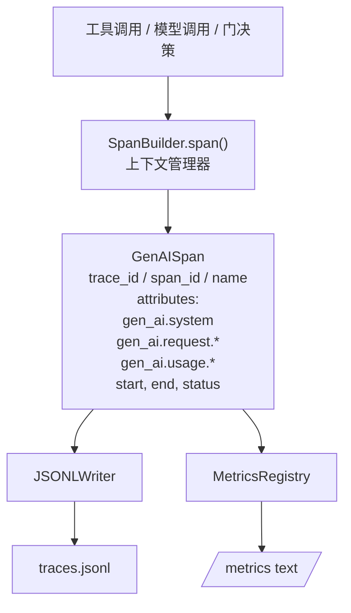
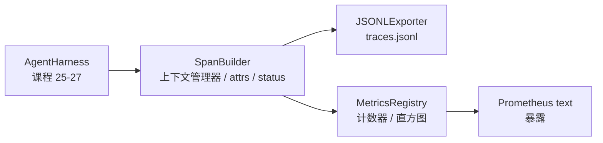

# Capstone 课程 28：使用 OTel GenAI Span 和 Prometheus 指标的可观测性

> 没有可观测性的智能体测试套件是一个烧钱的黑盒。本课程手写一个 span 构建器，发出符合 OpenTelemetry GenAI 语义约定的记录，写入 JSON-Lines 文件（每行一个 span），并以 Prometheus 文本格式暴露计数器和直方图。全程使用标准库 Python，离线运行。

**类型：** 构建
**语言：** Python（标准库）
**前置条件：** 阶段 19 · 25（验证门）、阶段 19 · 26（沙箱）、阶段 19 · 27（评估测试套件）、阶段 13 · 20（OpenTelemetry GenAI）、阶段 14 · 23（OTel GenAI 约定）
**时间：** 约 90 分钟

## 学习目标

- 构建符合 OpenTelemetry GenAI 语义约定的 span 数据类。
- 实现一个 JSONL 导出器，每行写一个自包含的 span。
- 构建带标签的计数器和直方图以及 Prometheus 文本格式暴露。
- 将任何可调用对象包装在 span 上下文管理器中，记录持续时间、状态和异常。
- 验证发出的 span 能通过 `json.loads` 往返并符合规范形状。

## 问题

生产中的编程智能体每轮产生三类 artifact：模型调用、工具执行和验证门决策。没有结构化遥测，这些都没有用。

第一个失败模式是缺失的 trace。周二出了事，但唯一的记录是一条 500 行的聊天日志。没有记录哪个工具运行了、花了多长时间、多少 token 进入了提示、或者门是否拒绝了什么。只能靠猜。

第二个失败模式是不可解析的 trace。测试套件写了 span 但使用了自定义的字段名。Grafana、Honeycomb、Jaeger 或本地 CLI 都没有办法读取它们。团队堆栈中无论存在什么工具都被浪费了，因为 span 是非标准的。

第三个失败模式是不可聚合的指标。你可以在 trace 中看到一个慢工具调用，但无法回答"过去一小时内 read_file 调用的 p95 延迟是多少？"因为没有指标，只有 trace。

OpenTelemetry GenAI 语义约定正是为此而存在。它们定义了一小组跨 LLM 框架共享的标准属性。如果你的测试套件写这些属性，每个 OTel 兼容的后端都可以读取。

## 概念



测试套件中的每个操作都会产生一个 span。span 有 trace id（整个智能体调用）、span id（这一个操作）、名称（例如 `gen_ai.chat`、`gen_ai.tool.execution`）、遵循 GenAI 约定的属性、开始和结束时间以及状态。

GenAI 约定标准化了这些属性键：`gen_ai.system`（哪个提供商，例如 `anthropic`、`openai`）、`gen_ai.request.model`（模型 id）、`gen_ai.request.max_tokens`、`gen_ai.usage.input_tokens`、`gen_ai.usage.output_tokens`、`gen_ai.response.model`、`gen_ai.response.id`、`gen_ai.operation.name`，加上工具特定的键 `gen_ai.tool.name` 和 `gen_ai.tool.call.id`。

导出器写 JSONL。每行一个 JSON 对象。这是下游工具可以流式处理、grep 和导入的最简单格式。真实的 OTel 导出器会说 OTLP gRPC；本课程的 JSONL 导出器是离线等价物，在每个工作站上以零退出。

指标与 trace 同在。每次工具调用时计数器递增：`tools_called_total{tool="read_file"}`。直方图记录观察到的延迟：`tool_latency_ms{tool="read_file"}`。两者都序列化为 Prometheus 文本暴露格式，这是事实上的拉取式指标标准。

## 架构



span 构建器是一个小类，有 `span(name, attrs)` 方法返回一个上下文管理器。上下文管理器在进入时记录开始时间，在退出时记录结束时间，如果抛出异常则附加异常，并将最终确定的 span 推送到导出器。

指标注册表是两个字典。计数器是 `{(name, frozen_labels): int}`。直方图在列表中保留原始采样，在暴露时序列化为 Prometheus 直方图桶。

## 你将构建什么

`main.py` 发货：

1. `GenAISpan` 数据类：trace_id、span_id、parent_span_id、name、attributes、start_unix_nano、end_unix_nano、status、status_message、events。
2. 带 `span(name, attrs, parent=None)` 上下文管理器的 `SpanBuilder` 类。
3. 带 `export(span)` 的 `JSONLExporter` 类，每行追加一条。
4. `Counter` 和 `Histogram` 类加上 `MetricsRegistry`。
5. `prometheus_exposition(registry)` 产生文本格式输出。
6. `wrap_tool_call(name)` 装饰器，发出一个 span 并更新指标。
7. Demo：合成一个完整的智能体调用（工具 span 周围的 gen_ai.chat span），写入 traces.jsonl，打印 Prometheus 暴露，以零退出。

Span id 和 trace id 是 16 字节的十六进制字符串，从 `os.urandom` 生成。这匹配 OTel 的 W3C trace 上下文。导出器从不抛出；IO 错误被暴露但测试套件继续运行。

直方图有固定的桶集（OTel 默认的延迟毫秒桶：5、10、25、50、100、250、500、1000、2500、5000、10000、+Inf）。采样作为列表存储；暴露时按需计算每个桶的计数。

## 为什么手写而不是 opentelemetry-sdk

OTel Python SDK 是一个真实的依赖。它也是几千行代码、OTLP 导出器的多个进程，以及淹没课程预算的运行时成本。手写版本教授线格式。在生产中，你可以将相同的属性接入真实的 SDK，免费获得 OTLP 导出器、批处理和资源检测。

约定是稳定的。课程发出的线格式在 2030 年仍会继续解析，因为 OTel 不会破坏 GenAI 属性名；只会添加新的。

## 这如何与 Track A 的其余部分组合

第 25 课产生了门链。第 26 课产生了沙箱。第 27 课产生了评估测试套件。第 28 课让前三者变得可观测。第 29 课将端到端 demo 的每一步都包装在 span 中，并在最后打印 Prometheus 文本。

## 运行

```bash
cd phases/19-capstone-projects/28-observability-otel-traces
python3 code/main.py
python3 -m pytest code/tests/ -v
```

Demo 在课程工作目录中发出一个 `traces.jsonl`（最后清理），然后打印三个 span 的样本，然后打印计数器和直方图的 Prometheus 暴露。测试验证 span 可以往返序列化、存在规范的 GenAI 属性、计数器正确递增，以及直方图暴露包含预期的桶计数。