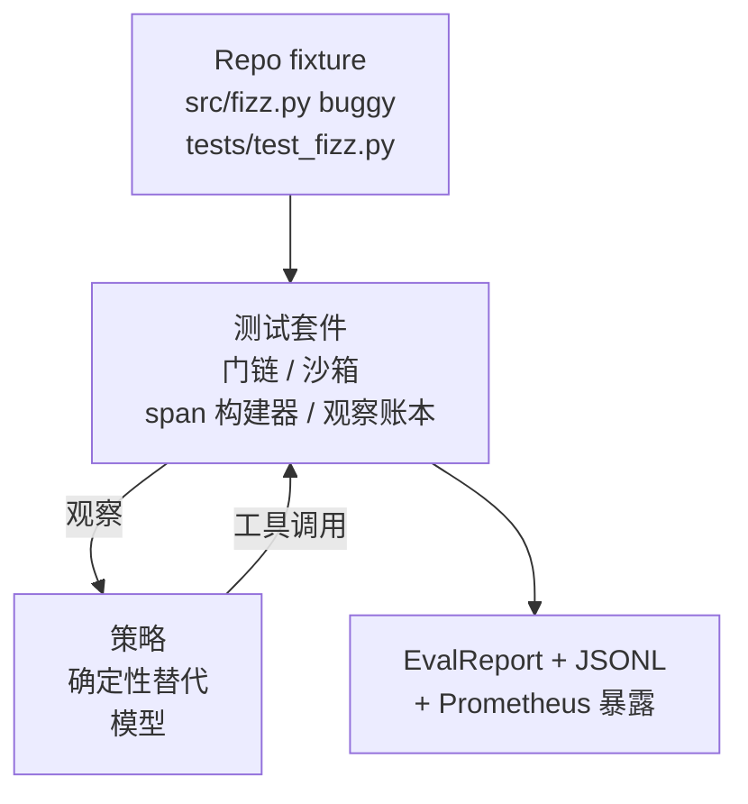
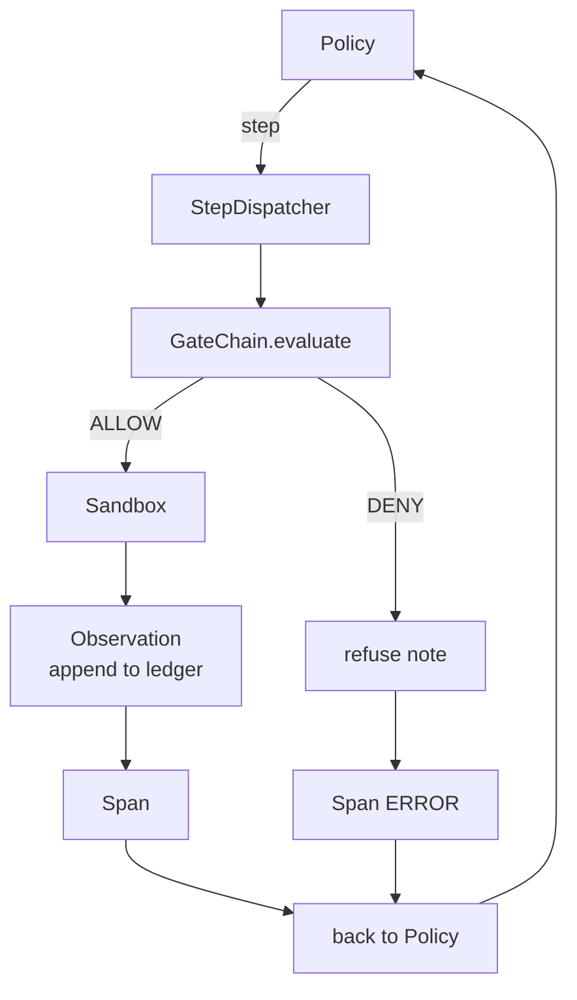

# Capstone 课程 29：测试套件上的端到端编程智能体

> Track A 的回报。本课程将门链、沙箱、评估测试套件和 OTel span 缝合到一个可工作的编程智能体中，修复一个真实的（小型的、fixture 规模的）多文件 Python 项目中的 bug。智能体是一个确定性策略，不是 LLM；这个替换使得课程可复现，并表明测试套件才是全程有趣的部分。契约是相同的：真实的模型可以插入策略接缝处。

**类型：** 构建
**语言：** Python（标准库）
**前置条件：** 阶段 19 · 25（验证门）、阶段 19 · 26（沙箱）、阶段 19 · 27（评估测试套件）、阶段 19 · 28（可观测性）、阶段 14 · 38（验证门）、阶段 14 · 41（真实仓库的工作台）、阶段 14 · 42（智能体工作台 capstone）
**时间：** 约 90 分钟

## 学习目标

- 将门链、沙箱、评估测试套件和 span 构建器组合成单个智能体循环。
- 实现一个确定性策略，使用 read_file、run_tests 和 write_file 修复 fixture bug。
- 在整个运行中强制执行全局步数预算加上观察 token 预算。
- 为完整运行发出完整的 OTel GenAI trace 和 Prometheus 指标。
- 验证智能体在少于 12 步内解决 fixture，对合法工具零门旅行。

## 问题

大多数智能体 demo 都是孤立工作的：沙箱自己、评估测试套件自己、span 发射器自己。看起来没问题。组合起来就会露出接缝。

门链说 ALLOW 但沙箱出于门链未预料到的原因拒绝了。评估测试套件记录了通过但 OTel span 说门拒绝了一个智能体声称使用过的工具。Prometheus 计数器应该递增一次却递增了两次。观察预算超限但智能体继续运行，因为预算在门链中跟踪而沙箱不知道。

本课程是整个 track 的集成测试。智能体必须按顺序做四件事：读取项目、运行测试、从测试失败中识别 bug、写修复、重新运行测试并停止。每个操作都经过门链。每个工具执行都经过沙箱。每一步都包装在 span 中。评估测试套件在最后为整个过程打分。

## 概念



智能体的策略是一个状态机。五个状态。

`SURVEY`：智能体读取项目列表。下一个状态是 RUN_TESTS。

`RUN_TESTS`：智能体运行测试命令。如果测试通过，状态机成功停止。否则下一个状态是 INSPECT。

`INSPECT`：智能体读取失败的源文件。下一个状态是 FIX。

`FIX`：智能体写入更正后的文件。下一个状态是 VERIFY。

`VERIFY`：智能体再次运行测试命令。如果测试通过，成功停止。否则失败停止。

每个状态对应一个工具调用。每个工具调用都经过门链。如果工具调用被拒绝，智能体在 trace 中报告拒绝并停止。

Fixture bug 是 `fizz.py` 中的 off-by-one。确定性策略通过正则表达式从测试失败消息中检测 bug 并发出更正后的文件。用 LLM 替换策略不会改变测试套件的契约。

## 架构



课程是自包含的。每个前置课程的原语都在 `main.py` 中以最小规模重新实现（gate、sandbox、ledger、span），这样课程无需导入同级模块即可运行。名称与课程 25-28 完全匹配，因此概念映射毫不含糊。

## 你将构建什么

`main.py` 发货：

1. 最小化的测试套件原语，与课程 25-28 相同的名称复制：`GateChain`、`Sandbox`、`ObservationLedger`、`SpanBuilder`、`MetricsRegistry`。
2. `CodingAgentPolicy` 类：带五个状态的状态机。
3. `Repo` 帮助类：用捆绑的 buggy fixture 准备一个带有 scratch dir 的目录。
4. `AgentRun` 类：驱动策略，通过测试套件分派，返回 `AgentRunReport`。
5. 一个捆绑的 fixture（`fixture_repo/`），包含 src/fizz.py、tests/test_fizz.py 和评估测试套件的 expected/ 树。
6. Demo：端到端运行策略，打印逐步 trace，断言通过，打印指标。

捆绑的 fixture 与课程 27 的任务结构相同：一个 buggy 文件和一个 tests 文件。测试失败消息包含足够的信息供确定性策略识别修复。真实的 LLM 会做同样的工作，只是更慢且召回更广，但不会改变测试套件的预期。

## 为什么策略不是 LLM

真实的 LLM 需要 API 密钥、网络调用和不可验证的随机性。测试套件才是课程关心的部分。换入确定性策略让课程可以在任何开发者笔记本上运行，零外部依赖，并且测试套件可以断言精确的步数。

课程的策略是 LLM 智能体所做的事情的一个严格子集。策略读取仓库、看到失败的测试、识别行并发出修复。LLM 通过相同的循环，使用相同的测试套件契约；簿记是完全相同的。

## Demo 断言什么

端到端 demo 在退出时断言五件事，测试套件以编程方式重新断言它们。

策略在少于 12 步内解决了 fixture。

观察预算从未超出。

对合法工具零门拒绝。（智能体从未编造一个被拒绝的工具名称。）

每一步在 traces.jsonl 中都有对应的 span。

Prometheus 暴露包含 `tools_called_total{tool="read_file"}` 条目和 `tool_latency_ms` 直方图。

## 这如何与 Track A 的其余部分组合

本课程是集成点。第 25 课写了门链。第 26 课写了沙箱。第 27 课写了评估测试套件。第 28 课写了可观测性。第 29 课证明它们作为一个系统工作。真实的智能体测试套件从这里扩展：将确定性策略换成模型，将捆绑的 fixture 换成真实仓库任务，将 JSONL 导出器换成 OTLP。

## 运行

```bash
cd phases/19-capstone-projects/29-end-to-end-coding-task-demo
python3 code/main.py
python3 -m pytest code/tests/ -v
```

Demo 打印逐步 trace、最终评估报告和 Prometheus 暴露。退出码为零。测试覆盖策略状态转换、对合成工具调用的门拒绝、针对捆绑 fixture 的端到端运行以及步数预算不变量。