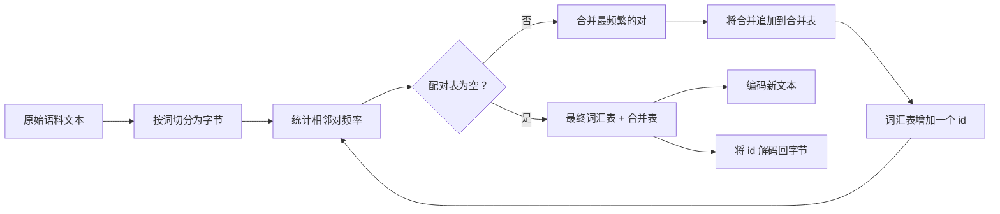
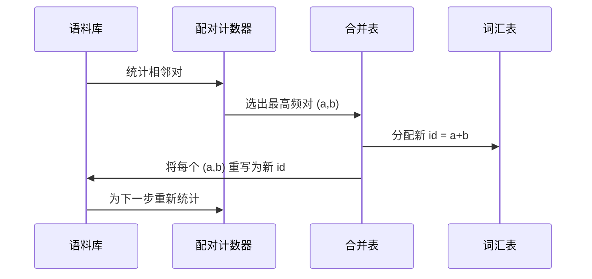

# 从零实现 BPE 分词器

> 输入字节，输出 id，id 再变回同样的字节。打造这个每台现代文本模型依然赖以起步的分词器。

**类型：** 建造型
**语言：** Python
**前置条件：** 阶段 04 课程、阶段 07 Transformer 课程
**时间：** 约 90 分钟

## 学习目标
- 通过反复合并训练语料中最频繁出现的相邻符号对，从原始文本语料库训练一个字节对编码词汇表。
- 实现确定性合并表，并将其应用于新文本以产生子词 id 流。
- 对任意 UTF-8 输入进行往返转换（编码为 id、再解码回字节），不丢失任何信息。
- 预留并保护特殊令牌（`<|endoftext|>`、`<|pad|>`），使其在训练和解码过程中不受影响。
- 理解为什么字节级字母表是通用分词器的正确底层选择。

## 框架

语言模型看到的不是文本，而是整数。从字符串到整数列表、再回到字符串的映射就是分词器。这一层如果出错，训练过程中每一条 loss 曲线都在测量错误的东西。

通用文本模型中占主导地位的子词分词器家族是字节对编码（Byte-Pair Encoding）。思想很简洁：从一个已知字母表开始。找出训练语料中相邻符号对出现最频繁的那一对。将其合并为一个新符号。重复，直到词汇表达到目标大小。对新文本进行编码时，按相同顺序重用相同的合并列表。

我们构建的是字节级变体。字母表是 256 个原始字节，而非 Unicode 码点。正是这个选择使得分词器能够处理任意 UTF-8 输入，而不会回退到未知令牌。

## 流水线

训练侧和推理侧共享合并表。这种共享即契约。如果在推理时改变了合并顺序，解码出的 id 流就会不同。

## 字节字母表

前 256 个 id 预留给原始字节 0x00 到 0xFF。这保证了任何输入字符串在任何合并发生之前都能用该词汇表表示。在字节块之后，我们为特殊令牌预留一个小范围。训练循环永远不会将这些 id 列为合并目标，因为我们完全将它们排除在预分词流之外。

预分词器在训练看到文本之前按空格和标点符号边界切分语料库。如果没有这个切分，BPE 合并步骤会愉快地学会跨越词边界的合并，词汇表就会被整个常用短语填满。有了这个切分，合并保持在词内，结果更具泛化性。

## 训练循环

每个训练步骤的循环做三件事：遍历语料库中的每个词，统计当前符号的每个相邻对出现的次数（按该词本身出现的频率加权）。选出计数最高的那一对。将该对的每个出现重写为一个新符号，其 id 为词汇表中下一个空闲槽位。然后记录合并。

每一步的开销与语料库表示为符号序列列表的大小成线性关系。对于一百万个词和一万个 id 的目标词汇表，循环在秒级完成，因为符号序列随着合并落地而收缩。

## 编码新文本

推理不调用合并计数器。它按学习到的相同顺序应用合并表。对于一个新词，编码器从字节切分开始。它扫描当前序列，寻找排名最低的合并（最早适用的那个）。执行该合并。再扫描。循环结束，直到表中没有合并适用于当前序列。

按排名排序这一性质使得编码是确定性的，并与相同输入上的训练行为匹配。最早学到的合并位于表顶，最早被应用。如果两个合并可以在同一位置适用，排名更低的胜出。

## 特殊令牌

特殊令牌是字节流永远无法产生的 id。我们手动预留。本课两个足够。

- `<|endoftext|>` 在预训练期间分隔文档。它告诉模型"这里开始一个新文档，不要让前一个文档的上下文泄露进来。"
- `<|pad|>` 填充短序列，使批处理可以形成矩形张量。损失掩码在训练期间将其隐藏。

编码器接受一个标志，允许在输入中使用特殊令牌。关闭该标志时，字符串 `<|endoftext|>` 和 `<|pad|>` 被按字节拆分进行分词。开启该标志时，字面字符串被映射到其预留的 id，不受任何合并影响。

## 往返保证

先编码再解码必须精确返回输入字节。解码器按顺序拼接每个 id 的字节展开。由于每个 id 要么是原始字节，要么是两个先前已知 id 的拼接，递归展开总是在原始字节处终止。解码后返回这些字节所拼出的 UTF-8 字符串。

本课的测试套件在未见过的句子、带 Unicode 表情的句子和包含字面 `<|endoftext|>` 令牌的句子上检查这一属性。

## 本课不涉及的内容

它不构建生产级最大分词器风格的正则驱动预分词器。这里的预分词器是一个简单的空格和标点切分。它足以在小型训练语料上产生合理的合并，与本课程链其余部分的契约保持一致。下一课将分词器视为黑盒，在此基础上构建滑动窗口数据集。

它不对配对计数器做并行化。在几千词的语料上跑一个 Python 循环，不到一秒就跑完。对于更大的语料，显然的改进方向是按词并行计数然后归并。

## 如何阅读代码

`main.py` 定义了四个对象。`BPETokenizer` 持有词汇表、合并表和特殊令牌表。`train` 是训练循环。`encode` 是推理路径。`decode` 是字节拼接。底部的演示在一个内置语料上训练一个小型分词器，对一个保留句子进行编码，将 id 解码回来，并打印两者。`code/tests/test_bpe.py` 中的测试固定了往返属性、特殊令牌预留和合并顺序。

运行演示。然后将演示中的目标词汇表大小从 300 改为 600，观察保留句子的编码长度如何下降。这条曲线就是 BPE 压缩曲线。