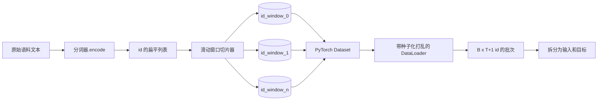
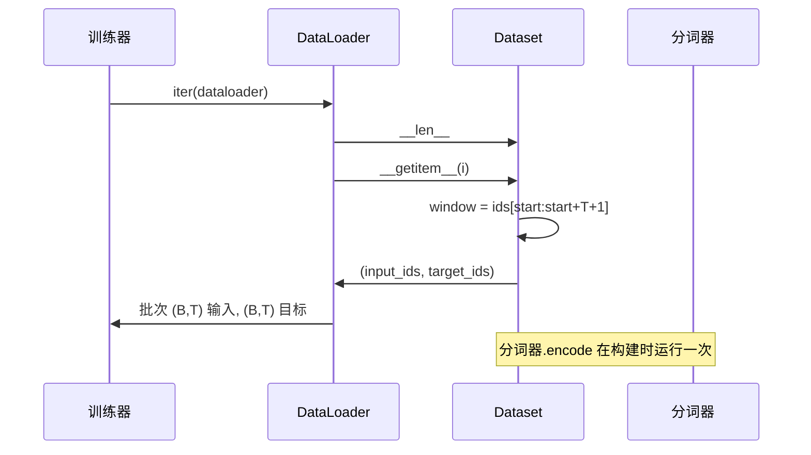

# 滑动窗口构建 token 化数据集

> 预训练运行是从 token id 到梯度的函数。本课构建的就是输送 id 的传送带。

**类型：** 建造型
**语言：** Python
**前置条件：** 阶段 04 课程、阶段 07 Transformer 课程、本阶段第 30 课
**时间：** 约 90 分钟

## 学习目标
- 通过调用分词器一次，将原始语料库转换为 token id 流。
- 将 id 流切片为具有可配置重叠步长的固定长度窗口。
- 构建一个 PyTorch Dataset，返回下一 token 预测的输入和目标张量。
- 将数据集包装在 DataLoader 中，并使用每个 epoch 种子化的确定性打乱。
- 理解步长、冗余和有效数据集大小之间的权衡。

## 框架

预训练运行每次读取一批 token id 并更新模型。每批的形状由训练契约固定。对于因果语言模型，批次持有形状为 `(B, T)` 的输入 id 和形状为 `(B, T)` 的目标 id，其中目标是向左偏移一个位置的输入。数据流水线的工作就是按需产生这种契约，以确定性和可重现的方式，从可能达数 GB 原始文本的语料库中生成。

本课构建该流水线。上一课的分词器将文本转换为一个长的扁平 id 列表。滑动窗口将该列表切片为训练样本。自定义 Dataset 将样本暴露为张量。DataLoader 对它们进行批处理并使用已知种子进行打乱。

## 形状契约

因果 LM 消费的 id 形状为 `(B, T)`，其中 `B` 是批次大小，`T` 是上下文长度。位置 `t` 处的目标是位置 `t+1` 处的输入。这意味着每个训练样本覆盖 `T+1` 个原始 id。窗口步长控制连续样本之间的重叠程度。

切片器永远不会与语料库边界重叠。如果最后一个窗口没有足够的 id 填充 `T+1` 个位置，切片器会丢弃它。用 `<|pad|>` 填充尾部也是一种有效选择，但会使损失掩码复杂化。本课选择丢弃。

## 为什么是滑动窗口

预训练语料库是一个长的 id 流。如果模型只看非重叠窗口，每个训练样本都会教它相同的 `T` 边界。调整步长会移动这些边界，使模型看到更多样化的预测下一个 token 任务。

步长为 `T` 产生非重叠窗口。步长为 `T // 2` 产生百分之五十的重叠，使有效数据集翻倍。步长为 `1` 产生最大重叠，使数据集增加 `T` 倍。代价是每个 epoch 更多的计算。好处是更多的边界多样性。大多数预训练运行使用等于上下文长度的步长，因为语料库已经比模型能在一个 epoch 内处理的大得多，所以边界多样性论据较弱。

## Dataset 类

PyTorch Dataset 有两个必需方法。`__len__` 返回样本数量。`__getitem__` 返回一个样本作为一对张量。我们的 Dataset 存储编码后的 id 流和步长。对其进行索引时会即时计算窗口起点，因此无论步长产生多少样本，内存成本都只是一份 id 流的副本。

偏移一个位置发生在 `__getitem__` 内部。Dataset 返回 `(input, target)`，其中 `input = window[:-1]`，`target = window[1:]`。两者都是 PyTorch long 张量。训练循环将它们视为真实标签。

## 确定性打乱

带有 `shuffle=True` 的 DataLoader 从 PyTorch 随机生成器读取。通过传入每个 epoch 种子化的显式 `torch.Generator`，我们可以在每次重新运行时不改变顺序。这一属性在你想比较仅在单个超参数上有差异的两次运行时非常重要。没有种子，两次运行会以不同顺序看到数据，loss 曲线会因为与变更无关的原因而分歧。

本课中的种子契约很简单。`epoch_seed = base_seed + epoch_index`。基础种子在构造时传入。Epoch 索引由训练器在每个 epoch 顶部递增。使用相同基础种子的重新运行在每个 epoch 中始终看到相同的顺序。

## 批次采样器

PyTorch 中的默认采样器以不启用替换的方式均匀随机选取索引。这正是我们预训练想要的。对于在小数据集上的微调，契约是相同的。DataLoader 通过调用 `__getitem__` `B` 次并堆叠结果来组装批次。因为每个样本在构造上长度相同，不需要填充逻辑。

本课为了简单起见保持 `num_workers=0`。在生产运行中，workers 会对 `__getitem__` 调用做并行化。对于我们的流水线，这基本上是一个空操作，因为工作只是内存张量的一个切片，但相同的 Dataset API 可以干净地支持 workers。

## 计算样本数

对于长度为 `N` 的 id 流，上下文长度 `T` 和步长 `S`，样本数为 `max(0, 1 + (N - (T + 1)) // S)`。本课将该计算暴露为 Dataset 上的一个静态方法，这样训练器可以在不迭代的情况下计算每个 epoch 的总步数。

## 本课不涉及的内容

它不做磁盘流式处理。语料库在内存中完全编码并保存为单个张量。对于几百万个 id 的语料，这远远小于一百兆字节，是本课的正确形态。磁盘流式处理是一个单独的问题，通过替换存储来接入，但保持 Dataset 契约不变。

它不处理多个文档。语料库被视为一个连续的 id 流。下一个文档边界通过在从多个文档构建语料库时插入 `<|endoftext|>` id 来编码。模型学会在边界周围进行预测。

## 如何阅读代码

`main.py` 定义了两个类和一个辅助函数。`SlidingWindowDataset` 是 PyTorch Dataset。`make_dataloader` 返回配置好的 DataLoader 和带种子的生成器。`_encode_corpus_to_ids` 是一次性分词器调用。底部的演示在进程中构建一个小型分词器，编码一个内置语料库，构造数据集和数据加载器，打印一个批次，并断言形状契约。`code/tests/test_dataset.py` 中的测试固定了窗口计数公式、偏移一个位置属性、确定性打乱和步长权衡。

运行演示。然后将上下文长度从 16 改为 32，观察每个 epoch 的样本数如何下降。这个数字就是你的每 epoch 步数预算。