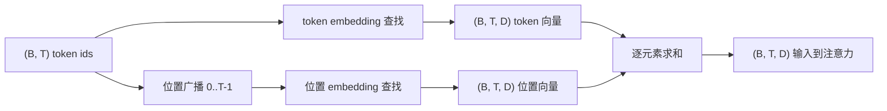
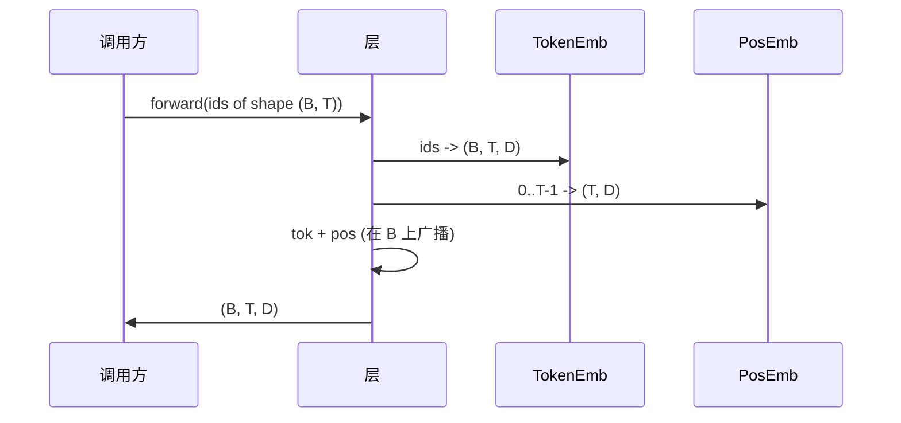

# Token 与位置 Embedding

> Id 是整数。模型想要的是向量。两者之间有两张查找表，而位置表的选择决定了模型能学到什么。

**类型：** 建造型
**语言：** Python
**前置条件：** 阶段 04 课程、阶段 07 Transformer 课程、本阶段第 30 和 31 课
**时间：** 约 90 分钟

## 学习目标
- 构建一个将词汇 id 映射到密集向量的 token embedding 查找表。
- 构建一个由位置索引的学习型位置 embedding 查找表。
- 构建一个由位置索引的固定正弦位置 embedding，无参数。
- 将 token 和位置 embedding 组合成单个输入，供 transformer block 使用。
- 对比学习型和正弦型 embedding 在长度泛化和参数量上的差异。

## 框架

模型与 token id 的第一次接触是在 token embedding 矩阵中进行行查找。该矩阵每一行对一个词汇 id，每列对一个模型维度。查找返回一个向量，模型的其余部分将其视为该 id 的含义。反向传播只更新前向传播中使用过的那些行。训练过程中，这些行的几何结构学习在方向上编码相似性。

单独的 token id 没有顺序。模型需要第二个信号来告诉它位置 1 与位置 17 不同。该信号主要有两种选择：学习型位置 embedding（第二张查找表，每行一个位置）和固定正弦位置 embedding（一个无参数的数学公式）。选择有后果。学习型表是一个参数，受模型训练时所依据的最大上下文长度限制。正弦表在理论上无参数，公式可以扩展到任意位置，但本课的 `SinusoidalPositionalEmbedding` 在 `max_context_length` 处预计算一张固定表，其 `forward` 在超过该边界时会抛出异常；因此两个模块都在这里强制执行最大上下文长度。模型即使表足够大可以索引，在训练长度之外仍可能表现挣扎。

本课构建两者并将它们与 token embedding 组合成单个输入，供下一课的注意力 block 使用。

## 形状契约

Embedding 阶段的输入是形状为 `(B, T)` 的一批 token id。输出是形状为 `(B, T, D)` 的张量，其中 `D` 是模型维度。每个批次元素的上下文长度 `T` 相同。每个位置的向量维度 `D` 相同。



组合方式是求和，而非拼接。求和使 `D` 在整个网络中保持不变，并让模型能够在每个特征的基础上决定在该层中 token 含义或位置哪个占主导。

## Token embedding 矩阵

Token embedding 是一个形状为 `(V, D)` 的参数张量，其中 `V` 是词汇表大小。PyTorch 将其暴露为 `nn.Embedding(V, D)`。在初始化时，条目从小高斯分布中抽取，传统上对于 transformer 规模模型均值约为 0，标准差约为 `0.02`。初始化的确切值不如它在各次运行之间保持一致重要。

前向传播是一个索引操作。PyTorch 将形状 `(B, T)` 的 int64 id 映射到形状 `(B, T, D)` 的浮点数，通过按行收集实现。反向传播只在本次前向传播中触碰到的那些行上累积梯度。两个从未出现在批次中的行在该步骤上收到零梯度。

一个微妙的细节。Token embedding 和模型末端的输出投影经常共享权重（权重绑定）。当发生这种情况时，每个反向传播都通过输出端触及 embedding 的每一行。本课将两者都暴露为独立模块，但在完整模型中同一矩阵可以扮演两个角色。

## 学习型位置 embedding

学习型位置 embedding 是形状为 `(max_context_length, D)` 的第二个 `nn.Embedding`。查找由位置 id `0, 1, 2, ..., T-1` 键控。前向传播将该位置向量在批次维度上广播。

学习型表的缺点是，如果模型只训练到位置 `T-1`，就无法查询位置 `T` 处的 embedding。该行不存在。使用这种方案的生产级仅解码器模型将最大上下文长度 baked 进入架构，并拒绝处理更长的输入。

## 正弦位置 embedding

正弦位置 embedding 是从位置到向量的函数。位置 `p` 和特征 `i` 产生：

```python
angle = p / (10000 ** (2 * (i // 2) / D))
emb[p, 2k]     = sin(angle)
emb[p, 2k + 1] = cos(angle)
```

该函数没有参数。每个位置都有一个独特的向量。波长在特征维度上几何变化，因此低维度编码粗粒度位置，高维度编码细粒度位置。

由 `sin` 和 `cos` 的选择产生的性质是：位置 `p + k` 处的向量是位置 `p` 处向量的线性函数。这给了注意力层一条学习相对位置偏移的简单路径。模型不需要一个单独的参数来表达"往回看五个 token"。

本课在构造时计算完整的正弦表，并在前向时索引到其中。

## 组合

输入流水线按顺序做三件事。读取 token id。查找 token 向量。加上位置向量。返回和。



求和步骤中的广播沿批次维度复制形状为 `(T, D)` 的位置张量。PyTorch 自动处理，因为位置张量在 unsqueeze 后形状为 `(1, T, D)`。

## 对比分析

本课在相同输入上运行两个变体并打印两个诊断。

第一个是参数量。学习型变体在 token embedding 之上添加 `max_context_length * D` 个参数。正弦变体添加零个。

第二个是相邻位置 embedding 之间的余弦相似度。正弦变体具有平滑且可预测的衰减，因为函数是连续的。初始化时的学习型变体具有近随机的相似度，因为各行是独立抽取的。训练后，学习型变体通常会发展出类似的平滑结构，但它必须从数据中发现这种结构。

## 本课不涉及的内容

它不构建旋转位置编码（RoPE）或 AliBi。这些是生产级 transformer 中的现代选择。两者都遵循与这里的 embedding 相同的形状契约（对形状为 `(B, T, D)` 的向量应用位置依赖的变换），但它们在注意力投影步骤而非输入处应用。下一课构建注意力 block，其中一个可选扩展是将旋转 fold 到那里的 query-key 投影中。

它不训练 embedding。训练需要损失，损失需要模型输出，模型输出需要注意力机制和 LM head。那是下一课和下下一课的内容。

## 如何阅读代码

`main.py` 定义了三个模块。`TokenEmbedding` 包装 `nn.Embedding(V, D)`。`LearnedPositionalEmbedding` 包装 `nn.Embedding(L, D)`。`SinusoidalPositionalEmbedding` 预计算表并将其暴露为缓冲区。`EmbeddingComposer` 将 token embedding 和位置 embedding 绑定在一起。底部的演示打印形状、参数量和相邻位置相似度诊断。`code/tests/test_embeddings.py` 中的测试固定了形状、广播行为、参数量和正弦公式。

运行演示。然后将模型维度 `D` 从 64 改为 32，观察正弦波长带如何变化。