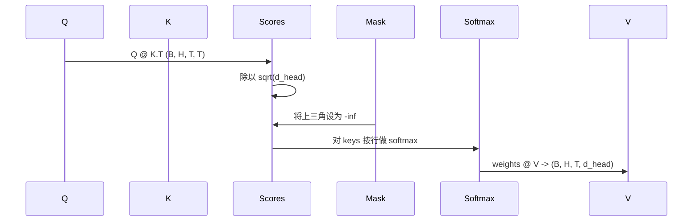

# 多头自注意力

> 一个线性投影，三个视角，H 个并行头，一个掩码。这就是模型实际使用的注意力块。

**类型：** 构建
**语言：** Python
**前置条件：** 阶段 04 课程、阶段 07 transformer 课程、本阶段第 30 至 32 课
**时间：** 约 90 分钟

## 学习目标
- 将批量的 Query/Key/Value 投影实现为单个线性层，分割为 H 个头。
- 用正确的归一化和 dtype 处理计算缩放点积注意力。
- 应用因果掩码，防止位置 attend 到后续位置。
- 检查固定输入下每个头的注意力权重，并分析每个头在看什么。
- 在一个简单任务上训练一个小注意力块，观察损失下降、头逐渐专业化。

## 框架

注意力机制让一个 token 的表示从同一序列中的其他 token 获取信息。自注意力意味着 query、key 和 value 都来自同一个输入。多头意味着投影被分割为 H 个并行注意力问题，其输出被拼接并投影回原空间。

高效的实现模式是：一个线性层从 `D` 投影到 `3 * D`，然后切分成三个视图，再 reshape 为 H 个大小为 `D // H` 的头。matmul、softmax 和加权和作为批量 tensor 操作执行，使各个头在加速器上并行运行。

本课构建这个块。它还添加了因果掩码，使同一份代码可以作为纯解码器语言模型的注意力层。下一课将把这个块堆叠成完整的 transformer，再下一课训练它。

## 形状契约

输入是 `(B, T, D)`，输出是 `(B, T, D)`。掩码是 `(T, T)` 或可广播到该形状。块内部的中间张量形状为 `(B, H, T, d_head)`，其中 `d_head = D // H`。约束条件是 `D % H == 0`。

```mermaid
flowchart LR
    A["(B, T, D) 输入"] --> B[Linear D -> 3D]
    B --> C["切分为 Q, K, V"]
    C --> D["reshape 为 (B, H, T, d_head)"]
    D --> E["scores = Q @ K.T / sqrt(d_head)"]
    E --> F[应用因果掩码]
    F --> G[对 keys 做 softmax]
    G --> H["context = weights @ V"]
    H --> I["reshape 为 (B, T, D)"]
    I --> J[output Linear D -> D]
    J --> K["(B, T, D) 输出"]
```

两个线性层（QKV 投影和输出投影）是块中唯一的参数。掩码、softmax、matmul 和 reshape 都是无参数的。

## QKV 切分

朴素实现有三个独立的线性层，分别用于 Q、K 和 V。高效实现只有一个输出 `3 * D` 个特征的线性层，然后切分结果。两者在数学上等价，因为三个独立的 `(D, D)` 权重矩阵乘法恰好等同于一个由它们堆叠而成的 `(3D, D)` 权重矩阵乘法。

高效版本更快，因为加速器只启动一次 matmul 而非三次。它也更容易初始化，因为三个子矩阵位于同一个参数张量中，可以一起初始化。

## 头的 reshape

切分后，Q、K、V 每个都是 `(B, T, D)`。为了将其转换为 H 个并行注意力问题，我们 reshape 为 `(B, T, H, d_head)`，再转置为 `(B, H, T, d_head)`。头的维度现在紧邻批量维度，因此 PyTorch 将每个头的注意力视为跨 `B * H` 个独立实例的批量操作。

d_head 维度保持在最后，这样 score matmul `Q @ K.transpose(-2, -1)` 会收缩它。结果是每个头的注意力分数形状为 `(B, H, T, T)`。

## 缩放

分数在 softmax 之前除以 `sqrt(d_head)`。如果不进行缩放，点积会随着 `d_head` 增大而增大，使 softmax 进入某个入口几乎占据所有质量、其他入口极小的状态。这种状态下的梯度极小，学习停滞。除以 `sqrt(d_head)` 可以使分数的方差在不同头大小下大致保持不变。

## 因果掩码

纯解码器语言模型在预测下一个 token 时只能以过去的 token 为条件。掩码强制执行这一点。具体来说，在 softmax 之前，`(T, T)` 分数矩阵中每条对角线以上的元素都被替换为负无穷。softmax 之后，这些位置的权重为零。

我们在构造时将掩码注册为 buffer，使其与模型在同一设备上，且不参与梯度图。掩码覆盖该块最大可能见到的上下文长度。在前向传播时，我们取左上角的 `(T, T)` 部分。

## 输出投影

在每个头的上下文向量 `(B, H, T, d_head)` 之后，我们转置回 `(B, T, H, d_head)`，reshape 为 `(B, T, D)`，再应用最终的 `(D, D)` 线性投影。输出投影让模型混合各个头。没有它，H 个头只能通过后面的层重新组合，块的人为约束会过强。

## 注意力权重检查

本课在 forward 方法上暴露了一个 `return_weights=True` 标志。设置后，块会返回形状为 `(B, H, T, T)` 的每个头的注意力权重，连同输出一起返回。演示打印一个头在短输入上的权重热力图，你可以看到因果三角结构和每个位置的聚焦情况。

在训练好的模型中，不同的头学习不同的模式。有些头 attend 到紧邻的前一个 token。有些头 attend 到序列开头。有些头几乎均匀地分散注意力。这个检查钩子是可解释性工作的入口。

## 训练演示

`main.py` 底部的演示将注意力块连接到一个小型 LM head，并在复制任务上训练整个模型。输入的每一行是一个在上下文中复制的随机 id。目标是输入平移一位后的结果，因此模型必须学习下一个 token 与前一个 token 相同。损失是交叉熵。在 H=4、D=32、T=12、词表大小为 64 的条件下，损失从随机水平（约为 `log(64) ~ 4.16`）在 CPU 上三个 epoch 内降到远低于 `1.0`。

演示的目的不是训练一个可用的模型，而是确认梯度流经块的每个部分，并且头在一个答案显而易见的任务上能学到东西。

## 本课不涉及的内容

它没有添加前馈块。真实模型中的 transformer 层是注意力后接一个两层 MLP，每个 MLP 周围有残差连接和 layer norm。下一课会添加这些。

它没有实现 rotary 或 AliBi 位置编码。两者都在同一个块的 QKV 投影步骤中应用，但它们是独立的教学单元。这里的块可以与任一种编码兼容，只需在 matmul 之前对 Q 和 K 进行变换。

它没有实现推理用的 KV 缓存。跨前向传播缓存 keys 和 values 是使自回归解码变快的优化。它改变了 K 和 V 张量的形状契约，但不影响 Q。它属于推理课程。

## 如何阅读代码

`main.py` 定义了 `MultiHeadSelfAttention`。该类持有两个线性层和一个注册的掩码 buffer。前向传播执行投影、reshape、打分、掩码、softmax、加权、reshape、再投影。底部的演示构建了一个小型模型，将注意力与 token 和位置嵌入以及 LM head 包装起来，在复制任务上训练三个 epoch，打印损失曲线和每个头的注意力热力图。`code/tests/test_attention.py` 中的测试固定了形状契约、因果性、softmax 性质、头分割性质和梯度流。

运行演示。然后将 `n_heads` 从 4 增加到 8（保持 `d_model=32`，因此 `d_head=4`），观察热力图如何变化。