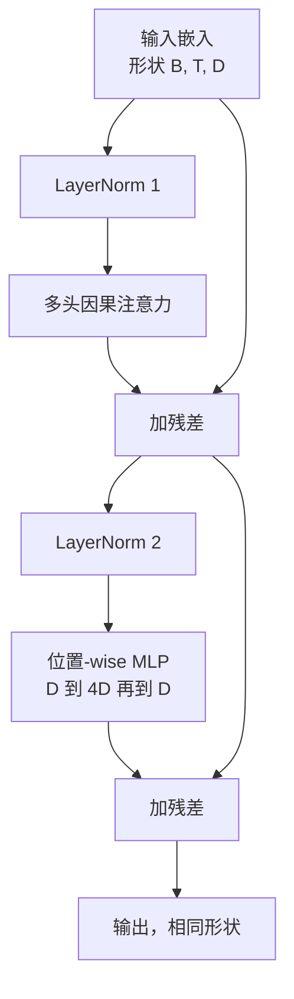
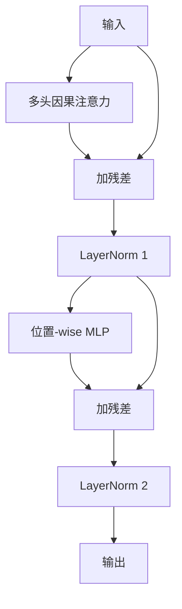

# 从零构建 Transformer 块

> 一个块是每个现代纯解码器 LLM 的单元。Layer norm、多头注意力、残差、MLP、残差。pre-LN 变体训练稳定无需 warmup。post-LN 变体是原始论文发布的版本。本课同时构建两者，并展示在常见学习率下哪种能在 12 层堆叠中存活。

**类型：** 构建
**语言：** Python
**前置条件：** 阶段 19 第 30 至 33 课（分词器、嵌入、注意力数学、批量数据加载器）
**时间：** 约 90 分钟

## 学习目标

- 在 PyTorch 中从四个运动部件构建 transformer 块：LayerNorm、多头因果注意力、残差连接、位置-wise MLP。
- 将 LayerNorm 放置在两种配置中（pre-LN 和 post-LN），并解释为什么一种能稳定训练而无需 warmup。
- 在多头注意力中实现因果掩码，使 token `i` 无法看到 token `j > i`。
- 跟踪两种变体在 12 层堆叠中的梯度流，并读出结果而非凭空推导。
- 将该块作为即插即用单元，在下一课组装 1.24 亿参数 GPT 时复用。

## 问题

Transformer 就是重复一个块。一次把块做错，重复十二次，你就会在第一个 epoch 交付一个发散的模型，或者一个需要 warmup 技巧才能训练下去的模型。本课中你会看到的两种失败模式并不稀奇。它们是学习者第一次堆叠块时就会遇到的。一个是注意力层 attend 到未来。另一个是 LayerNorm 放置在无法在深度上控制残差信号的位置。

一旦看清，修复是机械的。块恰好有两条残差路径和恰好两个归一化位置。选择好位置，其余的堆叠只是簿记工作。

## 概念

每个纯解码器 transformer 块是一个接受形状为 `(batch, sequence, embedding)` 的张量并返回相同形状张量的函数。内部有两个子层在工作。



这是 pre-LN 变体。LayerNorm 位于残差分支内部、子层之前。残差连接将未归一化的信号向前传递。

post-LN 变体将 LayerNorm 移到残差加法之后。



形状相同。训练行为不同。使用 post-LN 时，流经残差路径反向传播的梯度必须穿过 LayerNorm。在深度十二、学习率 `3e-4` 下，该梯度缩小得足够快，需要 warmup 调度。Pre-LN 让残差路径保持未归一化，因此梯度干净地传播到嵌入层。GPT-2 及之后之所以使用 pre-LN 配置，正是因为这个原因。

### 因果多头注意力

注意力子层将输入三个方向投影为 query、key、value 张量。每个都从 `(B, T, D)` reshape 为 `(B, H, T, D/H)`，其中 `H` 是头数。缩放点积注意力计算每头的 `softmax(Q K^T / sqrt(d_k))`，将上三角掩码为负无穷，通过 softmax 应用掩码，然后乘以 `V`。各头拼接回单个 `(B, T, D)` 张量，再投影一次。掩码是使模型具有因果性的唯一部件。忘掉掩码你就是在训练一个作弊的模型。

### MLP

位置-wise MLP 对每个 token 独立应用同一个两层网络。隐藏层宽度是嵌入宽度的四倍，激活函数是 GELU，第二个线性层后跟随 dropout。MLP 内部没有 token 之间的通信。所有的 token 混合都发生在注意力中。

### 残差连接做两件事

它们使梯度路径在深度上相加，这保持了梯度范数在十二层中的尺度。它们还让每个块学习对运行中表示的加性更新，而非完全替换。这两个效应都是该块能够扩展的原因。

## 构建它

`code/main.py` 实现了：

- `class LayerNorm`，带有可学习的 scale 和 shift、有偏的 eps、逐 token 向量应用。
- `class MultiHeadAttention`，带有 `num_heads`、`head_dim = d_model // num_heads`、融合 QKV 投影、注册的因果掩码、注意力和残差 dropout。
- `class FeedForward`，带有两个线性层、GELU 激活、dropout。
- `class TransformerBlock`，带有 `pre_ln` 标志切换两种变体。
- 一个演示，构建一个 6 层 pre-LN 堆叠和一个 6 层 post-LN 堆叠，使用相同输入并打印 (a) 输出形状，(b) 一次反向传播后嵌入层的梯度范数。

运行它：

```bash
python3 code/main.py
```

输出：两个堆叠的形状检查，梯度范数并排对比。pre-LN 堆叠在相同学习率下嵌入层的梯度范数比 post-LN 堆叠大一个数量级，这就是 pre-LN 无需 warmup 就能训练的经验信号。

## 堆叠

- `torch` 用于张量数学、自动求导和 `nn.Module` 管道。
- 没有 `transformers`，没有预训练权重。该块从原始部件实现。

## 实际生产模式

三个模式将教科书上的块变成可交付的东西。

**融合 QKV 投影。** 三个独立的线性层需要三次核启动和三次 matmul。一个宽度为 `3 * d_model` 的线性层在一次启动中完成相同工作，然后沿最后一轴切分输出。融合路径在每个加速器上更快，与 GPT-2、LLaMA 和 Mistral 的参考实现一致。

**注册因果掩码 buffer。** 掩码只取决于最大上下文长度。在构造时用 `register_buffer` 分配一次，在每次前向传播时切分活动窗口，跳过每次调用的分配。忘记这一点会让掩码在长上下文时成为分配器热点。

**两处 dropout，不是三处。** Dropout 属于注意力 softmax 之后（注意力 dropout）和 MLP 第二个线性之后（残差 dropout）。在残差本身上做 dropout 会破坏让梯度在深度上流动的加性恒等式。一些早期实现在这里犯错，并为此付出了训练脆弱的代价。

## 使用它

- 本课中的块可以不加修改地插入第 35 课的 GPT 组装中。
- pre-LN 变体是每个现代开源权重 LLM 使用的。post-LN 变体是 2017 年原始论文发布的。了解两者足以阅读你将遇到的任何解码器架构。
- 把 GELU 换成 SiLU，你就得到了 LLaMA 家族的激活函数。把 LayerNorm 换成 RMSNorm，你就得到了 LLaMA 家族的归一化。同一个骨架。

## 练习

1. 给块中的每个线性层添加 `bias=False` 标志。现代开源权重 LLM 的线性层不带偏置。在 12 层 768 维模型中测量你节省了多少参数。
2. 用手写的 RMSNorm 替换 `nn.LayerNorm`，验证输出形状不变。
3. 添加一个标志，返回第一个头的注意力权重为 `(B, T, T)` 张量。绘制上三角以确认 softmax 后为零。
4. 构建一个健全性检查，用 `H=6` 馈送 `(2, 16, 384)` 张量通过两种变体，并断言当权重以相同方式初始化且 dropout 设为零时，前向输出不同（例如 `not torch.allclose`）。

## 关键术语

| 术语 | 大家怎么说 | 实际含义 |
|------|-----------------|------------------------|
| Pre-LN | "Pre norm" | LayerNorm 在残差分支内部、每个子层之前；残差携带未归一化的信号 |
| Post-LN | "Post norm" | LayerNorm 在残差加法之后；2017 年论文发布的版本，需要 warmup |
| 因果掩码 | "三角掩码" | 注意力 logits 的上三角设为负无穷，使 token i 无法读取 token j（当 j > i 时） |
| 融合 QKV | "组合投影" | 一个宽度为 3D 的线性层替代三个宽度为 D 的线性层；一次核启动，一次 matmul |
| 残差流 | "Skip 连接" | 从头到尾流动的未归一化张量；每个块都对其做加性更新 |

## 进一步阅读

- 阶段 7 课程 02（从零构建自注意力）—— 本块底层注意力数学。
- 阶段 7 课程 05（完整 transformer）—— 同一骨架的编码器-解码器版本。
- 阶段 10 课程 04（预训练 mini GPT）—— 本块插入的训练过程。
- 阶段 19 课程 35（本轨道）—— 将十二个这样的块堆叠成 GPT 模型。