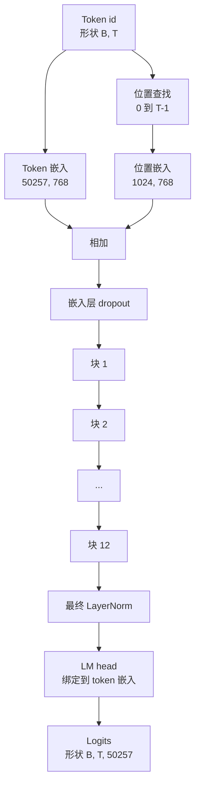
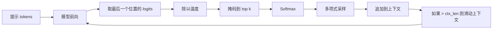

# GPT 模型组装

> 十二个块堆叠、一个 token 嵌入、一个学习到的位置嵌入、一个最终的 LayerNorm、和一个绑定的语言模型 head。这就是完整的 1.24 亿参数 GPT 模型。本课将这些部件组装成一个可工作的类，统计参数数量以确认模型与参考 124M 形状一致，并用多项式采样、温度和 top-k 生成文本。

**类型：** 构建
**语言：** Python
**前置条件：** 阶段 19 第 30 至 34 课
**时间：** 约 90 分钟

## 学习目标

- 将第 34 课的 transformer 块组装成完整的 GPT 模型：token 嵌入、位置嵌入、N 个块、最终 LayerNorm、语言模型 head。
- 复现 1.24 亿参数配置：词表 50257、上下文 1024、嵌入 768、十二个头、十二层。
- 将语言模型 head 权重绑定到 token 嵌入，并解释这在该规模下如何节省约 3800 万参数。
- 用多项式采样、温度缩放和 top-k 截断从提示词生成文本，用滑动窗口保持上下文长度。
- 测量参数数量和前向传播成本，与 124M 目标对比。

## 问题

一个 transformer 块单独什么都做不了。你需要把 token id 变成向量、混入位置信息、穿过堆叠、再投影回词表 logit。忘掉这四步中的任何一步，模型要么前向失败、要么位置信息漂移、要么无法说话。

模型的形状也很重要。参考 GPT-2 small 恰好是上述配置的 1.24 亿参数。这些数字不是魔法。词表 50257 乘嵌入 768 是 token 表。位置 1024 乘 768 是位置表。十二个块每个约 700 万参数，共 8400 万。最终 head 通过权重绑定复用 token 表。把各部分相加正好是 1.24 亿。构建一个参数数量与参考不匹配的模型，是接线错误的信号。

## 概念



Token id 变成 token 向量。位置 id 变成位置向量。两者相加后送入堆叠。最终 LayerNorm 是每个现代变体中都存活在块外部的那一块。LM head 复用 token 嵌入矩阵，这就是权重绑定的含义。

### 权重绑定

Token 嵌入形状为 `(vocab, d_model)`。语言模型 head 需要从 `d_model` 投影回 `vocab`。这两者是彼此的转置。绑定两者意味着使用同一个参数张量，但使用两次。在词表 50257 和 d_model 768 下，该矩阵是 3800 万参数。不绑定，你要付两次费用。绑定，你只付一次，而且因为嵌入和 head 一起更新，梯度信号也更干净一点。

### 位置嵌入是学习到的，不是正弦的

GPT-2 使用学习到的位置嵌入。位置表是一个形状为 `(1024, 768)` 的参数张量。模型在每次前向传播时查找位置 0 到 T-1，并将查找结果加到 token 嵌入上。这是位置方案中最简单的一种（RoPE、ALiBi、T5 相对偏置是替代方案），也是 124M 参考使用的方案。

### 生成：温度、top-k、多项式

生成是自回归的。每一步，模型返回整个词表在每个位置的 logit。你只取最后一个位置，除以温度，可选地将除了 top k 以外的 logit 全部掩码为负无穷，softmax 得到概率，从结果分布中采样一个 token。



三个旋钮，三种不同行为。温度接近零退化为贪心。温度一匹配模型的自然分布。Top-k 为一是贪心。Top-k 四十过滤长尾。这些组合很重要；下一课关于训练用生成作为定性评估信号。

## 构建它

`code/main.py` 实现了：

- `class GPTConfig` 数据类，包含 124M 默认值：`vocab_size=50257`、`context_length=1024`、`d_model=768`、`num_heads=12`、`num_layers=12`、`mlp_expansion=4`、`dropout=0.1`、`use_bias=True`、`weight_tying=True`。
- `class GPTModel`，带有 token 嵌入、位置嵌入、嵌入层 dropout、十二个 `TransformerBlock`、最终 LayerNorm，和一个在标志设置时绑定到 token 嵌入的 `lm_head`。
- 一个 `count_parameters` 辅助函数，返回唯一参数数量（因此权重绑定在计数中被尊重）。
- 一个 `generate` 函数，执行温度、top-k、多项式和滑动窗口上下文。
- 一个演示，构建模型，打印参数数量与参考 124M 对比，并从固定提示词生成短序列以展示流水线端到端工作。

运行它：

```bash
python3 code/main.py
```

输出：与 124M 参考并排的参数数量，从随机提示词生成的 token id，以及当绑定开启时 LM head 和 token 嵌入共享存储的确认。

为了保持演示快速，脚本还从头到尾运行一个 tiny 配置（`d_model=64`、`num_layers=2`）并内联打印生成的 token 序列。124M 配置被构建，但只统计其参数数量和执行一次前向传播。

## 堆叠

- `torch` 用于张量数学、自动求导和模块管道。
- `code/main.py` 在本地重新实现了第 34 课的相同块模式。

## 实际生产模式

三个模式决定了模型是能跑还是能交付。

**将残差投影初始化得小一些。** 注意力的输出投影和 MLP 的第二个线性层都直接馈入残差加法。用与每个其他线性层相同的标准差初始化它们，会导致残差流随深度增长，并将最终的 LayerNorm 推入高温区域。将这两个投影的标准差按 `1 / sqrt(2 * num_layers)` 缩放；残差流在十二层中保持在合理范围内。

**缓存位置 id 张量，不要重新计算。** `torch.arange(T)` 每次前向都分配新内存。在 `__init__` 中为最大上下文分配一次，每次调用时切分前 T 个条目，跳过分配器往返。

**在参数级别绑定权重，而不是仅通过复制。** 设置 `lm_head.weight = token_embedding.weight` 共享张量；复制不会。优化器需要更新一个参数，自动求导图需要一个累加。如果你复制，head 会偏离嵌入，权重绑定毫无意义。

## 使用它

- 本课的模型类与下一课训练的模型形状相同。
- 将学习到的位置嵌入替换为 RoPE 就能得到 LLaMA 家族，无需触碰块或 head。
- 将 GELU 替换为 SiLU、将 LayerNorm 替换为 RMSNorm，就能得到 LLaMA 家族的其余变更。
- 生成函数适用于任何 logits 来源，不仅是本模型。你可以在第 37 课从预训练 GPT-2 文件中拉取 logits 并复用相同的生成循环。

## 练习

1. 将 LM head 与 token 嵌入解绑定并重新统计参数。验证差值是 50257 乘以 768 = 3800 万。
2. 将学习到的位置嵌入替换为在构造时计算的正弦表。确认模型仍然可以前向传播，参数数量减少 786,432。
3. 给生成添加一个 `greedy=True` 标志，跳过采样并选择 argmax。确认序列在多次运行中是确定性的。
4. 添加一个 `repetition_penalty` 旋钮，在 softmax 之前将提示词或生成历史中任何 token 的 logit 除以一个常数。在固定提示词上展示大于一的值会减少输出中的重复次数。
5. 在 `top_k` 旁边添加 `top_p`（nucleus）采样。两行检查，保留的 token 的概率之和超过 `top_p`。

## 关键术语

| 术语 | 大家怎么说 | 实际含义 |
|------|-----------------|------------------------|
| 权重绑定 | "绑定嵌入" | LM head 和 token 嵌入共享同一个参数张量；节省词表乘 d_model 的参数，并与 GPT-2 参考一致 |
| 位置嵌入 | "学习到的位置" | 一个形状为 (上下文长度, d_model) 的独立表，加到 token 向量上；端到端学习 |
| 滑动窗口上下文 | "上下文上限" | 当提示词加生成的 token 超过上下文长度时，丢弃最旧的 token，使活动窗口适合 |
| Top-k 采样 | "K 截断" | 保留 K 个最高值的 logit，将其余的掩码为负无穷，在剩余部分上 softmax |
| 温度 | "采样温度" | 在 softmax 之前将 logits 除以 T；T 小于 1 变尖锐，T 等于 1 保持自然分布，T 大于 1 变平坦 |

## 进一步阅读

- 阶段 19 课程 34 —— 本模型堆叠的块。
- 阶段 19 课程 36 —— 用交叉熵损失驱动本模型的训练循环。
- 阶段 19 课程 37 —— 将预训练 GPT-2 权重加载到这个确切架构中。
- 阶段 7 课程 07（GPT 因果语言建模）—— 下一个 token 预测的数学。
- 阶段 10 课程 04（预训练 mini GPT）—— 同一架构上的原始训练过程。